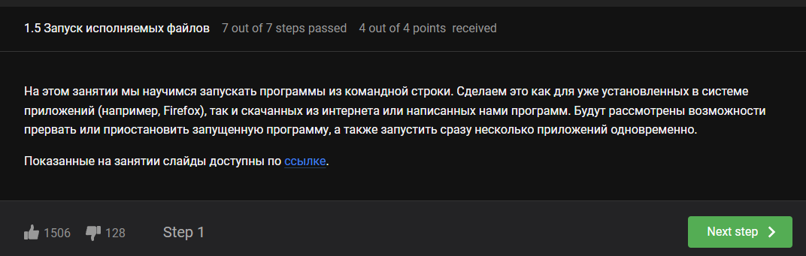
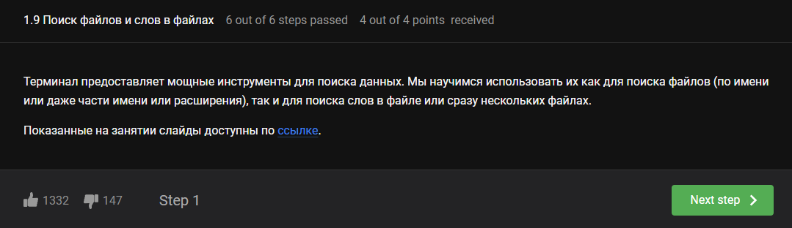

---
## Front matter
lang: ru-RU
title: Внешний курс №1
subtitle: Введение в Linux
author:
  - Луангсуваннавонг Сайпхачан
institute:
  - Российский университет дружбы народов, Москва, Россия
date: 15 мая 2025

## i18n babel
babel-lang: russian
babel-otherlangs: english

## Formatting pdf
toc: false
toc-title: Содержание
slide_level: 2
aspectratio: 169
section-titles: true
theme: metropolis
header-includes:
 - \metroset{progressbar=frametitle,sectionpage=progressbar,numbering=fraction}
---

# Информация

## Докладчик

:::::::::::::: {.columns align=center}
::: {.column width="70%"}

  * Луангсуваннавонг Сайпхачан
  * Студент из группы НКАбд-01-24
  * Российский университет дружбы народов
  * <https://sayprachanh-lsvnv.github.io>

:::
::: {.column width="30%"}
:::
::::::::::::::

# Этап 1 внешнего курса (Введение)

## Общая информация о курсе

## Как установить Linux

## Осваиваем Linux

## Terminal: основы

## Запуск исполняемых файлов

## Ввод / вывод

## Скачивание файлов из интернета

## Работа с архивами

## Поиск файлов и слов в файлах

## Выводы

Научился устанавливать Linux, основам linux и терминала, работе с архивом, ввод/вывод

# Спасибо за внимание
