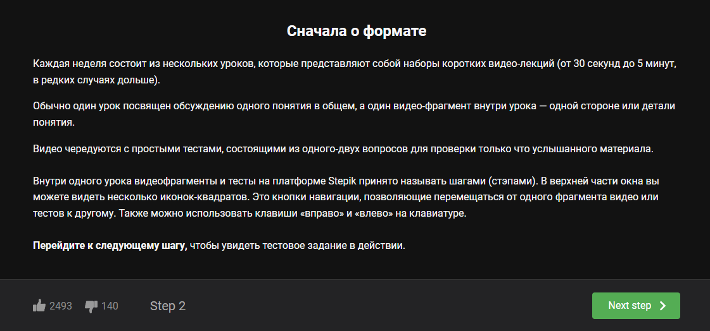
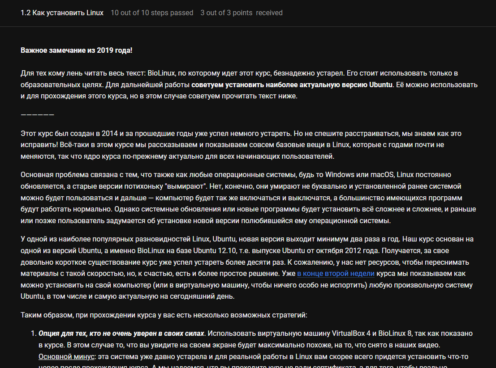
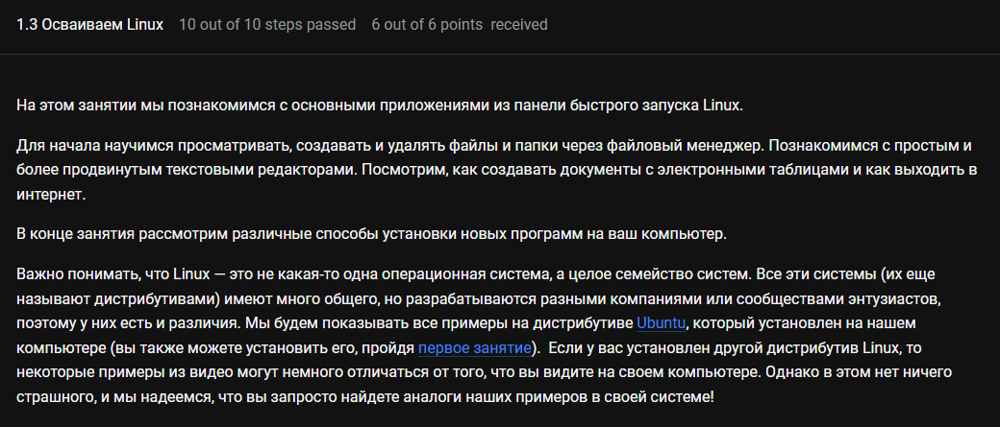
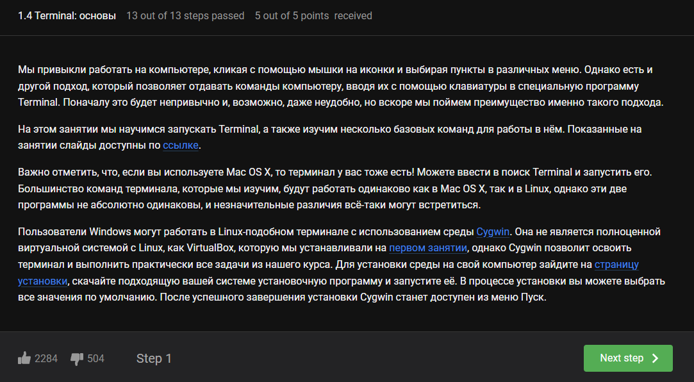
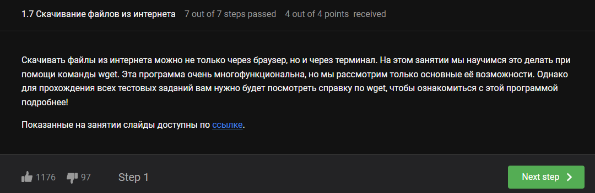
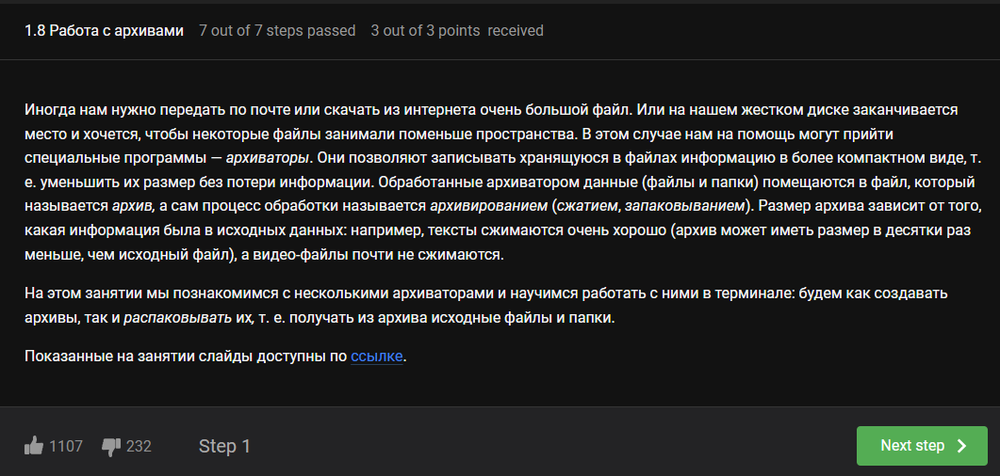

---
## Front matter
lang: ru-RU
title: Лабораторная работа №1
subtitle: Операционные системы
author:
  - Луангсуваннавонг Сайпхачан
institute:
  - Российский университет дружбы народов, Москва, Россия
date: 04 Марта 2025

## i18n babel
babel-lang: russian
babel-otherlangs: english

## Formatting pdf
toc: false
toc-title: Содержание
slide_level: 2
aspectratio: 169
section-titles: true
theme: metropolis
header-includes:
 - \metroset{progressbar=frametitle,sectionpage=progressbar,numbering=fraction}
---

## Цель работы

Целью данной работы является приобретение практических навыков уста-
новки операционной системы на виртуальную машину, настройки минимально
необходимых для дальнейшей работы сервисов.

## Задание

1. Установка виртуальной машины
2. Установка операционной системы
3. Настройка операционной системы после установки
4. Установка программного обеспечения для создания документации
5. Выполнение дополнительных задач

## Установка виртуальной машины

Я уже установил и настроил virtualbox во время выполнения лабораторной
работы по курсу “Архитектура компьютера и операционные системы” (рис. 1)

## Установка виртуальной машины

Нажав на "Создать", я создаю новую ОС, затем ввожу свое имя, путь, тип ОС и версию (рис. 2)

## Установка виртуальной машины

Настройка аппаратного обеспечения (рис. 3)

## Установка виртуальной машины

Настройка жесткого диска (рис. 4)

## Установка операционной системы

Запуск операционной системы после завершения настройки (рис. 5)

## Установка операционной системы

Создание конфигурации и модификатора настройки (рис. 6)

## Установка операционной системы

Я открываю терминал с помощью "Win+Enter", затем запускаю установку программы (рис. 7)

## Установка операционной системы

Я выбираю язык для использования в процессе установки (рис. 8)

## Установка операционной системы

Проверяю место установки и устанавливаю его по умолчанию (рис. 9)

## Установка операционной системы

Задаю имя компьютера в соответствии с соглашением об именовании (рис. 10)

## Установка операционной системы

Я настроил учетную запись администратора и пароль для суперпользователя (рис. 11)

## Установка операционной системы

Я настроил учетную запись для операционной системы (рис. 12)

## Установка операционной системы

Затем ос будет установлена, после того как я нажму "завершить установку" (рис. 13)

## Установка операционной системы

В интерфейсе virtualbox я удаляю диск с виртуального диска, предотвращаю его автоматический запуск на диск (рис. 14)

## Установка операционной системы

После извлечения, диск становится пустым (рис. 15)

## Настройка операционной системы после установки

Я запускаю ОС и вхожу в нее с учетной записью, созданной во время установки (рис. 16)

## Настройка операционной системы после установки

Переключаюсь на роль суперпользователя (рис. 17)

## Настройка операционной системы после установки

Я обновляю все пакеты (рис. 18)

## Настройка операционной системы после установки

Я устанавливаю программы для удобства работы в консоли:
tmux для открытия нескольких терминалов и mc для файлового менеджера в терминале (рис. 19)

## Настройка операционной системы после установки

Устанавливаю программу для автоматического обновления (рис. 20)

## Настройка операционной системы после установки

Устанавливаю необходимую конфигурацию для программы (рис. 21)

## Настройка операционной системы после установки

Я перехожу в каталог /etc/selinux, ищу нужный файл (рис. 22)

## Настройка операционной системы после установки

Я настраиваю файл: SELINUX=enforcing изменение на SELINUX=premissive (рис. 23)

## Настройка операционной системы после установки

Я сохраняю файл, затем перезагружаю ОС (рис. 24)

## Настройка операционной системы после установки

Я снова вхожу в ОС, открываю терминал и запускаю терминал мультиплексора (рис. 25)

## Настройка операционной системы после установки

Переключаюсь на роль суперпользователя (рис. 26)

## Настройка операционной системы после установки

Я устанавливаю пакет dkms (рис. 27)

## Настройка операционной системы после установки

Я подключаю диск к гостевой ОС с помощью утилиты монтирования (mount) (рис. 28)

## Настройка операционной системы после установки

Устанавливаю драйвер (рис. 29)

## Настройка операционной системы после установки

Затем я снова перезагружаю ОС (рис. 30)

## Настройка операционной системы после установки

Я перехожу в каталог /etc/X11/xorg.conf.d/, нахожу и открываю файл 00-keyboard.conf (рис. 31)

## Настройка операционной системы после установки

Я редактирую конфигурационный файл 00-keyboard.conf (рис. 32)

## Настройка операционной системы после установки

Я перезагружаю ОС (рис. 33)

## Установка программного обеспечения для создания документации

Я вручную устанавливаю pandoc и pandoc-crossref в браузере (рис. 34)

## Установка программного обеспечения для создания документации

Проверяю каталог загрузки через терминал (рис. 35)

## Установка программного обеспечения для создания документации

Затем я извлекаю файл pandoc (рис. 36)

## Установка программного обеспечения для создания документации

Я также извлекаю файл pandoc-crossref (рис. 37)

## Установка программного обеспечения для создания документации

Я копирую извлеченный файл pandoc в /usr/local/bin (рис. 38)

## Установка программного обеспечения для создания документации

Я делаю то же самое с файлом pandoc-crossref, копирую его в /usr/local/bin (рис. 39)

## Установка программного обеспечения для создания документации

Я проверяю работу своей команды (рис. 40)

## Установка программного обеспечения для создания документации

Устанавливаю дистрибутив texlive (рис. 41)

## Выполнение дополнительных задач

Запускаю команду dmesg, чтобы проанализировать последовательность загрузки системы (рис. 42)

## Выполнение дополнительных задач

Я нахожу версию Linux, используя команду dmesg | grep -i и ключевое слово "Linux version". (рис. 43)

## Выполнение дополнительных задач

Используя ту же команду с ключевым словом "processor", я нахожу частоту процессора (рис. 44)

## Выполнение дополнительных задач

Затем я нахожу модель процессора, используя ключевое слово "CPU0" (рис. 45)

## Выполнение дополнительных задач

Я нахожу доступную память, используя ту же команду и ключевое слово "memory". (рис. 46)

## Выполнение дополнительных задач

Обнаружив обнаруженный гипервизор, мы можем использовать заданное ключевое слово "hypervisor detected" (рис. 47).

## Выполнение дополнительных задач

Для определения типа файловой системы корневого раздела мы можем воспользоваться утилитой fdisk (рис. 48)

## Выполнение дополнительных задач

Что касается последовательности монтирования файловых систем, мы можем использовать ключевое слово "mount" с командой раньше (рис. 49)

## Список литературы{.unnumbered}

1. Dash, P. Getting Started with Oracle VM VirtualBox / P. Dash. – Packt Publishing
Ltd, 2013. – 86 сс.
2. Colvin, H. VirtualBox: An Ultimate Guide Book on Virtualization with VirtualBox.
VirtualBox / H. Colvin. – CreateSpace Independent Publishing Platform, 2015. –
70 сс.
3. Vugt, S. van. Red Hat RHCSA/RHCE 7 cert guide : Red Hat Enterprise Linux 7
(EX200 and EX300) : Certification Guide. Red Hat RHCSA/RHCE 7 cert guide / S.
van Vugt. – Pearson IT Certification, 2016. – 1008 сс.
4. Робачевский, А. Операционная система UNIX / А. Робачевский, С. Немнюгин,
О. Стесик. – 2-е изд. – Санкт-Петербург : БХВ-Петербург, 2010. – 656 сс.
5. Немет, Э. Unix и Linux: руководство системного администратора. Unix и
Linux / Э. Немет, Г. Снайдер, Т.Р. Хейн, Б. Уэйли. – 4-е изд. – Вильямс, 2014. –
1312 сс.
6. Колисниченко, Д.Н. Самоучитель системного администратора Linux : Си-
стемный администратор / Д.Н. Колисниченко. – Санкт-Петербург : БХВ-
Петербург, 2011. – 544 сс.
7. Robbins, A. Bash Pocket Reference / A. Robbins. – O’Reilly Media, 2016. – 156 сс.

