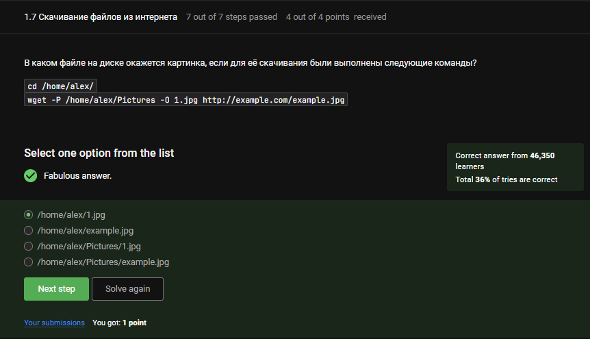
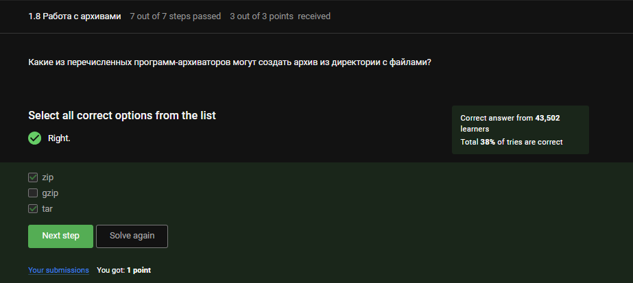

---
## Front matter
title: "Отчёт по внешнему курсу 1"
subtitle: "Операционные системы"
author: "Луангсуваннавонг Сайпхачан"

## Generic otions
lang: ru-RU
toc-title: "Содержание"

## Bibliography
bibliography: bib/cite.bib
csl: pandoc/csl/gost-r-7-0-5-2008-numeric.csl

## Pdf output format
toc: true # Table of contents
toc-depth: 2
lof: true # List of figures
lot: true # List of tables
fontsize: 12pt
linestretch: 1.5
papersize: a4
documentclass: scrreprt
## I18n polyglossia
polyglossia-lang:
  name: russian
  options:
	- spelling=modern
	- babelshorthands=true
polyglossia-otherlangs:
  name: english
## I18n babel
babel-lang: russian
babel-otherlangs: english
## Fonts
mainfont: IBM Plex Serif
romanfont: IBM Plex Serif
sansfont: IBM Plex Sans
monofont: IBM Plex Mono
mathfont: STIX Two Math
mainfontoptions: Ligatures=Common,Ligatures=TeX,Scale=0.94
romanfontoptions: Ligatures=Common,Ligatures=TeX,Scale=0.94
sansfontoptions: Ligatures=Common,Ligatures=TeX,Scale=MatchLowercase,Scale=0.94
monofontoptions: Scale=MatchLowercase,Scale=0.94,FakeStretch=0.9
mathfontoptions:
## Biblatex
biblatex: true
biblio-style: "gost-numeric"
biblatexoptions:
  - parentracker=true
  - backend=biber
  - hyperref=auto
  - language=auto
  - autolang=other*
  - citestyle=gost-numeric
## Pandoc-crossref LaTeX customization
figureTitle: "Рис."
tableTitle: "Таблица"
listingTitle: "Листинг"
lofTitle: "Список иллюстраций"
lotTitle: "Список таблиц"
lolTitle: "Листинги"
## Misc options
indent: true
header-includes:
  - \usepackage{indentfirst}
  - \usepackage{float} # keep figures where there are in the text
  - \floatplacement{figure}{H} # keep figures where there are in the text
---

# Этап 1 внешнего курса (Введение)

## Общая информация о курсе

Название курса "Введение в Linux", как указано в содержании заданий. (рис. [-@fig:001])

{#fig:001 width=70%}

Все выбранные утверждения соответствуют правилам прохождения курса. (рис. [-@fig:002])

{#fig:002 width=70%}

## Как установить Linux

Все перечисленные варианты (Linux, Windows, Другая) — корректные, так как вопрос допускает множественные ответы. (рис. [-@fig:003])

{#fig:003 width=70%}

Виртуальная машина — это специальная программа для запуска одной ОС на другой. (рис. [-@fig:004])

{#fig:004 width=70%}

Ответ "Да", поскольку у меня уже был установлен Linux (рис. [-@fig:005])

{#fig:005 width=70%}

## Осваиваем Linux

Файл был успешно создан, отформатирован и загружен в формате XML или FODT. (рис. [-@fig:006])

{#fig:006 width=70%}

Установочные пакеты в Ubuntu имеют расширение .deb. (рис. [-@fig:007])

{#fig:007 width=70%}

Denis-Courmont — это корректный ответ, взятый из вкладки Authors в VLC. (рис. [-@fig:008])

{#fig:008 width=70%}

Update Manager используется для обновления всей системы и установленных программ. (рис. [-@fig:009])

{#fig:009 width=70%}

## Terminal: основы

Консоль, ассоль и терминал — все являются синонимами командной строки. (рис. [-@fig:010])

{#fig:010 width=70%}

Команда pwd показывает, в какой директории мы находимся — корректный и чувствительный к регистру вариант. (рис. [-@fig:011])

{#fig:011 width=70%}

Все выбранные команды дают тот же результат, что и оригинальная команда — полный, читаемый, подробный список файлов в директории. (рис. [-@fig:012])

{#fig:012 width=70%}

Команды ls ~/Downloads, ls ./Downloads, ls -./Downloads и ls /home/bi/Downloads корректно показывают содержимое нужной директории, не заходя в другие. (рис. [-@fig:013])

{#fig:013 width=70%}

Команда rm -r удаляет директорию и её содержимое — это стандартный способ. (рис. [-@fig:014])

{#fig:014 width=70%}

## Запуск исполняемых файлов

При вводе firefox, а затем exit, ни Firefox, ни терминал не закрываются. (рис. [-@fig:015])

{#fig:015 width=70%}

Запуск программы с & эквивалентен комбинации Ctrl+Z, а затем bg — перевод в фоновый режим. (рис. [-@fig:016])

{#fig:016 width=70%}

Вывод соответствует заданию — показаны дата, время и контрольная сумма, как требовалось. (рис. [-@fig:017])

{#fig:017 width=70%}

## Ввод / вывод

Ошибки выводятся на экран, так как по умолчанию поток stderr направляется туда. (рис. [-@fig:018])

{#fig:018 width=70%}

Команды program 2>> file.txt и program 2> file.txt создают файл и записывают в него ошибки. (рис. [-@fig:019])

{#fig:019 width=70%}

Ошибки программ в конвейере не выводятся никуда, если специально не перенаправлены. (рис. [-@fig:020])

{#fig:020 width=70%}

## Скачивание файлов из интернета

Команда сохраняет файл как /home/alex/Pictures/1.jpg, потому что используется опция -O для указания имени, и -P для директории. (рис. [-@fig:021])

{#fig:021 width=70%}

Опция -q или --quiet отключает вывод сообщений — она именно для этого и предназначена. (рис. [-@fig:022])

{#fig:022 width=70%}

Будут скачаны .jpg и .html файлы, но .html впоследствии удалятся, так работает ограничение -A. (рис. [-@fig:023])

{#fig:023 width=70%}

## Работа с архивами

gzip по умолчанию удаляет архив после распаковки, в отличие от zip. (рис. [-@fig:024])

{#fig:024 width=70%}

Из указанных программ только tar поддерживает создание архива из директории напрямую. (рис. [-@fig:025])

{#fig:025 width=70%}

Опция -cjf используется для создания .tar.bz2 архива — c (create), j (bzip2), f (file) (рис. [-@fig:026])

{#fig:026 width=70%}

## Поиск файлов и слов в файлах

Маски *.jpg, *.?, и alexey.* не совпадают с именем Alexey.jpeg, потому что имя или расширение отличаются. (рис. [-@fig:027])

{#fig:027 width=70%}

Команда находит строки, где есть точное вхождение world без учёта регистра, без символов между буквами, кроме пробелов. (рис. [-@fig:028])

{#fig:028 width=70%}

Файл love.txt содержит все строки с “love” из загруженного архива — результат выполнения поиска с перенаправлением вывода. (рис. [-@fig:029])

{#fig:029 width=70%}

