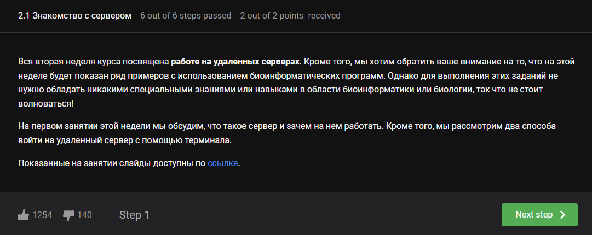
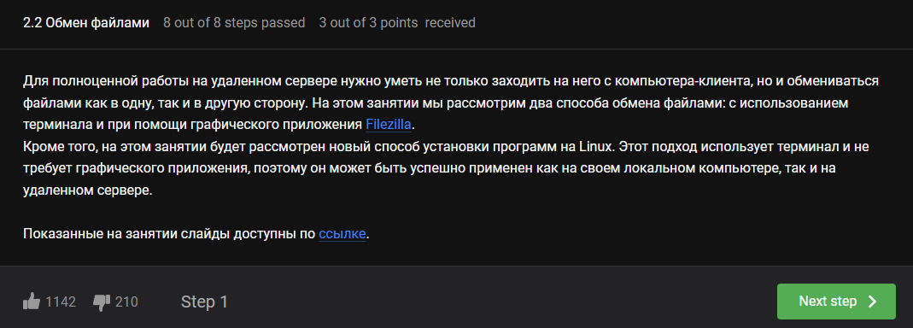
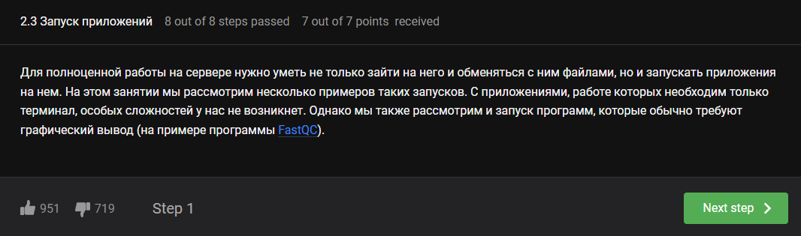
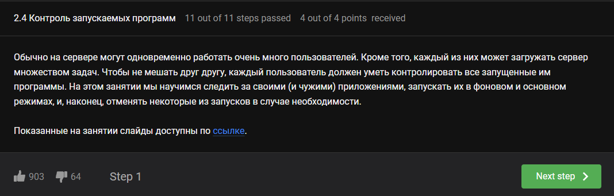
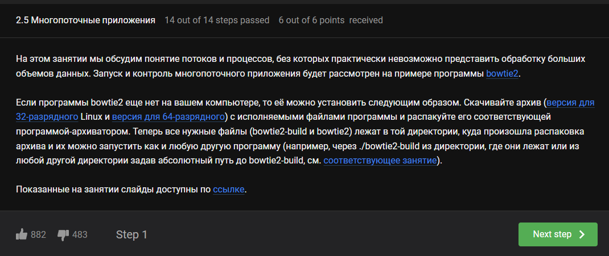
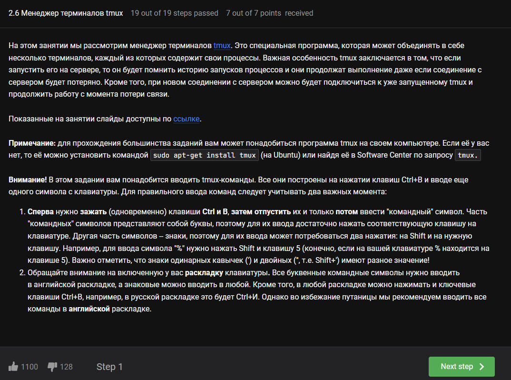
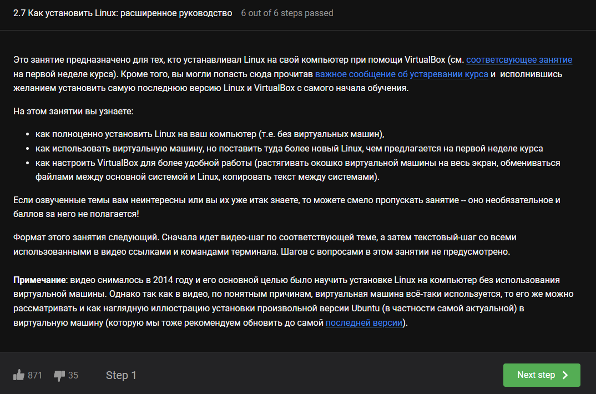

---
## Front matter
lang: ru-RU
title: Внешний курс №2
subtitle: Введение в Linux
author:
  - Луангсуваннавонг Сайпхачан
institute:
  - Российский университет дружбы народов, Москва, Россия
date: 15 мая 2025

## i18n babel
babel-lang: russian
babel-otherlangs: english

## Formatting pdf
toc: false
toc-title: Содержание
slide_level: 2
aspectratio: 169
section-titles: true
theme: metropolis
header-includes:
 - \metroset{progressbar=frametitle,sectionpage=progressbar,numbering=fraction}
---

# Информация

## Докладчик

:::::::::::::: {.columns align=center}
::: {.column width="70%"}

  * Луангсуваннавонг Сайпхачан
  * Студент из группы НКАбд-01-24
  * Российский университет дружбы народов
  * <https://sayprachanh-lsvnv.github.io>

:::
::: {.column width="30%"}
:::
::::::::::::::

# Этап 2 внешнего курса (Работа на сервере)

## Знакомство с сервером

## Обмен файлами

## Запуск приложений

## Контроль запускаемых программ

## Многопоточные приложения

## Менеджер терминалов tmux

## Как установить Linux: расширенное руководство

## Выводы

Научился работать с сервером: настройка общего доступа к файлам,
запуск приложений, многопоточные приложения и управление tmux.

# Спасибо за внимание
