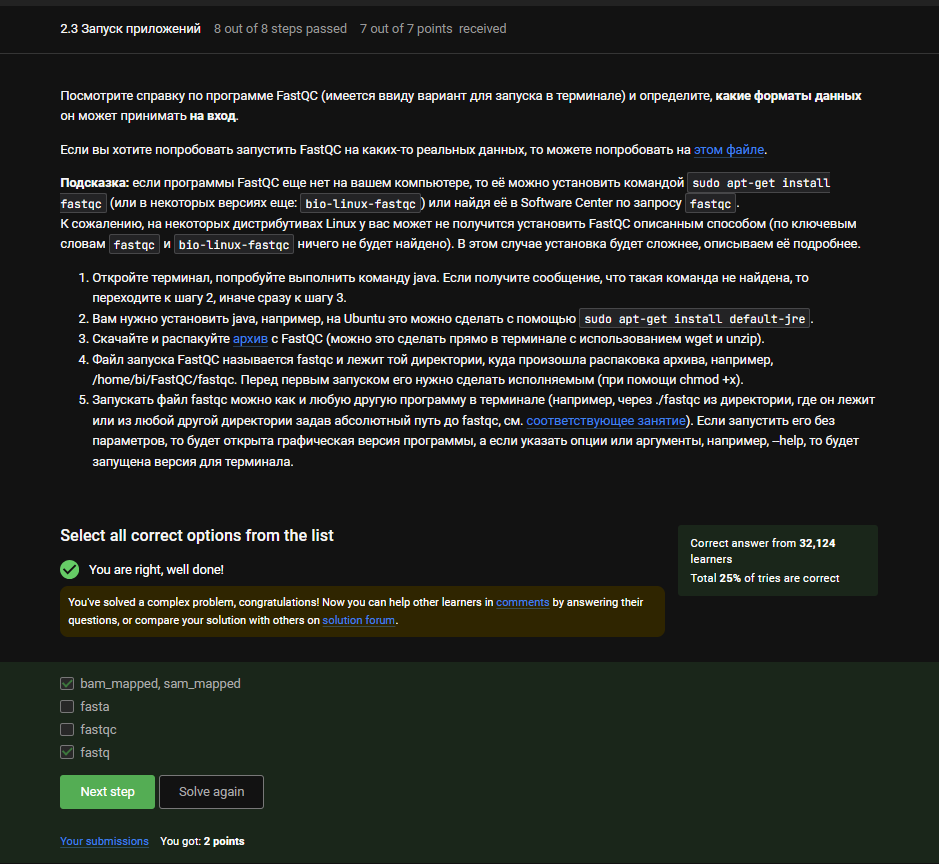

---
## Front matter
title: "Отчёт по внешнему курсу 2"
subtitle: "Операционные системы"
author: "Луангсуваннавонг Сайпхачан"

## Generic otions
lang: ru-RU
toc-title: "Содержание"

## Bibliography
bibliography: bib/cite.bib
csl: pandoc/csl/gost-r-7-0-5-2008-numeric.csl

## Pdf output format
toc: true # Table of contents
toc-depth: 2
lof: true # List of figures
lot: true # List of tables
fontsize: 12pt
linestretch: 1.5
papersize: a4
documentclass: scrreprt
## I18n polyglossia
polyglossia-lang:
  name: russian
  options:
	- spelling=modern
	- babelshorthands=true
polyglossia-otherlangs:
  name: english
## I18n babel
babel-lang: russian
babel-otherlangs: english
## Fonts
mainfont: IBM Plex Serif
romanfont: IBM Plex Serif
sansfont: IBM Plex Sans
monofont: IBM Plex Mono
mathfont: STIX Two Math
mainfontoptions: Ligatures=Common,Ligatures=TeX,Scale=0.94
romanfontoptions: Ligatures=Common,Ligatures=TeX,Scale=0.94
sansfontoptions: Ligatures=Common,Ligatures=TeX,Scale=MatchLowercase,Scale=0.94
monofontoptions: Scale=MatchLowercase,Scale=0.94,FakeStretch=0.9
mathfontoptions:
## Biblatex
biblatex: true
biblio-style: "gost-numeric"
biblatexoptions:
  - parentracker=true
  - backend=biber
  - hyperref=auto
  - language=auto
  - autolang=other*
  - citestyle=gost-numeric
## Pandoc-crossref LaTeX customization
figureTitle: "Рис."
tableTitle: "Таблица"
listingTitle: "Листинг"
lofTitle: "Список иллюстраций"
lotTitle: "Список таблиц"
lolTitle: "Листинги"
## Misc options
indent: true
header-includes:
  - \usepackage{indentfirst}
  - \usepackage{float} # keep figures where there are in the text
  - \floatplacement{figure}{H} # keep figures where there are in the text
---

# Этап 2 внешнего курса (Работа на сервере)

## Знакомство с сервером
Удалённый сервер можно использовать для хранения больших и общедоступных данных, выполнения сложных вычислений, хранения конфиденциальной информации. (рис. [-@fig:001])

{#fig:001 width=70%}

Ключ id_rsa.pub можно безопасно передавать по интернету. (рис. [-@fig:002])

{#fig:002 width=70%}

## Обмен файлами

Команда scp -r stepic username@server:~/ правильно копирует папку и всё её содержимое. (рис. [-@fig:003])

{#fig:003 width=70%}

Проблему с установкой решает команда sudo apt-get update, а также проверка соединения с интернетом. (рис. [-@fig:004])

{#fig:004 width=70%}

FileZilla используется для копирования файлов на сервер и просмотра директорий на локальном и удалённом компьютере. (рис. [-@fig:005])

{#fig:005 width=70%}

## Запуск приложений

Можно проверить наличие версии программы для терминала, настроить сервер для отображения на экране или запустить программу на своём компьютере. (рис. [-@fig:006])

{#fig:006 width=70%}

Правильные команды позволяют получить справку по программе: help program, man program, program --help. (рис. [-@fig:007])

{#fig:007 width=70%}

Программа FastQC принимает входные файлы в формате bam_mapped, sam_mapped. (рис. [-@fig:008])

{#fig:008 width=70%}

Команда clustalw test.fasta -align явно запускает множественное выравнивание, как требуется в задании. (рис. [-@fig:009])

{#fig:009 width=70%}

## Контроль запускаемых программ

Команда jobs покажет только program2 и program3, так как program1 был завершён через Ctrl+C. (рис. [-@fig:010])

{#fig:010 width=70%}

Идентификаторы одинаковые только у ps и top, так как они используют PID. (рис. [-@fig:011])

{#fig:011 width=70%}

Команда kill -9 завершает процесс немедленно, в отличие от обычного kill. (рис. [-@fig:012])

{#fig:012 width=70%}

kill без опций отправляет SIGTERM, и приостановленный процесс завершится после продолжения. (рис. [-@fig:013])

{#fig:013 width=70%}

## Многопоточные приложения

После остановки приложение не использует CPU — результат 0%. (рис. [-@fig:014])

{#fig:014 width=70%}

Приложение использует столько памяти, сколько было занято на момент остановки. (рис. [-@fig:015])

{#fig:015 width=70%}

Ответ - "Никак", поскольку отдельные потоки в многопоточном процессе не могут быть завершены напрямую без завершения всего процесса. (рис. [-@fig:016])

{#fig:016 width=70%}

Только bowtie2 поддерживает многопоточность, так как bowtie2-build работает в однопоточном режиме. (рис. [-@fig:017])

{#fig:017 width=70%}

Я запускаю и сравниваю многопоточные приложения на своем компьютере и копирую ответ. (рис. [-@fig:018])

{#fig:018 width=70%}

## Менеджер терминалов tmux

Команда fg во второй вкладке не найдёт процессов, так как приостановленный процесс остаётся в исходной вкладке. (рис. [-@fig:019])

{#fig:019 width=70%}

При вводе exit в последней вкладке trnux завершит работу, так как не останется активных сессий. (рис. [-@fig:020])

{#fig:020 width=70%}

Соединение с сервером прервётся, но работа trnux продолжится, так как он работает как демон-процесс.(фоновый процесс, выполняющийся без непосредственного взаимодействия с пользователем) (рис. [-@fig:021])

{#fig:021 width=70%}

Принудительное закрытие вкладки (Ctrl+B+X) завершит все фоновые процессы в ней. (рис. [-@fig:022])

{#fig:022 width=70%}

Для переименования текущей вкладки используется комбинация Ctrl+B и запятой. (рис. [-@fig:023])

{#fig:023 width=70%}

Вкладки можно разделять горизонтально (Ctrl+B+") и вертикально (Ctrl+B+%), а между частями перемещаться стрелками. (рис. [-@fig:024])

{#fig:024 width=70%}

## Как установить Linux: расширенное руководство

(расширенное руководство по установке Linux)
