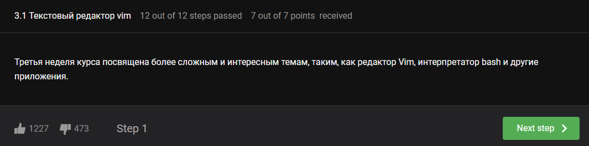
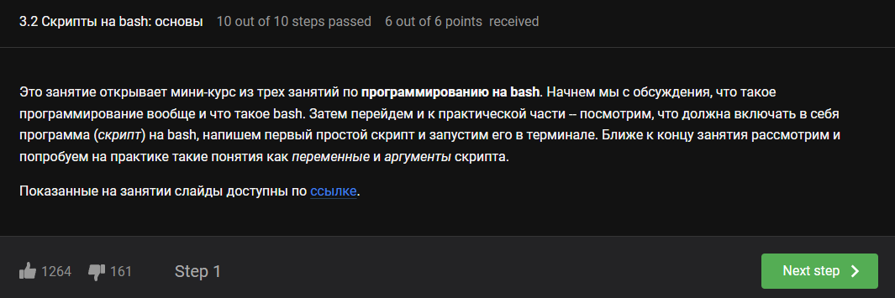
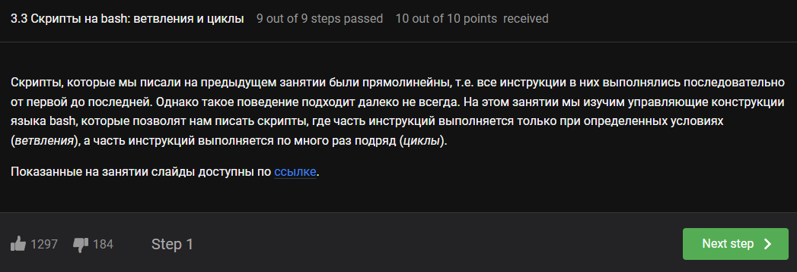
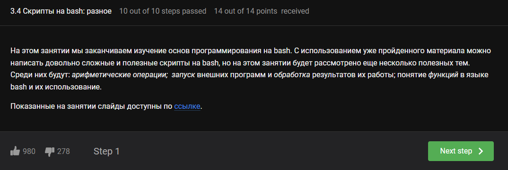
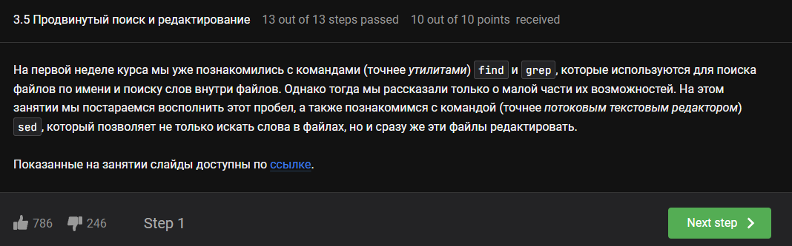
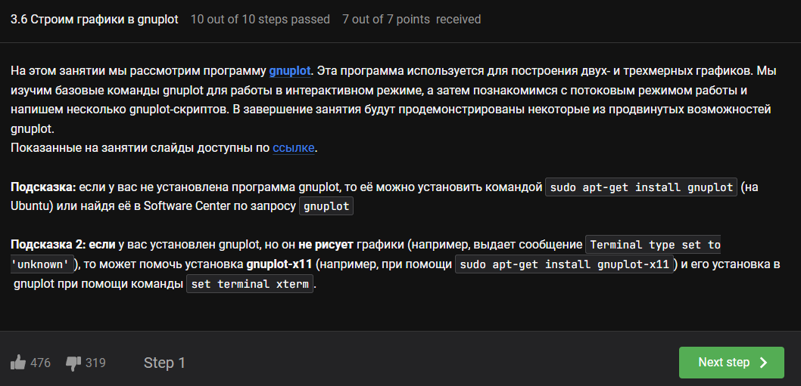
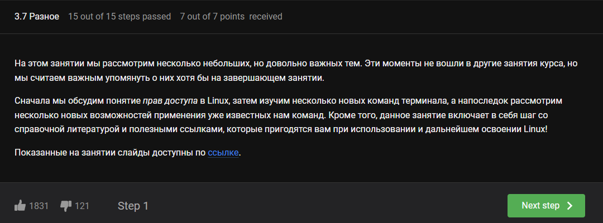

---
## Front matter
lang: ru-RU
title: Внешний курс №3
subtitle: Введение в Linux
author:
  - Луангсуваннавонг Сайпхачан
institute:
  - Российский университет дружбы народов, Москва, Россия
date: 15 мая 2025

## i18n babel
babel-lang: russian
babel-otherlangs: english

## Formatting pdf
toc: false
toc-title: Содержание
slide_level: 2
aspectratio: 169
section-titles: true
theme: metropolis
header-includes:
 - \metroset{progressbar=frametitle,sectionpage=progressbar,numbering=fraction}
---

# Информация

## Докладчик

:::::::::::::: {.columns align=center}
::: {.column width="70%"}

  * Луангсуваннавонг Сайпхачан
  * Студент из группы НКАбд-01-24
  * Российский университет дружбы народов
  * <https://sayprachanh-lsvnv.github.io>

:::
::: {.column width="30%"}
:::
::::::::::::::

# Этап 3 внешнего курса (Продвинутые темы)

## Текстовый редактор vim

## Скрипты на bash: основы

## Скрипты на bash: ветвления и циклы

## Скрипты на bash: разное

## Продвинутый поиск и редактирование

## Строим графики в gnuplot

## Разное

## Выводы

Научился работать с текстовым редактором Vim, писать базовые скрипты на Bash, ветвления и циклы,
продвинутый поиск и редактирование, а также строить графики в Gnuplot.

# Спасибо за внимание
