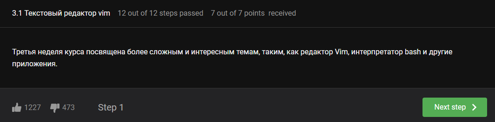
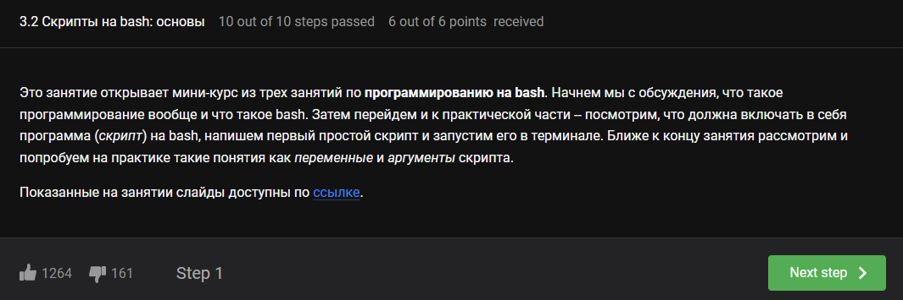
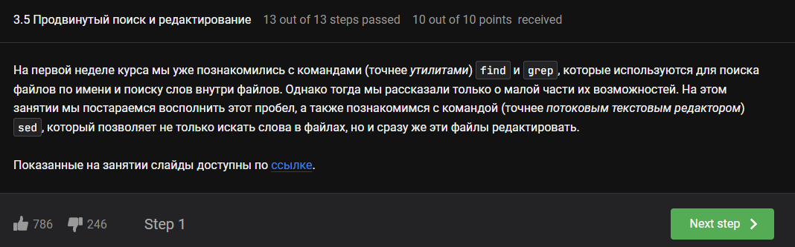
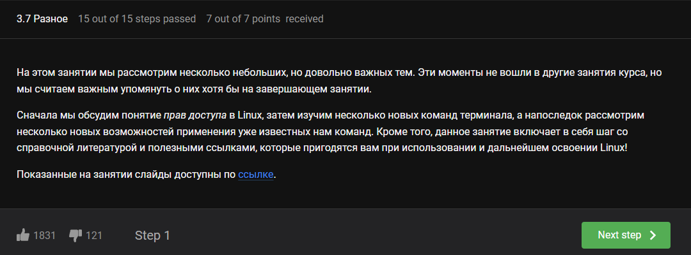

---
## Front matter
lang: ru-RU
title: Лабораторная работа №3
subtitle: Операционные системы
author:
  - Луангсуваннавонг Сайнхачан
institute:
  - Российский университет дружбы народов, Москва, Россия

date: 3 Марта 2025

## i18n babel
babel-lang: russian
babel-otherlangs: english

## Formatting pdf
toc: false
toc-title: Содержание
slide_level: 2
aspectratio: 169
section-titles: true
theme: metropolis
header-includes:
 - \metroset{progressbar=frametitle,sectionpage=progressbar,numbering=fraction}
---

## Цель работы

  Цель работы - Научиться оформлять отчёты с помощью легковесного языка разметки Markdown.
  
## Задание

  1. Сделайте отчёт по предыдущей лабораторной работе в формате Markdown.
  2. В качестве отчёта просьба предоставить отчёты в 3 форматах: pdf, docx и
     md (в архиве, поскольку он должен содержать скриншоты, Makefile и т.д.)

## Теоретическое введение

  Markdown - это облегченный язык разметки, созданный для форматирования
обычного текста с максимальным сохранением его читабельности человеком и
пригодный для машинного преобразования в языки для расширенной публика-
ции.

## Работа с файлами и каталогами

  Я перехожу в каталог, где находится шаблон (рис. 1).

  

## Работа с файлами и каталогами

  Используя утилиту копирования, я копирую шаблон, над которым буду работать(рис. 2)

  

## Работа с Markdown 

  Я открываю файл шаблона в текстовом редакторе(рис. 3)
  
  

## Работа с Markdown 

  Следуя инструкциям, я добавляю изображение выполненной работы в файл шаблона Markdown(рис. 4)
  
  

## Работа с Markdown 

  Я добавляю список использованной литературы для выполнения работы в конце файла шаблона(рис. 5)
  
  

## Работа с Markdown 

  После завершения написания файла шаблона я сохраняю файл,
  затем, используя команду make, создаю копии файлов шаблона в форматах .pdf и .docx (рис. 6)

  

## Завершение работы

  После этого я добавляю все файлы в репозиторий GitHub (рис. 7)
  
  

## Завершение работы
 
  Используя команду git push, я отправляю файлы на сервер GitHub (рис. 8)
  
  

## Выводы

  Во время выполнения этой лабораторной работы, я научился создавать отчеты,
  используя облегченный язык разметки Markdown.

## Список литературы{.unnumbered}

[Лабораторная работа № 3](https://esystem.rudn.ru/pluginfile.php/2586858/mod_resource/content/3/003-lab_markdown.pdf)

:::{#refs}
:::
