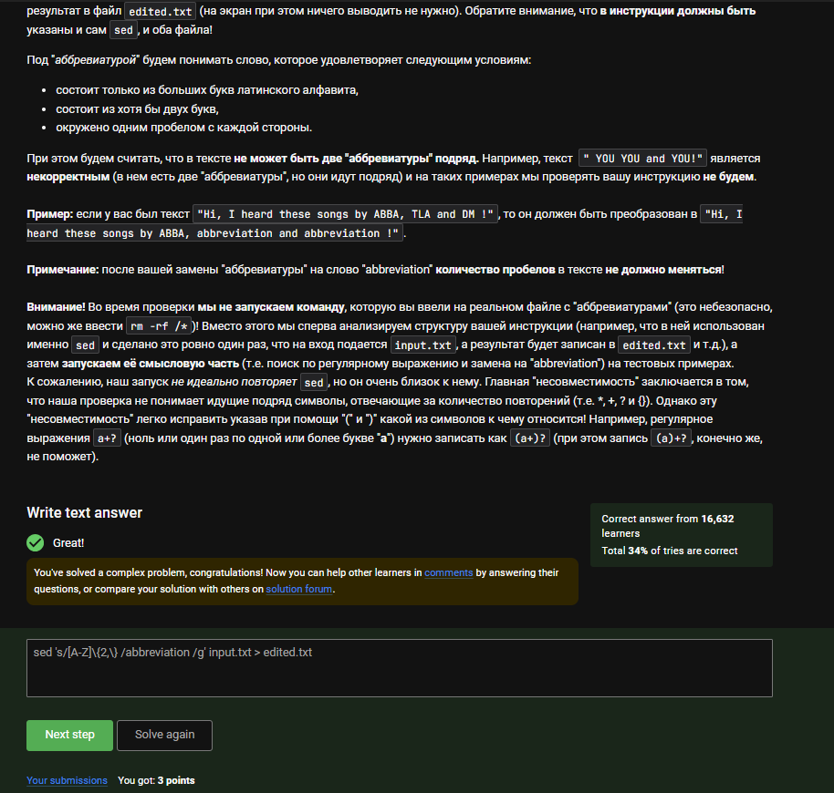

---
## Front matter
title: "Отчёт по внешнему курсу 3"
subtitle: "Операционные системы"
author: "Луангсуваннавонг Сайпхачан"

## Generic otions
lang: ru-RU
toc-title: "Содержание"

## Bibliography
bibliography: bib/cite.bib
csl: pandoc/csl/gost-r-7-0-5-2008-numeric.csl

## Pdf output format
toc: true # Table of contents
toc-depth: 2
lof: true # List of figures
lot: true # List of tables
fontsize: 12pt
linestretch: 1.5
papersize: a4
documentclass: scrreprt
## I18n polyglossia
polyglossia-lang:
  name: russian
  options:
	- spelling=modern
	- babelshorthands=true
polyglossia-otherlangs:
  name: english
## I18n babel
babel-lang: russian
babel-otherlangs: english
## Fonts
mainfont: IBM Plex Serif
romanfont: IBM Plex Serif
sansfont: IBM Plex Sans
monofont: IBM Plex Mono
mathfont: STIX Two Math
mainfontoptions: Ligatures=Common,Ligatures=TeX,Scale=0.94
romanfontoptions: Ligatures=Common,Ligatures=TeX,Scale=0.94
sansfontoptions: Ligatures=Common,Ligatures=TeX,Scale=MatchLowercase,Scale=0.94
monofontoptions: Scale=MatchLowercase,Scale=0.94,FakeStretch=0.9
mathfontoptions:
## Biblatex
biblatex: true
biblio-style: "gost-numeric"
biblatexoptions:
  - parentracker=true
  - backend=biber
  - hyperref=auto
  - language=auto
  - autolang=other*
  - citestyle=gost-numeric
## Pandoc-crossref LaTeX customization
figureTitle: "Рис."
tableTitle: "Таблица"
listingTitle: "Листинг"
lofTitle: "Список иллюстраций"
lotTitle: "Список таблиц"
lolTitle: "Листинги"
## Misc options
indent: true
header-includes:
  - \usepackage{indentfirst}
  - \usepackage{float} # keep figures where there are in the text
  - \floatplacement{figure}{H} # keep figures where there are in the text
---

# Этап 3 внешнего курса (Продвинутые темы)

## Текстовый редактор vim

Для выхода из vim после открытия файла нужно ввести :q, затем нажать Enter. (рис. [-@fig:001])

{#fig:001 width=70%}

На строке 9 слов, W перемещает по "большим словам", потому нужно меньше нажатий, чем с w. (рис. [-@fig:002])

{#fig:002 width=70%}

Корректный результат достигается с помощью d2wywPp и d2wwypP, так как они заменяют нужное слово и вставляют его повторно. (рис. [-@fig:003])

{#fig:003 width=70%}

Команда :%s/Windows/Linux заменяет слово Windows на Linux только один раз в каждой строке. (рис. [-@fig:004])

{#fig:004 width=70%}

Режим Visual активируется клавишей v, поддерживает перемещения и команды d, y. Завершение — :q или дважды Esc. (рис. [-@fig:005])

{#fig:005 width=70%}

## Скрипты на bash: основы

История команд сохраняется только внутри текущей оболочки, поэтому отображаются только команды из последней оболочки C. (рис. [-@fig:006])

{#fig:006 width=70%}

Файл будет создан в директории /home/bi/, несмотря на начальный запуск из /home/bi/Documents. (рис. [-@fig:007])

{#fig:007 width=70%}

В Bash корректные переменные: variable123, __variable, variable. (рис. [-@fig:008])

{#fig:008 width=70%}

Скрипт примет два аргумента и выведет их в требуемом формате, используя символ "$". (рис. [-@fig:009])

{#fig:009 width=70%}

## Скрипты на bash: ветвления и циклы

Выбранные выражения корректно возвращают True, поскольку соответствуют синтаксису условий [[ ... ]]. (рис. [-@fig:010])

{#fig:010 width=70%}

При var=3 срабатывает ветка < 3 → four, а при var=5 срабатывает первая ветка > 5 — тоже four. (рис. [-@fig:011])

{#fig:011 width=70%}

Скрипт выводит сообщения в зависимости от количества учащихся, используя инструкции if-else (рис. [-@fig:012])

{#fig:012 width=70%}

Слово finish не выводится при str > "c", потому итог: 5 раз "start" и 4 раза "finish". (рис. [-@fig:013])

{#fig:013 width=70%}

Скрипт обрабатывает ввод имени и возраста, определяя группу (child, youth, adult). (рис. [-@fig:014])

{#fig:014 width=70%}

## Скрипты на bash: разное

Команды a=$a+$b, a+=$b и let "a = a + b" корректно увеличивают a на значение b. (рис. [-@fig:015])

{#fig:015 width=70%}

echo "pwd" выполняет команду pwd и выводит текущий путь — /home/bi. (рис. [-@fig:016])

{#fig:016 width=70%}

Команды if `/program, if [ $? -eq 0 ]` и через промежуточную переменную корректно проверяют код возврата. (рис. [-@fig:017])

{#fig:017 width=70%}

После 10 вызовов функции counter, сумма параметров 1–10 даёт 55, и 2+1, 2+2, ... 2+10 даёт 110. (рис. [-@fig:018])

{#fig:018 width=70%}

Для этой задачи я пишу функцию, которая находит наибольший общий делитель (GCD), а также проверяет наличие пустых входных данных, после чего выдает ответ (рис. [-@fig:019])

{#fig:019 width=70%}

Скрипт проверяет валидность ввода чисел и операций, обрабатывает exit и арифметику. (рис. [-@fig:020])

{#fig:020 width=70%}

## Продвинутый поиск и редактирование

Команда find -iname "star*" найдёт файлы с учетом регистра, включая Star_Wars.avi. (рис. [-@fig:021])

{#fig:021 width=70%}

-path может дать аналогичный результат как -name, но не всегда, особенно с учётом регистра. (рис. [-@fig:022])

{#fig:022 width=70%}

Команда -mindepth 2 -maxdepth 3 исключает файлы на первом уровне, потому file3 не найден. (рис. [-@fig:023])

{#fig:023 width=70%}

Так как word есть в каждой строке, любой вариант -A, -B, -C даст одинаковый размер файла. (рис. [-@fig:024])

{#fig:024 width=70%}

Команда находит строки, заканчивающиеся на ubuntu, с учетом возможного префикса X, x, K и т.д. (рис. [-@fig:025])

{#fig:025 width=70%}

Без -n sed выведет строку и результат команды, поэтому каждая строка выводится дважды. (рис. [-@fig:026])

{#fig:026 width=70%}

Регулярное выражение заменяет аббревиатуры на "abbreviation", сохраняя пробелы. (рис. [-@fig:027])

{#fig:027 width=70%}

## Строим графики в gnuplot

Опция -p (--persist) предотвращает автоматическое закрытие окна с графиком после построения. (рис. [-@fig:028])

{#fig:028 width=70%}

Пропущена первая строка с заголовками, поэтому построено 9 точек и в заголовке используется второе значение. (рис. [-@fig:029])

{#fig:029 width=70%}

Команда set xtics формирует подписи точек по значениям переменных x1, x2, x3. (рис. [-@fig:030])

{#fig:030 width=70%}

Используя скрипт, он отображает график, меняет направление вращения на противоположное и ускоряет его в 2 раза. (рис. [-@fig:031])

{#fig:031 width=70%}

## Разное

Подходящие команды корректно изменяют права файла на rwxrw-r--. (рис. [-@fig:032])

- Первый предоставляет разрешение на запись группе и пользователю, а также разрешение на выполнение пользователю
- Во-вторых, он предоставляет разрешение на запись и выполнение всем, затем удаляет разрешение на запись и выполнение у других и удаляет разрешение на выполнение из группы
- Последняя команда даёт пользователю и группе право на запись, а также пользователю — право на выполнение.

{#fig:032 width=70%}

Команды sudo chown, sudo chmod дают группе возможность записывать в директорию. (рис. [-@fig:033])

{#fig:033 width=70%}

wc позволяет подсчитать строки, слова и размер файла в байтах. (рис. [-@fig:034])

{#fig:034 width=70%}

Команда du -s -h показывает размер текущей директории в удобном формате. (рис. [-@fig:035])

{#fig:035 width=70%}

Команда mkdir dir{1,2,3} — это самый короткий способ создания трёх директорий одновременно. (рис. [-@fig:036])

{#fig:036 width=70%}
