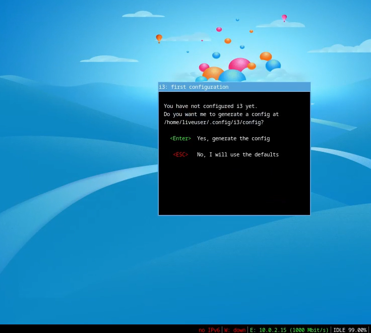
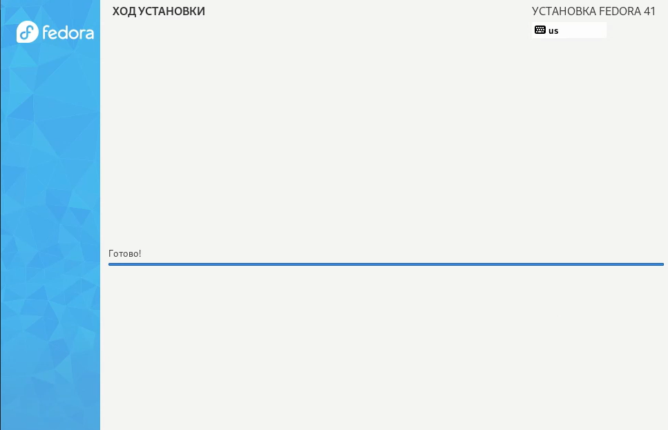
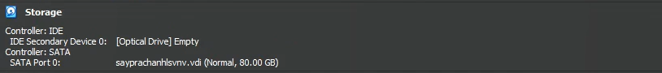

---
## Front matter
title: "Отчёт по лабораторной работе №1"
subtitle: "Операционные системы"
author: "Луангсуваннавонг Сайпхачан"

## Generic otions
lang: ru-RU
toc-title: "Содержание"

## Bibliography
bibliography: bib/cite.bib
csl: pandoc/csl/gost-r-7-0-5-2008-numeric.csl

## Pdf output format
toc: true # Table of contents
toc-depth: 2
lof: true # List of figures
lot: true # List of tables
fontsize: 12pt
linestretch: 1.5
papersize: a4
documentclass: scrreprt
## I18n polyglossia
polyglossia-lang:
  name: russian
  options:
	- spelling=modern
	- babelshorthands=true
polyglossia-otherlangs:
  name: english
## I18n babel
babel-lang: russian
babel-otherlangs: english
## Fonts
mainfont: IBM Plex Serif
romanfont: IBM Plex Serif
sansfont: IBM Plex Sans
monofont: IBM Plex Mono
mathfont: STIX Two Math
mainfontoptions: Ligatures=Common,Ligatures=TeX,Scale=0.94
romanfontoptions: Ligatures=Common,Ligatures=TeX,Scale=0.94
sansfontoptions: Ligatures=Common,Ligatures=TeX,Scale=MatchLowercase,Scale=0.94
monofontoptions: Scale=MatchLowercase,Scale=0.94,FakeStretch=0.9
mathfontoptions:
## Biblatex
biblatex: true
biblio-style: "gost-numeric"
biblatexoptions:
  - parentracker=true
  - backend=biber
  - hyperref=auto
  - language=auto
  - autolang=other*
  - citestyle=gost-numeric
## Pandoc-crossref LaTeX customization
figureTitle: "Рис."
tableTitle: "Таблица"
listingTitle: "Листинг"
lofTitle: "Список иллюстраций"
lotTitle: "Список таблиц"
lolTitle: "Листинги"
## Misc options
indent: true
header-includes:
  - \usepackage{indentfirst}
  - \usepackage{float} # keep figures where there are in the text
  - \floatplacement{figure}{H} # keep figures where there are in the text
---

# Цель работы

Целью данной работы является приобретение практических навыков установки операционной системы на виртуальную машину,
настройки минимально необходимых для дальнейшей работы сервисов.

# Задание

 1. Установка виртуальной машины
 2. Установка операционной системы
 3. Настройка операционной системы после установки
 4. Установка программного обеспечения для создания документации
 5. Выполнение дополнительных задач

# Выполнение лабораторной работы

## Установка виртуальной машины

Я уже установил и настроил virtualbox во время выполнения лабораторной работы по курсу "Архитектура компьютера и операционные системы" (раздел "архитектура компьютера"),
поэтому мне нужно только открыть программу (рис. [-@fig:001])

{#fig:001 width=70%}

Нажав на "Создать", я создаю новую виртуальную машину, ввожу свое имя, путь к папке machine,
выбираю тип операционной системы и версию (рис. [-@fig:002])

(из-за системы и драйвера моего компьютера я не могу использовать требуемую ОС
для выполнения лабораторной работы, поэтому я решил использовать другая операционная система, но аналогично имеет то же самое)

{#fig:002 width=70%}

Я настраиваю аппаратное обеспечение для визуальной машины. Я установил базовую память на 10 ГБ, а также процессор на 5 процессоров (рис. [-@fig:003])

{#fig:003 width=70%}

Затем я настроил виртуальный жесткий диск объемом 80 Гб в соответствии с требованиями лабораторной работы (рис. [-@fig:004])

{#fig:004 width=70%}

## Установка операционной системы

После завершения настройки виртуальной машины я запускаю ее и жду, пока операционная система завершит настройку. (рис. [-@fig:005])

{#fig:005 width=70%}

Я вижу интерфейс начальной настройки, я нажимаю "Enter", чтобы сгенерировать конфигурацию, затем снова нажимаю Enter, чтобы выбрать клавишу "Win" в качестве модификатора (рис. [-@fig:006])

{#fig:006 width=70%}

Нажав "Win+Enter", я открываю терминал, затем ввожу liveinst в терминал, чтобы запустить программу установки (рис. [-@fig:007])

{#fig:007 width=70%}

После этого откроется вкладка настройки. Я выбираю язык для использования в процессе установки (рис. [-@fig:008])

{#fig:008 width=70%}

Я проверяю место установки и сохраняю значение по умолчанию (рис. [-@fig:009])

{#fig:009 width=70%}

Я задаю имя компьютера в соответствии с соглашением об именовании (рис. [-@fig:010])

{#fig:010 width=70%}

Я настроил аккаунт администратора, а также пароль для суперпользователя (рис. [-@fig:011])

{#fig:011 width=70%}

Затем я создаю пользователя, вводя свое собственное имя, а также пароль к учетной записи пользователя (рис. [-@fig:012])

{#fig:012 width=70%}

После этого операционные системы будут установлены. После установки я нажимаю "завершить установку". (рис. [-@fig:013])

{#fig:013 width=70%}

Я возвращаюсь к интерфейсу Virtualbox, поскольку диск не выключился автоматически, я должен извлечь диск из виртуального привода (рис. [-@fig:014])

{#fig:014 width=70%}

После удаления носитель данных с изображением становится пустым (рис. [-@fig:015])

{#fig:015 width=70%}

## Настройка операционной системы после установки

Я снова запускаю визуальное окно, вхожу в ОС под своей учетной записью, которую я создал во время установки (рис. [-@fig:016])

{#fig:016 width=70%}

Я открываю терминал. Используя команду sudo -i, я переключаюсь на роль суперпользователя (рис. [-@fig:017])

{#fig:017 width=70%}

Используя команду dnf update, Я обновляю все пакеты (рис. [-@fig:018])

{#fig:018 width=70%}

Я устанавливаю программу для удобства работы в консоли:
tmux для открытия нескольких "вкладок" в одном терминале и mc для файлового менеджера в терминале (рис. [-@fig:019])

{#fig:019 width=70%}

Я устанавливаю программу для автоматического обновления (рис. [-@fig:020])

{#fig:020 width=70%}

затем я устанавливаю необходимую конфигурацию для программы (рис. [-@fig:021])

{#fig:021 width=70%}

Я перехожу в каталог /etc/selinux, а также ищу нужный файл (рис. [-@fig:022])

{#fig:022 width=70%}

Затем в конфигурации файла я добавляю файл: SELINUX=enforcing изменение на SELINUX=premissive (рис. [-@fig:023])

{#fig:023 width=70%}

Я сохраняю файл и закрываю его, после чего перезагружаю операционную систему (рис. [-@fig:024])

{#fig:024 width=70%}

Я снова вхожу в операционную систему, запускаю терминал и запускаю мультиплексор терминала (рис. [-@fig:025])

{#fig:025 width=70%}

Я переключаюсь на роль суперпользователя (рис. [-@fig:026])

{#fig:026 width=70%}

Я устанавливаю пакет dkms (рис. [-@fig:027])

{#fig:027 width=70%}

В меню виртуальной машины с помощью утилиты mount подключаю образ диска для гостевой ОС. (рис. [-@fig:028])

{#fig:028 width=70%}

Устанавливаю драйвер (рис. [-@fig:029])

{#fig:029 width=70%}

Затем я снова перезагружаю ОС (рис. [-@fig:030])

{#fig:030 width=70%}

После повторного входа в ОС я перехожу в каталог /etc/X11/xorg.conf.d/,
открываю mc для удобства в файловом менеджере и открываю файл 00-keyboard.conf (рис. [-@fig:031])

{#fig:031 width=70%}

Я редактирую конфигурационный файл (рис. [-@fig:032])

{#fig:032 width=70%}

Я снова перезагружаю систему (рис. [-@fig:033])

{#fig:033 width=70%}

## Установка программного обеспечения для создания документации

Я открываю браузер и устанавливаю pandoc и pandoc-crossref вручную, так как это будет необходимо для создания файлов и документов (рис. [-@fig:034])

{#fig:034 width=70%}

Я проверяю каталог загрузки через терминал (рис. [-@fig:035])

{#fig:035 width=70%}

Затем я извлекаю загруженные файлы (рис. [-@fig:036] и рис. [-@fig:037])

{#fig:036 width=70%}

{#fig:037 width=70%}

Я копирую оба файла в /usr/local/bin (рис. [-@fig:038] и рис. [-@fig:039])

{#fig:038 width=70%}

{#fig:039 width=70%}

Я проверяю работу своей команды с помощью ls (рис. [-@fig:040])

{#fig:040 width=70%}

Я устанавливаю дистрибутив texlive (рис. [-@fig:041])

{#fig:041 width=70%}

# Выполнение дополнительных задач

Я открываю терминал, запускаю команду dmesg, чтобы проанализировать последовательность загрузки системы (рис. [-@fig:042])

{#fig:042 width=70%}

С помощью поиска с помощью команды dmesg | grep -i я нашел версию Linux 6.12.15-200.fc41.x86_64 (рис. [-@fig:043])

{#fig:043 width=70%}

Затем, используя ту же команду, но изменив вводимые данные, на этот раз я ввел частоту процессора,
используя только одно ключевое слово "процессор", и в результате: частота процессора равна 2592,006 MHz (рис. [-@fig:044])

{#fig:044 width=70%}

Далее я ищу модель процессора (рис. [-@fig:045])

{#fig:045 width=70%}

Введя в команду ключевое слово "memory", я ищу объем доступной оперативной памяти (рис. [-@fig:046])

{#fig:046 width=70%}

Я ищу тип обнаруженного гипервизора (рис. [-@fig:047])

{#fig:047 width=70%}

Тип файловой системы корневого раздела, его можно посмотреть с помощью утилиты fdisk (рис. [-@fig:048])

{#fig:048 width=70%}

Что касается последовательности монтирования файловых систем, то ее можно отобразить, введя ключевое слово "mount" (рис. [-@fig:049])

{#fig:049 width=70%}

# Выводы

Во время выполнения этой лабораторной работы я приобрел практические навыки установки операционной системы на виртуальную машину и
настройки минимально необходимых для дальнейшей работы сервисов.

# Ответы на контрольные вопросы

1. Какую информацию содержит учётная запись пользователя?

	Учетная запись содержит данные для идентификации пользователя и информацию для входа в систему:

Имя пользователя (user name) — это уникальное имя, которое может содержать только английские буквы и знак _. Оно используется для входа в систему.

Идентификатор пользователя (UID) — это уникальный номер, который система присваивает каждому пользователю.

Идентификатор группы (GID) — это номер группы, к которой относится пользователь. У каждого пользователя есть хотя бы одна группа, и он может принадлежать к нескольким группам.

Полное имя (full name) — это может быть ФИО или другое имя, которое помогает идентифицировать пользователя.

Домашний каталог (home directory) — это личная папка пользователя, где хранятся его файлы, документы и настройки.

Оболочка (login shell) — это программа, которая запускается, когда пользователь входит в систему. Например, /bin/bash — это популярная оболочка в Linux.

2. Укажите команды терминала и приведите примеры:

для получения справки по команде: --help ;

для перемещения по файловой системе: cd;

для просмотра содержимого каталога: ls;

для определения объёма каталога: du;

для создания / удаления каталогов: mkdir / rmdir, для создания / удаления файлов: touch / rm;

для задания определённых прав на файл / каталог: chmod;

для просмотра истории команд - history.

3. Что такое файловая система? Приведите примеры с краткой характеристикой.

Файловая система — это способ организации и хранения файлов на диске. Она помогает системе находить и управлять файлами.

Примеры:

FAT32 — это старая файловая система, которая используется на флешках и старых компьютерах. Она поддерживает файлы до 4 ГБ.

ext3/ext4 — это файловая система для Linux. Она надёжная и быстрая, поддерживает большие файлы и диски.

NTFS — это файловая система для Windows. Она поддерживает большие файлы, шифрование и другие современные функции.

4. Как посмотреть, какие файловые системы подмонтированы в ОС?

Используя команду df в терминале, которая показывает список всех файловых систем, их размер и данные о памяти. а для просмотра подключенных файловых систем мы можем использовать команду mount

5. Как удалить зависший процесс?

Чтобы удалить зависший процесс, сначала находим его ID с помощью команды ps, затем используем команду kill <ID процесса>. Также можно использовать команду killall, чтобы завершить все процессы с определённым именем без указания ID.

# Список литературы{.unnumbered}

1. Dash, P. Getting Started with Oracle VM VirtualBox / P. Dash. – Packt Publishing Ltd, 2013. – 86 сс.
2. Colvin, H. VirtualBox: An Ultimate Guide Book on Virtualization with VirtualBox. VirtualBox / H. Colvin. – CreateSpace Independent Publishing Platform, 2015. – 70 сс.
3. Vugt, S. van. Red Hat RHCSA/RHCE 7 cert guide : Red Hat Enterprise Linux 7 (EX200 and EX300) : Certification Guide. Red Hat RHCSA/RHCE 7 cert guide / S. van Vugt. – Pearson IT Certification, 2016. – 1008 сс.
4. Робачевский, А. Операционная система UNIX / А. Робачевский, С. Немнюгин, О. Стесик. – 2-е изд. – Санкт-Петербург : БХВ-Петербург, 2010. – 656 сс.
5. Немет, Э. Unix и Linux: руководство системного администратора. Unix и Linux / Э. Немет, Г. Снайдер, Т.Р. Хейн, Б. Уэйли. – 4-е изд. – Вильямс, 2014. – 1312 сс.
6. Колисниченко, Д.Н. Самоучитель системного администратора Linux : Системный администратор / Д.Н. Колисниченко. – Санкт-Петербург : БХВ-Петербург, 2011. – 544 сс.
7. Robbins, A. Bash Pocket Reference / A. Robbins. – O’Reilly Media, 2016. – 156 сс.

::: {#refs}
:::
