---
## Front matter
lang: ru-RU
title: Лабораторая работа №2
subtitle: Операционные системы
author:
  - Луангсуваннавонг Сайпхачан
institute:
  - Российский университет дружбы народов, Москва, Россия
date: 03 марта 2025

## i18n babel
babel-lang: russian
babel-otherlangs: english

## Formatting pdf
toc: false
toc-title: Содержание
slide_level: 2
aspectratio: 169
section-titles: true
theme: metropolis
header-includes:
 - \metroset{progressbar=frametitle,sectionpage=progressbar,numbering=fraction}
---

## Цель работы

  Цель работы - Изучение идеологии и применения инструментов контроля
версий и овладение навыками работы с git.

## Задание

  1. Создать базовую конфигурацию для работы с git.
  2. Создать ключ SSH.
  3. Создать ключ PGP.
  4. Настроить подписи git.
  5. Зарегистрироваться на Github.
  6. Создать локальный каталог для выполнения заданий по предмету.
  
## Базовая установка и настройка
 Устанавливаю git и gh (рис. 1)

  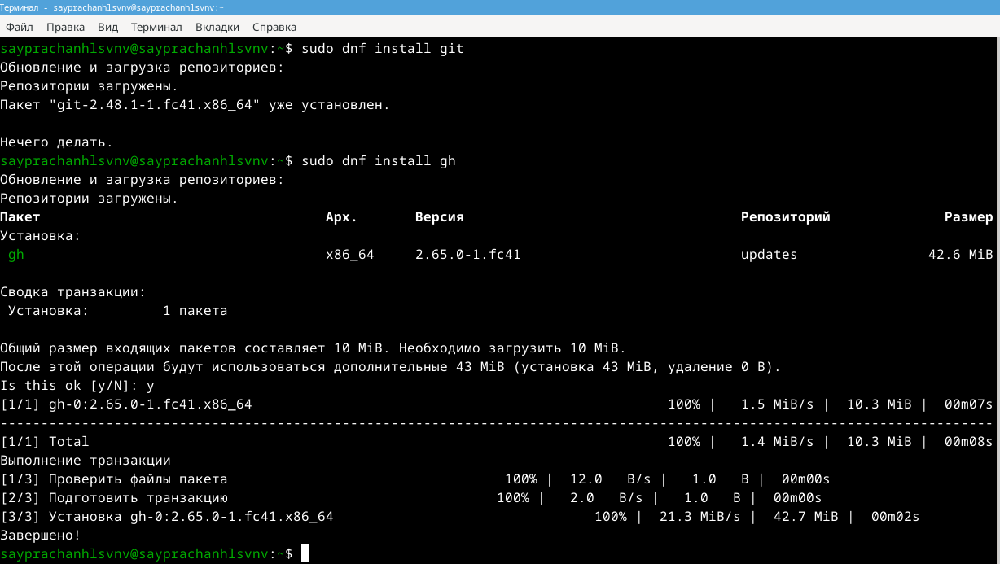

## Базовая установка и настройка

 Я настраиваю имя и адрес электронной почты владельца репозитория (рис. 2)

  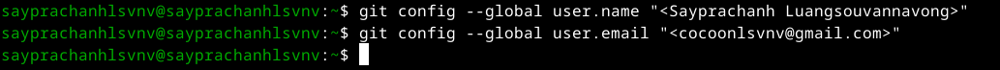
  
## Базовая установка и настройка

 - Настройка utf-8 для корректного отображения (рис. 3)

 

## Базовая установка и настройка

 - Настройка начальной ветви (рис. 4)

 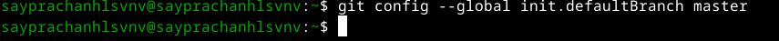

## Базовая установка и настройка

 - Настройка параметров autocrlf (рис. 5)

  
  
## Базовая установка и настройка

- Настройка параметров safecrlf (рис. 6)
 
  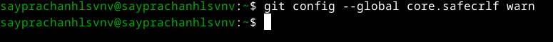

## Базовая установка и настройка

Я создаю ssh-ключ размером 4096 бит по алгоритму rsa (рис. 7)

  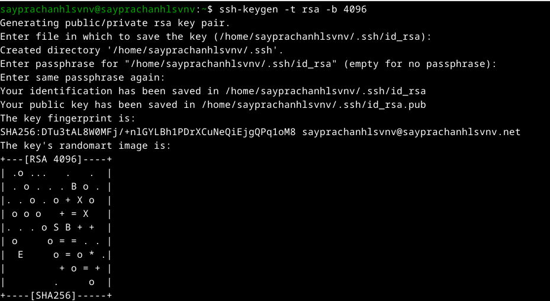

## Базовая установка и настройка

Я создаю ssh-ключ по алгоритму ed25519 (рис. 8)

  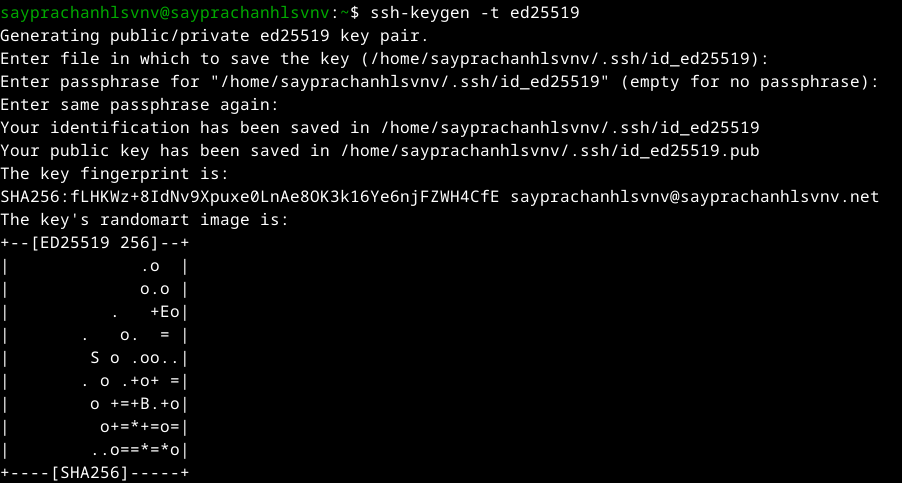

## Базовая установка и настройка

 Я генерирую ключ GPG, а также отвечаю на вопросы о личной информации (рис. 9)

  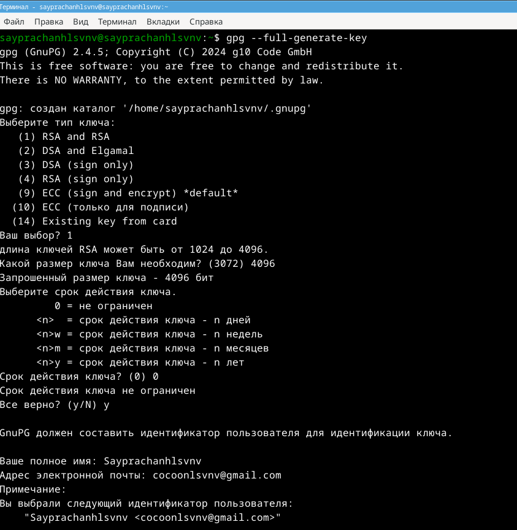

## Базовая установка и настройка

Я ввожу фразу-пароль для защиты нового ключа (рис. 10)

  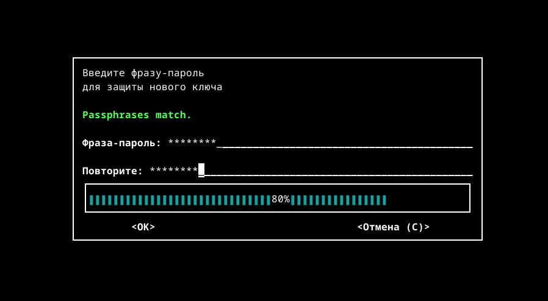

## Базовая установка и настройка

Я уже создал аккаунт на GitHub, а также настроил систему, поэтому просто вхожу в свой аккаунт (рис. 1)

  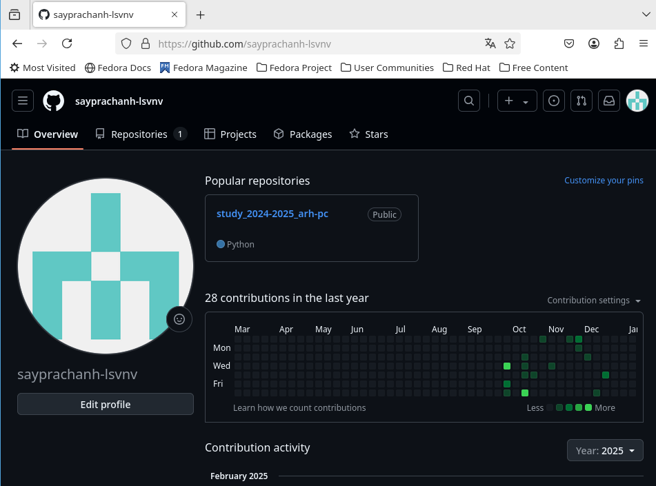
  
## Настройка на GitHub

я отображаю и копирую сгенерированный ключ (рис. 12)

  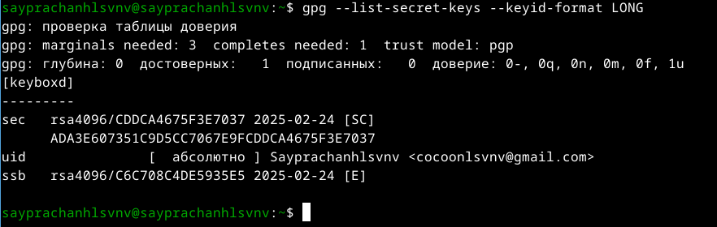

## Настройка на GitHub

Я копирую сгенерированный ключ в буфер обмена (рис. 13)

  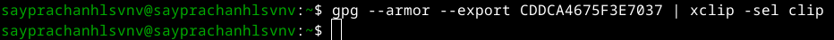

## Настройка на GitHub

Захожу в настройки свой аккаунт на GitHub, нахожу раздел GPG keys для ее добавления (рис. 14)

 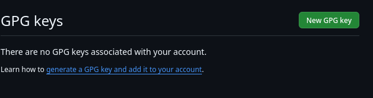

## Настройка на GitHub

Нажимаю “New GPG Key” и вставляю ключ из буфера обмена (рис. 15)

 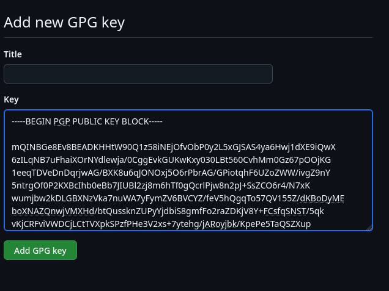

## Настройка на GitHub

 Я добавил ключи (рис. 16)

 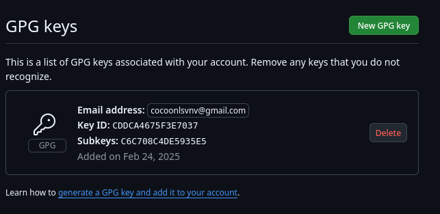

## Настройка на GitHub 

Используя ранее введенный адрес электронной почты, я указываю git, чтобы
использовать его при создании подписи фиксации (рис. 17)

 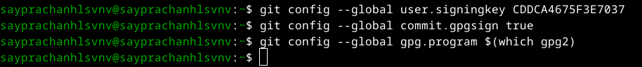

## Настройка на GitHub

Авторизация в gh, я отвечаю на вопросы и аутентифицируюсь на GitHub через браузер (рис. 18)

 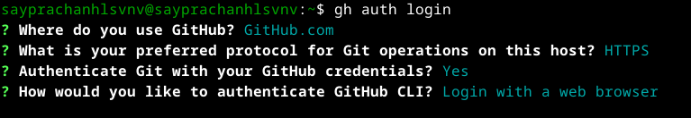

## Настройка на GitHub

Затем я завершаю авторизацию на сайте (рис. 19)

 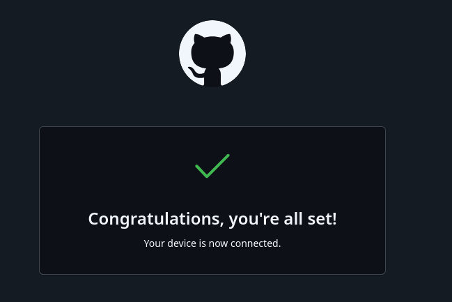

## Настройка на GitHub

Вижу текст о завершении авторизации под именем sayprachanh-lsvnv (рис. 20)

 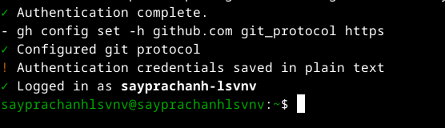
  
## Настройка файлов и каталогов

Я создаю новый каталог, а также новый репозиторий на GitHub (рис. 21)

 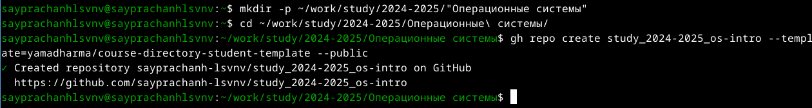

## Настройка файлов и каталогов

Я клонирую репозиторий в свой локальный репозиторий (рис. 22)

 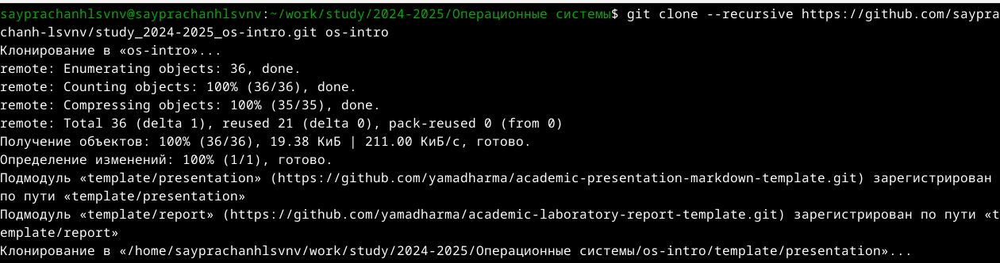

## Настройка файлов и каталогов

Я перехожу в каталог и проверяю содержимое каталога (рис. 23)

 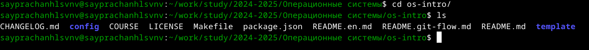
  
## Настройка файлов и каталогов

Я удаляю файл package.json, а также создаю необходимые каталоги (рис. 24)

  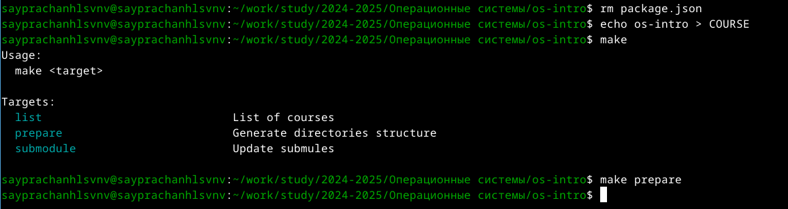

## Завершение работы 

После этого я добавляю все на GitHub (рис. 25)

  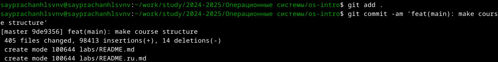
  
## Завершение работы 
  
Я отправляю все файлы на сервер Github (рис. 26)

  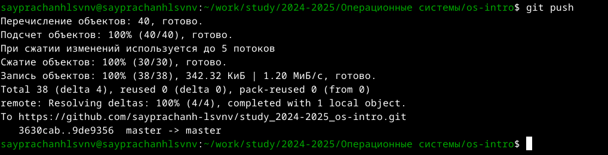
  
## Выводы

  Во время выполнения этой лабораторной работы, я изучил идеологию и при-
  меняемые инструменты контроля версий, а также овладел навыками работы с
  git
  
## Список литературы{.unnumbered}

  [Лабораторная работа № 2](https://esystem.rudn.ru/mod/page/view.php?id=1224371)
  
:::{#refs}
:::
