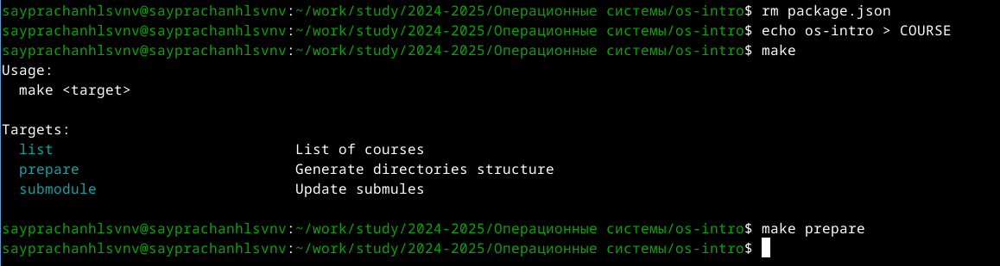

---
## Front matter
title: "Отчёт по лабораторной работе №2"
subtitle: "Операционные системы"
author: "Луангсуваннавонг Сайпхачан"

## Generic otions
lang: ru-RU
toc-title: "Содержание"

## Bibliography
bibliography: bib/cite.bib
csl: pandoc/csl/gost-r-7-0-5-2008-numeric.csl

## Pdf output format
toc: true # Table of contents
toc-depth: 2
lof: true # List of figures
lot: true # List of tables
fontsize: 12pt
linestretch: 1.5
papersize: a4
documentclass: scrreprt
## I18n polyglossia
polyglossia-lang:
  name: russian
  options:
	- spelling=modern
	- babelshorthands=true
polyglossia-otherlangs:
  name: english
## I18n babel
babel-lang: russian
babel-otherlangs: english
## Fonts
mainfont: IBM Plex Serif
romanfont: IBM Plex Serif
sansfont: IBM Plex Sans
monofont: IBM Plex Mono
mathfont: STIX Two Math
mainfontoptions: Ligatures=Common,Ligatures=TeX,Scale=0.94
romanfontoptions: Ligatures=Common,Ligatures=TeX,Scale=0.94
sansfontoptions: Ligatures=Common,Ligatures=TeX,Scale=MatchLowercase,Scale=0.94
monofontoptions: Scale=MatchLowercase,Scale=0.94,FakeStretch=0.9
mathfontoptions:
## Biblatex
biblatex: true
biblio-style: "gost-numeric"
biblatexoptions:
  - parentracker=true
  - backend=biber
  - hyperref=auto
  - language=auto
  - autolang=other*
  - citestyle=gost-numeric
## Pandoc-crossref LaTeX customization
figureTitle: "Рис."
tableTitle: "Таблица"
listingTitle: "Листинг"
lofTitle: "Список иллюстраций"
lotTitle: "Список таблиц"
lolTitle: "Листинги"
## Misc options
indent: true
header-includes:
  - \usepackage{indentfirst}
  - \usepackage{float} # keep figures where there are in the text
  - \floatplacement{figure}{H} # keep figures where there are in the text
---

# Цель работы

Цель работы - Изучение идеологии и применения инструментов контроля версий
и овладение навыками работы с git.

# Задание

  1. Создать базовую конфигурацию для работы с git.
  2. Создать ключ SSH.
  3. Создать ключ PGP.
  4. Настроить подписи git.
  5. Зарегистрироваться на Github.
  6. Создать локальный каталог для выполнения заданий по предмету.

# Теоретическое введение

Системы контроля версий (Version Control System, VCS) применяются при работе нескольких человек над одним проектом. Обычно основное дерево проекта хранится в локальном или удалённом репозитории, к которому настроен доступ для участников проекта. При внесении изменений в содержание проекта система контроля версий позволяет их фиксировать, совмещать изменения, произведённые разными участниками проекта, производить откат к любой более ранней версии проекта, если это требуется.

В классических системах контроля версий используется централизованная модель, предполагающая наличие единого репозитория для хранения файлов. Выполнение большинства функций по управлению версиями осуществляется специальным сервером. Участник проекта (пользователь) перед началом работы посредством определённых команд получает нужную ему версию файлов. После внесения изменений, пользователь размещает новую версию в хранилище. При этом предыдущие версии не удаляются из центрального хранилища и к ним можно вернуться в любой момент. Сервер может сохранять не полную версию изменённых файлов, а производить так называемую дельта-компрессию — сохранять только изменения между последовательными версиями, что позволяет уменьшить объём хранимых данных.

Системы контроля версий поддерживают возможность отслеживания и разрешения конфликтов, которые могут возникнуть при работе нескольких человек над одним файлом. Можно объединить (слить) изменения, сделанные разными участниками (автоматически или вручную), вручную выбрать нужную версию, отменить изменения вовсе или заблокировать файлы для изменения. В зависимости от настроек блокировка не позволяет другим пользователям получить рабочую копию или препятствует изменению рабочей копии файла средствами файловой системы ОС, обеспечивая таким образом, привилегированный доступ только одному пользователю, работающему с файлом.

Системы контроля версий также могут обеспечивать дополнительные, более гибкие функциональные возможности. Например, они могут поддерживать работу с несколькими версиями одного файла, сохраняя общую историю изменений до точки ветвления версий и собственные истории изменений каждой ветви. Кроме того, обычно доступна информация о том, кто из участников, когда и какие изменения вносил. Обычно такого рода информация хранится в журнале изменений, доступ к которому можно ограничить.

В отличие от классических, в распределённых системах контроля версий центральный репозиторий не является обязательным.

Среди классических VCS наиболее известны CVS, Subversion, а среди распределённых — Git, Bazaar, Mercurial. Принципы их работы схожи, отличаются они в основном синтаксисом используемых в работе команд.

# Выполнение лабораторной работы

## Установка программного обеспечения

Я установил git и gh в систему используя команду `dnf install`(рис. [-@fig:001])

{#fig:001 width=70%}

## Базовая настройка git

Затем я настраиваю имя и адрес электронной почты владельца репозитория, используя свое имя и адрес электронной почты (рис. [-@fig:002])

{#fig:002 width=70%}

Я настраиваю utf-8 при выводе git-сообщений о коррекции отображения (рис. [-@fig:003])

{#fig:003 width=70%}

Я задаю имя начальной ветви как (master) (рис. [-@fig:004])

{#fig:004 width=70%}

Я задаю параметры autocrlf и safecrlf для корректного отображения строки
(рис. [-@fig:005] и рис. [-@fig:006])

{#fig:005 width=70%}

{#fig:006 width=70%}

## Создание ключа SSH

Я создаю ssh-ключ размером 4096 бит по алгоритму rsa(рис. [-@fig:007])

{#fig:007 width=70%}

Я создаю ssh-ключ по алгоритму ed25519(рис. [-@fig:008])

{#fig:008 width=70%}

## Создание ключа GPG

Генерирую ключ GPG, выбираю 1 для типа ключа RSA и RSA ,
затем ввожу 4096 для необходимого размера ключа и оставляю неограниченный срок действия ключа,
а также отвечаю на вопросы о личной информации(рис. [-@fig:009])

{#fig:009 width=70%}

Я ввожу фразу-пароль для защиты нового ключа(рис. [-@fig:010])

{#fig:010 width=70%}

## Настройка GitHub

Я уже создал аккаунт на GitHub, а также настроил систему, поэтому просто вхожу в свой аккаунт.(рис. [-@fig:011])

{#fig:011 width=70%}

## Добавление GPG ключа в GitHub

Я отображаю список ключей в терминале и нахожу сгенерированные ключи GPG,
ключ находится за обратной косой чертой, поэтому я копирую его(рис. [-@fig:012])

{#fig:012 width=70%}

Я самостоятельно копирую отпечаток GPG, затем с помощью утилиты xclip копирую его в буфер обмена(рис. [-@fig:013])

{#fig:013 width=70%}

Захожу в настройки свой аккаунт на GitHub, нахожу раздел GPG keys для ее добавления(рис. [-@fig:014])

{#fig:014 width=70%}

Нажимаю "New GPG Key" и вставляю ключ из буфера обмена(рис. [-@fig:015])

{#fig:015 width=70%}

Я добавил ключи GPG(рис. [-@fig:016])

{#fig:016 width=70%}

## Настройка автоматических подписей коммитов git

Используя ранее введенный адрес электронной почты,
я указываю git, чтобы использовать его при создании подписи фиксации(рис. [-@fig:017])

{#fig:017 width=70%}

## Настройка gh

Я начинаю авторизацию в gh, отвечаю на наводящие вопросы и выбираю Авторизоваться через браузер.(рис. [-@fig:018])

{#fig:018 width=70%}

Затем я завершаю авторизацию на сайте(рис. [-@fig:019])

{#fig:019 width=70%}

Вижу текст о завершении авторизации под именем sayprachanh-lsvnv(рис. [-@fig:020])

{#fig:020 width=70%}

## Сознание репозитория курса на основе шаблона

После этого я начинаю создавать каталог с помощью mkdir, присваивая ему имя: операционные системы.
Используя cd, я вхожу в созданный каталог.
А также создайте новый репозиторий на моем Github под названием study_2024-2025_os-intro(рис. [-@fig:021])

{#fig:021 width=70%}

Используя git clone, я клонирую удаленный репозиторий, который я создал ранее, в свой локальный репозиторий(рис. [-@fig:022])

{#fig:022 width=70%}

## Настройка каталога курса

Я перехожу в каталог с помощью command cd и проверяю содержимое каталога с помощью ls(рис. [-@fig:023])

{#fig:023 width=70%}

Используя команду rm, я удаляю файл package.json. Затем я создаю необходимые каталоги с помощью make и
выбираю опцию "prepare" для создания структуры каталогов(рис. [-@fig:024])

{#fig:024 width=70%}

Я добавляю все файлы для отправки на сервер с помощью команды git add. и комментирую их с помощью git commit(рис. [-@fig:025])

{#fig:025 width=70%}

Я отправляю файл на сервер с помощью команды git push(рис. [-@fig:026])

{#fig:026 width=70%}

# Выводы

Во время выполнения этой лабораторной работы,
я изучил идеологию и применяемые инструменты контроля версий, а также овладел навыками работы с git

# Ответы на контрольные вопросы

1. Что такое системы контроля версий (VCS) и для решения каких задач они предназначаются?

Системы контроля версий (VCS) — это инструменты для управления изменениями в файлах. Они помогают:

Сохранять историю изменений.
Отслеживать, кто и когда внёс изменения.
Возвращаться к предыдущим версиям.
Совместно работать над проектами.

2. Объясните следующие понятия VCS и их отношения: хранилище, commit, история, рабочая копия.
Хранилище (репозиторий) — место, где хранятся все версии файлов.

Commit — фиксация изменений в хранилище с комментарием.
История — последовательность всех commit'ов.
Рабочая копия — текущая версия файлов на компьютере разработчика.

3. Что представляют собой и чем отличаются централизованные и децентрализованные VCS? Приведите примеры VCS каждого вида.

Централизованные VCS (например, SVN): одно главное хранилище, с которым работают все.
Децентрализованные VCS (например, Git): у каждого разработчика своя копия хранилища, изменения объединяются позже.

4. Опишите действия с VCS при единоличной работе с хранилищем.

Создать репозиторий (git init).
Добавить файлы (git add).
Фиксировать изменения (git commit).
Просматривать историю (git log).

5. Опишите порядок работы с общим хранилищем VCS.

Клонировать репозиторий (git clone).
Создать ветку для изменений (git branch).
Фиксировать изменения (git commit).
Отправить изменения на сервер (git push).
Получить изменения от других (git pull).

6. Каковы основные задачи, решаемые инструментальным средством git?

Управление версиями файлов.
Совместная работа над кодом.
Создание и управление ветками.
Резервное копирование и восстановление.

7. Назовите и дайте краткую характеристику командам git.

git init — создать новый репозиторий.
git add — добавить файлы в индекс.
git commit — зафиксировать изменения.
git push — отправить изменения на сервер.
git pull — получить изменения с сервера.
git branch — управление ветками.
git merge — объединить ветки.

8. Приведите примеры использования при работе с локальным и удалённым репозиториями.

Чтобы работать с локальным репозиторием, сначала создаём его с помощью команды git init. Затем добавляем файлы командой git add и фиксируем изменения командой git commit -m "Описание изменений". Для работы с удалённым репозиторием клонируем его командой git clone, вносим изменения и отправляем их на сервер командой git push origin main.

9. Что такое и зачем могут быть нужны ветви (branches)?

Ветви — это отдельные линии разработки. Они нужны для:
Параллельной работы над разными задачами.
Изоляции экспериментальных изменений.
Упрощения слияния изменений.

10. Как и зачем можно игнорировать некоторые файлы при commit?

Во время работы над проектом могут быть созданы файлы, которые не следует добавлять в репозиторий, например, временный файл. Чтобы игнорировать это, мы создаем файл.gitignore и указываем в нем шаблоны файлов или папок.

# Список литературы{.unnumbered}

[Лабораторная работа № 2](https://esystem.rudn.ru/mod/page/view.php?id=1224371)

::: {#refs}
:::
