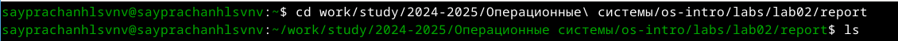
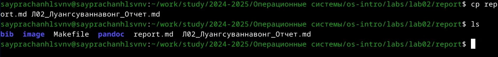
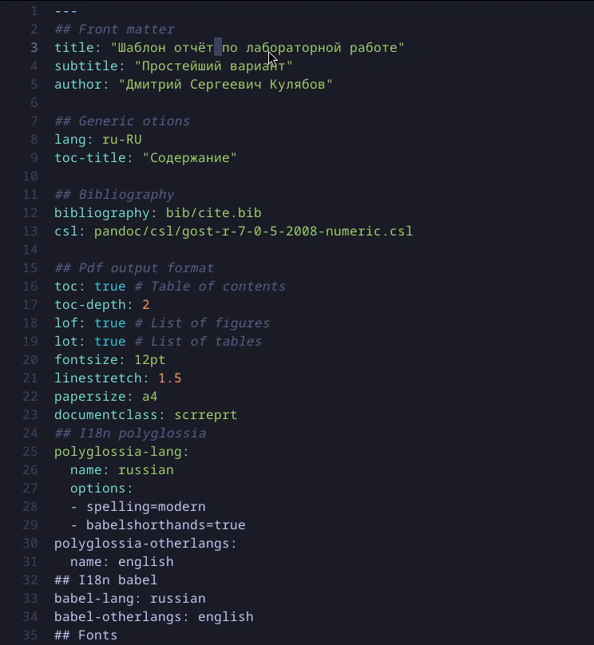
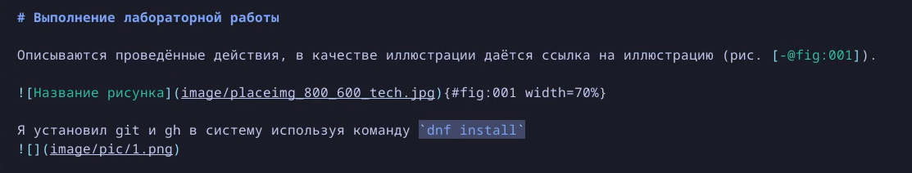
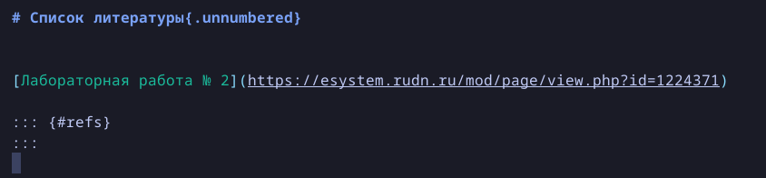
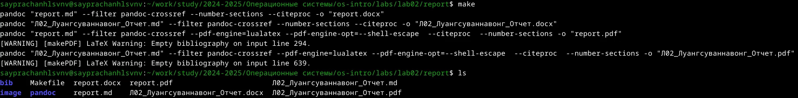
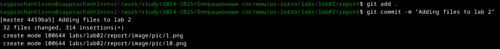
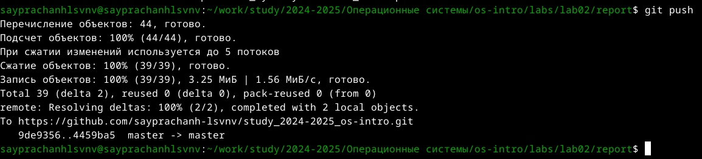

---
## Front matter
title: "Отчёт по лабораторной работе №3"
subtitle: "Операционные системы"
author: "Луангсуваннавонг Сайпхачан"

## Generic otions
lang: ru-RU
toc-title: "Содержание"

## Bibliography
bibliography: bib/cite.bib
csl: pandoc/csl/gost-r-7-0-5-2008-numeric.csl

## Pdf output format
toc: true # Table of contents
toc-depth: 2
lof: true # List of figures
lot: true # List of tables
fontsize: 12pt
linestretch: 1.5
papersize: a4
documentclass: scrreprt
## I18n polyglossia
polyglossia-lang:
  name: russian
  options:
	- spelling=modern
	- babelshorthands=true
polyglossia-otherlangs:
  name: english
## I18n babel
babel-lang: russian
babel-otherlangs: english
## Fonts
mainfont: IBM Plex Serif
romanfont: IBM Plex Serif
sansfont: IBM Plex Sans
monofont: IBM Plex Mono
mathfont: STIX Two Math
mainfontoptions: Ligatures=Common,Ligatures=TeX,Scale=0.94
romanfontoptions: Ligatures=Common,Ligatures=TeX,Scale=0.94
sansfontoptions: Ligatures=Common,Ligatures=TeX,Scale=MatchLowercase,Scale=0.94
monofontoptions: Scale=MatchLowercase,Scale=0.94,FakeStretch=0.9
mathfontoptions:
## Biblatex
biblatex: true
biblio-style: "gost-numeric"
biblatexoptions:
  - parentracker=true
  - backend=biber
  - hyperref=auto
  - language=auto
  - autolang=other*
  - citestyle=gost-numeric
## Pandoc-crossref LaTeX customization
figureTitle: "Рис."
tableTitle: "Таблица"
listingTitle: "Листинг"
lofTitle: "Список иллюстраций"
lotTitle: "Список таблиц"
lolTitle: "Листинги"
## Misc options
indent: true
header-includes:
  - \usepackage{indentfirst}
  - \usepackage{float} # keep figures where there are in the text
  - \floatplacement{figure}{H} # keep figures where there are in the text
---

# Цель работы

Цель работы - Научиться оформлять отчёты с помощью легковесного языка разметки Markdown.

# Задание

 1. Сделайте отчёт по предыдущей лабораторной работе в формате Markdown.
 2. В качестве отчёта просьба предоставить отчёты в 3 форматах: pdf, docx и md (в архиве,
    поскольку он должен содержать скриншоты, Makefile и т.д.)

# Теоретическое введение

  Markdown - это облегченный язык разметки,
  созданный для форматирования обычного текста с максимальным сохранением его читабельности
  человеком и пригодный для машинного преобразования в языки для расширенной публикации.
  
# Выполнение лабораторной работы

Перехожу в каталог, в котором находится шаблон отчет по лабораторной работы, с помощью утилиты cd (рис. [-@fig:001])

{#fig:001 width=70%}

Используя утилиту cp, я создаю шаблон, над которым буду работать, копируя исходный файл report.md и присваивая ему новое имя (рис. [-@fig:002])

{#fig:002 width=70%}

Я открываю созданный файл с помощью текстового редактора helix (рис. [-@fig:003])

{#fig:003 width=70%}

Я начинаю работать над  отчетом по лабораторной работы, следуя инструкции, добавляю фотографии, используя заданную форму. (рис. [-@fig:004])

{#fig:004 width=70%}

В конце отчета, я добавляю список литературы, который я использую для выполнения лабораторной работы. (рис. [-@fig:005])

{#fig:005 width=70%}

После завершения записи с языком разметки Markdown, я сохраняю и закрываю файл, затем, используя команду make, создаю копии файлов из файла md в формате pdf и формате docx. (рис. [-@fig:006])

{#fig:006 width=70%}

После этого я добавляю созданные файлы в репозиторий GitHub. (рис. [-@fig:007])

{#fig:007 width=70%}

Я отправляю все файлы на сервер с помощью команды git push (рис. [-@fig:008])

{#fig:008 width=70%}

# Выводы

Во время выполнения этой лабораторной работы,
я научился создавать отчеты с использованием облегченного языка разметки Markdown.

# Список литературы{.unnumbered}

[Лабораторная работа № 3](https://esystem.rudn.ru/pluginfile.php/2586858/mod_resource/content/3/003-lab_markdown.pdf)

::: {#refs}
:::
