---
## Front matter
lang: ru-RU
title: Лабораторная работа №4
subtitle: Операционные системы
author:
  - Луангсуваннавонг Сайпхачан
institute:
  - Российский университет дружбы народов, Москва, Россия
date: 04 Марта 2025

## i18n babel
babel-lang: russian
babel-otherlangs: english

## Formatting pdf
toc: false
toc-title: Содержание
slide_level: 2
aspectratio: 169
section-titles: true
theme: metropolis
header-includes:
 - \metroset{progressbar=frametitle,sectionpage=progressbar,numbering=fraction}
---

## Цель работы

Цель работы - получение навыков правильной работы с репозиториями git

## Задание

1. Выполнить работу для тестового репозитория.
2. Преобразовать рабочий репозиторий в репозиторий с git-flow и conventional commits.

## Установка git-flow

Во-первых, я включаю репозиторий copr (рис. 1)

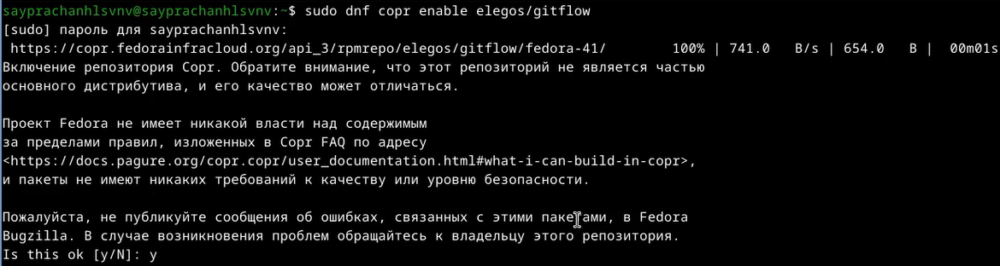

## Установка git-flow

Затем я устанавливаю git-flow (рис. 2)

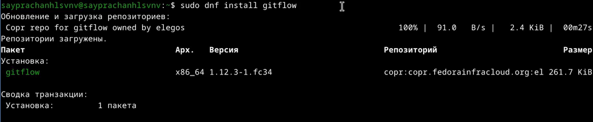

## Установка Node.js

Я устанавливаю Node.js для семантического управления версиями и общепринятых коммитов (рис. 3)

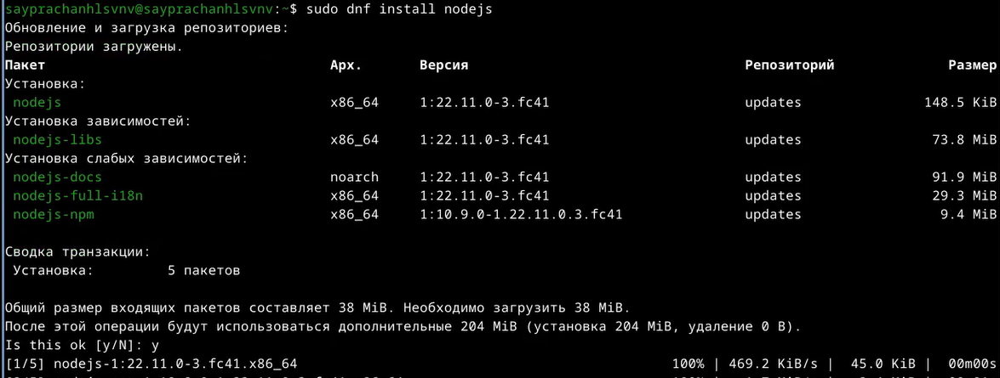

## Установка Node.js

Устанавливаю pnpm для зависимостей установки и для более быстрой установки (рис. 4)

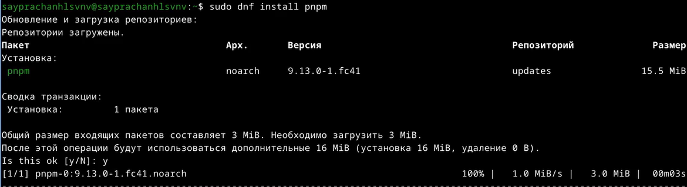

## Настройка Node.js

После установки я задаю путь к своей системе для использования в работе с помощью команды pnpm setup (рис. 5)

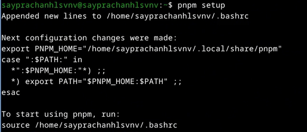

## Настройка Node.js

Я указал путь к pnpm как к файлу ~/.bashrc, поскольку я буду использовать pnpm для установки пакетов (рис. 6)

## Настройка Node.js

Я устанавливаю программу, которая используется для форматирования коммитов,
и вместе с git-cz, который используется для коммитов (рис. 7)

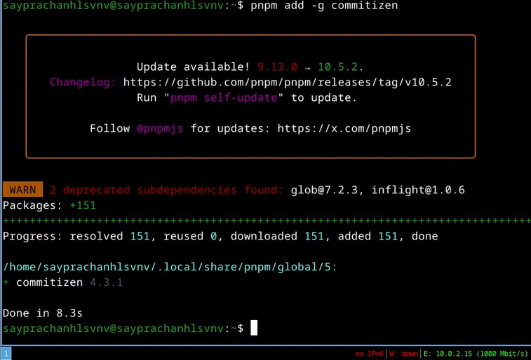

## Настройка Node.js

Я устанавливаю программу, которая помогает с созданием журнала изменений (рис. 8)

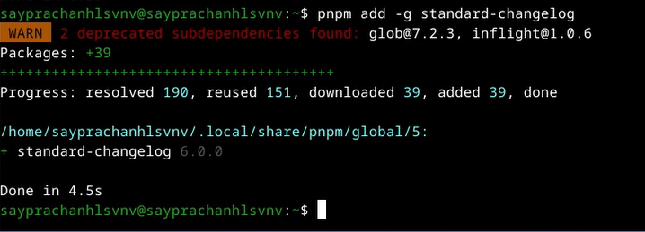

## Создание репозитория git

Я создаю новый репозиторий на github, даю ему имя git-extended (рис. 9)

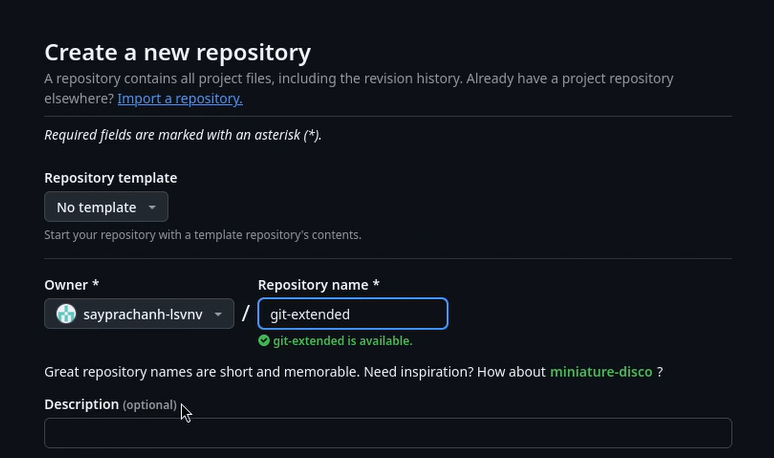

## Создание репозитория git

Я создаю новый каталог с тем же именем, что и у репозитория (рис. 10)

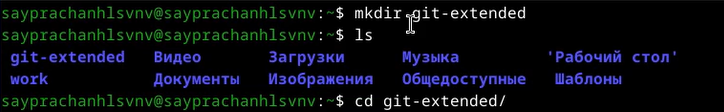

## Создание репозитория git

Я начинаю делать свой первый коммит в репозитории (рис. 11)

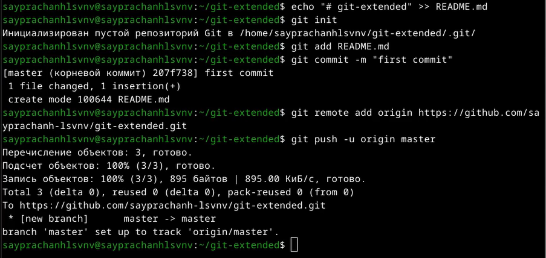

## Создание репозитория git

Мы видим, что в репозитории появился новый файл с первого коммита (рис. 12)

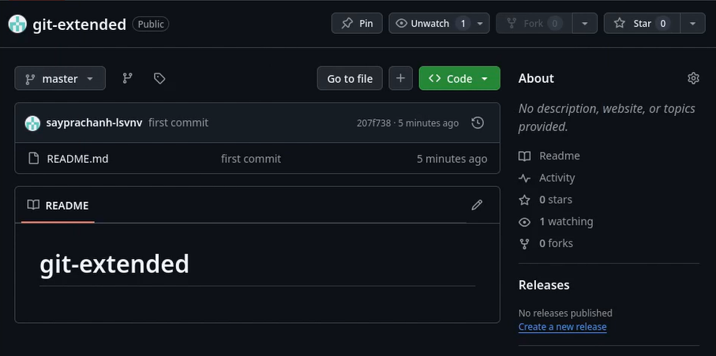

## Создание репозитория git

Я создаю файл package.json для настройки Nodejs, используя команду pnpm init (рис. 13)

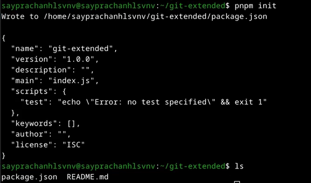

## Создание репозитория git

Я вношу некоторые изменения в файл package.json (рис. 14)

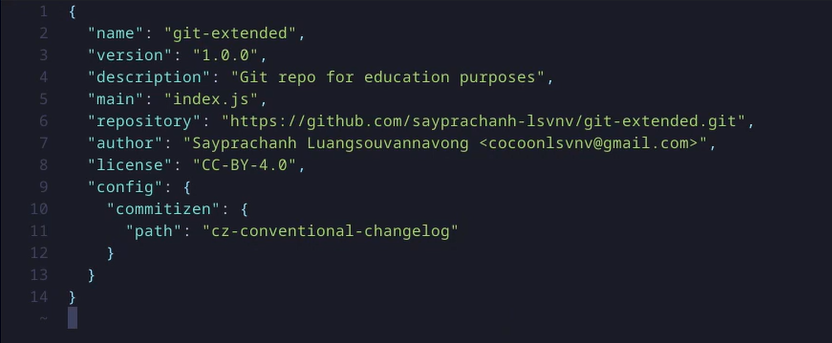

## Создание репозитория git

Я добавляю файл на GitHub (рис. 15)

## Создание репозитория git

Затем я выполняю коммит в файле используя git-cz (рис. 16)

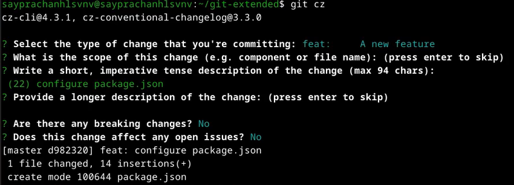

## Создание репозитория git

Отправляю файл на сервер GitHub (рис. 17)

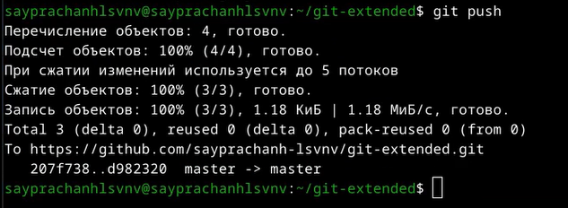

## Создание репозитория git

Начинаю инициализировать git flow (рис. 18)

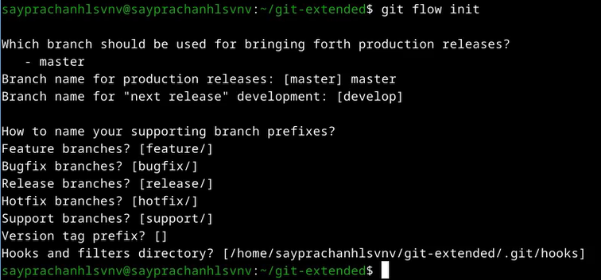

## Создание репозитория git

Я проверяю ветку, в которой нахожусь в данный момент, которая является веткой develop (рис. 19)

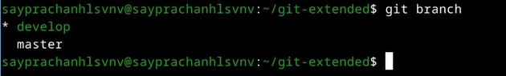

## Создание репозитория git

Затем я попробовал загрузить все репозитории в удаленный репозиторий (рис. 20)

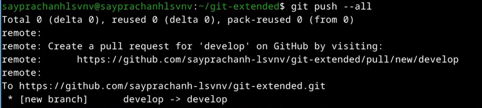

## Создание репозитория git

Я установил внешнюю ветвь в качестве восходящей ветви (рис. 21)

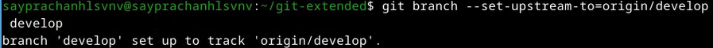

## Создание репозитория git

Используя git flow release start, я создаю новый релиз и устанавливаю версию 1.0.0 (рис. 22)

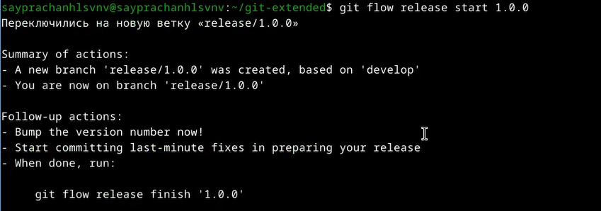

## Создание репозитория git

Создаю журнал изменений файлов для документирования изменений (рис. 23)

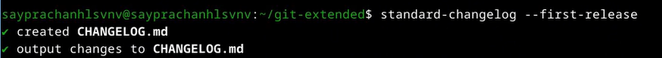

## Создание репозитория git

Затем я добавляю файл журнала изменений в индекс GitHub (рис. 24)

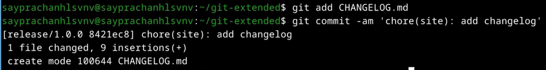

## Создание репозитория git

После завершения создания новой версии релиза,
я использую команду git flow release finish, чтобы завершить процесс. (рис. 25)

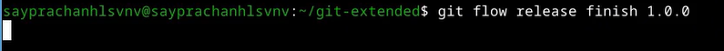

## Создание репозитория git

Я объединяю ветвь release с основной ветвью (рис. 26)

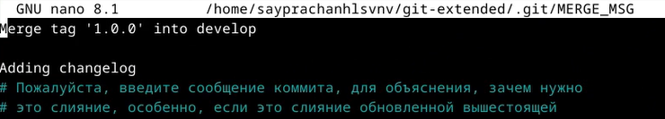

## Создание репозитория git

Я отправляю все на сервер GitHub (рис. 27)

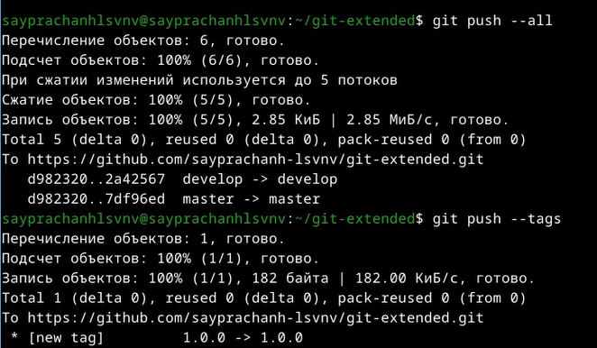

## Создание репозитория git

Я создаю тег выпуска в репозитории GitHub и устанавливаю версию выпуска на 1.0.0 (рис. 28)

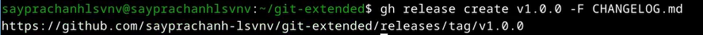

## Работа с репозиторием git

Я создаю новую ветку для разработки новой функциональности используя команду git flow start (рис. 29)

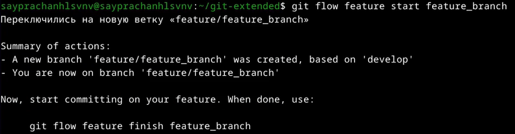

## Работа с репозиторием git

После завершения создания функционала я завершаю процесс с помощью команды git flow finish,
а также создаю новую ветку для обновления версии выпуска (рис. 30)

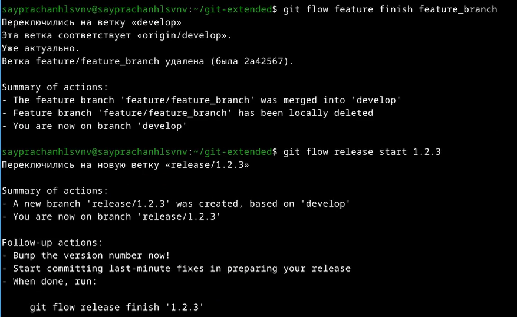

## Работа с репозиторием git

Я редактирую файл package.json, меняю версию с 1.0.0 на 1.2.3 (рис. 31)

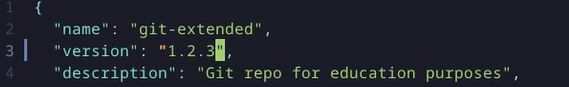

## Работа с репозиторием git

Я создаю журнал изменений и добавляю все в индекс GitHub (рис. 32)

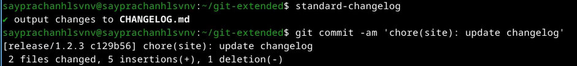

## Работа с репозиторием git

Я отправляю новый релиз на сервер GitHub (рис. 33)

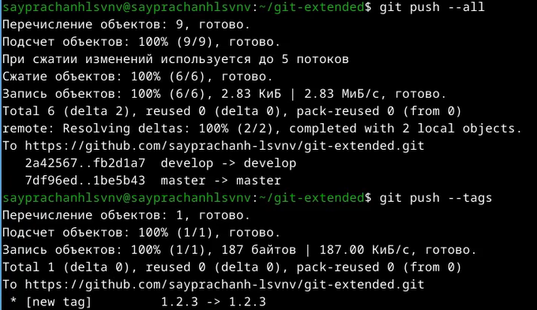

## Работа с репозиторием git

Создаю тег выпуска в репозитории github с комментарием из журнала изменений (рис. 34)

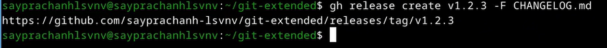

## Список литературы{.unnumbered}

[Лабораторная работа №4](https://esystem.rudn.ru/mod/page/view.php?id=1224375)
