---
## Front matter
title: "Отчёт по лабораторной работе №4"
subtitle: "Операционные системы"
author: "Луангсуваннавонг Сайпхачан"

## Generic otions
lang: ru-RU
toc-title: "Содержание"

## Bibliography
bibliography: bib/cite.bib
csl: pandoc/csl/gost-r-7-0-5-2008-numeric.csl

## Pdf output format
toc: true # Table of contents
toc-depth: 2
lof: true # List of figures
lot: true # List of tables
fontsize: 12pt
linestretch: 1.5
papersize: a4
documentclass: scrreprt
## I18n polyglossia
polyglossia-lang:
  name: russian
  options:
	- spelling=modern
	- babelshorthands=true
polyglossia-otherlangs:
  name: english
## I18n babel
babel-lang: russian
babel-otherlangs: english
## Fonts
mainfont: IBM Plex Serif
romanfont: IBM Plex Serif
sansfont: IBM Plex Sans
monofont: IBM Plex Mono
mathfont: STIX Two Math
mainfontoptions: Ligatures=Common,Ligatures=TeX,Scale=0.94
romanfontoptions: Ligatures=Common,Ligatures=TeX,Scale=0.94
sansfontoptions: Ligatures=Common,Ligatures=TeX,Scale=MatchLowercase,Scale=0.94
monofontoptions: Scale=MatchLowercase,Scale=0.94,FakeStretch=0.9
mathfontoptions:
## Biblatex
biblatex: true
biblio-style: "gost-numeric"
biblatexoptions:
  - parentracker=true
  - backend=biber
  - hyperref=auto
  - language=auto
  - autolang=other*
  - citestyle=gost-numeric
## Pandoc-crossref LaTeX customization
figureTitle: "Рис."
tableTitle: "Таблица"
listingTitle: "Листинг"
lofTitle: "Список иллюстраций"
lotTitle: "Список таблиц"
lolTitle: "Листинги"
## Misc options
indent: true
header-includes:
  - \usepackage{indentfirst}
  - \usepackage{float} # keep figures where there are in the text
  - \floatplacement{figure}{H} # keep figures where there are in the text
---

# Цель работы
  
  Цель работы - получение навыков правильной работы с репозиториями git.
  
# Задание

 1. Выполнить работу для тестового репозитория.
 2. Преобразовать рабочий репозиторий в репозиторий с git-flow и conventional commits.

# Теоретическое введение

Gitflow Workflow опубликована и популяризована Винсентом Дриссеном, оно предполагает выстраивание строгой модели ветвления с учётом выпуска проекта.
Данная модель отлично подходит для организации рабочего процесса на основе релизов.
Работа по модели Gitflow включает создание отдельной ветки для исправлений ошибок в рабочей среде.
Последовательность действий при работе по модели Gitflow:

 - Из ветки master создаётся ветка develop.

 - Из ветки develop создаётся ветка release.

 - Из ветки develop создаются ветки feature.

 - Когда работа над веткой feature завершена, она сливается с веткой develop.

 - Когда работа над веткой релиза release завершена, она сливается в ветки develop и master.

 - Если в master обнаружена проблема, из master создаётся ветка hotfix.

 - Когда работа над веткой исправления hotfix завершена, она сливается в ветки develop и master.

# Выполнение лабораторной работы

## Установка git-flow

Сначала я включаю репозиторий copr, затем устанавливаю gitflow (рис. [-@fig:001] и рис. [-@fig:002])

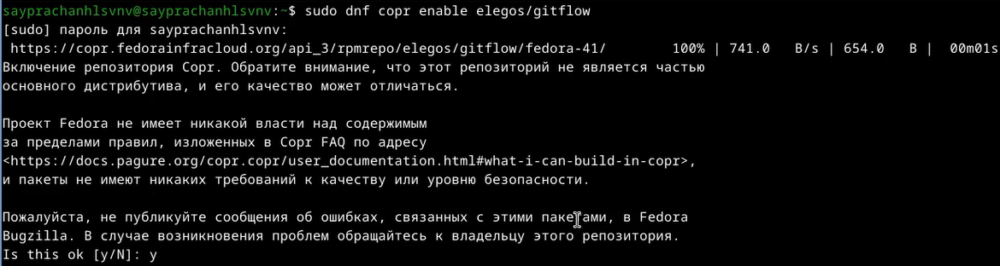{#fig:001 width=70%}

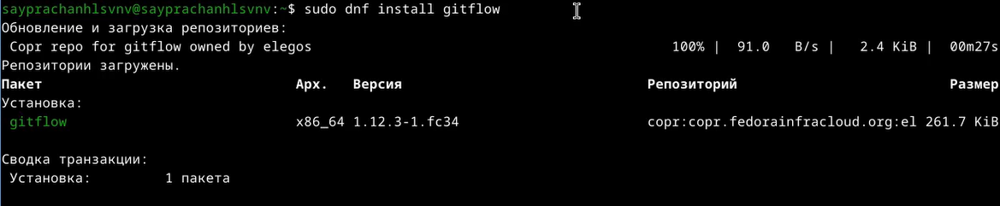{#fig:002 width=70%}

## Установка Node.js

Я устанавливаю Node.js для семантического управления версиями и общепринятых коммитов. (рис. [-@fig:003])

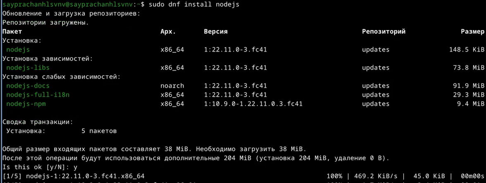{#fig:003 width=70%}

а также устанавливаю pnpm для зависимостей установки и для более быстрой установки (рис. [-@fig:004])

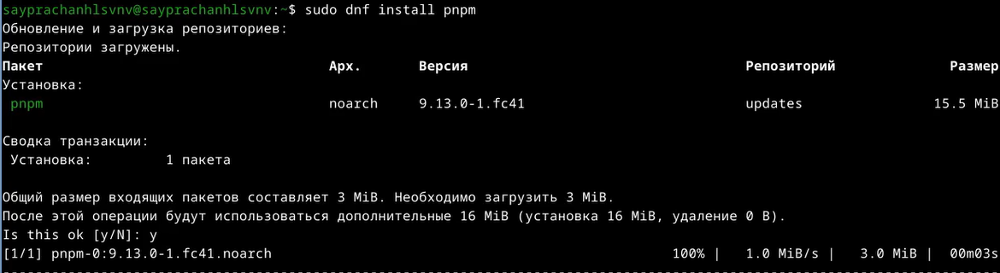{#fig:004 width=70%}

### Настройка Node.js

Затем, используя команду pnpm setup, я устанавливаю переменную PATH в системе для использования при работе с Nodejs (рис. [-@fig:005])

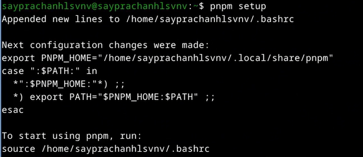{#fig:005 width=70%}

Я начинаю использовать pnpm, используя команду `source ~/.bashrc`, я установил в качестве источника системный файл ~/.bashrc,
поскольку это путь для выполнения программы (рис. [-@fig:006])

{#fig:006 width=70%}

Я устанавливаю программу, которая используется для форматирования коммитов с помощью команды npm add,
и она также предоставляет нам git-cz, который мы будем использовать для коммитов (рис. [-@fig:007])

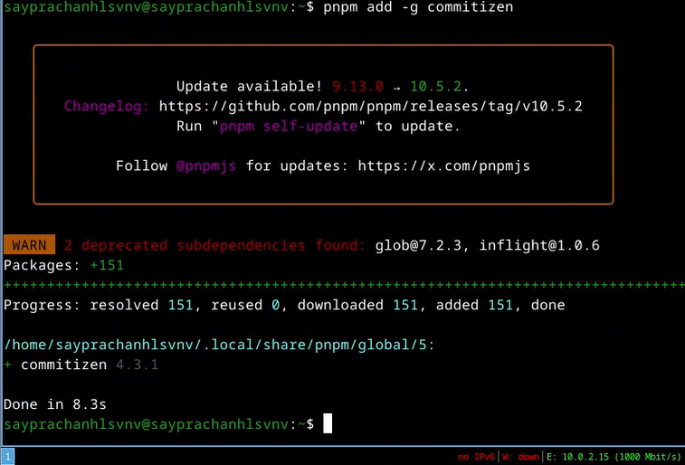{#fig:007 width=70%}

Я устанавливаю программу, которая использовалась для помощи в создании журнала (рис. [-@fig:008])

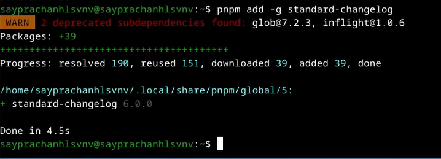{#fig:008 width=70%}

## Создание репозитория git

Я захожу в свою учетную запись на github, затем создаю новый репозиторий, присваивая ему имя git-extended (рис. [-@fig:009])

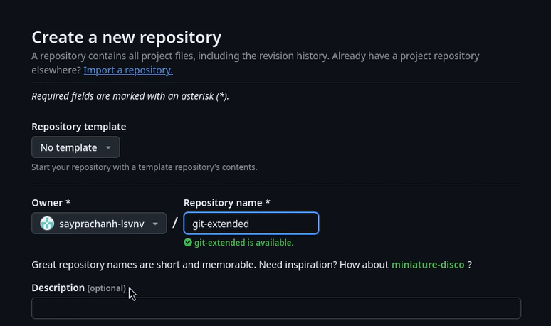{#fig:009 width=70%}

Я возвращаюсь к терминалу, затем создаю новый каталог, такой же, как и в созданном репозитории (рис. [-@fig:010])

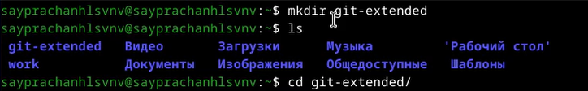{#fig:010 width=70%}

Я начинаю делать свой первый коммит и публикую его в репозитории GitHub, который я создал ранее (рис. [-@fig:011])

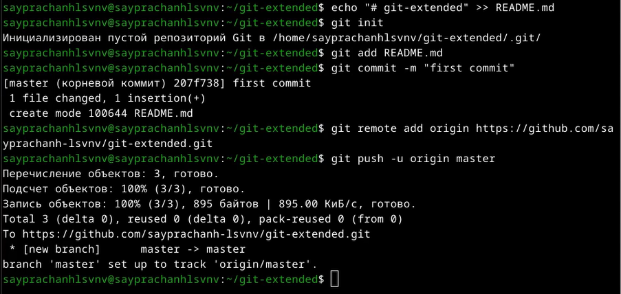{#fig:011 width=70%}

Я вижу, что созданный репозиторий обновлен новым файлом, который я создал во время первой коммит (рис. [-@fig:012])

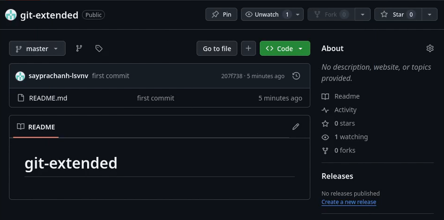{#fig:012 width=70%}

Используя команду pnpm init, я создаю файл package.json для настройки пакета Nodejs (рис. [-@fig:013])

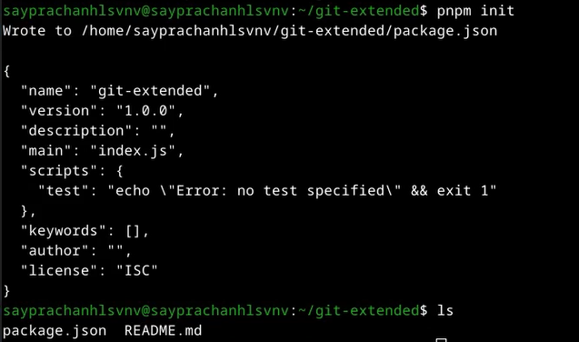{#fig:013 width=70%}

Я открываю файл package.json в текстовом редакторе,
затем ввожу несколько параметров пакета, таких как название пакета, лицензия на пакет,
а также настраиваю формат коммитов (рис. [-@fig:014])

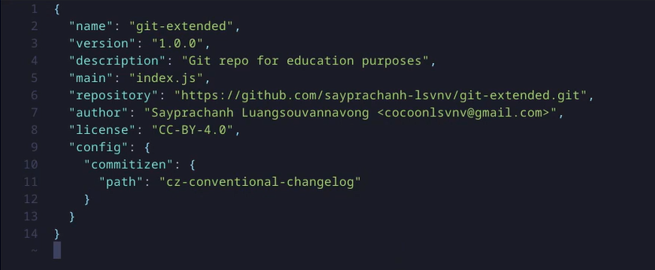{#fig:014 width=70%}

Я добавляю файл на GitHub (рис. [-@fig:015])

{#fig:015 width=70%}

Затем я выполняю коммит в файле с помощью команды git-cz (рис. [-@fig:016])

{#fig:016 width=70%}

Я отправляю файл на сервер GitHub (рис. [-@fig:017]) 

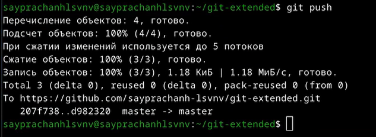{#fig:017 width=70%}

После этого я начинаю инициализировать git flow, а также настраиваю названия префиксов (рис. [-@fig:018])

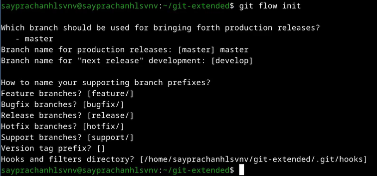{#fig:018 width=70%}

Я объединяю ветку выпуска с основной веткой, завершая создание версии выпуска.
Я проверяю, что я уже в ветке develop (рис. [-@fig:019])

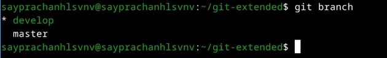{#fig:019 width=70%}

Затем я попробовал загрузить все репозитории в удаленный репозиторий (рис. [-@fig:020])

{#fig:020 width=70%}

Я установил внешнюю ветвь в качестве восходящей для более ранней ветви (рис. [-@fig:021])

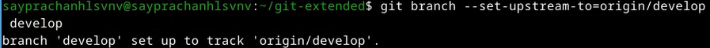{#fig:021 width=70%}

Я начинаю создавать новую версию, используя команду git flow release start, и устанавливаю версию на 1.0.0.
Я также создаю журнал изменений для документирования изменений в новой версии (рис. [-@fig:022] и рис. [-@fig:023])

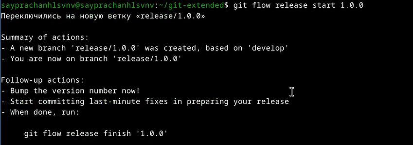{#fig:022 width=70%}

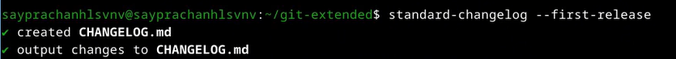{#fig:023 width=70%}

Затем я добавляю файл журнала изменений в индекс GitHub, готовлю его к отправке на сервер GitHub (рис. [-@fig:024])

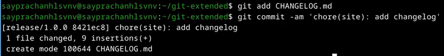{#fig:024 width=70%}

Используя команду git flow release finish и следуя за версией выпуска,
я объединяю ветку выпуска с основной веткой, завершая создание версии выпуска. (рис. [-@fig:025] и рис. [-@fig:026])

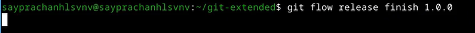{#fig:025 width=70%}

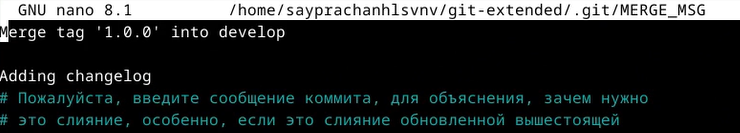{#fig:026 width=70%}

Я отправляю все на сервер GitHub с помощью git push (рис. [-@fig:027])

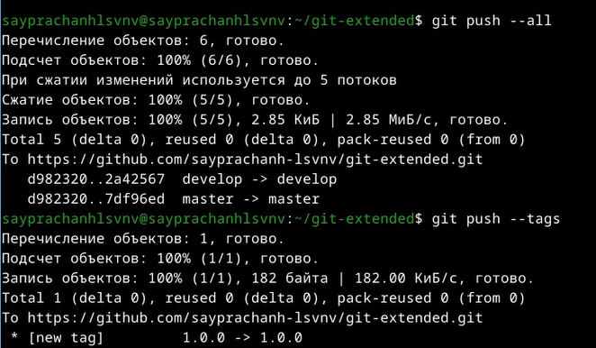{#fig:027 width=70%}

Я создаю тег выпуска в репозитории GitHub и устанавливаю версию выпуска на 1.0.0, поскольку это первый релиз (рис. [-@fig:028])

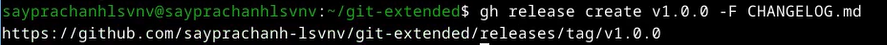{#fig:028 width=70%}

## Работа с репозиторием git

Я создаю новую ветку для разработки новой функциональности для предыдущей версии релиза,
используя команду git flow start. Затем я начинаю работать с новой функциональностью. (рис. [-@fig:029])

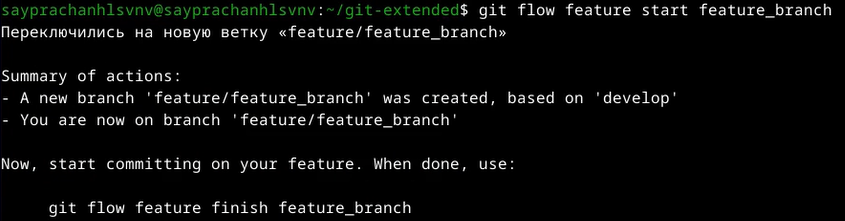{#fig:029 width=70%}

После завершения работы и разработки новой функциональности я объединяю созданную ветку feature_branch с веткой develop.
Затем я создаю релиз с версией 1.2.3 для обновления старого релиза до версии 1.0.0 (рис. [-@fig:030])

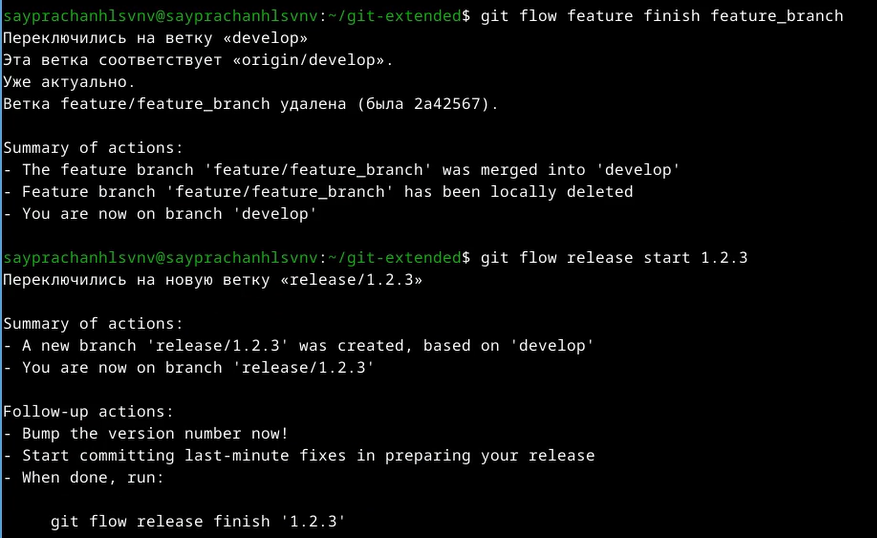{#fig:030 width=70%}

Я редактирую файл package.json, изменяя версию выпуска с версии 1.0.0 на версию 1.2.3 (рис. [-@fig:031])

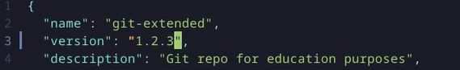{#fig:031 width=70%}

После этого я создаю журнал изменений для документирования изменений и
добавляю все в индекс GitHub, готовлю к отправке на сервер GitHub (рис. [-@fig:032])

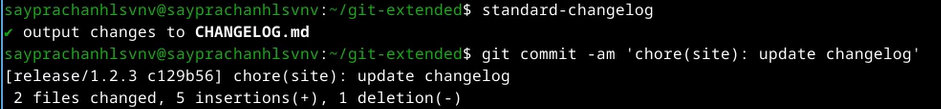{#fig:032 width=70%}

Я отправляю новый релиз на сервер GitHub (рис. [-@fig:033])

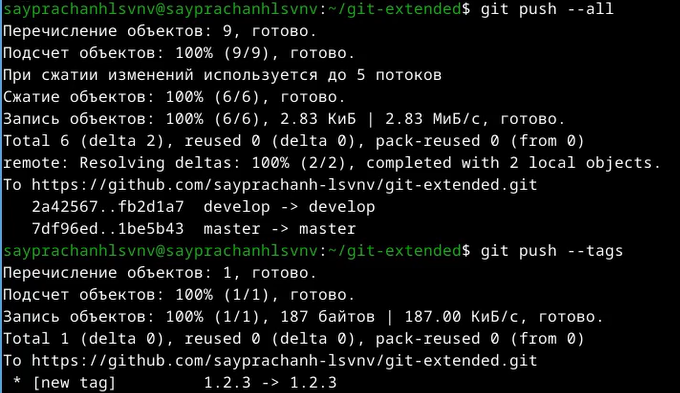{#fig:033 width=70%}

Я создаю тег выпуска в репозитории github с комментарием из журнала изменений (рис. [-@fig:034])

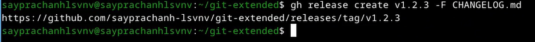{#fig:034 width=70%}

# Выводы

Во время выполнения лабораторной работы я понял и получил навыки правильной работы с репозиториями git.

# Список литературы{.unnumbered}

[Лабораторная работа №4](https://esystem.rudn.ru/mod/page/view.php?id=1224375)

::: {#refs}
:::
