---
## Front matter
lang: ru-RU
title: Лабораторная работа №5
subtitle: Опереционные системы
author:
  - Луангсуваннавонг Сайпхачан
institute:
  - Российский университет дружбы народов, Москва, Россия
date: 13 марта 2025

## i18n babel
babel-lang: russian
babel-otherlangs: english

## Formatting pdf
toc: false
toc-title: Содержание
slide_level: 2
aspectratio: 169
section-titles: true
theme: metropolis
header-includes:
 - \metroset{progressbar=frametitle,sectionpage=progressbar,numbering=fraction}
---

## Цель работы

  Цель работы - Обучение использованию менеджера паролей и управлению
конфигурационными файлами домашнего каталога пользователя с помощью
chezmoi.

## Задание

  1. Работа с менеджером паролей pass
  2. Управление файлами конфигурации с помощью chezmoi
  
## Работа с менеджером паролей pass

Сначала я устанавливаю менеджер паролей пакетов (рис. 1)

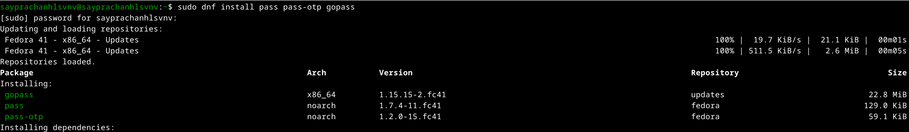

## Работа с менеджером паролей pass

Я перечисляю ключ, который я сгенерировал ранее из прошлой лабораторной
работы (рис. 2)

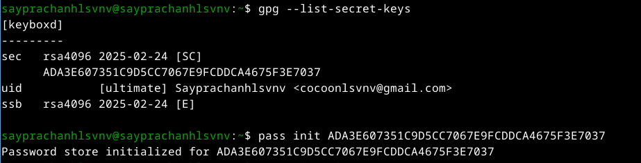

## Работа с менеджером паролей pass

Я инициализирую хранилище для пароля (рис. 3)

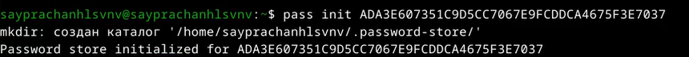

## Работа с менеджером паролей pass

Я создаю структуру git (рис. 4)

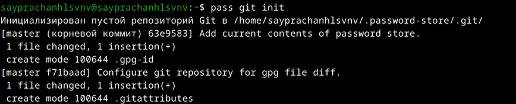

## Работа с менеджером паролей pass

После этого я создаю новый репозиторий на Github для работы с менеджером
паролей (рис. 5)

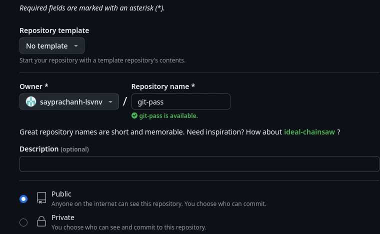

## Работа с менеджером паролей pass

я клонирую созданный репозиторий в свой локальный и снова
создаю структуру git (рис. 6)

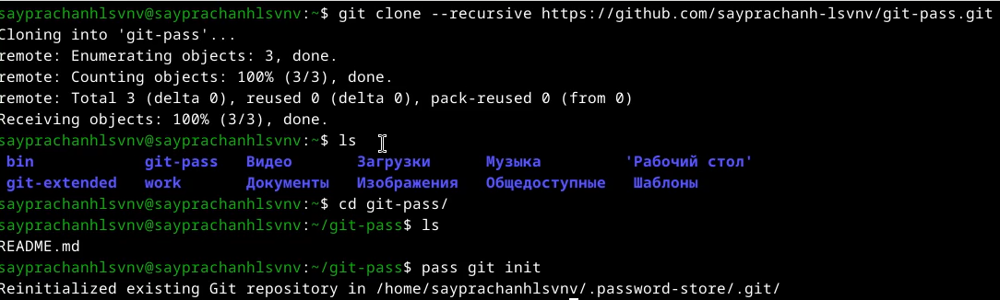

## Работа с менеджером паролей pass

Я задаю адрес репозитория для размещения на хостинге (рис. 7)

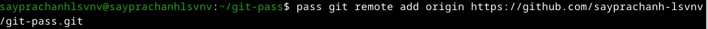

## Работа с менеджером паролей pass

Я синхронизирую удаленный репозиторий с локальным, используя git pull (рис. 8)

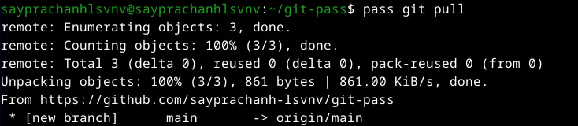

## Работа с менеджером паролей pass

Я отправляю файл на сервер Github (рис. 9)

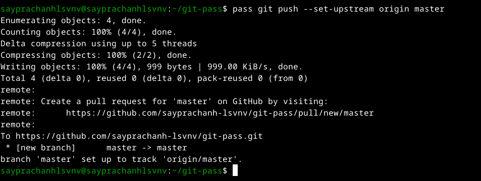

## Работа с менеджером паролей pass

Я захожу в каталог, в котором сохранен пароль (рис. 10)

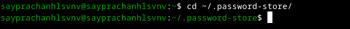

## Работа с менеджером паролей pass

Затем я добавляю все файлы и отправляю их на сервер Github
(поскольку никаких изменений внесено не было, ничего не обновлялось) (рис. 11)

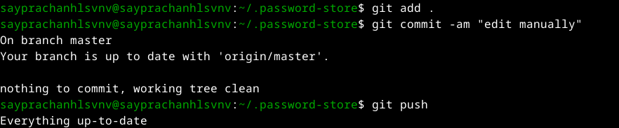

## Работа с менеджером паролей pass

Я проверяю статус синхронизации (рис. 12)

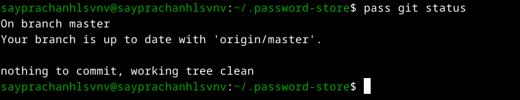

## Настройка интерфейса с броузером

Я включаю систему для установки плагина (рис. 13)

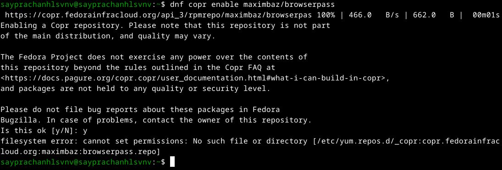

## Настройка интерфейса с броузером

Я устанавливаю плагин (рис. 14)

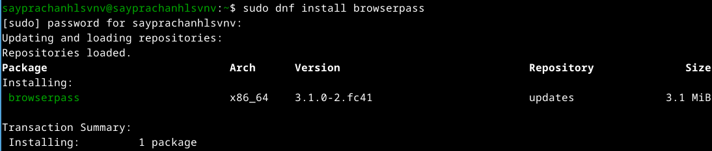

## Сохранение пароля

Используя pass insert, я добавляю новый пароль, затем указываю путь к файлу,
в котором будет храниться мой пароль (рис. 15)

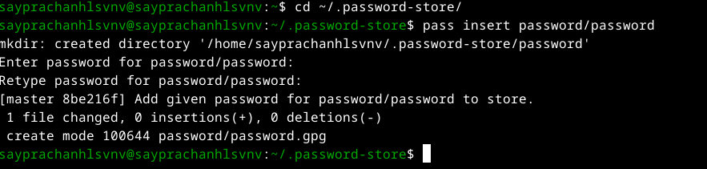

## Сохранение пароля

Я пытаюсь отобразить пароль, который я ввел (рис. 16)

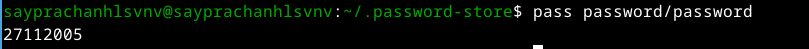

## Сохранение пароля

Затем я меняю существующий пароль и генерирую новый пароль с помощью pass generate (рис. 17)

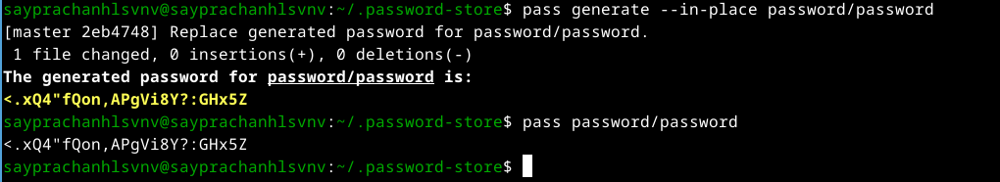

## Работа с конфигурационным файлом с помощью chezmoi

Я устанавливаю дополнительное программное обеспечение для работы с конфигурационными файлами (рис. 18)

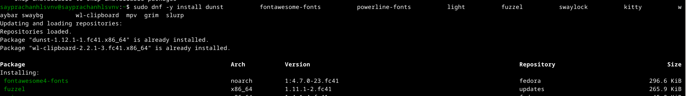

## Работа с конфигурационным файлом с помощью chezmoi

Я включаю систему для установки шрифтов (рис. 19)

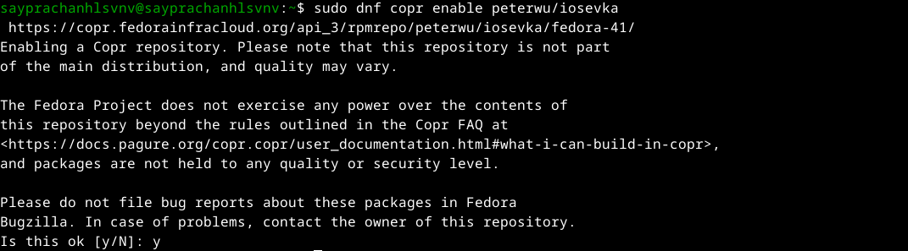

## Работа с конфигурационным файлом с помощью chezmoi

Я ищу нужные шрифты (рис. 20)

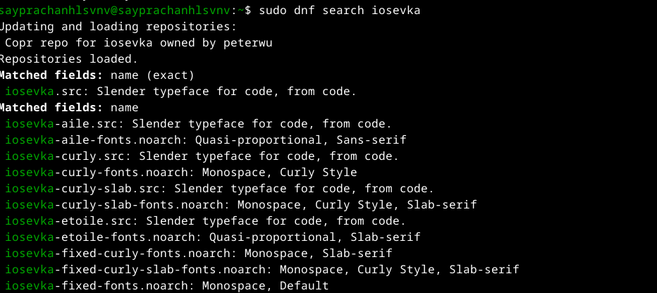

## Работа с конфигурационным файлом с помощью chezmoi

Я устанавливаю шрифты (рис. 21)

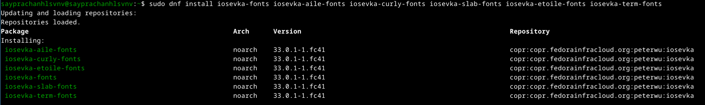

## Работа с конфигурационным файлом с помощью chezmoi

Я устанавливаю двоичный файл.
Следующий скрипт проверит архитектуру процессора и ОС и установит необходимый файл (рис. 22)

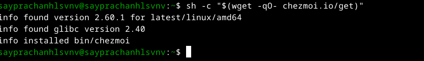

## Работа с конфигурационным файлом с помощью chezmoi

Я создаю новый репозиторий для конфигурационных файлов (рис. 23)

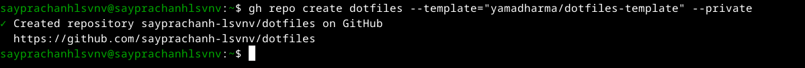

## Работа с конфигурационным файлом с помощью chezmoi

Я инициализирую chemzoi в созданном репозитории (рис. 24)

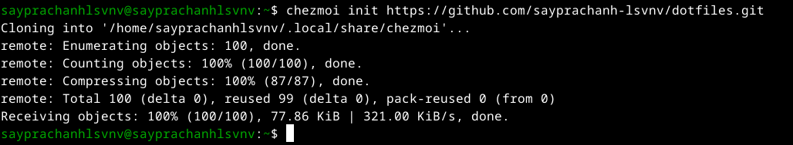

## Работа с конфигурационным файлом с помощью chezmoi

После инициализации я проверяю изменения, которые будут внесены в мой домашний каталог (рис. 25)

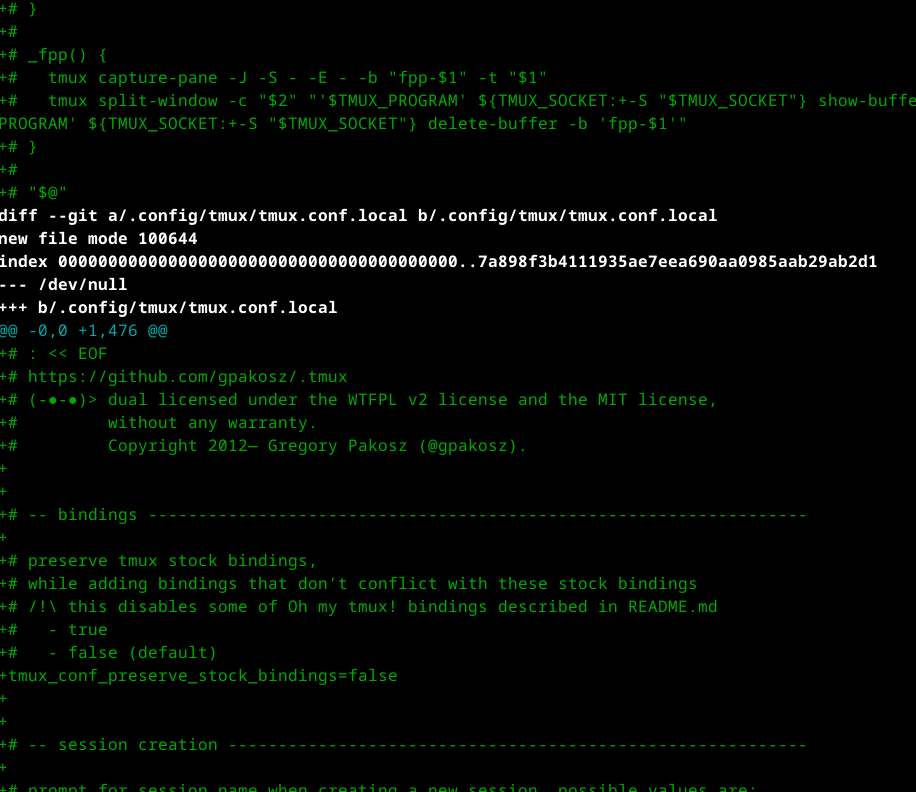

## Работа с конфигурационным файлом с помощью chezmoi

Я применяю изменения из chemzoi, используя команду chemzoi apply -v (рис. 26)

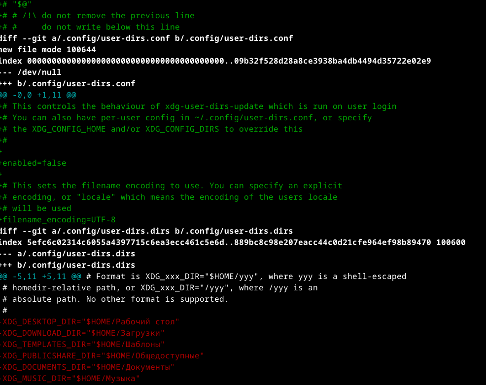

## Работа с конфигурационным файлом с помощью chezmoi

На второй машине я инициализирую chemzoi и проверяю изменения с помощью chemzoi diff (рис. 27)

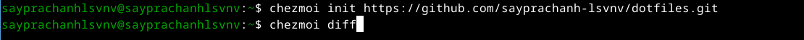

## Работа с конфигурационным файлом с помощью chezmoi

Затем применяю изменения (рис. 28)

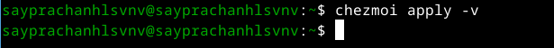

## Работа с конфигурационным файлом с помощью chezmoi

Затем я извлекаю последние изменения из репозитория, чтобы применить их к своей системе (рис. 29)

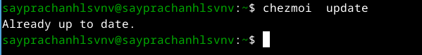

## Работа с конфигурационным файлом с помощью chezmoi

Я пытаюсь извлечь последние изменения из репозитория и посмотреть, что изменилось, еще не применяя их (рис. 30)

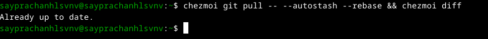

## Работа с конфигурационным файлом с помощью chezmoi

Я применяю изменения еще раз (рис. 31)

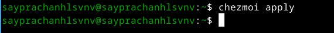

## Работа с конфигурационным файлом с помощью chezmoi

Я перемещаю и редактирую файл ~/.config/chezmoi/chezmoi.toml (рис. 32)

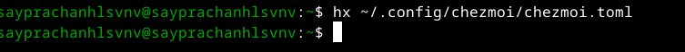

## Работа с конфигурационным файлом с помощью chezmoi

Я меняю настройки файла для автоматической фиксации и отправки изменений из моего каталога
в мой удаленный репозиторий (рис. 33)

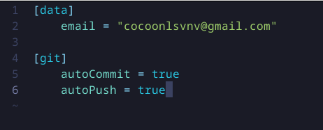

## Выводы

Во время выполнения этой лабораторной работы я научился пользоваться
менеджером паролей, а также управлять конфигурационными файлами в до-
машнем каталоге с помощью chemzoi

## Cписок литературы{.unnumbered}

[Лабораторная работа №5](https://esystem.rudn.ru/mod/page/view.php?id=1224377)

:::{#refs}
:::
