---
## Front matter
title: "Отчёт по лабораторной работе №5"
subtitle: "Операционные системы"
author: "Луангсуваннавонг Сайпхачан"

## Generic otions
lang: ru-RU
toc-title: "Содержание"

## Bibliography
bibliography: bib/cite.bib
csl: pandoc/csl/gost-r-7-0-5-2008-numeric.csl

## Pdf output format
toc: true # Table of contents
toc-depth: 2
lof: true # List of figures
lot: true # List of tables
fontsize: 12pt
linestretch: 1.5
papersize: a4
documentclass: scrreprt
## I18n polyglossia
polyglossia-lang:
  name: russian
  options:
	- spelling=modern
	- babelshorthands=true
polyglossia-otherlangs:
  name: english
## I18n babel
babel-lang: russian
babel-otherlangs: english
## Fonts
mainfont: IBM Plex Serif
romanfont: IBM Plex Serif
sansfont: IBM Plex Sans
monofont: IBM Plex Mono
mathfont: STIX Two Math
mainfontoptions: Ligatures=Common,Ligatures=TeX,Scale=0.94
romanfontoptions: Ligatures=Common,Ligatures=TeX,Scale=0.94
sansfontoptions: Ligatures=Common,Ligatures=TeX,Scale=MatchLowercase,Scale=0.94
monofontoptions: Scale=MatchLowercase,Scale=0.94,FakeStretch=0.9
mathfontoptions:
## Biblatex
biblatex: true
biblio-style: "gost-numeric"
biblatexoptions:
  - parentracker=true
  - backend=biber
  - hyperref=auto
  - language=auto
  - autolang=other*
  - citestyle=gost-numeric
## Pandoc-crossref LaTeX customization
figureTitle: "Рис."
tableTitle: "Таблица"
listingTitle: "Листинг"
lofTitle: "Список иллюстраций"
lotTitle: "Список таблиц"
lolTitle: "Листинги"
## Misc options
indent: true
header-includes:
  - \usepackage{indentfirst}
  - \usepackage{float} # keep figures where there are in the text
  - \floatplacement{figure}{H} # keep figures where there are in the text
---

# Цель работы

  Цель работы - Обучение использованию менеджера паролей и управлению конфигурационными файлами домашнего каталога пользователя с помощью chezmoi.

# Задание

  1. Работа с менеджером паролей pass
  2. Управление файлами конфигурации

# Выполнение лабораторной работы

## Работа с менеджером паролей pass

Сначала я открываю терминал и устанавливаю пакет менеджера паролей (рис. [-@fig:001]).

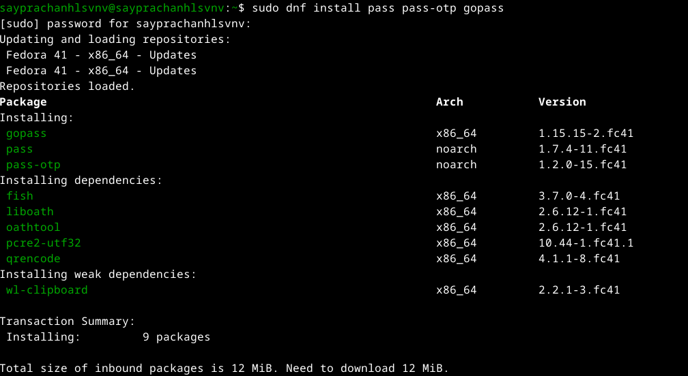{#fig:001 width=70%}

Я перечисляю ключ, который я сгенерировал ранее из прошлой лабораторной работы (рис. [-@fig:002]).

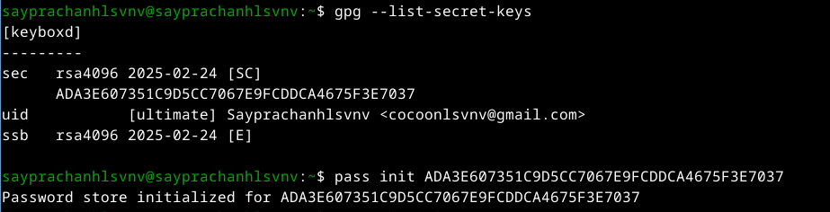{#fig:002 width=70%}

Я инициализирую хранилище для пароля, используя ключ gpg, который я перечислил (рис. [-@fig:003]).

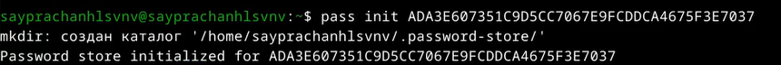{#fig:003 width=70%}

Я создаю структуру git (рис. [-@fig:004])

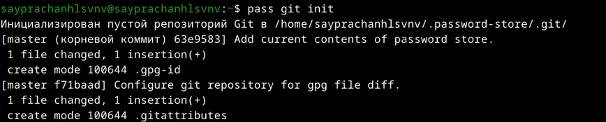{#fig:004 width=70%} 

После этого я создаю новый репозиторий на Github для работы с менеджером паролей, затем я клонирую созданный репозиторий в свой локальный
и снова создаю структуру git (так как я понял, что для ее создания нам нужен репозиторий) (рис. [-@fig:005] и рис. [-@fig:006]).

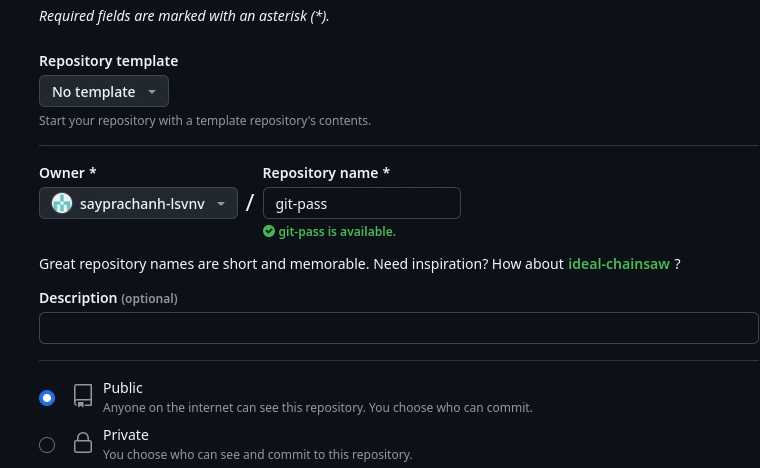{#fig:005 width=70%}

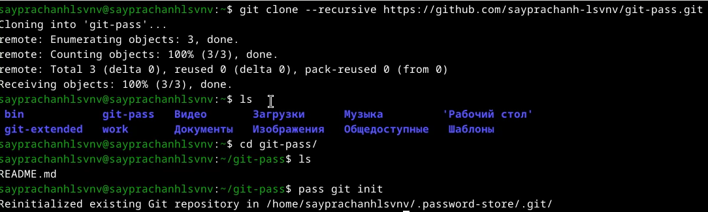{#fig:006 width=70%}

Я указываю адрес репозитория для размещения на хостинге  (рис. [-@fig:007]).

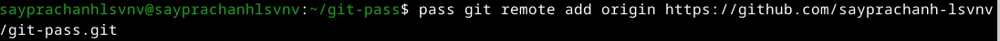{#fig:007 width=70%}

Я синхронизирую удаленный репозиторий с локальным, используя git pull, поскольку это недавно созданный репозиторий, ничего не обновляется (рис. [-@fig:008]).

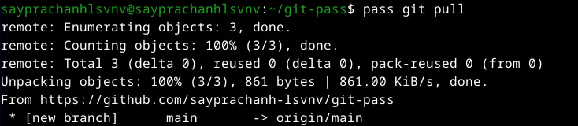{#fig:008 width=70%}

Я отправляю файл на сервер Github (рис. [-@fig:009]).

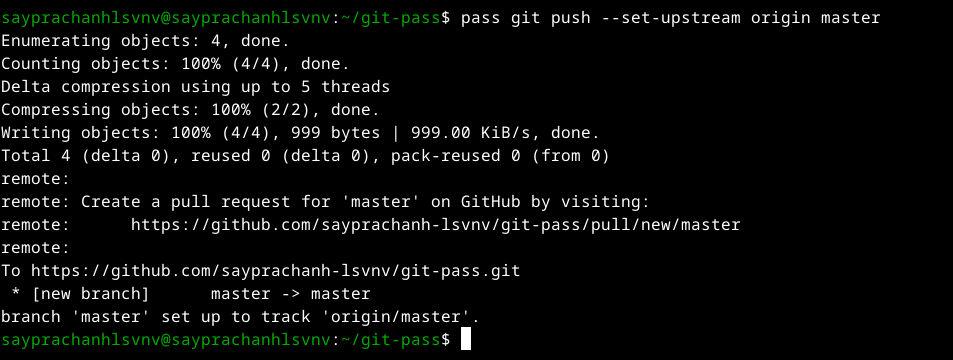{#fig:009 width=70%}

Я перехожу в каталог, сохраняя пароль (рис. [-@fig:010])

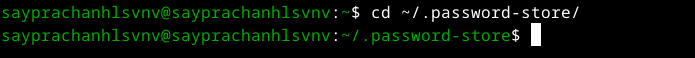{#fig:010 width=70%}

Я добавляю все файлы, затем отправляю их на сервер, ничего не обновляется, так как я ничего не менял, но если я сменю пароль, это будет обновление на сервере Github (рис. [-@fig:011]).

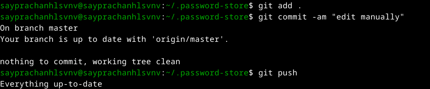{#fig:011 width=70%}

Я проверяю статус синхронизации(рис. [-@fig:012])

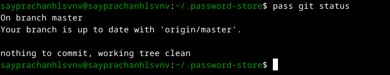{#fig:012 width=70%}

## Настройка интерфейса с броузером

Я включаю систему для установки плагина для настройки интерфейса браузера (рис. [-@fig:013]).

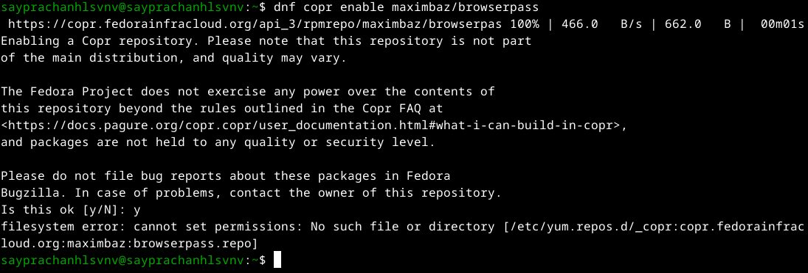{#fig:013 width=70%}

Я устанавливаю плагин (рис. [-@fig:014]).

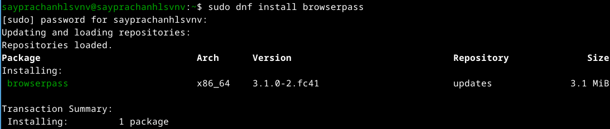{#fig:014 width=70%}

Я добавляю новый пароль с помощью команды ` pass insert`, присваиваю каталогу для хранения пароля имя "password", затем файлу - "password". (рис. [-@fig:015]).

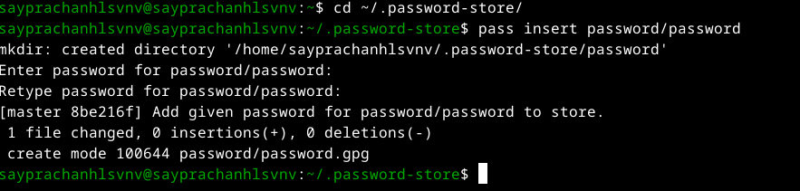{#fig:015 width=70%}

Я показываю пароль, который я ввел, из файла password/password (рис. [-@fig:016]).

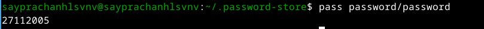{#fig:016 width=70%}

Я пытаюсь заменить существующий пароль, используя команду pass generate, и задаю путь к файлу, в котором я храню пароль
Затем я снова вывожу пароль на экран, и он был изменен (рис. [-@fig:017]).

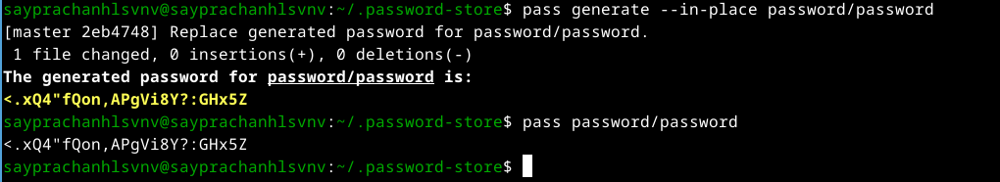{#fig:017 width=70%}

## Установка необходимого программного обеспечения

Для работы с конфигурацией файла я сначала устанавливаю дополнительное программное обеспечение (рис. [-@fig:018]).

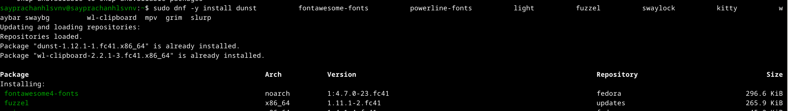{#fig:018 width=70%}

Я включаю систему для установки шрифтов (рис. [-@fig:019]).

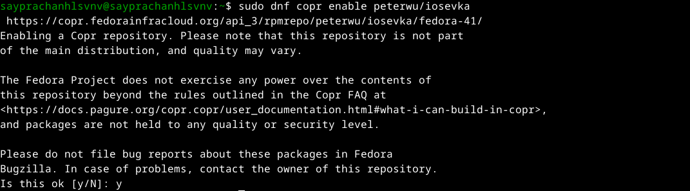{#fig:019 width=70%}

Я ищу нужные шрифты (рис. [-@fig:020]).

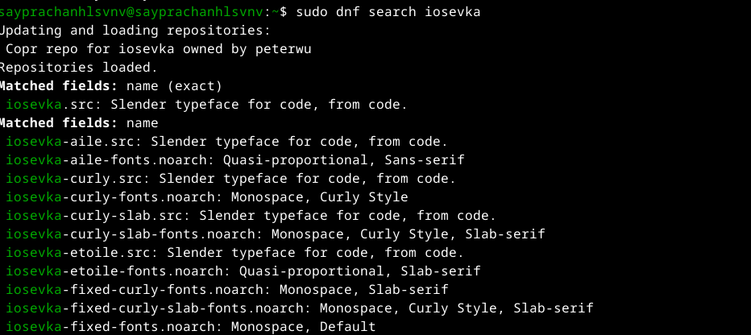{#fig:020 width=70%}

Я устанавливаю шрифты (рис. [-@fig:021]).

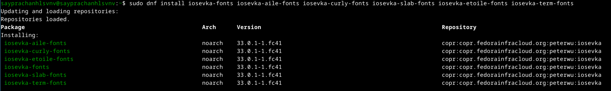{#fig:021 width=70%}

Устанавливаю двоичный файл с помощью wget. Скрипт определяет архитектуру процессора и операционную систему и загружает необходимый файл для настройки (рис. [-@fig:022]).

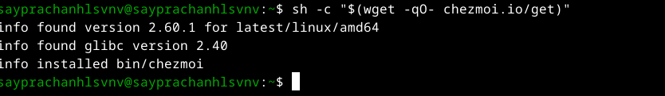{#fig:022 width=70%}

Затем я создаю новый репозиторий, который будет использоваться для хранения конфигурационных файлов на основе заданного шаблона (рис. [-@fig:023]).

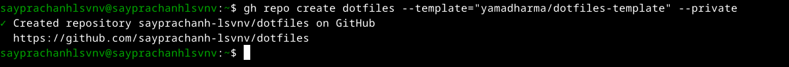{#fig:023 width=70%}

## Использование chezmoi

Я инициализирую двоичный файл, используя команду chezmoi, с созданным репозиторием (рис. [-@fig:024]).

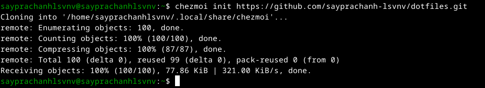{#fig:024 width=70%}

Используя команду chemzoi, я проверяю изменения, которые chemzoi внесет в мой домашний каталог.
И когда я удовлетворен изменениями, я применяю их, используя команду `chemzoi apply -v` (рис. [-@fig:025]). (рис. [-@fig:026]).

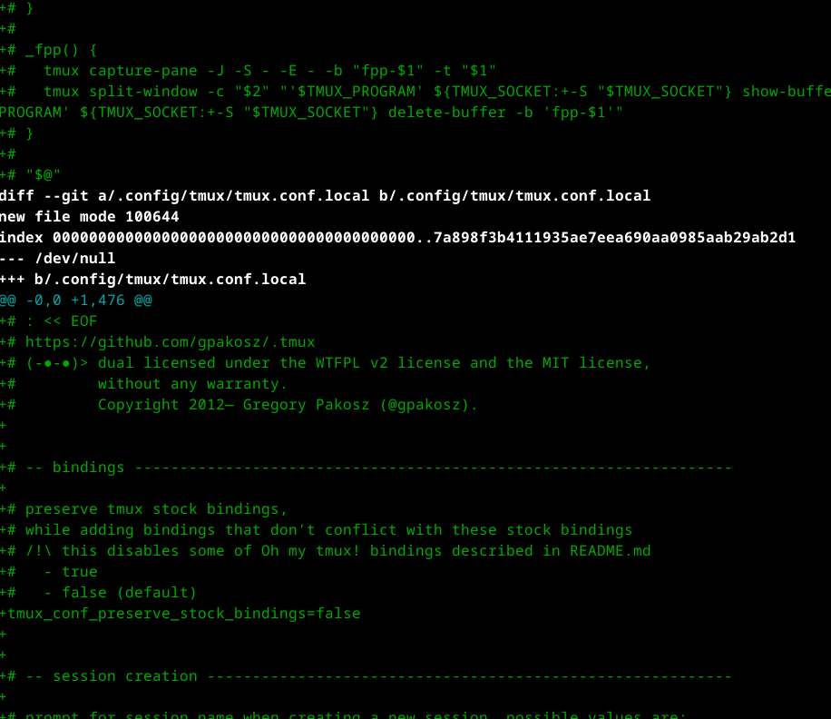{#fig:025 width=70%}

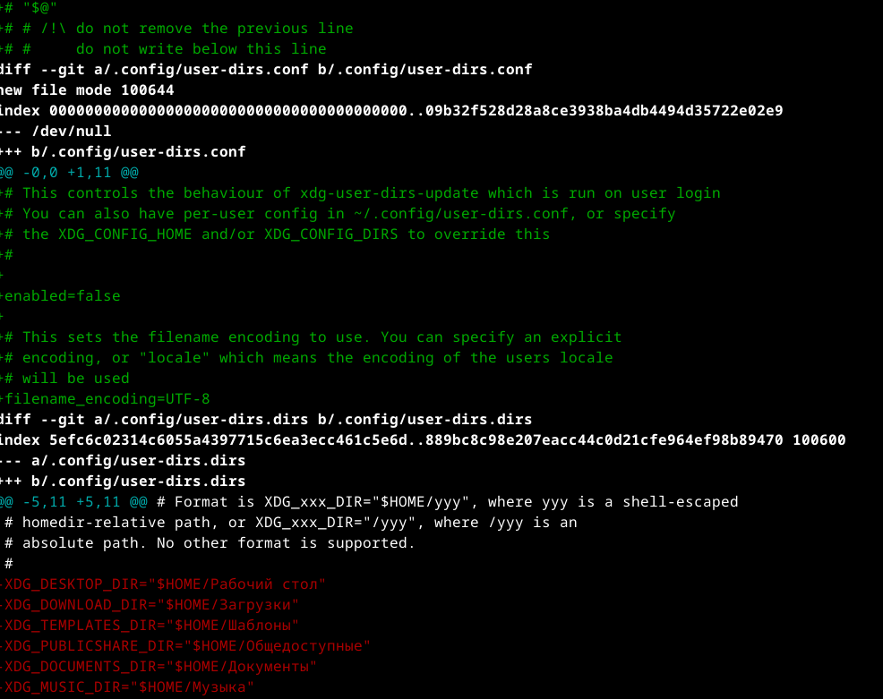{#fig:026 width=70%}

Я инициализирую chemzoi с помощью созданного репозитория, а также проверяю измененияa (рис. [-@fig:027]).

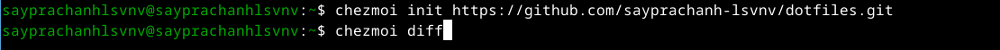{#fig:027 width=70%}

Затем применяю изменения (рис. [-@fig:028]).

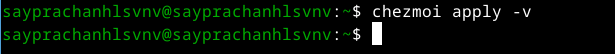{#fig:028 width=70%}

После этого я обновляю chemzoi, и все уже обновлено (рис. [-@fig:029]).

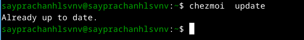{#fig:029 width=70%}

Используя эту команду, я загружаю последние изменения из удаленного репозитория в локальный и просматриваю изменения, еще не применяя их.
Поскольку репозиторий создан недавно, он отображает "уже обновлен" (рис. [-@fig:030]).

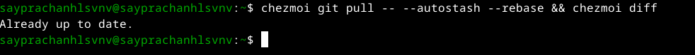{#fig:030 width=70%}

Я применяю изменения еще раз (рис. [-@fig:031]).

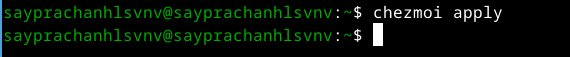{#fig:031 width=70%}

Я перемещаю и редактирую файл `~/.config/chezmoi/chezmoi.toml`, чтобы автоматически зафиксировать и отправить изменения из моего каталога в мой удаленный репозиторий (рис. [-@fig:032] и рис. [-@fig:033])

{#fig:032 width=70%}

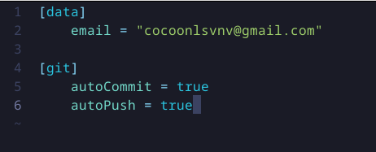{#fig:033 width=70%}

# Выводы

Во время выполнения этой лабораторной работы я научился пользоваться менеджером паролей, а также управлять конфигурационными файлами в домашнем каталоге с помощью chemzoi

# Список литературы{.unnumbered}

[Лабораторная работа №5](https://esystem.rudn.ru/mod/page/view.php?id=1224377)

::: {#refs}
:::
