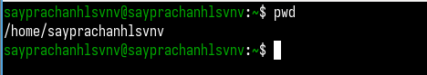

---
## Front matter
lang: ru-RU
title: Лабораторная работа №6
subtitle: Опереционные системы
author:
  - Луангсуваннавонг Сайпхачан
institute:
  - Российский университет дружбы народов, Москва, Россия
  
date: 20 марта 2025

## i18n babel
babel-lang: russian
babel-otherlangs: english

## Formatting pdf
toc: false
toc-title: Содержание
slide_level: 2
aspectratio: 169
section-titles: true
theme: metropolis
header-includes:
 - \metroset{progressbar=frametitle,sectionpage=progressbar,numbering=fraction}
---

## Цель работы

Цель работы - Приобретение практических навыков взаимодействия пользователя с системой посредством командной строки

## Задание

1. Перемещайтесь между каталогами
2. Выводите список файлов и каталогов
3. Проверяйте информацию о файлах и каталогах

## Перемещение и перечисление каталогов

Я открываю терминал и проверяю свой текущий каталог с помощью pwd (рис. 1)

## Перемещение и перечисление каталогов

Используя команду cd, я меняю каталог и перемещаюсь в каталог /tmp (рис. 2)

## Перемещение и перечисление каталогов

Я перечисляю все содержимое каталога с помощью команды ls  (рис. 3)

## Перемещение и перечисление каталогов

Добавляя -l к команде ls, я отображаю информацию о содержимом каталога (рис. 4)

## Перемещение и перечисление каталогов

Добавляя -a к команде ls, я отображаю все содержимое каталога, включая скрытые файлы (рис. 5)

## Перемещение и перечисление каталогов

Используя -la для команды ls, я вывожу список всех скрытых файлов,
а также отображаю информацию о них, а также другое содержимое каталога (рис. 6)

## Перемещение и перечисление каталогов

Я проверяю и нахожу каталог, используя ключевые слова, а также команду ls с помощью команды grep (рис. 7)

## Перемещение и перечисление каталогов

Я перехожу в домашний каталог с помощью команды cd ~ (рис. 8)

## Перемещение и перечисление каталогов

Используя comannd ls -l, я перечисляю информацию о содержимом домашнего каталога, такую как владелец, разрешения, время (рис. 9)

## Работа с командой

Используя команду mkdir, я создаю новый каталог в домашнем каталоге (рис. 10)

## Работа с командой

Затем я создаю другой каталог в созданном каталоге, используя ту же команду (mkdir). (рис. 11)

## Работа с командой

Я создаю еще 3 каталога в домашнем каталоге (рис. 12)

## Работа с командой

Используя команду rmdir, я удаляю созданные 3 каталога (letters, memos, misk) (рис. 13)

## Работа с командой

Я пытаюсь удалить каталог с помощью команды rm, но это не работает, так как команда rm используется для удаления файлов (рис. 14)

## Работа с командой

Однако, добавив -r к команде rm, я удаляю подкаталог внутри каталога (рис. 15)

## Работа с командой

Используя command man с командой ls, я ищу инструкции для перечисления не только каталогов, но и их подкаталогов (рис. 16)

## Работа с командой

Используя опцию -R команды ls, я вывожу список каталогов (work), а также содержимое подкаталогов внутри него (рис. 17 и рис. 18)

## Работа с командой

## Работа с командой

Далее, во введении, мне нужно найти опцию для отображения времени изменения файлов командой ls, которой, как оказалось, является опция -t (рис. 19)

## Работа с командой

Я использую опцию -t с -l для команды ls, и она отображает как содержимое, так и время изменения (рис. 20)

## Работа с командой

Используя команду man, я нахожу информацию и инструкции к командам, во-первых, это команда (cd) (рис. 21)

## Работа с командой

Далее я нахожу информацию о команде (pwd) (рис. 22)

## Работа с командой

Я нахожу информацию о команде (mkdir) с помощью команды man (рис. 23)

## Работа с командой

Я нахожу информацию о команде (rmdir), и команда заключается только в удалении пустого каталога (рис. 24)

## Работа с командой

Наконец, я нахожу информацию о команде rm, которая заключается в перемещении файлов и каталогов (рис. 25)

## Отображение истории выполнения команд

Я отображаю все ранее введенные команды в операционной системе, используя команду history (рис. 26 и рис. 27)

## Отображение истории выполнения команд

## Отображение истории выполнения команд

Добавляя символ (!) и числа в команду history, я повторно использую команду. пример: команда rmdir (рис. 28 и рис. 29)

## Отображение истории выполнения команд

## Отображение истории выполнения команд

Добавляя символ (^) и название каталога, я изменяю название каталога и перемещаю другой каталог, который я ввел (рис. 30)

## Выводы

Во время выполнения этой лабораторной работы я приобрел практические
навыки взаимодействия пользователя с системой через командную строку.

## Список литературы{.unnumbered}

[Лабораторная работа №6](https://esystem.rudn.ru/mod/resource/view.php?id=1224379)
