---
## Front matter
title: "Отчёт по лабораторной работе №6"
subtitle: "Опереционные системы"
author: "Луангсуваннавонг Сайпхачан"

## Generic otions
lang: ru-RU
toc-title: "Содержание"

## Bibliography
bibliography: bib/cite.bib
csl: pandoc/csl/gost-r-7-0-5-2008-numeric.csl

## Pdf output format
toc: true # Table of contents
toc-depth: 2
lof: true # List of figures
lot: true # List of tables
fontsize: 12pt
linestretch: 1.5
papersize: a4
documentclass: scrreprt
## I18n polyglossia
polyglossia-lang:
  name: russian
  options:
	- spelling=modern
	- babelshorthands=true
polyglossia-otherlangs:
  name: english
## I18n babel
babel-lang: russian
babel-otherlangs: english
## Fonts
mainfont: IBM Plex Serif
romanfont: IBM Plex Serif
sansfont: IBM Plex Sans
monofont: IBM Plex Mono
mathfont: STIX Two Math
mainfontoptions: Ligatures=Common,Ligatures=TeX,Scale=0.94
romanfontoptions: Ligatures=Common,Ligatures=TeX,Scale=0.94
sansfontoptions: Ligatures=Common,Ligatures=TeX,Scale=MatchLowercase,Scale=0.94
monofontoptions: Scale=MatchLowercase,Scale=0.94,FakeStretch=0.9
mathfontoptions:
## Biblatex
biblatex: true
biblio-style: "gost-numeric"
biblatexoptions:
  - parentracker=true
  - backend=biber
  - hyperref=auto
  - language=auto
  - autolang=other*
  - citestyle=gost-numeric
## Pandoc-crossref LaTeX customization
figureTitle: "Рис."
tableTitle: "Таблица"
listingTitle: "Листинг"
lofTitle: "Список иллюстраций"
lotTitle: "Список таблиц"
lolTitle: "Листинги"
## Misc options
indent: true
header-includes:
  - \usepackage{indentfirst}
  - \usepackage{float} # keep figures where there are in the text
  - \floatplacement{figure}{H} # keep figures where there are in the text
---

# Цель работы

  Цель работы - Приобретение практических навыков взаимодействия пользователя с системой посредством командной строки
  
# Задание

  1. Перемещайтесь между каталогами
  2. Выводите список файлов и каталогов
  3. Проверяйте информацию о файлах и каталогах
  
# Выполнение лабораторной работы

## Перемещение и перечисление каталогов

Сначала я открываю терминал в своей оc, затем определяю полное имя своего домашнего каталога с помощью команды pwd (рис. [-@fig:001])

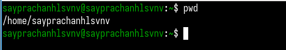{#fig:001 width=70%}

Используя утилиту cd, я меняю каталог из домашнего каталога и перемещаюсь в каталог /tmp (рис. [-@fig:002])

{#fig:002 width=70%}

Я перечисляю содержимое каталога /tmp, используя команду ls (рис. [-@fig:003])

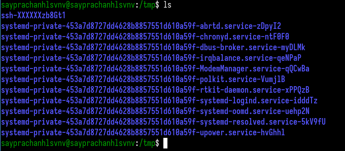{#fig:003 width=70%}

Затем я использую команду ls с ключевым словом -l, чтобы перечислить содержимое, а также владельца файлов,
а также время, когда они были созданы или изменены, а также предупреждения (рис. [-@fig:004])

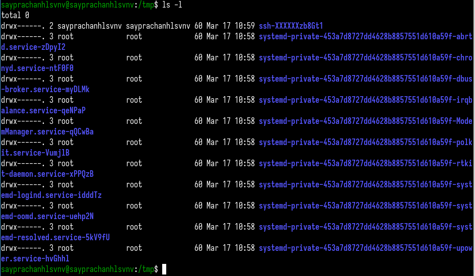{#fig:004 width=70%}

Используя ls и ключевое слово -a, я перечисляю все файлы, а также скрытые файлы внутри директории (рис. [-@fig:005])

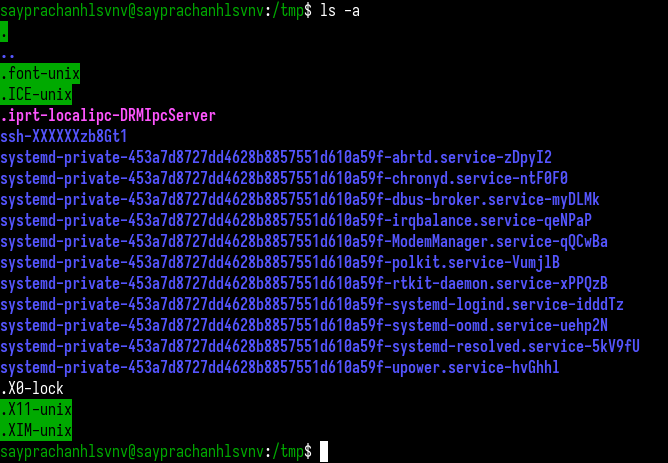{#fig:005 width=70%}

Теперь, объединив оба параметра -l и -a с помощью утилиты ls,
я вывожу список всех файлов в каталоге /tmp, а также отображаю информацию о файлах, такую как разрешение, владелец, время создания и модификации (рис. [-@fig:006])

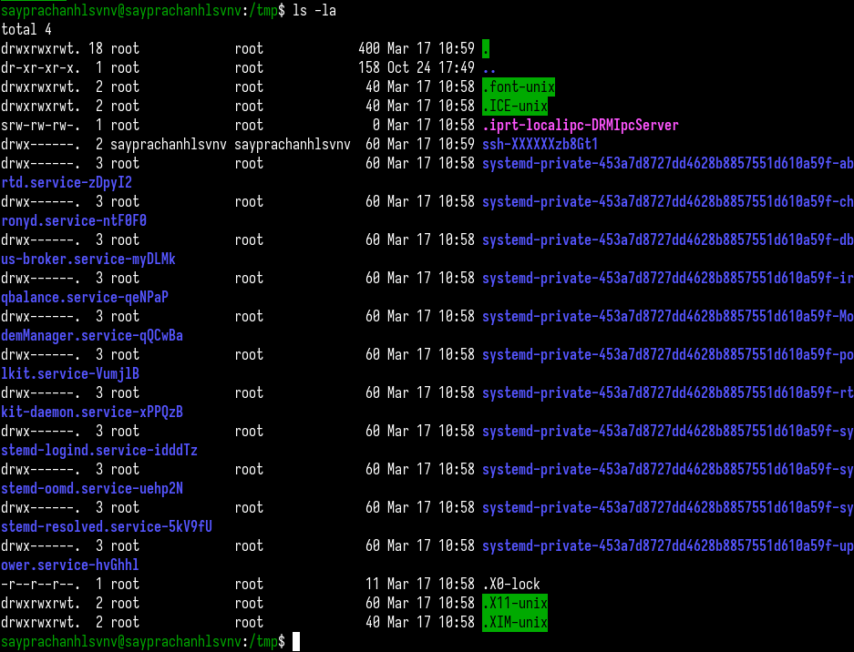{#fig:006 width=70%}

Используя утилиту ls, а также команду grep, я вывожу список каталогов /var/spool, затем с помощью утилиты grep нахожу подкаталог cron, вводя ключевое слово,
В результате получается подкаталог с именем cron. (рис. [-@fig:007])

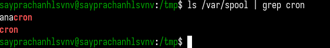{#fig:007 width=70%}

Затем я перехожу в домашний каталог с помощью утилиты cd, затем перечисляю содержимое каталога (рис. [-@fig:008])

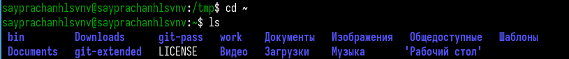{#fig:008 width=70%}

Используя утилиту ls с ключевым словом -l, я перечисляю информацию о файлах и каталогах,
такую как права доступа и владелец. Владелец находится в третьем столбце списка. (рис. [-@fig:009])

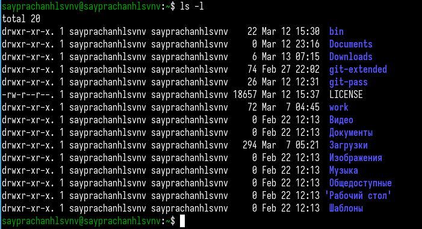{#fig:009 width=70%}

## Работа с командой

Я создаю новый каталог с именем newdir в домашнем каталоге, используя команду mkdir (рис. [-@fig:010])

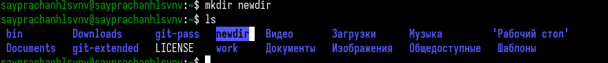{#fig:010 width=70%}

После этого я создаю еще один каталог внутри созданного каталога newdir и называю каталог morefun,
затем с помощью команды ls проверяю корректность выполненной команды. (рис. [-@fig:011])

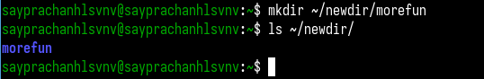{#fig:011 width=70%}

В домашнем каталоге я создаю еще три каталога: letters, memos, misk. Используя команду mkdir, и ввожу названия каталогов, которые я хочу создать,
а также пробел между именами, чтобы создать более одного каталога (рис. [-@fig:012])

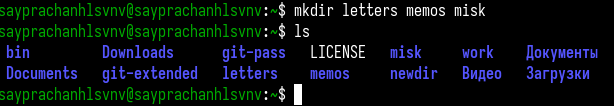{#fig:012 width=70%}

Затем я удаляю созданные каталоги одной командой (рис. [-@fig:013])

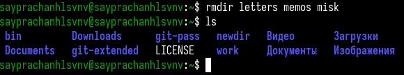{#fig:013 width=70%}

Я пытаюсь удалить каталог ~/newdir с помощью команды rm, но это не работает, так как команда rm используется для удаления файлов (рис. [-@fig:014])

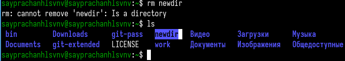{#fig:014 width=70%}

Однако вы можете использовать команду rm для удаления каталога, но добавив ключевое слово -r в команду rm. Используя команду rm -r, я удаляю каталог morefun из каталога ~/newdir (рис. [-@fig:015])

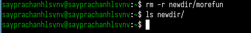{#fig:015 width=70%}

Затем я использую команду man, чтобы найти информацию и инструкции о команде ls, мне нужно найти ключевое слово для просмотра содержимого не только указанного каталога, но и
включенных в него подкаталогов, которым является ключевое слово -R (рекурсивный) (рис. [-@fig:016])

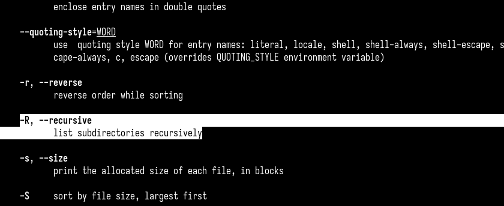{#fig:016 width=70%}

Я пробую команду ls с рекурсивным (-R) в каталоге ~/work (рис. [-@fig:017]) (рис. [-@fig:018])

{#fig:017 width=70%}

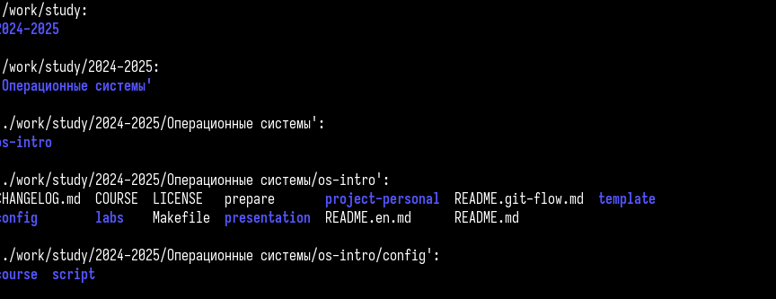{#fig:018 width=70%}

Далее я нахожу ключевое слово в команде ls, которое позволяет мне отсортировать отображаемый список содержимого каталога
с расширенным описанием файлов по времени последнего изменения, которым в данном случае является option (-t). (рис. [-@fig:019])

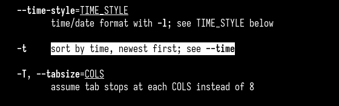{#fig:019 width=70%}

Я использую параметр (-t) с параметром (-l) в команде ls, чтобы указать время внесения изменений, а также другую информацию о каталоге (рис. [-@fig:020])

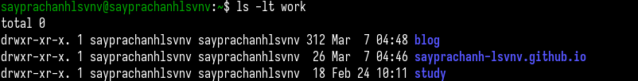{#fig:020 width=70%}

Используя команду man с командой cd, я нахожу основную инструкцию по этой команде, вкратце, команда используется для перехода к каталогам. (рис. [-@fig:021])

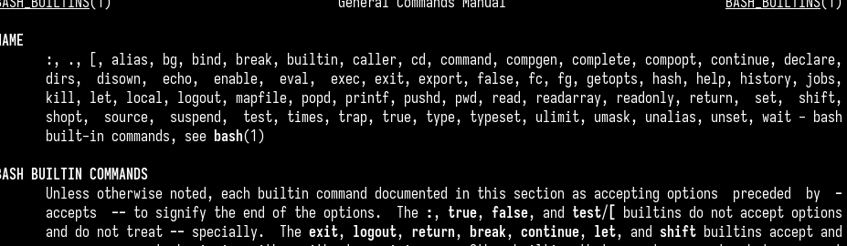{#fig:021 width=70%}

Я нахожу информацию о команде pwd с помощью команды man, команда pwd используется для печати имени текущего/рабочего каталога (рис. [-@fig:022])

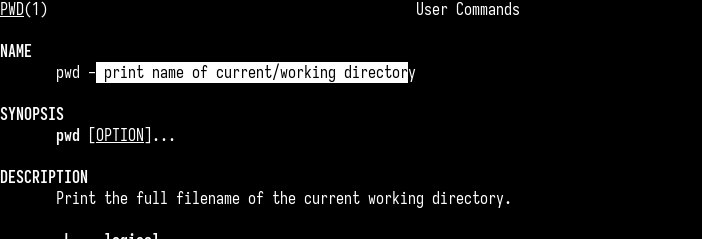{#fig:022 width=70%}

Далее следует команда mkdir, которая используется для создания новых каталогов (рис. [-@fig:023])

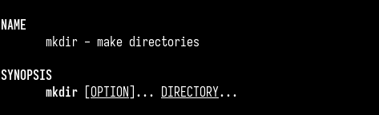{#fig:023 width=70%}

Команда rmdir используется только для удаления пустых каталогов (рис. [-@fig:024])

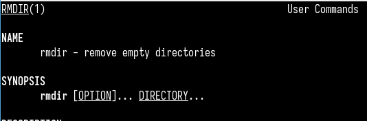{#fig:024 width=70%}

Наконец, команда rm, она используется для удаления файлов или каталогов (рис. [-@fig:025])

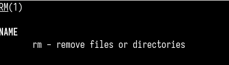{#fig:025 width=70%}

## Отображение истории выполнения команд

Используя команду history, я перечисляю все команды, которые я использовал в системе. (рис. [-@fig:026] и рис. [-@fig:027])

{#fig:026 width=70%}

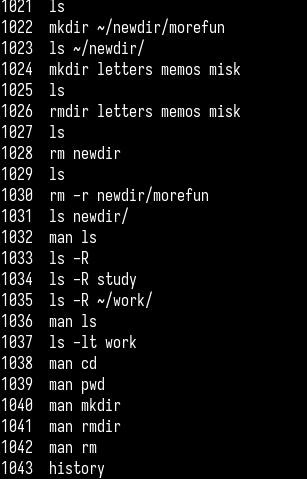{#fig:027 width=70%}

Используя символ ! и номер команды, я повторно использую команду man rmdir из списка предыдущей команды history, 
В результате отображаются инструкции команды rmdir. (рис. [-@fig:028] и рис. [-@fig:029])

{#fig:028 width=70%}

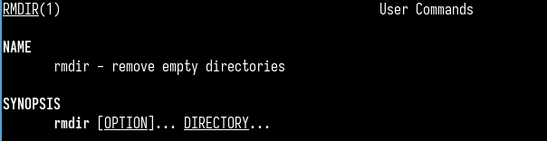{#fig:029 width=70%}

Добавив символ (^) в начале названия каталога, за которым следует другой каталог, я изменяю команду в команде history. и меняю на новый каталог (рис. [-@fig:030])

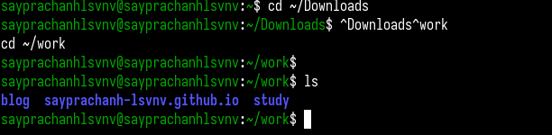{#fig:030 width=70%}

# Выводы

  Во время выполнения этой лабораторной работы я приобрел практические навыки взаимодействия пользователя с системой через командную строку.

# Список литературы{.unnumbered}

[Лабораторная работа №6](https://esystem.rudn.ru/mod/resource/view.php?id=1224379)

::: {#refs}
:::
