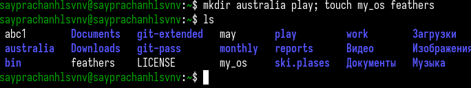

---
## Front matter
lang: ru-RU
title: Лабораторная работа №7
subtitle: Операционные системы
author:
  - Луангсуваннавонг Сайпхачан
institute:
  - Российский университет дружбы народов, Москва, Россия
  
date: 25 марта 2025

## i18n babel
babel-lang: russian
babel-otherlangs: english

## Formatting pdf
toc: false
toc-title: Содержание
slide_level: 2
aspectratio: 169
section-titles: true
theme: metropolis
header-includes:
 - \metroset{progressbar=frametitle,sectionpage=progressbar,numbering=fraction}
---
## Докладчик

:::::::::::::: {.columns align=center}
::: {.column width="70%"}

  * Луангсуваннавонг Сайпхачан
  * Студент из группы НКАбд-01-24
  * Российский университет дружбы народов
  * <https://sayprachanh-lsvnv.github.io>

:::
::: {.column width="30%"}
:::
::::::::::::::

## Цель работы

  Ознакомление с файловой системой Linux, её структурой, именами и содержанием
каталогов. Приобретение практических навыков по применению команд для работы
с файлами и каталогами, по управлению процессами (и работами),
по проверке использования диска и обслуживанию файловой системы.

## Задание

 1. Выполнить все примеры из лабораторной работы
 2. Выполнить команду для копирования,перемещения,создания фалов и каталогов
 3. Определить параметры команды chmod
 4. Изменить права доступа к файлам и каталогам
 5. Прочитать инструкции о команде mount, fsck, mkfs, kill

# Выполнение лабораторной работы

## Выполнение всех примеров

Сначала я создаю текстовый файл abc1, затем копирую его и создаю 2 новых файла с именами april и may.

## Выполнение всех примеров

Я создаю каталог monthly, затем копирую созданные текстовые файлы (april и may) в этот каталог.

## Выполнение всех примеров

Я копирую текстовый файл и называю его june, создавая еще один файл в каталоге monthly.

## Выполнение всех примеров

Далее я создаю еще один каталог monthly.00, затем копирую каталог monthly в monthly.00.

## Выполнение всех примеров

Затем я копирую каталог monthly.00 в /tmp.

## Выполнение всех примеров

Я переименовываю текстовый файл april в july с помощью команды mv.

## Выполнение всех примеров

Затем я перемещаю файл july в каталог monthly.00.

## Выполнение всех примеров

Я переименовываю каталог monthly.00 в monthly.01.

## Выполнение всех примеров

Я создаю новый каталог reports и перемещаю в него каталог monthly.01.

## Выполнение всех примеров

Внутри каталога reports я переименовываю monthly.01 обратно в monthly.

## Выполнение всех примеров

Я создаю файл с именем may.

## Выполнение всех примеров

Используя команду ls -l, я проверяю права доступа файла may,
затем добавляю право на выполнение для владельца и проверяю правильность выполнения команды.

## Выполнение всех примеров

Я убираю право на выполнение для владельца файла may.

## Выполнение всех примеров

Затем я создаю каталог monthly и изменяю его права, убирая право на чтение для группы и остальных.

## Выполнение всех примеров

Я создаю текстовый файл abc1 и добавляю право на запись для группы.

## Выполнение всех примеров

Я проверяю целостность файловой системы в /dev/sda1 с помощью команды fsck.

## Выполнение копирования, создания и перемещения файлов и каталогов

Я копирую файл io.h из /usr/include/sys в домашний каталог и называю его equipment.

## Выполнение копирования, создания и перемещения файлов и каталогов

Я создаю новый каталог ski.plases.

## Выполнение копирования, создания и перемещения файлов и каталогов

Я перемещаю файл equipment в созданный каталог.

## Выполнение копирования, создания и перемещения файлов и каталогов

Я переименовываю файл equipment в equiplist внутри каталога ski.plases.

## Выполнение копирования, создания и перемещения файлов и каталогов

Я создаю текстовый файл abc1, затем копирую его в каталог ski.plases под именем equiplist2.

## Выполнение копирования, создания и перемещения файлов и каталогов

Я создаю подкаталог equipment внутри ski.plases.

## Выполнение копирования, создания и перемещения файлов и каталогов

Я перемещаю оба файла (equiplist и equiplist2) в созданный подкаталог.

## Выполнение копирования, создания и перемещения файлов и каталогов

Я создаю новый каталог newdir, перемещаю его в ski.plases и переименовываю в plans.

## Выполнение копирования, создания и перемещения файлов и каталогов

В домашнем каталоге я создаю 2 каталога (australia и play) и 2 текстовых файла (my_os и feathers),
затем с помощью команды ls -l отображаю права доступа созданных файлов и каталогов.

## Выполнение копирования, создания и перемещения файлов и каталогов

## Изменение прав доступа

Сначала я убираю право на выполнение для группы и остальных у каталога australia, затем проверяю правильность выполнения команд.

## Изменение прав доступа

## Изменение прав доступа

Затем я убираю право на выполнение для группы и остальных у каталога play.

## Изменение прав доступа

Я убираю право на запись и добавляю право на выполнение для владельца файла my_os.

## Изменение прав доступа

Я добавляю право на запись для группы файла feathers.

## Изменение прав доступа

С помощью команды cat я просматриваю содержимое файла /etc/passwd.

## Изменение прав доступа

Я копирую файл feathers и называю его file.old.

## Изменение прав доступа

Я перемещаю файл file.old в каталог play.

## Изменение прав доступа

Используя команду cp, я копирую каталог play и называю копию fun.

## Изменение прав доступа

Я перемещаю каталог fun в play и переименовываю его в games.

## Изменение прав доступа

Я отображаю права доступа файла feathers, затем убираю право на чтение для владельца.

## Изменение прав доступа

Затем я пытаюсь просмотреть содержимое файла feathers, но получаю сообщение "permission denied",
что означает отсутствие прав на чтение файла.

## Изменение прав доступа

Я пытаюсь скопировать файл feathers, но также получаю "permission denied",
так как для копирования необходимо право на чтение.

## Изменение прав доступа

Я возвращаю право на чтение для владельца файла feathers с помощью команды chmod.

## Изменение прав доступа

Я убираю право на выполнение для владельца каталога play.

## Изменение прав доступа

Затем я пытаюсь перейти в каталог play, но получаю "permission denied",
так как без права на выполнение это невозможно.

## Изменение прав доступа

Я возвращаю право на выполнение для владельца каталога play.

## Использование команды man

С помощью команды man я просматриваю инструкции для команд: mount, fsck, mkfs, kill.

## Использование команды man

Команда mount используется для подключения файловой системы к указанной точке монтирования,
обеспечивая доступ к данным (разделам, USB-накопителям, файловым системам и т. д.).

## Использование команды man

Команда fsck (File System Integrity Check) используется для проверки и исправления ошибок файловой системы.

## Использование команды man

Команда mkfs (Make Filesystem) используется для создания файловой системы на устройстве,
таком как раздел диска или флеш-накопитель в Linux.

## Использование команды man

Команда kill используется для отправки сигналов процессам, например, для их завершения,
но также может отправлять другие сигналы (приостановка, возобновление, перезапуск).

## Выводы

Во время выполнения данной лабораторной работы я ознакомился с файловой системой Linux, её структурой,именами каталогов и их содержимым.
Приобрел практические навыки использования команд для работы с файлами и каталогами,
управления процессами(и заданиями), проверки использования диска и обслуживания файловой системы.

# Спасибо за внимание
