---
## Front matter
title: "Отчёт по лабораторной работе №7"
subtitle: "Операционные системы"
author: "Луангсуваннавонг Сайпхачан"

## Generic otions
lang: ru-RU
toc-title: "Содержание"

## Bibliography
bibliography: bib/cite.bib
csl: pandoc/csl/gost-r-7-0-5-2008-numeric.csl

## Pdf output format
toc: true # Table of contents
toc-depth: 2
lof: true # List of figures
lot: true # List of tables
fontsize: 12pt
linestretch: 1.5
papersize: a4
documentclass: scrreprt
## I18n polyglossia
polyglossia-lang:
  name: russian
  options:
	- spelling=modern
	- babelshorthands=true
polyglossia-otherlangs:
  name: english
## I18n babel
babel-lang: russian
babel-otherlangs: english
## Fonts
mainfont: IBM Plex Serif
romanfont: IBM Plex Serif
sansfont: IBM Plex Sans
monofont: IBM Plex Mono
mathfont: STIX Two Math
mainfontoptions: Ligatures=Common,Ligatures=TeX,Scale=0.94
romanfontoptions: Ligatures=Common,Ligatures=TeX,Scale=0.94
sansfontoptions: Ligatures=Common,Ligatures=TeX,Scale=MatchLowercase,Scale=0.94
monofontoptions: Scale=MatchLowercase,Scale=0.94,FakeStretch=0.9
mathfontoptions:
## Biblatex
biblatex: true
biblio-style: "gost-numeric"
biblatexoptions:
  - parentracker=true
  - backend=biber
  - hyperref=auto
  - language=auto
  - autolang=other*
  - citestyle=gost-numeric
## Pandoc-crossref LaTeX customization
figureTitle: "Рис."
tableTitle: "Таблица"
listingTitle: "Листинг"
lofTitle: "Список иллюстраций"
lotTitle: "Список таблиц"
lolTitle: "Листинги"
## Misc options
indent: true
header-includes:
  - \usepackage{indentfirst}
  - \usepackage{float} # keep figures where there are in the text
  - \floatplacement{figure}{H} # keep figures where there are in the text
---

# Цель работы

Ознакомление с файловой системой Linux, её структурой, именами и содержанием
каталогов. Приобретение практических навыков по применению команд для работы
с файлами и каталогами, по управлению процессами (и работами), по проверке использования диска и обслуживанию файловой системы.

# Задание

1. Выполнить все примеры из лабораторной работы
2. Выполнить команду для копирования, перемещения, создания файлов и каталогов
3. Определить параметры команды chmod
4. Изменить права доступа к файлам и каталогам
5. Прочитать инструкции о команде mount, fsck, mkfs, kill

# Теоретическое введение

Для создания текстового файла можно использовать команду touch.
Для просмотра файлов небольшого размера можно использовать команду cat.
Для просмотра файлов постранично удобнее использовать команду less.

Команда cp используется для копирования файлов и каталогов.
Команды mv и mvdir предназначены для перемещения и переименования файлов
и каталогов.

Каждый 
В сведениях о файле или каталоге указываются:
– тип файла (символ (-) обозначает файл, а символ (d) — каталог);

– права для владельца файла (r — разрешено чтение, w — разрешена запись, x — разрешено выполнение, - — право доступа отсутствует);

– права для членов группы (r — разрешено чтение, w — разрешена запись, x — разрешено
выполнение, - — право доступа отсутствует);

– права для всех остальных (r — разрешено чтение, w — разрешена запись, x — разрешено
выполнение, - — право доступа отсутствует).

Права доступа к файлу или каталогу можно изменить, воспользовавшись командой
chmod. Сделать это может владелец файла (или каталога) или пользователь с правами
администратора

Файловая система в Linux состоит из фалов и каталогов. Каждому физическому носителю соответствует своя файловая система.
Существует несколько типов файловых систем. Перечислим наиболее часто встречающиеся типы:

– ext2fs (second extended filesystem);

– ext2fs (third extended file system);

– ext4 (fourth extended file system);

– ReiserFS;

– xfs;

– fat (file allocation table);

– ntfs (new technology file system).

Для просмотра используемых в операционной системе файловых систем можно воспользоваться командой mount без параметров

# Выполнение лабораторной работы

## Выполнение всех примеров

### Копирование файлов и каталогов

Сначала я создаю текстовый файл abc1, затем копирую созданный текстовый файл дважды и даю ему имена april и may. (рис. [-@fig:001])

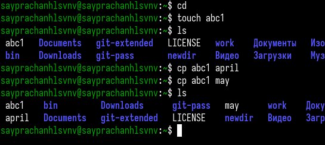{#fig:001 width=70%}

Затем я создаю каталог monthly и копирую оба текстовых файла (april и may) в созданный каталог. (рис. [-@fig:002])

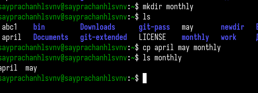{#fig:002 width=70%}

Я копирую текстовый файл may и даю ему имя june. Теперь в каталоге находятся три текстовых файла: april, june и may. (рис. [-@fig:003])

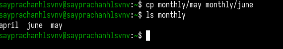{#fig:003 width=70%}

Я создаю еще один каталог с именем monthly.00, затем копирую каталог monthly в созданный каталог monthly.00. (рис. [-@fig:004])

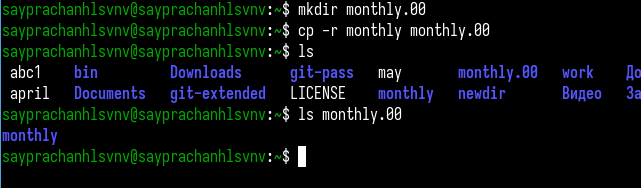{#fig:004 width=70%}

Затем я копирую каталог monthly.00 в каталог /tmp. (рис. [-@fig:005])

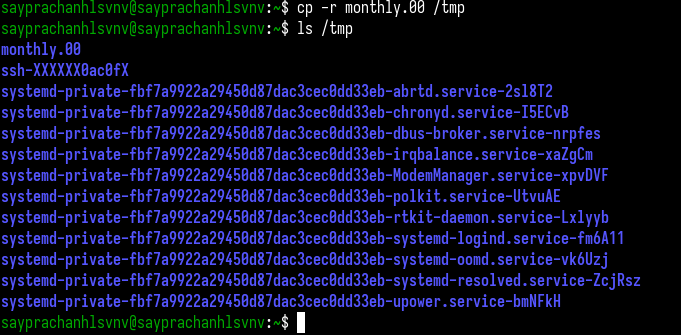{#fig:005 width=70%}

### Перемещение и переименование файлов и каталогов

Используя команду mv, я переименовываю текстовый файл april в july. (рис. [-@fig:006])

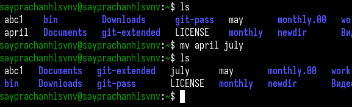{#fig:006 width=70%}

Я перемещаю текстовый файл july в каталог monthly.00 с помощью команды mv. (рис. [-@fig:007])

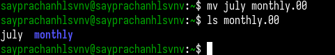{#fig:007 width=70%}

Затем я изменяю имя каталога monthly.00 на monthly.01. (рис. [-@fig:008])

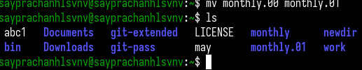{#fig:008 width=70%}

Я создаю новый каталог и называю его reports, затем перемещаю каталог monthly.01 в созданный каталог. (рис. [-@fig:009])

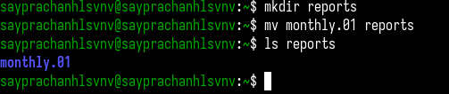{#fig:009 width=70%}

Затем я изменяю имя каталога monthly.01 на monthly внутри каталога reports. (рис. [-@fig:010])

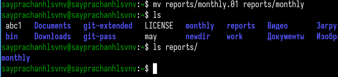{#fig:010 width=70%}

### Изменение прав доступа

Я создаю файл и называю его may. (рис. [-@fig:011])

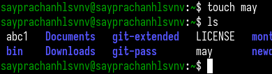{#fig:011 width=70%}

Я отображаю права доступа созданного текстового файла с помощью команды ls с опцией -l. Затем, используя команду chmod, я изменяю права доступа пользователя, добавляя право на выполнение, и проверяю правильность выполнения. (рис. [-@fig:012])

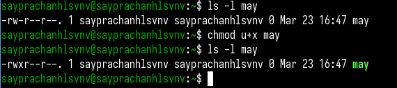{#fig:012 width=70%}

Я лишаю пользователя права на выполнение, удаляя право на выполнение у текстового файла may, и проверяю правильность выполнения. (рис. [-@fig:013])

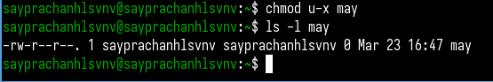{#fig:013 width=70%}

Затем я создаю каталог monthly и изменяю права доступа каталога, удаляя право на чтение для группы и остальных. (рис. [-@fig:014])

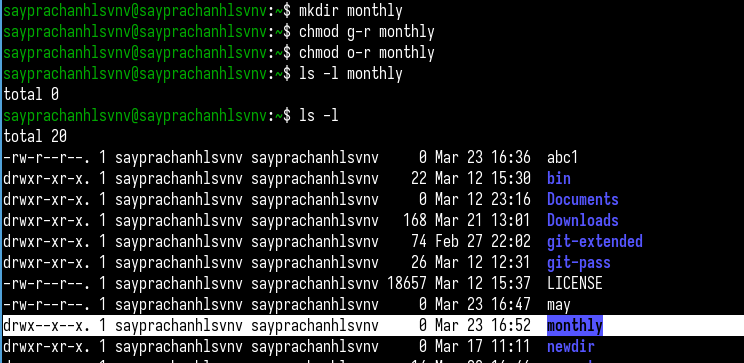{#fig:014 width=70%}

Я создаю текстовый файл с именем abc1, затем добавляю право на запись для группы. (рис. [-@fig:015])

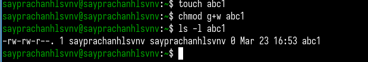{#fig:015 width=70%}

### Анализ файловой системы

Я проверяю целостность файловой системы на /dev/sda1 с помощью команды fsck. (рис. [-@fig:016])

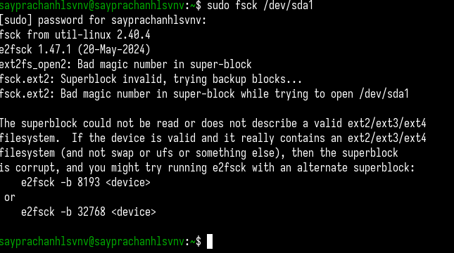{#fig:016 width=70%}

## Создание файлов и каталогов

Я копирую файл io.h из /usr/include/sys в домашний каталог и даю ему имя equipment. (рис. [-@fig:017])

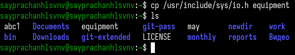{#fig:017 width=70%}

Я создаю новый каталог ski.plases. (рис. [-@fig:018])

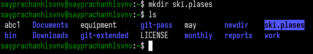{#fig:018 width=70%}

Затем я перемещаю файл equipment в созданный каталог. (рис. [-@fig:019])

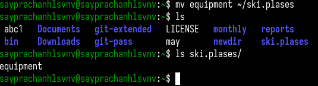{#fig:019 width=70%}

Я изменяю имя файла с equipment на equiplist в созданном каталоге. (рис. [-@fig:020])

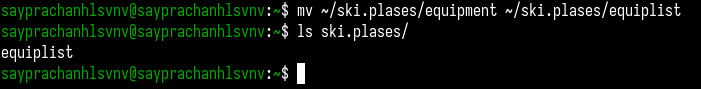{#fig:020 width=70%}

Я создаю текстовый файл с именем abc1, затем копирую созданный текстовый файл в каталог ski.plases и даю ему новое имя equiplist2. (рис. [-@fig:021])

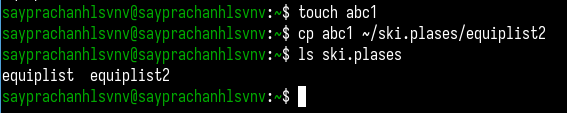{#fig:021 width=70%}

Я создаю подкаталог equipment в каталоге ski.plases. (рис. [-@fig:022])

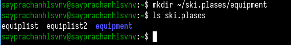{#fig:022 width=70%}

Затем я перемещаю оба файла (equiplist и equiplist2) в созданный подкаталог. (рис. [-@fig:023])

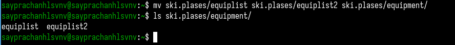{#fig:023 width=70%}

Я создаю новый каталог newdir, затем перемещаю его в каталог ski.plases и изменяю имя на plans. (рис. [-@fig:024])

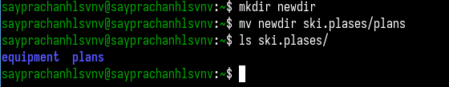{#fig:024 width=70%}

Затем я создаю два каталога (australia и play) и два текстовых файла (my_os и feathers) в домашнем каталоге, затем отображаю права доступа файлов, так как позже я их изменю. (рис. [-@fig:025] и рис. [-@fig:026])

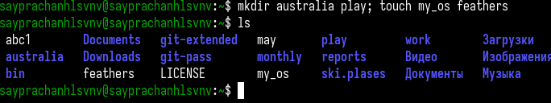{#fig:025 width=70%}

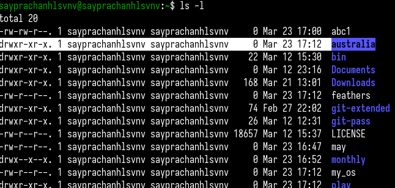{#fig:026 width=70%}

## Изменение прав доступа

Сначала я изменяю права доступа каталога australia. Я удаляю право на выполнение для группы и остальных. Затем я проверяю правильность выполнения команд. (рис. [-@fig:027] и рис. [-@fig:028])

{#fig:027 width=70%}

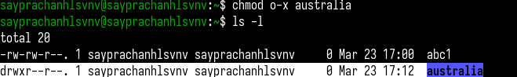{#fig:028 width=70%}

Затем я изменяю права доступа каталога play. Я удаляю право на чтение для группы и остальных. (рис. [-@fig:029])

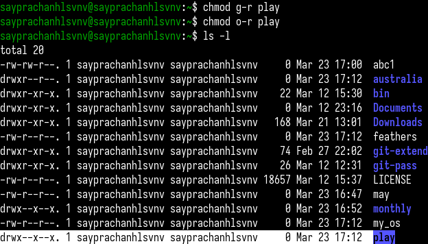{#fig:029 width=70%}

Я изменяю права доступа текстового файла my_os. Я удаляю право на запись для пользователя, затем добавляю право на выполнение для пользователя. (рис. [-@fig:030])

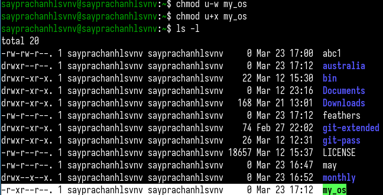{#fig:030 width=70%}

Я изменяю права доступа текстового файла feathers. Я добавляю право на запись для группы. (рис. [-@fig:031])

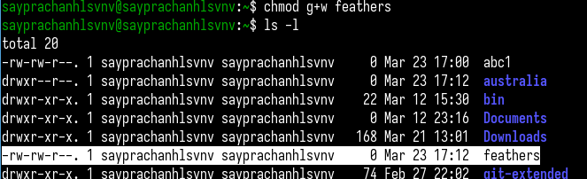{#fig:031 width=70%}

Используя команду cat, я просматриваю содержимое файла /etc/passwd. (рис. [-@fig:032])

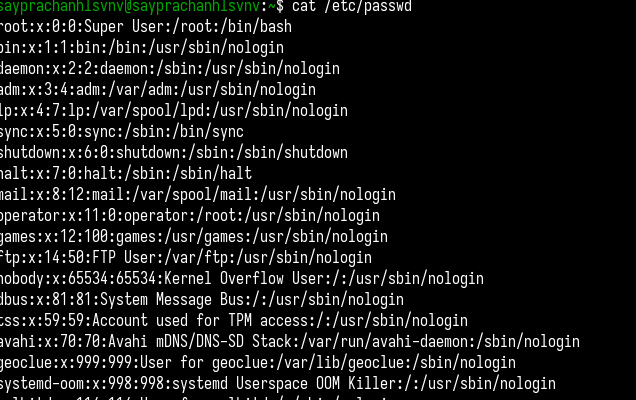{#fig:032 width=70%}

Я копирую файл feathers и даю ему имя file.old. (рис. [-@fig:033])

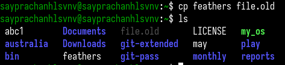{#fig:033 width=70%}

Я перемещаю файл file.old в каталог ~/play. (рис. [-@fig:034])

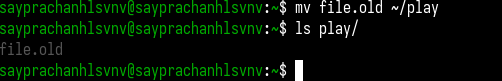{#fig:034 width=70%}

Затем я копирую каталог play в каталог fun с помощью команды cp. (рис. [-@fig:035])

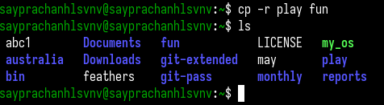{#fig:035 width=70%}

Я перемещаю каталог fun в каталог play и даю ему новое имя games. (рис. [-@fig:036])

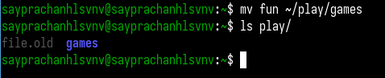{#fig:036 width=70%}

Я отображаю права доступа текстового файла feathers, затем лишаю пользователя права на чтение с помощью команды chmod u-r. (рис. [-@fig:037])

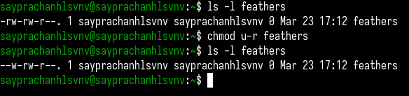{#fig:037 width=70%}

Затем я пытаюсь отобразить содержимое файла feathers, но получаю сообщение "permission denied", что означает, что у меня нет прав на просмотр этого файла, так как я лишил пользователя права на чтение. (рис. [-@fig:038])

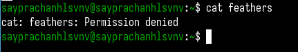{#fig:038 width=70%}

Я пытаюсь скопировать файл feathers, но также получаю сообщение "permission denied". Это происходит потому, что команде cp необходимо прочитать содержимое файла, чтобы скопировать его, но я лишил пользователя права на чтение. (рис. [-@fig:039])

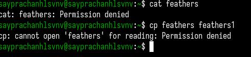{#fig:039 width=70%}

Используя команду chmod u+r, я возвращаю пользователю право на чтение файла feathers. (рис. [-@fig:040])

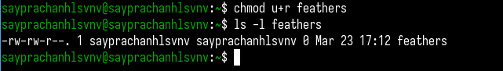{#fig:040 width=70%}

Я лишаю пользователя права на выполнение для каталога ~/play. (рис. [-@fig:041])

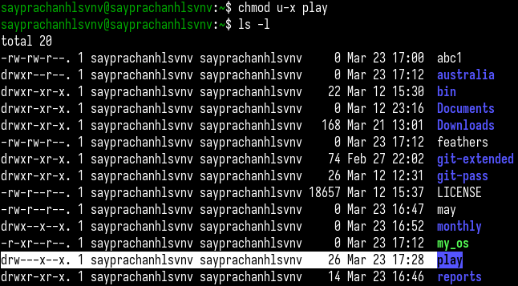{#fig:041 width=70%}

Затем я пытаюсь перейти в каталог play с помощью команды cd, но получаю сообщение "permission denied". Это означает, что я не могу получить доступ к каталогу, так как я лишил пользователя права на выполнение, а право на выполнение необходимо для доступа к каталогу, даже если у меня есть право на чтение. (рис. [-@fig:042])

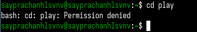{#fig:042 width=70%}

Я возвращаю пользователю право на выполнение для каталога play. (рис. [-@fig:043])

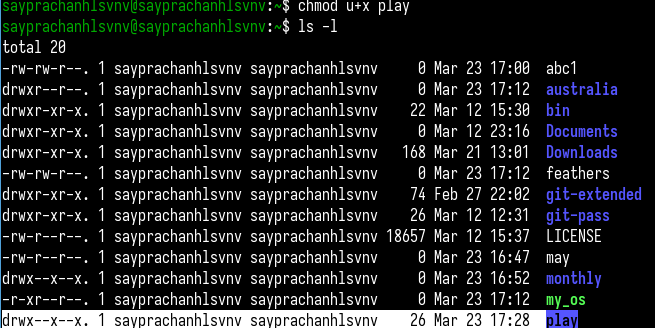{#fig:043 width=70%}

## Использование команды man

Затем, используя команду man, я отображаю инструкции для следующих команд: mount, fsck, mkfs, kill (рис. [-@fig:044]).

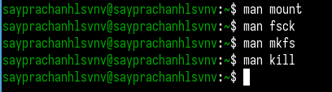{#fig:044 width=70%}

Команда mount используется для подключения файловой системы к указанной точке монтирования, что позволяет получить доступ к данным (разделам диска, сетевым файловым системам и т.д.). (рис. [-@fig:045])

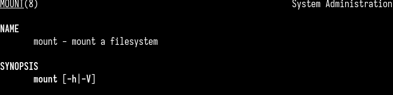{#fig:045 width=70%}

Команда fsck (проверка целостности файловой системы) используется для проверки и исправления ошибок файловой системы, обычно после сбоев системы или неправильного завершения работы. (рис. [-@fig:046])

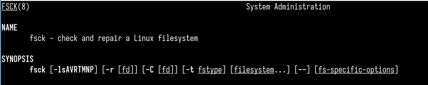{#fig:046 width=70%}

Команда mkfs (создание файловой системы) используется для создания файловой системы на устройстве, таком как раздел диска или USB-накопитель, в Linux. Она форматирует устройство, подготавливая его для хранения данных. (рис. [-@fig:047])

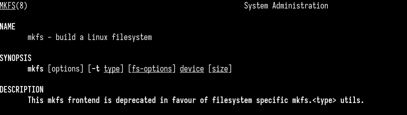{#fig:047 width=70%}

Команда kill используется для отправки сигналов процессам, обычно для завершения процессов, но также может отправлять другие сигналы (перезапуск, приостановка или возобновление).
При отправке сигнала, если сигнал не указан, по умолчанию отправляется сигнал SIGTERM. Однако для принудительного завершения процесса используется сигнал -9, который устанавливает сигнал SIGKILL для немедленного завершения процесса. (рис. [-@fig:048])

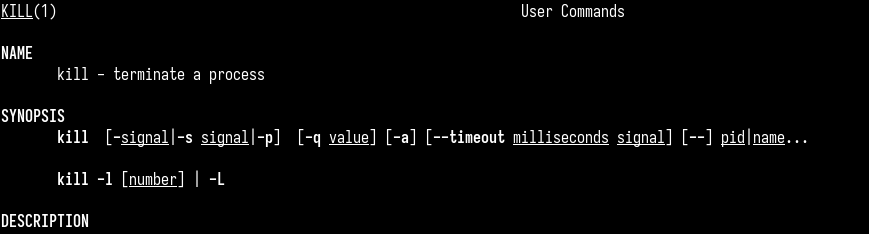{#fig:048 width=70%}

# Выводы

Во время выполнения данной лабораторной работы я ознакомился с файловой системой Linux, её структурой, именами каталогов и их содержимым.
Я приобрел практические навыки использования команд для работы с файлами и каталогами, управления процессами (и заданиями), проверки использования диска и обслуживания файловой системы.

# Ответы на контрольные вопросы

1. Характеристика каждой файловой системы на жёстком диске компьютера:

NTFS (New Technology File System): Это файловая система по умолчанию для Windows. Она поддерживает большие файлы, безопасность данных через права доступа и шифрование. Также используется журналирование, которое помогает восстанавливать данные после сбоя системы.

FAT32 (File Allocation Table 32): Старая файловая система, часто используемая на USB-флешках и внешних дисках. Она поддерживает маленькие файлы (до 4 ГБ) и имеет ограничение на размер тома (2 ТБ).

ext4 (Fourth Extended File System): Это файловая система по умолчанию для большинства дистрибутивов Linux. Она поддерживает большие файлы, обеспечивает хорошую производительность и использует журналирование для защиты данных.

exFAT (Extended File Allocation Table): Эта файловая система используется на флеш-накопителях и SD-картах. Она поддерживает файлы больше 4 ГБ и совместима как с Windows, так и с macOS.

HFS+ (Mac OS Extended): Это старая файловая система, использовавшаяся в macOS. Она поддерживает журналирование для защиты данных, но была заменена новой файловой системой APFS в последних версиях macOS.

2. Общая структура файловой системы и описание директорий первого уровня:

Windows:

C:/ — Основной раздел, где установлена операционная система.

Program Files/ — Для установленных программ.

Users/ — Хранит данные и настройки пользователей.

Windows/ — Системные файлы операционной системы.

Linux:

/ — Корневая директория, содержащая все остальные файлы.

/bin/ — Важные системные команды.

/home/ — Данные пользователей.

/lib/ — Библиотеки для работы программ.

/etc/ — Конфигурационные файлы.

/dev/ — Устройства (например, жёсткие диски).

/tmp/ — Временные файлы.

/var/ — Логи и переменные данные.

3. Что нужно сделать, чтобы файловая система стала доступной для операционной системы:

Для того чтобы использовать файловую систему, её нужно смонтировать.
В Linux это делается с помощью команды mount, а в Windows обычно это происходит автоматически.

4. Причины повреждения файловой системы и как их исправить:

 +  Причины повреждений:

	- Неправильное завершение работы компьютера (например, из-за отключения питания).

	- Проблемы с оборудованием (например, повреждённые сектора на жёстком диске).

 	- Вирусы, которые могут повредить данные.

+ Как исправить повреждения:

	- Для восстановления используется команда chkdsk (в Windows) или fsck (в Linux).

	- Важно регулярно делать резервные копии данных.

5. Как создаётся файловая система:

Файловая система создаётся во время форматирования.
В Linux это можно сделать с помощью команды mkfs (например, mkfs.ext4 /dev/sda1),
а в Windows для этого используется инструмент форматирования в "Управлении дисками".

6. Команды для просмотра текстовых файлов:

cat: Показывает всё содержимое файла.

more: Открывает файл постранично.

less: Похож на more, но с более удобной навигацией.

head: Показывает первые несколько строк.

tail: Показывает последние строки, полезно для просмотра логов.

nano: Простой текстовый редактор в терминале.

vim: Мощный редактор для работы с большими файлами.

7. Основные возможности команды cp в Linux:

cp используется для копирования файлов и директорий.

cp file1 file2: Копирует file1 в file2.

cp -r: Копирует директории и всё их содержимое.

cp -i: Спрашивает подтверждение перед перезаписью файла.

cp -v: Показывает процесс копирования.

cp --preserve=all: Копирует файлы, сохраняя их оригинальные атрибуты.

8. Основные возможности команды mv в Linux:

mv используется для перемещения или переименования файлов.

mv file1 file2: Перемещает или переименовывает файлы.

mv -i: Запрашивает подтверждение перед перезаписью.

mv -v: Показывает процесс перемещения файлов.

9. Что такое права доступа и как их изменить?

Права доступа определяют, кто может читать, изменять или выполнять файл. Права бывают для владельца, группы и остальных пользователей.

r — чтение, w — запись, x — выполнение.

Права можно изменить с помощью команды chmod:

chmod 755 file: Устанавливает права на чтение, запись и выполнение для владельца и только чтение и выполнение для группы и других.

chmod +x file: Добавляет право на выполнение для всех.

chmod u+x file: Добавляет право на выполнение для владельца.

# Список литературы{.unnumbered}

[Лабораторная работа №7](https://esystem.rudn.ru/pluginfile.php/2586866/mod_resource/content/4/005-lab_files.pdf)

::: {#refs}
:::
