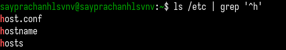

---
## Front matter
lang: ru-RU
title: Лабораторная работа №8
subtitle: Операционные системы
author:
  - Луангсуваннавонг Сайпхачан
institute:
  - Российский университет дружбы народов, Москва, Россия
  
date: 29 марта 2025

## i18n babel
babel-lang: russian
babel-otherlangs: english

## Formatting pdf
toc: false
toc-title: Содержание
slide_level: 2
aspectratio: 169
section-titles: true
theme: metropolis
header-includes:
 - \metroset{progressbar=frametitle,sectionpage=progressbar,numbering=fraction}
---

# Информация

## Докладчик

:::::::::::::: {.columns align=center}
::: {.column width="70%"}

  * Луангсуваннавонг Сайпхачан
  * Студент из группы НКАбд-01-24
  * Российский университет дружбы народов
  * <https://sayprachanh-lsvnv.github.io>

:::
::: {.column width="30%"}
:::
::::::::::::::

## Цель работы

 Ознакомление с инструментами поиска файлов и фильтрации текстовых данных.
Приобретение практических навыков: по управлению процессами (и заданиями), по
проверке использования диска и обслуживанию файловых систем

## Задание

 1. Перенаправлять выходные данные в файлы
 2. Выполнять поиск файлов
 3. Фильтровать текст и файлы
 4. Проверять использование диска
 5. Управлять задачами и процессами

# Выполнение лабораторной работы

## Перенаправление файла

Используя команду ls с опцией -lR, я вывожу всю информацию о каталоге /etc, затем записываю вывод в файл file.txt,
используя символ >. Затем я вывожу информацию о домашнем каталоге и добавляю её в файл file.txt с помощью символа >>.

## Перенаправление файла

Я ищу файлы, которые заканчиваются на .conf, в файле file.txt с помощью команды grep, после чего записываю результат в файл conf.txt.

## Поиск файлов

Я нахожу все файлы в домашнем каталоге, начинающиеся на букву 'c', используя команду find с опцией -name и шаблоном 'c*', а затем вывожу их с помощью опции -print.

## Поиск файлов
Другой способ — использовать команду ls вместе с grep, но это работает только для файлов непосредственно в домашнем каталоге, а не в его подкаталогах.

## Поиск файлов

Далее, используя команду ls, я вывожу список файлов в каталоге /etc, затем с помощью grep нахожу файлы, начинающиеся на букву 'h',
добавляя строку '^h' (символ ^ означает начало строки).

## Перенаправление файла

С помощью команды find я ищу файлы, заканчивающиеся на 'log', затем вывожу результат в файл ~/logfile, добавляя амперсанд (&),
чтобы процесс выполнялся в фоновом режиме, так как он требует значительных вычислительных ресурсов.

## Удаление файла

Я удаляю файл ~/logfile с помощью команды rm.

## Работает в фоновом режиме

Я запускаю gedit из консоли в фоновом режиме, используя амперсанд (&).

## Процесс ID

Я получаю информацию о процессах, запущенных в моём терминале, с помощью команды ps с опцией aux, затем с помощью grep ищу процесс gedit, чтобы узнать его ID (PID).
Также можно использовать команду pgrep gedit, которая также выведет ID процесса.

## Инструкции по командам

Используя команду man, я читаю инструкцию к команде kill, затем, используя полученную информацию, завершаю процесс gedit с помощью команды kill и его PID (например, 3946).

## Инструкции по командам

Перед выполнением команд я читаю инструкции к командам df и du с помощью man.

## Информация о диске

С помощью команды df с опцией -vi я вывожу подробную информацию о размере каждого смонтированного раздела диска.

## Информация о диске

Затем, используя команду du, я вывожу информацию об использовании диска для всех файлов в каталоге. Я указываю каталог lab03/report,
где хранятся файлы лабораторной работы 3.

## Поиск файлов

Я нахожу все каталоги в домашней директории с помощью команды find, устанавливая параметр -type в значение d (от "directory").

## Выводы

  Во время этой лабораторной работы, я ознакомился с инструментами поиска файлов и фильтрации текстовых данных.
Приобрел практические навыки управления процессами (и задачами), проверки использования диска и обслуживания файловых систем.

# Спасибо за внимание
