---
## Front matter
title: "Отчёт по лабораторной работе №8"
subtitle: "Операционные системы"
author: "Луангсуваннавонг Сайпхачан"

## Generic otions
lang: ru-RU
toc-title: "Содержание"

## Bibliography
bibliography: bib/cite.bib
csl: pandoc/csl/gost-r-7-0-5-2008-numeric.csl

## Pdf output format
toc: true # Table of contents
toc-depth: 2
lof: true # List of figures
lot: true # List of tables
fontsize: 12pt
linestretch: 1.5
papersize: a4
documentclass: scrreprt
## I18n polyglossia
polyglossia-lang:
  name: russian
  options:
	- spelling=modern
	- babelshorthands=true
polyglossia-otherlangs:
  name: english
## I18n babel
babel-lang: russian
babel-otherlangs: english
## Fonts
mainfont: IBM Plex Serif
romanfont: IBM Plex Serif
sansfont: IBM Plex Sans
monofont: IBM Plex Mono
mathfont: STIX Two Math
mainfontoptions: Ligatures=Common,Ligatures=TeX,Scale=0.94
romanfontoptions: Ligatures=Common,Ligatures=TeX,Scale=0.94
sansfontoptions: Ligatures=Common,Ligatures=TeX,Scale=MatchLowercase,Scale=0.94
monofontoptions: Scale=MatchLowercase,Scale=0.94,FakeStretch=0.9
mathfontoptions:
## Biblatex
biblatex: true
biblio-style: "gost-numeric"
biblatexoptions:
  - parentracker=true
  - backend=biber
  - hyperref=auto
  - language=auto
  - autolang=other*
  - citestyle=gost-numeric
## Pandoc-crossref LaTeX customization
figureTitle: "Рис."
tableTitle: "Таблица"
listingTitle: "Листинг"
lofTitle: "Список иллюстраций"
lotTitle: "Список таблиц"
lolTitle: "Листинги"
## Misc options
indent: true
header-includes:
  - \usepackage{indentfirst}
  - \usepackage{float} # keep figures where there are in the text
  - \floatplacement{figure}{H} # keep figures where there are in the text
---

# Цель работы

Ознакомление с инструментами поиска файлов и фильтрации текстовых данных.
Приобретение практических навыков: по управлению процессами (и заданиями), по
проверке использования диска и обслуживанию файловых систем

# Задание

 1. Перенаправлять выходные данные в файлы
 2. Выполнять поиск файлов
 3. Фильтровать текст и файлы
 4. Проверять использование диска
 5. Управлять задачами и процессами

# Теоретическое введение

В системе по умолчанию открыто три специальных потока:

– stdin — стандартный поток ввода (по умолчанию: клавиатура), файловый дескриптор 0;

– stdout — стандартный поток вывода (по умолчанию: консоль), файловый дескриптор 1;

– stderr — стандартный поток вывод сообщений об ошибках (по умолчанию: консоль), файловый дескриптор 2.

Большинство используемых в консоли команд и программ записывают результаты своей работы в стандартный поток вывода stdout.
Например, команда ls выводит в стандартный поток вывода (консоль) список файлов в текущей директории. Потоки вывода
и ввода можно перенаправлять на другие файлы или устройства. Проще всего это делаетсяс помощью символов >, >>, <, <<.

Конвейер (pipe) служит для объединения простых команд или утилит в цепочки, в которых результат работы предыдущей команды передаётся последующей.

Команда find используется для поиска и отображения на экран имён файлов, соответствующих заданной строке символов.
Найти в текстовом файле указанную строку символов позволяет команда grep. Команда df показывает размер каждого смонтированного раздела диска.

Любую выполняющуюся в консоли команду или внешнюю программу можно запустить
в фоновом режиме. Для этого следует в конце имени команды указать знак амперсанда &

Любой команде, выполняемой в системе, присваивается идентификатор процесса (process ID).
Получить информацию о процессе и управлять им, пользуясь идентификатором процесса, можно из любого окна командного интерпретатора.


# Выполнение лабораторной работы

Сначала я вхожу в систему и открываю терминал. Используя команду `ls` с опцией `-lR`,
я вывожу список содержимого и информацию о каталоге `/etc` с правами суперпользователя, затем записываю это в текстовый файл `file.txt`,
используя символ `>`, который перенаправляет вывод команды `ls` в `file.txt`.

Затем я вывожу содержимое домашнего каталога (`~`) и, используя символ `>>`, добавляю его в `file.txt`
без перезаписи предыдущей информации. После этого с помощью утилиты `head` я вывожу первые 10 строк из `file.txt`. (рис. [-@fig:001])  

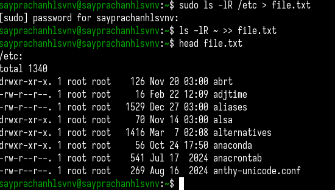{#fig:001 width=70%}

Я ищу все файлы, оканчивающиеся на `.conf`, в текстовом файле `file.txt` с помощью команды `grep`,
добавляю строку `./conf` к найденным файлам и записываю результат в текстовый файл `conf.txt`,
используя символ `>`. (рис. [-@fig:002])  

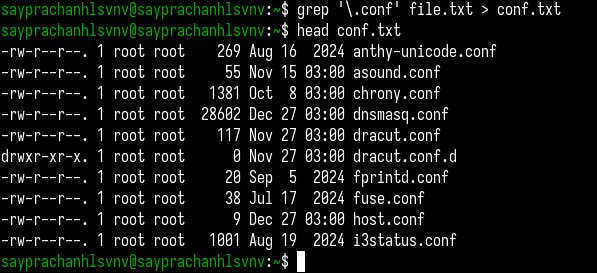{#fig:002 width=70%}

С помощью команды `find` я ищу все файлы и каталоги, начинающиеся на `c` в домашней директории,
устанавливая опцию `-name` на искомую строку (`"c*"`), затем вывожу результат на экран с помощью `-print`. (рис. [-@fig:003])

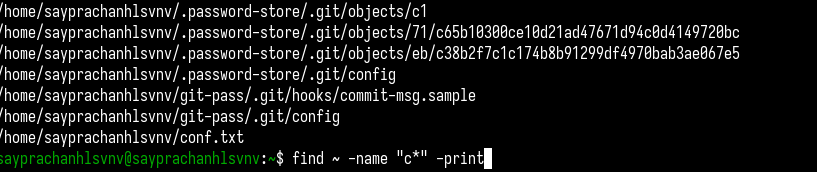{#fig:003 width=70%}

Альтернативный способ — использование команд `ls` и `grep`: `ls` выводит список файлов и каталогов в домашней директории,
а `grep` с шаблоном `^c` (символ `^` означает "начинается с буквы") отображает только файлы, начинающиеся на `c`.
Однако этот способ не показывает файлы в подкаталогах. (рис. [-@fig:004])

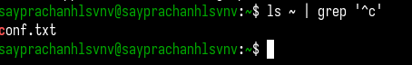{#fig:004 width=70%}

Далее, используя команду `ls`, я вывожу список файлов в каталоге `/etc`, а затем с помощью `grep` ищу все файлы,
начинающиеся на букву `h`, используя шаблон `^h`. (рис. [-@fig:005])  

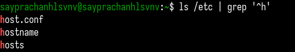{#fig:005 width=70%}

С помощью команды `find` я ищу файлы, оканчивающиеся на `log*` в домашнем каталоге, перенаправляю вывод в файл `~/logfile` и,
добавляя амперсанд (`&`), запускаю этот процесс в фоновом режиме, так как он требует значительного времени для выполнения. (рис. [-@fig:006])  

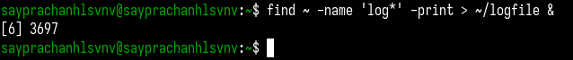{#fig:006 width=70%}

Затем я удаляю файл `logfile` командой `rm`. (рис. [-@fig:007])  

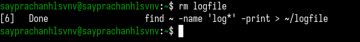{#fig:007 width=70%}

Добавляя амперсанд (`&`), я запускаю `gedit` из консоли в фоновом режиме. (рис. [-@fig:008])  

{#fig:008 width=70%}

Используя команду `ps` с опцией `aux`, я получаю информацию о процессах, запущенных в моем терминале.
С помощью `grep` я ищу процесс `gedit`, чтобы найти его ID (в данном случае — `3946`).

Альтернативный способ получить ID процесса `gedit` — использовать команду `pgrep`, которая ищет процессы и возвращает их ID. (рис. [-@fig:009])  

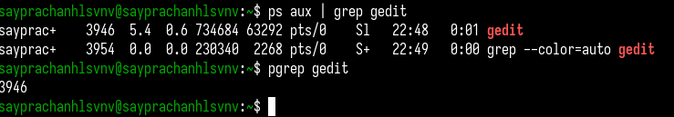{#fig:009 width=70%}

С помощью команды `man` я читаю инструкции по использованию команды `kill`, затем завершаю процесс `gedit`, используя его ID (рис. [-@fig:010])  

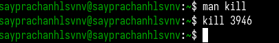{#fig:010 width=70%}

Используя `man`, я изучаю справку по командам `df` и `du`, после чего выполняю каждую из них. (рис. [-@fig:011])

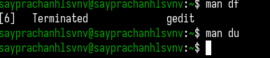{#fig:011 width=70%}

Сначала командой `df` с опцией `-vi` я вывожу размер каждого смонтированного раздела диска в детализированном виде. (рис. [-@fig:012])

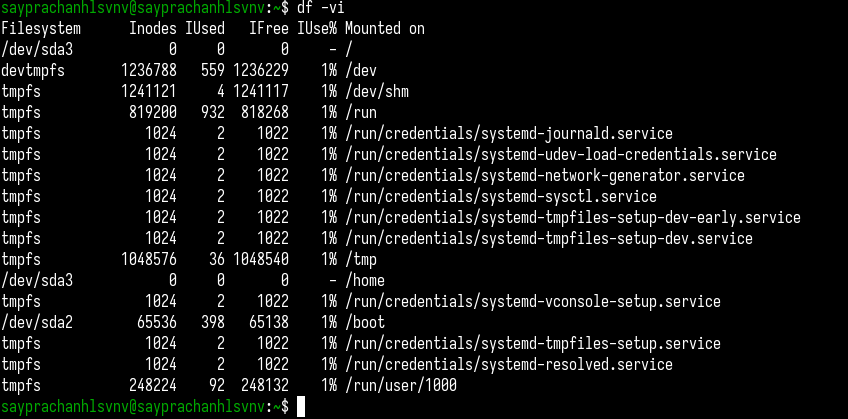{#fig:012 width=70%}

Затем с помощью `du -a` я отображаю использование диска всеми файлами в указанной директории (в данном случае — `lab03/report`). (рис. [-@fig:013])  

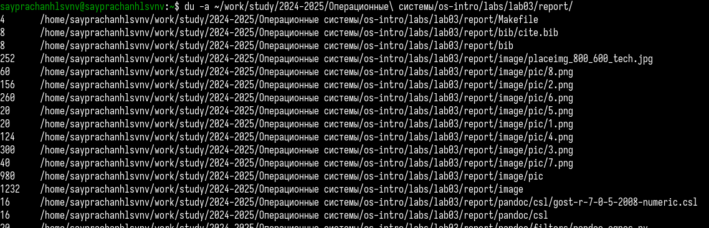{#fig:013 width=70%}

С помощью команды `find` я ищу и отображаю все каталоги в домашней директории, устанавливая опцию `-type d` (`d` — directory, каталог). (рис. [-@fig:014])  

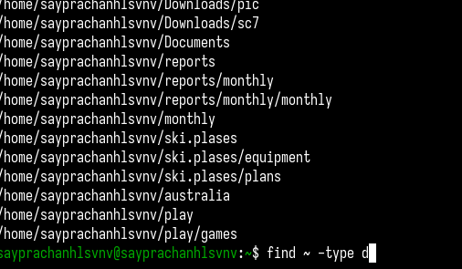{#fig:014 width=70%}

# Выводы

Во время этой лабораторной работы, я ознакомился с инструментами поиска файлов и фильтрации текстовых данных.
Приобрел практические навыки управления процессами (и задачами), проверки использования диска и обслуживания файловых систем.

# Ответы на контрольные вопросы

1. Какие потоки ввода/вывода вы знаете?

   Потоки ввода/вывода (I/O) в операционных системах могут быть:
   
   - Стандартный ввод (stdin)—  поток, через который происходит ввод данных пользователем или программами (например, с клавиатуры).
   - Стандартный вывод (stdout)—  поток, через который программа выводит данные (например, на экран).
   - Стандартная ошибка (stderr) — поток, предназначенный для вывода ошибок и сообщений об ошибках.

2. Объясните разницу между операцией > и >>.

   - `>` — это операция перенаправления вывода. Она перезаписывает файл, если он существует. Если файл не существует, то он создается.
   - `>>` — это операция перенаправления вывода, но в отличие от >, она добавляет данные в конец файла, не перезаписывая его.

3. Что такое конвейер?

   Конвейер (или пайп) — это механизм, который позволяет передавать вывод одной программы в качестве ввода другой.
  Это позволяет объединить несколько команд для выполнения сложных операций в одном процессе.
  В Unix/Linux конвейеры реализуются через символ (|).

4. Что такое процесс? Чем это понятие отличается от программы?

   - Процесс — это выполняющаяся инстанция программы, включая её код, данные и состояние.
      Каждый процесс имеет свой уникальный идентификатор (PID) и ресурсы.
   - Программа — это набор инструкций, которые могут быть выполнены процессором.
      Программа сама по себе не выполняется, пока она не запущена как процесс.

5. Что такое PID и GID?

   - PID (Process ID) — уникальный идентификатор процесса в операционной системе.
   - GID (Group ID) — идентификатор группы пользователей, с которой ассоциирован процесс.

6. Что такое задачи и какая команда позволяет ими управлять?

   Задачи (или процессы) — это выполняющиеся программы или их части.
  Управление задачами осуществляется с помощью таких команд, как ps, top, htop, а также kill для завершения задач.

7. Найдите информацию об утилитах top и htop. Каковы их функции?

   - top — это утилита для отображения информации о запущенных процессах в реальном времени,
  включая использование процессора, памяти и другие ресурсы системы. Команда предоставляет информацию в текстовом виде.
   - htop  — улучшенная версия top. Это интерактивная утилита с более удобным и наглядным интерфейсом,
  которая предоставляет те же данные, но с возможностью фильтрации, сортировки и управления процессами через пользовательский интерфейс.

8. Назовите и дайте характеристику команде поиска файлов. Приведите примеры использования этой команды.

   - Команда find — используется для поиска файлов и каталогов в файловой системе по различным критериям.
     Пример:
     ```
     find /home/user -name "*.txt"
     find / -type d  (d - directory)
     ```

9. Можно ли по контексту (содержанию) найти файл? Если да, то как?

   Да, можно. Для поиска файлов по содержимому используется команда `grep`.
   Пример:
   ```
   grep -r "text" /path/
   ```

10. Как определить объем свободной памяти на жёстком диске?

    Для определения объема свободного места на диске используется команда `df`.
    Пример:
    ```
    df -h 
    ```
    
11. Как определить объем вашего домашнего каталога?

    Для этого можно использовать команду `du`:
    ```
    du -sh ~
    ```

12. Как удалить зависший процесс?

    Для удаления зависшего процесса используется команда `kill`.
    Для этого нужно сначала найти PID процесса с помощью команды `ps` или `top`, а затем отправить сигнал завершения:
    ```
    kill -9 <PID>  
    ```
    В случае если процесс не отвечает на стандартный сигнал, можно использовать `kill -9` для принудительного завершения.

# Список литературы{.unnumbered}

[Лабораторная работа №8](https://esystem.rudn.ru/pluginfile.php/2586868/mod_resource/content/4/006-lab_proc.pdf)

::: {#refs}
:::
