---
## Front matter
lang: ru-RU
title: Лабораторная работа №9
subtitle: Операционные системы
author:
  - Луангсуваннавонг Сайпхачан
institute:
  - Российский университет дружбы народов, Москва, Россия
date: 08 апреля 2025

## i18n babel
babel-lang: russian
babel-otherlangs: english

## Formatting pdf
toc: false
toc-title: Содержание
slide_level: 2
aspectratio: 169
section-titles: true
theme: metropolis
header-includes:
 - \metroset{progressbar=frametitle,sectionpage=progressbar,numbering=fraction}
---

# Информация

## Докладчик

:::::::::::::: {.columns align=center}
::: {.column width="70%"}

  * Луангсуваннавонг Сайпхачан
  * Студент из группы НКАбд-01-24
  * Российский университет дружбы народов
  * <https://sayprachanh-lsvnv.github.io>

:::
::: {.column width="30%"}
:::
::::::::::::::

## Цель работы

Освоение основных возможностей командной оболочки Midnight Commander.
Приобретение навыков практической работы по просмотру каталогов и файлов;
манипуляций с ними.

# Выполнение лабораторной работы

## Задание по mc

Я изучаю инструкцию mc (Midnight Commander) с помощью команды man

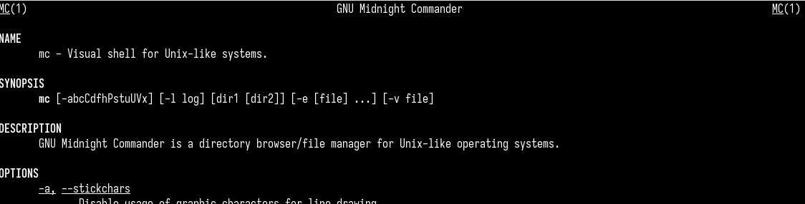

## Задание по mc

Открываю mc, используя команду mc, затем изучаю его структуру

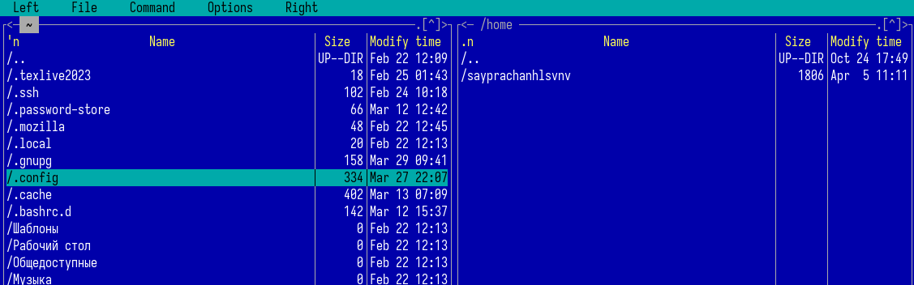

## Задание по mc

Нажимая Ctrl + t, выбираю 2 текстовых файла (file.txt и conf.txt)

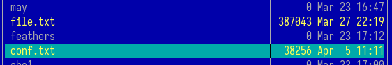

## Задание по mc

Копирую оба выбранных файла в директорию Documents с помощью клавиши F5

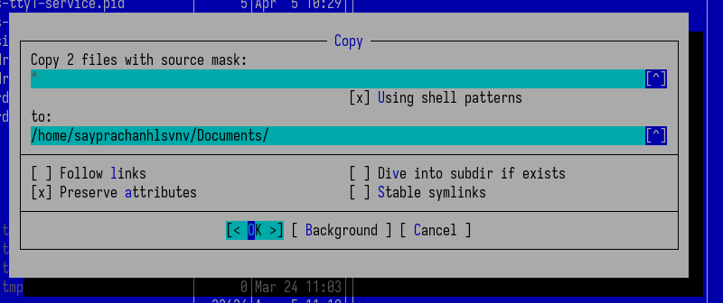

## Задание по mc

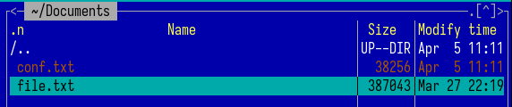

## Задание по mc

Используя клавишу F6, перемещаю скопированный текстовый файл conf.txt в домашнюю директорию, даю ему новое имя file1.txt

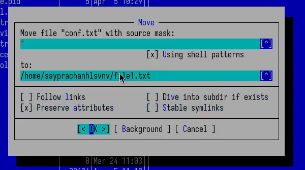

## Задание по mc

Нажимая Ctrl + x и букву i, отображаю информацию о текстовом файле (дата, размер файла)

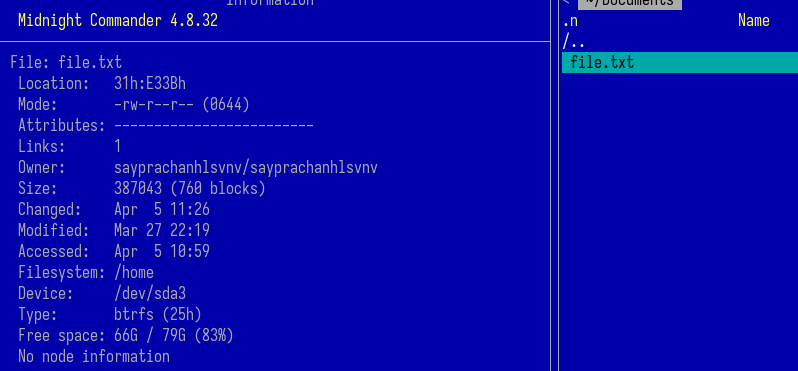

## Задание по mc

Нажимая Ctrl + x, затем букву c, отображаю информацию о правах доступа к файлу

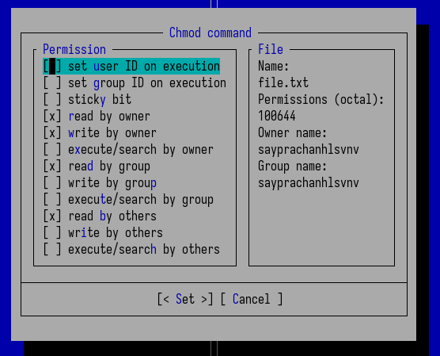

## Задание по mc

Удаляю файл с помощью клавиши F8

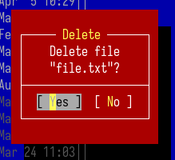

## Задание по mc

Просматриваю содержимое файла с помощью клавиши F3 (в полноэкранном режиме)

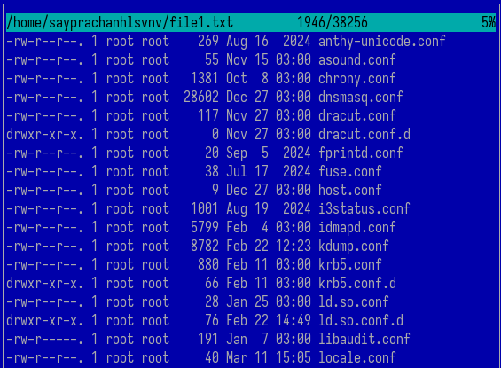

## Задание по mc

Затем настраиваю панели: отображаю содержимое файла на правой панели, а домашнюю директорию на левой

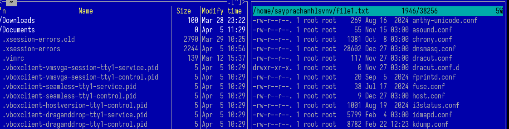

## Задание по mc

Отображаю дерево каталогов директории 'work' на правой панели, затем сравниваю с тем же каталогом, но в другом формате на левой панели

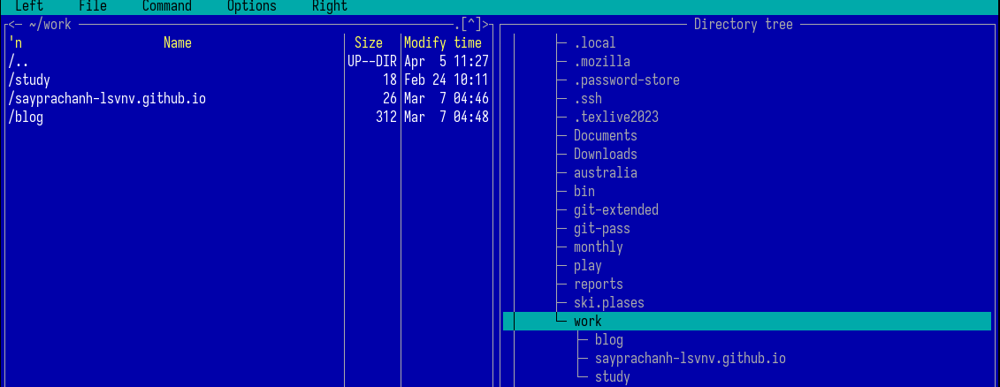

## Задание по mc

Открываю текстовый файл для редактирования с помощью F4, добавляю текст ('hello world') в файл

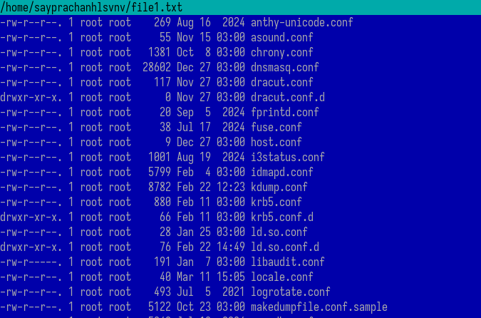

## Задание по mc

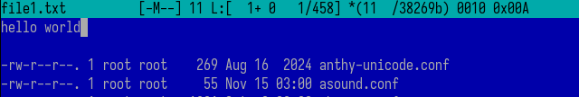

## Задание по mc

Закрываю файл без сохранения. Таким образом, изменений в файле не происходит

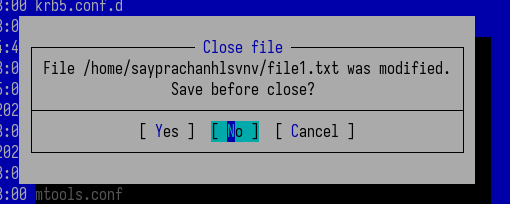

## Задание по mc

С помощью F7 создаю новую директорию с именем "HelloWorld"

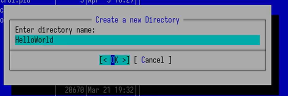

## Задание по mc

Копирую текстовый файл "file1.txt" в созданную директорию, указав путь через интерфейс mc

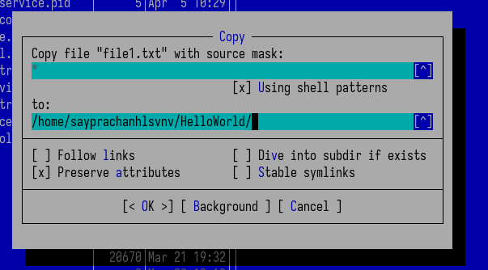

## Задание по mc

Перехожу в подменю по F9, выбираю раздел 'command', затем опцию поиска файлов. Ввожу имя файла (*.txt). В результате отображаются все файлы с расширением .txt

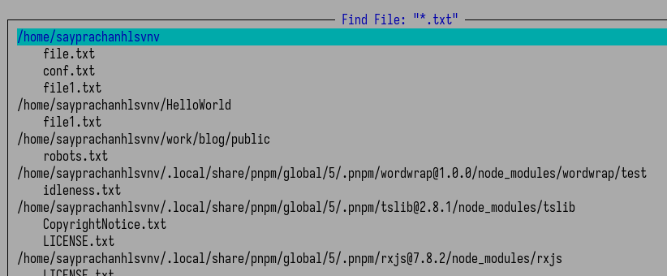

## Задание по mc

Можно включить историю команд в mc для повторного использования предыдущих команд

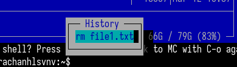

## Задание по mc

Можно использовать дерево каталогов в подменю для возврата в домашнюю директорию

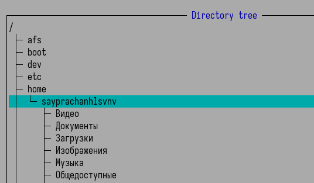

## Задание по mc

Открываю файл расширений программы mc для анализа

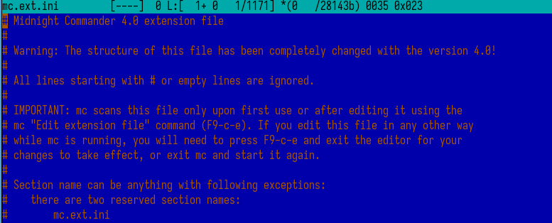

## Задание по mc

Открываю файл меню для анализа (меню содержит: local и user), выбираю local menu file

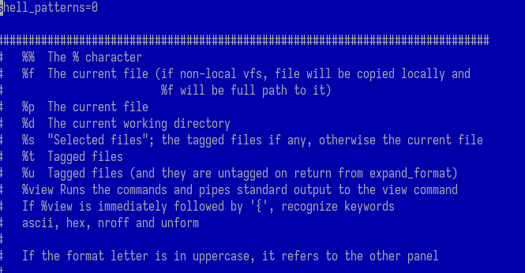

## Задание по mc

Используя опции подменю, включаю отображение скрытых файлов на панелях

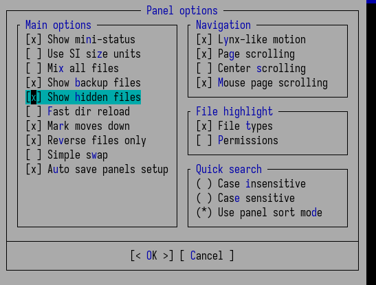

## Задание по mc

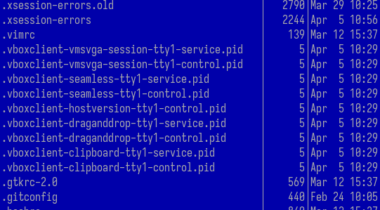

## Задание по mc

Изменяю структуру интерфейса с вертикальной на горизонтальную

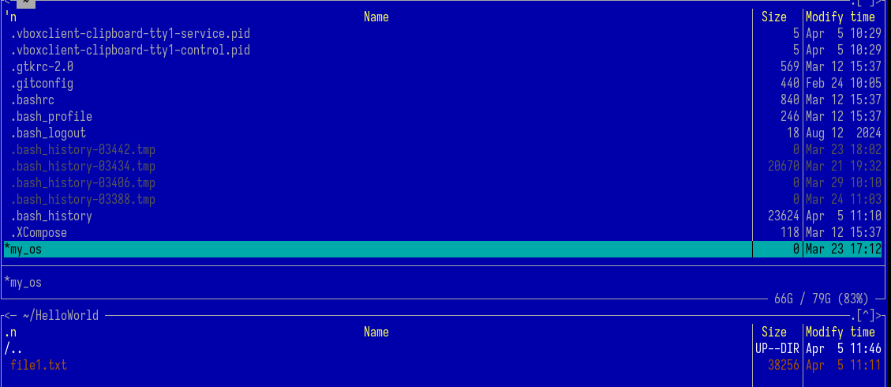

## Задание по mc

Изменяю внешний вид интерфейса

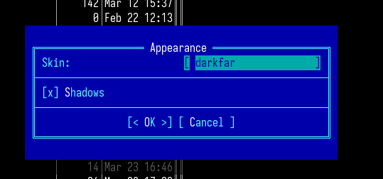

## Задание по mc

Отображаю все функциональные клавиши, используемые при работе с интерфейсом

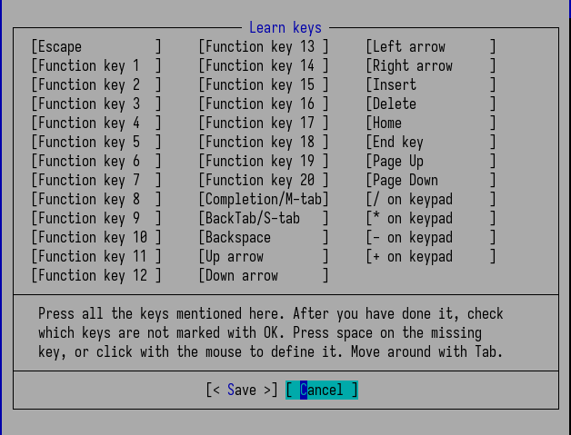

## Задание по встроенному редактору mc

Создаю текстовый файл 'text.txt' в домашней директории

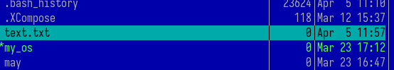

## Задание по встроенному редактору mc

Открываю файл для редактирования, копирую произвольный текст из файла лабораторной работы 9 и вставляю в созданный текстовый файл

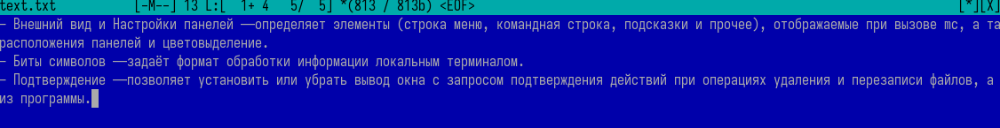

## Задание по встроенному редактору mc

Используя F8, удаляю 2 части текста

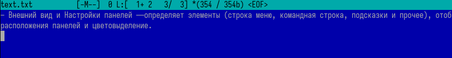

## Задание по встроенному редактору mc

Выделяю текст с помощью F3, затем копирую его F5 и вставляю на вторую строку нажатием Enter

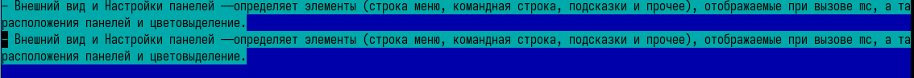

## Задание по встроенному редактору mc

Выделяю скопированный текст F3, затем перемещаю его с помощью F6

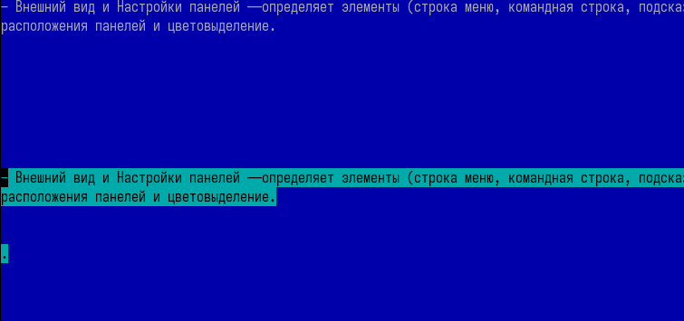

## Задание по встроенному редактору mc

Сохраняю измененный файл 'text.txt' с помощью F2

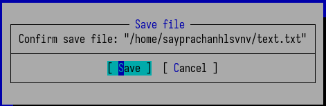

## Задание по встроенному редактору mc

Отменяю изменения в файле комбинацией Ctrl + U. Текст возвращается к состоянию до перемещения

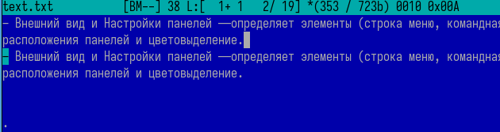

## Задание по встроенному редактору mc

Перехожу в конец файла комбинацией Ctrl + End и добавляю текст

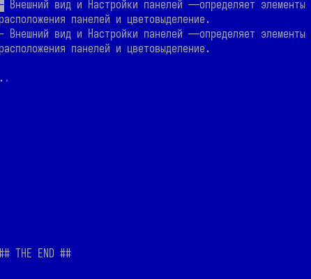

## Задание по встроенному редактору mc

Перехожу в начало файла комбинацией Ctrl + Home и добавляю текст

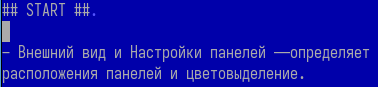

## Задание по встроенному редактору mc

Сохраняю файл и выхожу с помощью F10

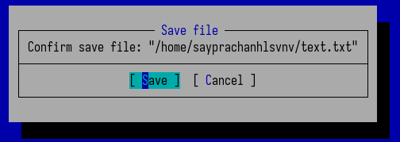

## Задание по встроенному редактору mc

Открываю исходный код на языке программирования (файл index.js на JavaScript)

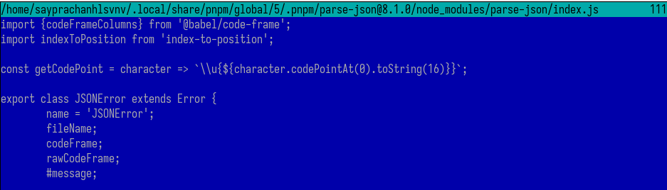

## Задание по встроенному редактору mc

Включаю подсветку синтаксиса для лучшего восприятия исходного кода

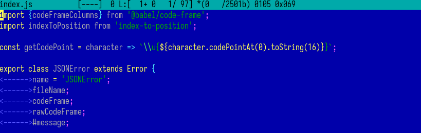

## Задание по встроенному редактору mc

Если отключить подсветку синтаксиса, исходный код становится трудночитаемым, так как отсутствует цветовое выделение команд и функций

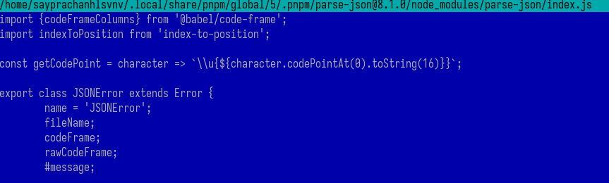

## Выводы

Я освоил основные возможности командной оболочки Midnight Commander
(mc). Я приобрел практические навыки работы с каталогами и файлами, включая
их просмотр и различные манипуляции.

# Спасибо за внимание

