---
## Front matter
title: "Отчёт по лабораторной работе №9"
subtitle: "Операционные системы"
author: "Луангсуваннавонг Сайпхачан"

## Generic otions
lang: ru-RU
toc-title: "Содержание"

## Bibliography
bibliography: bib/cite.bib
csl: pandoc/csl/gost-r-7-0-5-2008-numeric.csl

## Pdf output format
toc: true # Table of contents
toc-depth: 2
lof: true # List of figures
lot: true # List of tables
fontsize: 12pt
linestretch: 1.5
papersize: a4
documentclass: scrreprt
## I18n polyglossia
polyglossia-lang:
  name: russian
  options:
	- spelling=modern
	- babelshorthands=true
polyglossia-otherlangs:
  name: english
## I18n babel
babel-lang: russian
babel-otherlangs: english
## Fonts
mainfont: IBM Plex Serif
romanfont: IBM Plex Serif
sansfont: IBM Plex Sans
monofont: IBM Plex Mono
mathfont: STIX Two Math
mainfontoptions: Ligatures=Common,Ligatures=TeX,Scale=0.94
romanfontoptions: Ligatures=Common,Ligatures=TeX,Scale=0.94
sansfontoptions: Ligatures=Common,Ligatures=TeX,Scale=MatchLowercase,Scale=0.94
monofontoptions: Scale=MatchLowercase,Scale=0.94,FakeStretch=0.9
mathfontoptions:
## Biblatex
biblatex: true
biblio-style: "gost-numeric"
biblatexoptions:
  - parentracker=true
  - backend=biber
  - hyperref=auto
  - language=auto
  - autolang=other*
  - citestyle=gost-numeric
## Pandoc-crossref LaTeX customization
figureTitle: "Рис."
tableTitle: "Таблица"
listingTitle: "Листинг"
lofTitle: "Список иллюстраций"
lotTitle: "Список таблиц"
lolTitle: "Листинги"
## Misc options
indent: true
header-includes:
  - \usepackage{indentfirst}
  - \usepackage{float} # keep figures where there are in the text
  - \floatplacement{figure}{H} # keep figures where there are in the text
---

# Цель работы

Освоение основных возможностей командной оболочки Midnight Commander. Приобретение навыков практической работы по просмотру каталогов и файлов;
манипуляций с ними.

# Задание

**1. Задание по mc**

 1. Изучите информацию о mc, вызвав в командной строке man mc.
 2. Запустите из командной строки mc, изучите его структуру и меню.
 3. Выполните несколько операций в mc, используя управляющие клавиши (операции с панелями; выделение/отмена выделения файлов, копирование/перемещение файлов,
      получение информации о размере и правах доступа на файлы и/или каталоги и т.п.)
 4. Выполните основные команды меню левой (или правой) панели. Оцените степень подробности вывода информации о файлах.
 5. Используя возможности подменю Файл , выполните:
  - просмотр содержимого текстового файла;
  - редактирование содержимого текстового файла (без сохранения результатов редактирования);
  - создание каталога;
  - копирование в файлов в созданный каталог.
 6. С помощью соответствующих средств подменю Команда осуществите:
  - поиск в файловой системе файла с заданными условиями (например, файла с расширением .c или .cpp,
  содержащего строку main);
  - выбор и повторение одной из предыдущих команд;
  - переход в домашний каталог;
  - анализ файла меню и файла расширений.
 7. Вызовите подменю Настройки . Освойте операции, определяющие структуру экрана mc (Full screen, Double Width, Show Hidden Files и т.д.)

**2. Задание по встроенному редактору mc**

1. Создайте текстовой файл text.txt.
2. Откройте этот файл с помощью встроенного в mc редактора.
3. Вставьте в открытый файл небольшой фрагмент текста, скопированный из любого
другого файла или Интернета.
4. Проделайте с текстом следующие манипуляции, используя горячие клавиши:

  4.1 Удалите строку текста.
  
  4.2 Выделите фрагмент текста и скопируйте его на новую строку

  4.3. Выделите фрагмент текста и перенесите его на новую строку.

  4.4. Сохраните файл.

  4.5. Отмените последнее действие.

  4.6.Перейдите в конец файла (нажав комбинацию клавиш) и напишите некоторый текст.

  4.7. Перейдите в начало файла (нажав комбинацию клавиш) и напишите некоторый текст.

  4.8. Сохраните и закройте файл.

5. Откройте файл с исходным текстом на некотором языке программирования (например C или Java)
6. Используя меню редактора, включите подсветку синтаксиса, если она не включена, или выключите, если она включена

# Теоретическое введение

Командная оболочка — интерфейс взаимодействия пользователя с операционной системой и программным обеспечением посредством команд.
Midnight Commander (или mc) — псевдографическая командная оболочка для UNIX/Linux систем. Для запуска mc необходимо в командной строке набрать mc и нажать Enter .

Этот мощный файловый менеджер предоставляет удобный двухпанельный интерфейс для работы с файловой системой.
Основные возможности включают: копирование, перемещение и переименование файлов; создание и удаление каталогов; просмотр содержимого (F3) и редактирование текстовых файлов (F4).
MC также поддерживает работу с архивами (tar, zip и др.) и сетевыми соединениями (FTP, SSH). 

Интерфейс состоит из двух информационных панелей, отображающих содержимое каталогов, командной строки в нижней части экрана и подсказок по функциональным клавишам (F1-F10),
что делает его удобным инструментом для администрирования и повседневной работы в терминале.

# Выполнение лабораторной работы

## Задание по mc

Используя команду mc, я изучаю инструкцию команды mc (Midnight Commander) (рис. [-@fig:001]).

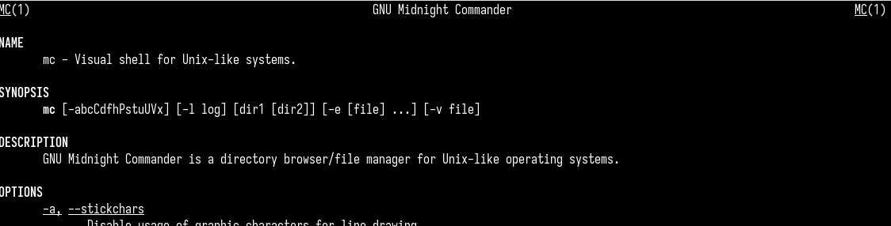{#fig:001 width=70%}

Затем я открываю интерфейс mc, используя команду mc, и изучаю его структуру и навигацию с помощью горячих клавиш (рис. [-@fig:002]).

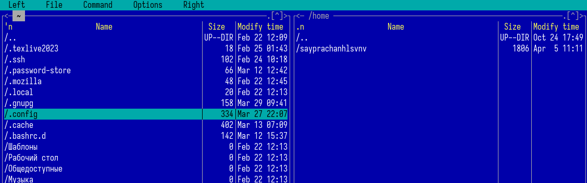{#fig:002 width=70%}

Нажимая Ctrl + t, я выбираю 2 текстовых файла (file.txt и conf.txt) (рис. [-@fig:003]).

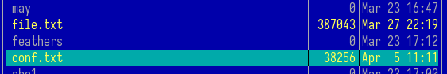{#fig:003 width=70%}

Копирую оба выбранных файла в директорию Documents с помощью клавиши F5, затем открываю другую директорию на второй панели и проверяю содержимое папки Documents (рис. [-@fig:004] и рис. [-@fig:005]).

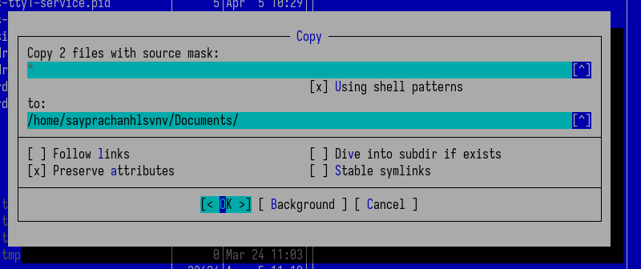{#fig:004 width=70%}

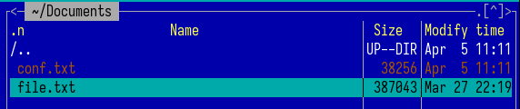{#fig:005 width=70%}

Используя клавишу F6, я перемещаю скопированный текстовый файл conf.txt обратно в домашнюю директорию и даю ему новое имя file1.txt (рис. [-@fig:006]).

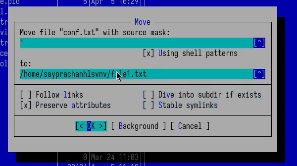{#fig:006 width=70%}

Нажимая Ctrl + x, затем клавишу i на клавиатуре, я отображаю информацию о текстовом файле file.txt (дата, размер файла) (рис. [-@fig:007]).

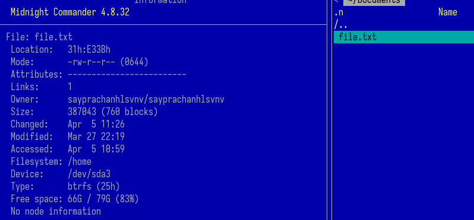{#fig:007 width=70%}

Нажимая Ctrl + x, затем букву c, я отображаю информацию о правах доступа к файлу file.txt (рис. [-@fig:008]).

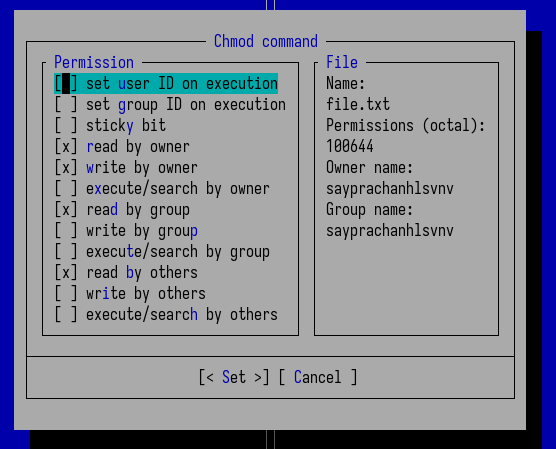{#fig:008 width=70%}

Используя клавишу F8, я удаляю скопированный файл file.txt в директории Documents (рис. [-@fig:009]).

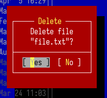{#fig:009 width=70%}

Используя клавишу F3, я просматриваю содержимое файла file1.txt в полноэкранном режиме (рис. [-@fig:010]).

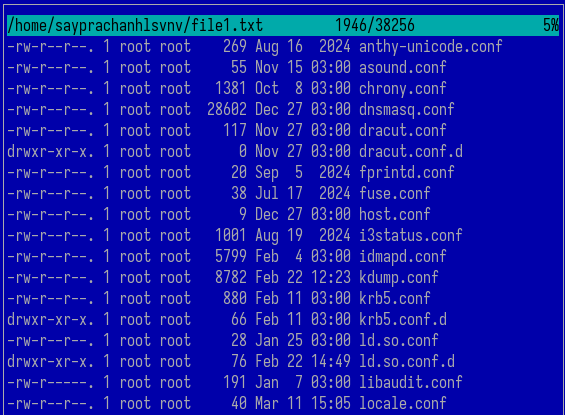{#fig:010 width=70%}

Затем я настраиваю панели так, чтобы справа отображалось содержимое файла file1.txt, а слева — домашняя директория (рис. [-@fig:011]).

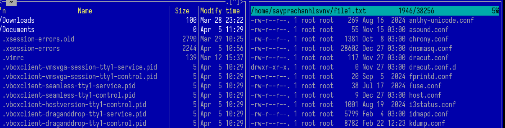{#fig:011 width=70%}

Далее я отображаю дерево директории 'work' на правой панели и сравниваю его с той же директорией, но в другом формате, на левой панели (рис. [-@fig:012]).

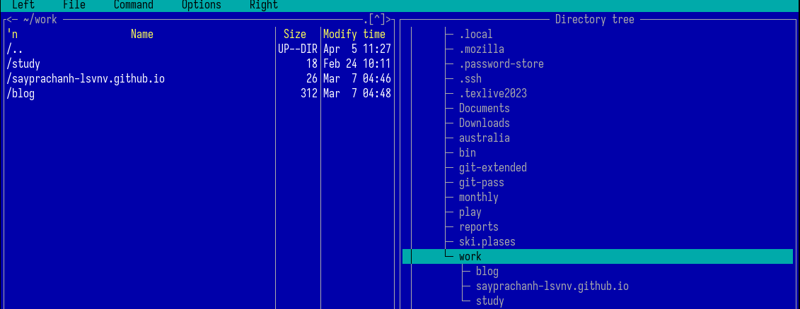{#fig:012 width=70%}

Используя клавишу F4, я открываю файл 'file1.txt' для редактирования и добавляю текст ('hello world') в файл (рис. [-@fig:013])(рис. [-@fig:014]).

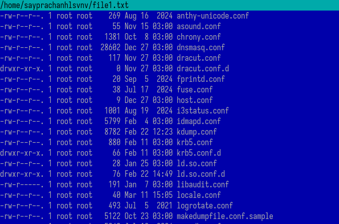{#fig:013 width=70%}

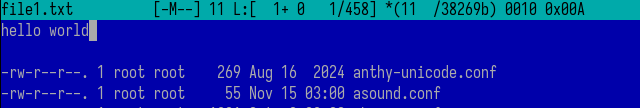{#fig:014 width=70%}

Я закрываю отредактированный файл без сохранения изменений. В результате содержимое файла остаётся неизменным (рис. [-@fig:015]).

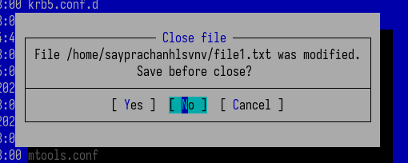{#fig:015 width=70%}

Используя клавишу F7, я создаю новую директорию с именем "HelloWorld" (рис. [-@fig:016]).

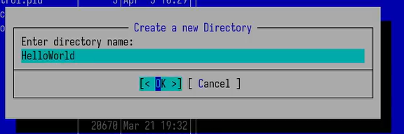{#fig:016 width=70%}

Затем я копирую текстовый файл "file1.txt" в созданную директорию, указав путь в интерфейсе (рис. [-@fig:017]).

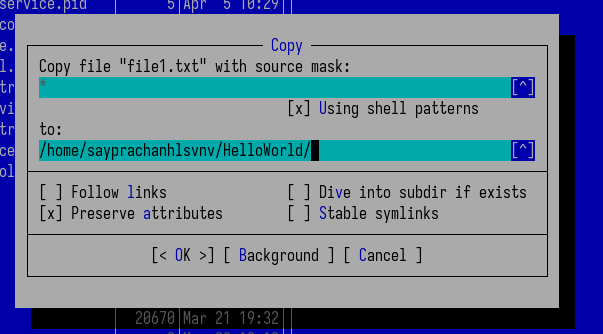{#fig:017 width=70%}

Используя клавишу F9, я перехожу в верхнее меню команд, нахожу раздел поиска файлов и ввожу имя файла, указывая маску "*.txt", что отображает все файлы с расширением .txt (рис. [-@fig:018]).

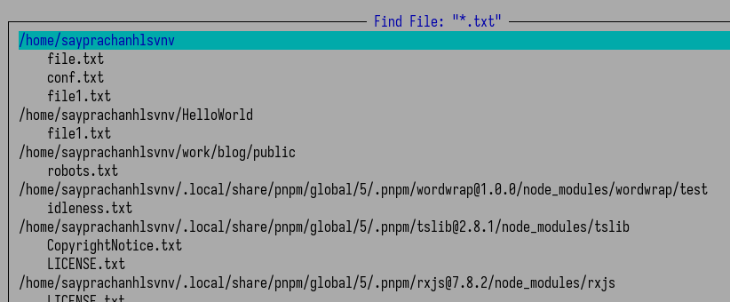{#fig:018 width=70%}

Чтобы повторно использовать предыдущую команду, можно включить историю команд и выбрать нужную команду из истории (рис. [-@fig:019]).

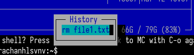{#fig:019 width=70%}

Чтобы вернуться в домашнюю директорию, можно использовать дерево директорий в верхнем меню команд (рис. [-@fig:020]).

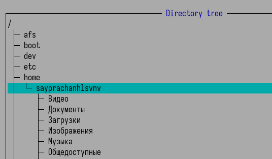{#fig:020 width=70%}

Я открываю файл расширений программы mc для анализа (рис. [-@fig:021]).

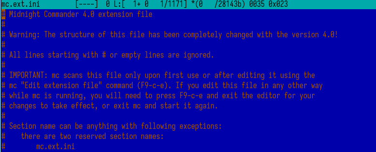{#fig:021 width=70%}

Затем я открываю файл меню для анализа. Меню состоит из двух частей: локальной и пользовательской. В данном случае я анализирую локальное меню (рис. [-@fig:022]).

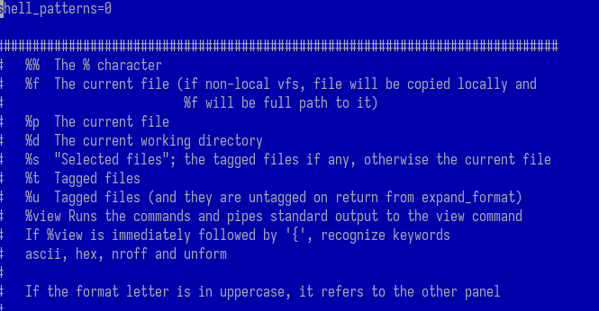{#fig:022 width=70%}

Я вношу изменения в панели и структуру mc. В подменю настроек панелей я включаю отображение скрытых файлов, что позволяет видеть все скрытые файлы во всех директориях (рис. [-@fig:023] и рис. [-@fig:024]).

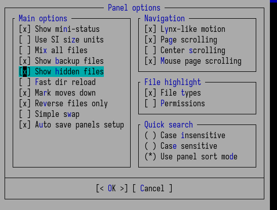{#fig:023 width=70%}

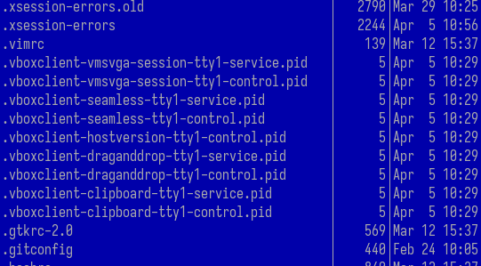{#fig:024 width=70%}

Далее я изменяю структуру интерфейса, переключая его с вертикального на горизонтальный (рис. [-@fig:025]).

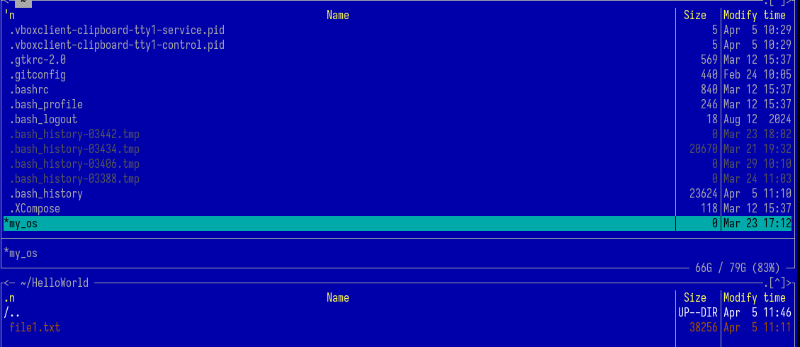{#fig:025 width=70%}

Я изменяю внешний вид интерфейса (рис. [-@fig:026]).

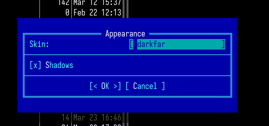{#fig:026 width=70%}

Я отображаю все функциональные клавиши, используемые при работе с интерфейсом (рис. [-@fig:027]).

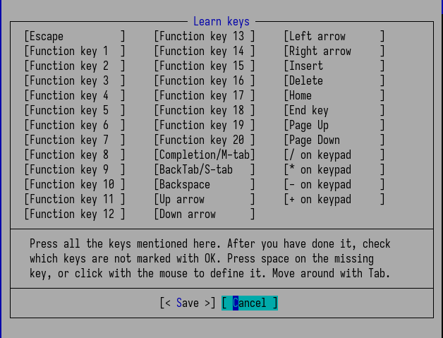{#fig:027 width=70%}

## Задание по встроенному редактору mc

Я создаю текстовый файл 'text.txt' в домашней директории (рис. [-@fig:028]).

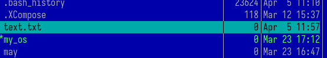{#fig:028 width=70%}

Я копирую случайный текст из файла лабораторная работа 9 и вставляю его в созданный текстовый файл (рис. [-@fig:029]).

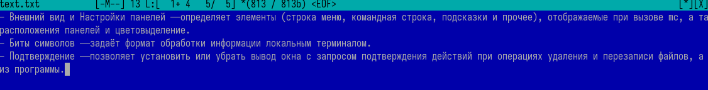{#fig:029 width=70%}

Используя клавишу F8, я удаляю две части текста (рис. [-@fig:030]).

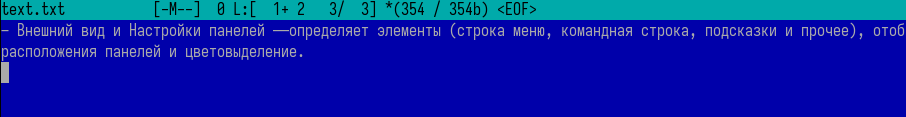{#fig:030 width=70%}

Я перехожу к тексту, выделяю его с помощью клавиши F3, копирую с помощью F5 и вставляю на вторую строку текстового файла, нажав Enter на клавиатуре (рис. [-@fig:031]).

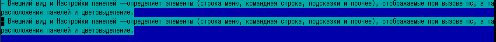{#fig:031 width=70%}

Я выделяю скопированный текст снова с помощью F3, затем перемещаю его, используя F6 и клавиши-стрелки на клавиатуре (рис. [-@fig:032]).

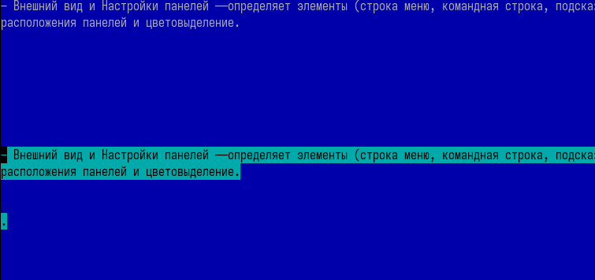{#fig:032 width=70%}

Используя клавишу F2, я сохраняю изменённый текстовый файл 'text.txt' (рис. [-@fig:033]).

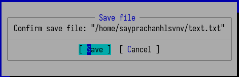{#fig:033 width=70%}

Я пытаюсь отменить действие внутри текстового файла, используя комбинацию клавиш Ctrl + U. В результате изменённый текст возвращается к состоянию до перемещения (рис. [-@fig:034]).

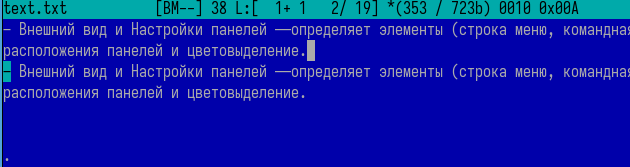{#fig:034 width=70%}

Используя комбинацию клавиш Ctrl + End, я перехожу в конец текстового файла и добавляю несколько строк текста (рис. [-@fig:035]).

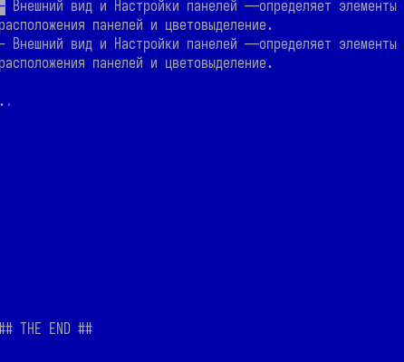{#fig:035 width=70%}

Затем я перехожу в начало файла с помощью комбинации Ctrl + Home и добавляю текст в первую строку (рис. [-@fig:036]).

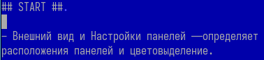{#fig:036 width=70%}

Я сохраняю текстовый файл и выхожу из него с помощью клавиши F10 (рис. [-@fig:037]).

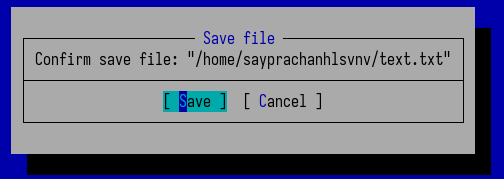{#fig:037 width=70%}

Я открываю исходный текстовый файл на языке программирования. Я открываю файл index.js из программы pnpm, написанный на JavaScript (.js) (рис. [-@fig:038]).

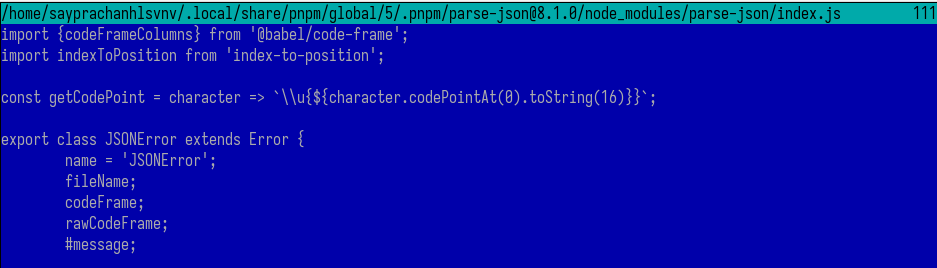{#fig:038 width=70%}

В меню редактора я включаю подсветку синтаксиса для лучшего отображения исходного кода (рис. [-@fig:039]).

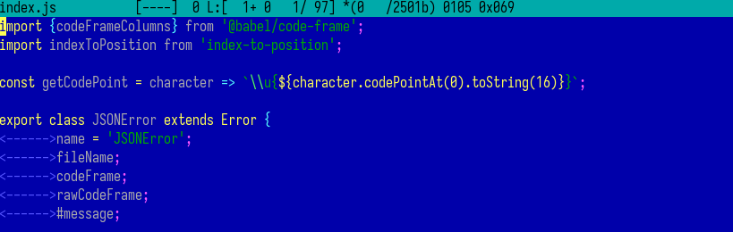{#fig:039 width=70%}

А вот когда я выключаю подсветку синтаксиса. В результате исходный код теряет цветовое выделение команд и функций, что затрудняет чтение (рис. [-@fig:040]).

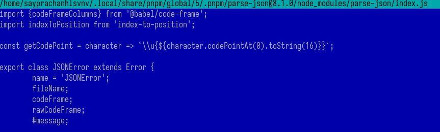{#fig:040 width=70%}

# Выводы

Я освоил основные возможности командной оболочки Midnight Commander (mc). Я приобрел практические навыки работы с каталогами и файлами, включая их просмотр и различные манипуляции.

# Ответы на контрольные вопросы

1. Какие режимы работы есть в mc. Охарактеризуйте их.

Midnight Commander поддерживает несколько режимов работы, которые помогают эффективно управлять файлами:

Двухпанельный режим – основной режим, где одновременно отображаются две панели (левая и правая) для удобного копирования, перемещения и сравнения файлов.

Командная строка – внизу экрана доступна строка для ввода shell-команд (можно быстро переключаться клавишей Ctrl+O).

Режим просмотра (F3) – позволяет просматривать содержимое файлов без редактирования.

Режим редактирования (F4) – встроенный текстовый редактор для изменения файлов.

Режим быстрого просмотра (Ctrl+Q) – показывает информацию о выделенном файле в отдельной панели.

2. Какие операции с файлами можно выполнить как с помощью команд shell, так и с помощью меню (комбинаций клавиш) mc? Приведите несколько примеров.

В mc можно выполнять те же действия, что и через терминал, но с удобным интерфейсом:

Копирование – F5 (аналог cp в терминале).

Перемещение / Переименование – F6 (аналог mv).

Удаление – F8 (аналог rm).

Создание каталога – F7 (аналог mkdir).

Поиск файлов – Alt+? (аналог find или locate).

Изменение прав доступа – Ctrl+X C (аналог chmod).

3. Опишите структура меню левой (или правой) панели mc, дайте характеристику командам.

Меню вызывается через Ctrl+X или кнопку мыши и включает:

Просмотр (F3) – быстрое чтение файла.

Редактирование (F4) – изменение файла во встроенном редакторе.

Копирование (F5) – дублирование файла/каталога.

Ссылка – создание жёстких/символических ссылок.

Права доступа (Ctrl+X C) – настройка chmod/chown.

Информация – просмотр метаданных файла (размер, дата, права).
Формат списка – настройка отображения (краткий, расширенный, дерево).

4. Опишите структура меню Файл mc, дайте характеристику командам.

Доступно через F9 → Файл:

Просмотр (F3) – открыть файл для чтения.

Просмотр в формате… – выбор кодировки.

Правка (F4) – редактирование.

Копирование (F5) – копировать в другую панель.

Переименование / перемещение (F6).

Создание каталога (F7).

Удаление (F8).

Ссылка – создание жёсткой/символической ссылки.
Права доступа – изменение chmod/chown.

5. Опишите структура меню Команда mc, дайте характеристику командам.

Доступно через F9 → Команда:

Поиск файла (Alt+?) – поиск по маске.

История команд – просмотр выполненных команд.

Каталоги быстрого доступа (Ctrl+\) – закладки.

Расширенный фильтр – отбор файлов по критериям.

Сравнение каталогов – Ctrl+X D (аналог diff).

Внешняя панель – подключение FTP/SFTP.

Редактировать файл расширений – настройка ассоциаций файлов.

6. Опишите структура меню Настройки mc, дайте характеристику командам.

Доступно через F9 → Настройки:

Конфигурация – основные параметры mc.

Внешний вид – настройка цветов и шрифтов.

Поведение – автозавершение, подтверждение действий.

Панели – настройка отображения (полный/краткий список).

Распознавание клавиатуры – для разных терминалов.

Сохранить настройки – запись конфига в ~/.config/mc/ini.

7. Назовите и дайте характеристику встроенным командам mc.

cd – смена каталога.

help (F1) – справка.

select/unselect (Insert) – выделение файлов.

quick view (Ctrl+Q) – быстрый просмотр.

history (Alt+H) – история команд.

hotlist (Ctrl+\) – избранные каталоги.

8. Назовите и дайте характеристику командам встроенного редактора mc.

Сохранение (F2).

Поиск (F7).

Замена (F4).

Отмена (Ctrl+U).

Копирование/вставка (Ctrl+Ins, Shift+Ins).

Переход к строке (Ctrl+G).

9. Дайте характеристику средствам mc, которые позволяют создавать меню, определяемые пользователем.

Можно создавать через:

~/.config/mc/menu – редактирование файла меню.

F2 → Меню пользователя – добавление своих команд.

10. Дайте характеристику средствам mc, которые позволяют выполнять действия, определяемые пользователем, над текущим файлом

Настраиваются через:

Редактор расширений (F9 → Команда → Редактировать файл расширений).
Можно привязать горячие клавиши или команды к определённым типам файлов (например, открывать .txt в nano).

# Список литературы{.unnumbered}

[Лабораторная работа №9](https://esystem.rudn.ru/pluginfile.php/2586870/mod_resource/content/5/007-lab_mc.pdf)

::: {#refs}
:::
