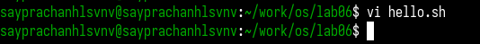
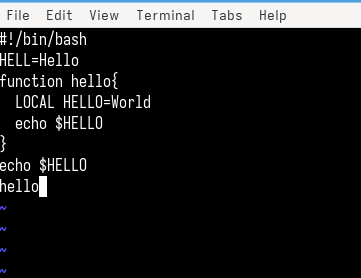
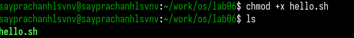
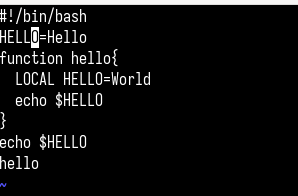
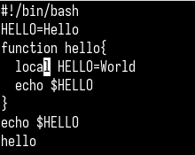
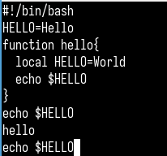
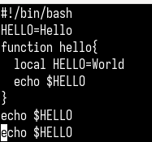
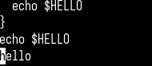

---
## Front matter
lang: ru-RU
title: Лабораторная работа №10
subtitle: Операционные системы
author:
  - Луангсуваннавонг Сайпхачан
institute:
  - Российский университет дружбы народов, Москва, Россия
date: 18 апреля 2025

## i18n babel
babel-lang: russian
babel-otherlangs: english

## Formatting pdf
toc: false
toc-title: Содержание
slide_level: 2
aspectratio: 169
section-titles: true
theme: metropolis
header-includes:
 - \metroset{progressbar=frametitle,sectionpage=progressbar,numbering=fraction}
---

# Информация

## Докладчик

:::::::::::::: {.columns align=center}
::: {.column width="70%"}

  * Луангсуваннавонг Сайпхачан
  * Студент из группы НКАбд-01-24
  * Российский университет дружбы народов
  * <https://sayprachanh-lsvnv.github.io>

:::
::: {.column width="30%"}
:::
::::::::::::::

## Цель работы

Познакомиться с операционной системой Linux. Получить практические навыки работы с редактором vi, установленным по умолчанию практически во всех дистрибутивах.

## Задание

1. Ознакомиться с теоретическим материалом.
2. Ознакомиться с редактором vi.
3. Выполнить упражнения, используя команды vi.

# Выполнение лабораторной работы

## Создание нового файла с использованием vi

Я создаю новый каталог 'os', затем его подкаталог 'lab06' в директории 'work' (рис. 1)

## Создание нового файла с использованием vi

Я запускаю vi, используя команду vi, затем создаю файл с именем 'hello.sh' (рис. 2)

## Создание нового файла с использованием vi

Нажимая букву 'i', я перехожу из командного режима (по умолчанию) в режим вставки в текстовом редакторе vi.
Затем я ввожу текст кода в файл hello.sh (рис. 3)

## Создание нового файла с использованием vi

Я возвращаюсь в командный режим, нажав клавишу 'ESC', затем ввожу символ ':' с буквами 'w' и 'q' для сохранения изменений
и выхода из файла (рис. 4)

## Создание нового файла с использованием vi

Я делаю файл hello.sh исполняемым с помощью команды chmod, добавляя право на выполнение файла (рис. 5)

## Редактирование существующего файла

Я снова открываю файл hello.sh в текстовом редакторе vi (рис. 6)

## Редактирование существующего файла

Я перемещаю курсор с помощью клавиш со стрелками в конец слова 'HELL', затем изменяю его на 'HELLO' в режиме вставки (рис. 7)

## Редактирование существующего файла

Я перехожу на следующую строку, изменяю слово 'LOCAL' на 'local' в режиме вставки, затем возвращаюсь в командный режим (рис. 8)

## Редактирование существующего файла

Нажав букву 'G' на клавиатуре в командном режиме, я перехожу в конец файла, затем переключаюсь в режим вставки и добавляю новый текст в файл (echo $HELLO) (рис. 9)

## Редактирование существующего файла

Я удаляю предыдущую последнюю строку файла, нажав букву 'd' в командном режиме (рис. 10)

## Редактирование существующего файла

Нажав букву 'u' в командном режиме, я отменяю команду удаления (удаление предыдущей последней строки) (рис. 11)

## Редактирование существующего файла

Я сохраняю изменения в файле, затем выхожу из файла, введя символ ':', за которым следуют буквы w и q (рис. 12)

## Выводы

Во время этой лабораторной работы я познакомился с операционной системой Linux.
Получил практические навыки работы с редактором vi, установленным по умолчанию практически во всех дистрибутивах

# Спасибо за внимание

