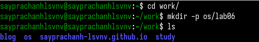
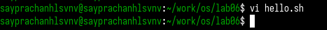
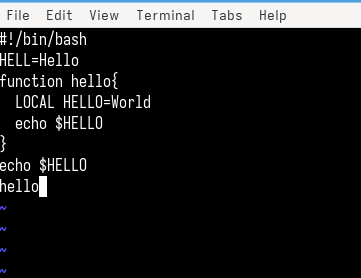
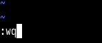
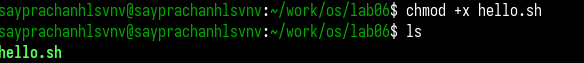
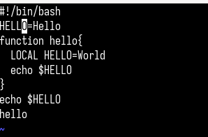
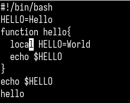
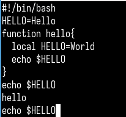
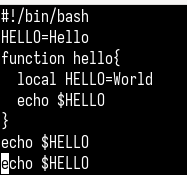
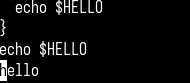

---
## Front matter
title: "Отчёт по лабораторной работе №10"
subtitle: "Операционные системы"
author: "Луангсуваннавонг Сайпхачан"

## Generic otions
lang: ru-RU
toc-title: "Содержание"

## Bibliography
bibliography: bib/cite.bib
csl: pandoc/csl/gost-r-7-0-5-2008-numeric.csl

## Pdf output format
toc: true # Table of contents
toc-depth: 2
lof: true # List of figures
lot: true # List of tables
fontsize: 12pt
linestretch: 1.5
papersize: a4
documentclass: scrreprt
## I18n polyglossia
polyglossia-lang:
  name: russian
  options:
	- spelling=modern
	- babelshorthands=true
polyglossia-otherlangs:
  name: english
## I18n babel
babel-lang: russian
babel-otherlangs: english
## Fonts
mainfont: IBM Plex Serif
romanfont: IBM Plex Serif
sansfont: IBM Plex Sans
monofont: IBM Plex Mono
mathfont: STIX Two Math
mainfontoptions: Ligatures=Common,Ligatures=TeX,Scale=0.94
romanfontoptions: Ligatures=Common,Ligatures=TeX,Scale=0.94
sansfontoptions: Ligatures=Common,Ligatures=TeX,Scale=MatchLowercase,Scale=0.94
monofontoptions: Scale=MatchLowercase,Scale=0.94,FakeStretch=0.9
mathfontoptions:
## Biblatex
biblatex: true
biblio-style: "gost-numeric"
biblatexoptions:
  - parentracker=true
  - backend=biber
  - hyperref=auto
  - language=auto
  - autolang=other*
  - citestyle=gost-numeric
## Pandoc-crossref LaTeX customization
figureTitle: "Рис."
tableTitle: "Таблица"
listingTitle: "Листинг"
lofTitle: "Список иллюстраций"
lotTitle: "Список таблиц"
lolTitle: "Листинги"
## Misc options
indent: true
header-includes:
  - \usepackage{indentfirst}
  - \usepackage{float} # keep figures where there are in the text
  - \floatplacement{figure}{H} # keep figures where there are in the text
---

# Цель работы

Познакомиться с операционной системой Linux. Получить практические навыки работы с редактором vi, установленным по умолчанию практически во всех дистрибутивах

# Задание

1. Ознакомиться с теоретическим материалом.
2. Ознакомиться с редактором vi.
3. Выполнить упражнения, используя команды vi.

# Теоретическое введение

В большинстве дистрибутивов Linux в качестве текстового редактора по умолчанию
устанавливается интерактивный экранный редактор vi (Visual display editor).
Редактор vi имеет три режима работы:

– командный режим — предназначен для ввода команд редактирования и навигации по
редактируемому файлу;

– режим вставки — предназначен для ввода содержания редактируемого файла;

– режим последней (или командной) строки — используется для записи изменений в файл
и выхода из редактора.

Для вызова редактора vi необходимо указать команду vi и имя редактируемого файла:
vi <имя_файла>

При этом в случае отсутствия файла с указанным именем будет создан такой файл.
Переход в командный режим осуществляется нажатием клавиши Esc . Для выхода из
редактора vi необходимо перейти в режим последней строки: находясь в командном
режиме, нажать Shift-; (по сути символ : — двоеточие), затем:

– набрать символы wq, если перед выходом из редактора требуется записать изменения
в файл;

– набрать символ q (или q!), если требуется выйти из редактора без сохранения.
Замечание. Следует помнить, что vi различает прописные и строчные буквы при наб

# Выполнение лабораторной работы

## Создание нового файла с использованием vi

Сначала я создаю новый каталог в каталоге work и называю его os, затем создаю вложенный подкаталог lab06, после чего перехожу в созданный каталог (рис. [-@fig:001])

{#fig:001 width=70%}

С помощью команды vi я запускаю текстовый редактор vi, затем создаю новый файл, давая ему имя hello.sh (рис. [-@fig:002])

{#fig:002 width=70%}

Я перехожу в режим вставки в текстовом редакторе vi, затем ввожу bash-код в файл, нажав клавишу i на клавиатуре — это переводит меня из командного режима в режим вставки для ввода текста в файл (рис. [-@fig:003])

{#fig:003 width=70%}

Затем я возвращаюсь в командный режим, нажав клавишу ESC на клавиатуре, затем ввожу символ :, за которым следуют буквы w и q, чтобы сохранить изменения в файле и выйти из него (рис. [-@fig:004])

{#fig:004 width=70%}

С помощью команды chmod я изменяю права доступа к файлу hello.sh, добавляя право на выполнение, чтобы сделать файл исполняемым (рис. [-@fig:005])

{#fig:005 width=70%}

## Редактирование существующего файла

Я снова открываю файл hello.sh в текстовом редакторе vi (рис. [-@fig:006])

{#fig:006 width=70%}

Я перемещаю курсор с помощью стрелок к концу слова "HELL" во второй строке, перехожу в режим вставки и изменяю слово на "HELLO", затем нажимаю ESC, чтобы вернуться в командный режим (рис. [-@fig:007])

{#fig:007 width=70%}

Перехожу на следующую строку и меняю слово "LOCAL" на "local" в режиме вставки. После завершения редактирования возвращаюсь в командный режим (рис. [-@fig:008])

{#fig:008 width=70%}

В командном режиме, нажав клавишу G, я перемещаюсь в конец файла, затем перехожу в режим вставки и добавляю новую строку в файл (echo $HELLO). После завершения ввода возвращаюсь в командный режим (рис. [-@fig:009])

{#fig:009 width=70%}

В командном режиме, нажав клавишу d, я удаляю последнюю строку файла, предварительно перейдя на неё с помощью стрелок (рис. [-@fig:010])

{#fig:010 width=70%}

Нажав клавишу u в командном режиме, я отменяю последнее действие (удаление предыдущей последней строки) (рис. [-@fig:011])

{#fig:011 width=70%}

Я ввожу символ :, затем буквы w и q, чтобы сохранить изменения и выйти из файла (рис. [-@fig:012])

{#fig:012 width=70%}

# Выводы

 Во время этой лабораторной работы я познакомился с операционной системой Linux. Получил практические навыки работы с редактором vi, установленным по умолчанию практически во всех дистрибутивах

# Ответы на контрольные вопросы

1. Дайте краткую характеристику режимам работы редактора vi.

Редактор vi работает в три режима. Первый — командный режим (Command Mode), где можно двигаться по тексту и использовать команды. Второй — режим вставки (Insert Mode),
он нужен чтобы писать текст (включается с i, a, o). Третий — это режим последней строки (Last line Mode), когда пишем : и используем команды для сохранения, выхода, поиска.

2. Как выйти из редактора, не сохраняя произведённые изменения?

Надо нажать Esc, потом написать :q! и нажать Enter. Это выход без сохранить. Ещё можно использовать ZQ.

3. Назовите и дайте краткую характеристику командам позиционирования.

h, j, k, l — двигаться по символам (влево, вниз, вверх, вправо).

0, ^, $ — начало строки, первый символ, конец строки.

w, b, e — переход по словам.

gg, G, nG — начало файла, конец, и строка номер n.

4. Что для редактора vi является словом?

Слово — это буквы, цифры и подчёркивание. Но если использовать W, B, тогда считается как любое символы до пробела. Например, foo-bar — может быть одно слово или два, зависит от команды.

5. Каким образом из любого места редактируемого файла перейти в начало (конец) файла?

Чтобы в начало файла: команда gg или 1G.

Чтобы в конец: команда G.

А если нужно точная строка: пишем :номер.

6. Назовите и дайте краткую характеристику основным группам команд редактирования.

Вставка: i, a, o — для писать текст.

Удаление: x — символ, dd — строка, dw — слово.

Копия и вставка: yy, yw, p.

Замена: r — символ, cw — слово, R — замена режим.

7. Необходимо заполнить строку символами $. Каковы ваши действия?

Сначала в командный режим (нажать Esc), потом написать 80i$, и Esc.
Можно ещё сделать :s/^.*$/$$$$$$$/, тогда строка заменится на $.

8. Как отменить некорректное действие, связанное с процессом редактирования?

u — отмена последнего действия.

Ctrl+r — вернуть обратно.

U — отмена изменений в строке.

9. Назовите и дайте характеристику основным группам команд режима последней строки.

Файл: :w — сохранить, :q — выйти, :q! — выйти без сохранить.

Поиск и замена: :/текст, :%s/старый/новый/g.

Настройки: :set number, :set ignorecase.

10. Как определить, не перемещая курсора, позицию, в которой заканчивается строка?

Можно нажать $, курсор покажет конец.
Если включить :set ruler, тогда всегда видно позиция курсора.

11. Выполните анализ опций редактора vi (сколько их, как узнать их назначение и т.д.).

Показать все опции: :set all.

Справка по опции: :help 'имя_опции'.

Примеры: :set number, :set nowrap.
Опций очень много, они меняют поведение vi.

12. Как определить режим работы редактора vi?

Командный режим — когда нет текста внизу.

Режим вставки — написано -- INSERT --.

Режим последней строки — видно : или / внизу.

13. Постройте граф взаимосвязи режимов работы редактора vi.

Командный режим (Command mode)

|
| - i, a, o →  Режим вставки (Insert) → Esc → Командный режим

|

|- :, / →  Режим последней строки (Ex) → Enter → Командный режим

# Список литературы{.unnumbered}

[Лабораторная работа №10](https://esystem.rudn.ru/pluginfile.php/2586872/mod_resource/content/4/008-lab_vi.pdf)

::: {#refs}
:::
