---
## Front matter
lang: ru-RU
title: Лабораторная работа №11
subtitle: Операционные системы
author:
  - Луангсуваннавонг Сайпхачан
institute:
  - Российский университет дружбы народов, Москва, Россия
date: 23 апреля 2025

## i18n babel
babel-lang: russian
babel-otherlangs: english

## Formatting pdf
toc: false
toc-title: Содержание
slide_level: 2
aspectratio: 169
section-titles: true
theme: metropolis
header-includes:
 - \metroset{progressbar=frametitle,sectionpage=progressbar,numbering=fraction}
---

# Информация

## Докладчик

:::::::::::::: {.columns align=center}
::: {.column width="70%"}

  * Луангсуваннавонг Сайпхачан
  * Студент из группы НКАбд-01-24
  * Российский университет дружбы народов
  * <https://sayprachanh-lsvnv.github.io>

:::
::: {.column width="30%"}
:::
::::::::::::::

## Цель работы

Познакомиться с операционной системой Linux. Получить практические навыки работы с редактором Emacs.

## Задание

1. Ознакомиться с теоретическим материалом.
2. Ознакомиться с редактором emacs.
3. Выполнить упражнения.
4. Ответить на контрольные вопросы.

# Выполнение лабораторной работы

## Основные команды emacs

Я запускаю emacs через терминал (рис. 1)

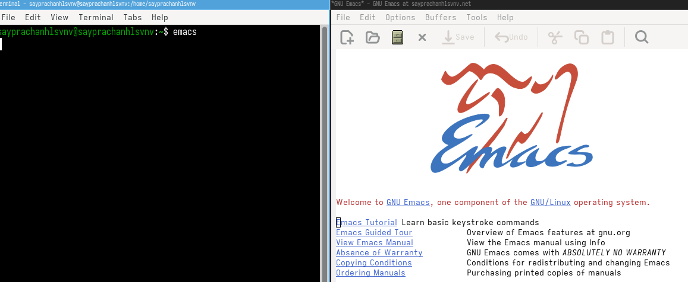

## Основные команды emacs

С помощью Ctrl-x Ctrl-f (C-x C-f) создаю файл lab07.sh (рис. 2)

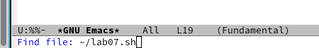

## Основные команды emacs

Добавляю текстовый код в файл lab07.sh (рис. 3)

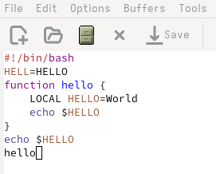

## Основные команды emacs

Сохраняю файл комбинацией Ctrl-x Ctrl-s (C-x C-s) (рис. 4)

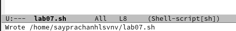

## Основные команды emacs

Используя Ctrl-k (C-k), вырезаю целую строку (рис. 5)

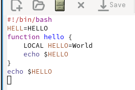

## Основные команды emacs

Вырезаю другую строку, затем вставляю её в конец файла комбинацией Ctrl-y (C-y) (рис. 6)

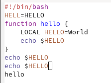

## Основные команды emacs

Выделяю область текста с помощью Ctrl-space (C-space), затем копирую её комбинацией Alt-w или End-w (M-w) (рис. 7)

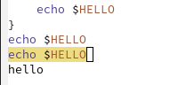

## Основные команды emacs

Затем вставляю скопированный текст в конец файла с помощью Ctrl-y (C-y) (рис. 8)

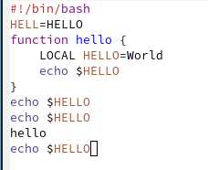

## Основные команды emacs

Снова выделяю текст и вырезаю его комбинацией Ctrl-w (C-w) (рис. 9)

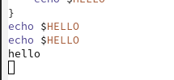

## Основные команды emacs

Для отмены последнего действия использую Ctrl-/ (C-/) (рис. 10 и рис. 11)

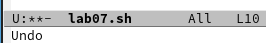

## Основные команды emacs

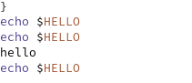

## Основные команды emacs

Перемещаю курсор в начало строки с помощью Ctrl-a (C-a) (рис. 12)

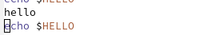

## Основные команды emacs

Перемещаю курсор в конец строки комбинацией Ctrl-e (C-e) (рис. 13)

## Основные команды emacs

Используя Alt-< или Esc-< (M-<), перемещаю курсор в начало буфера (рис. 14)

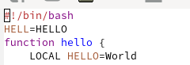

## Основные команды emacs

С помощью Alt-> или Esc-> (M->) перемещаю курсор в конец буфера (рис. 15)

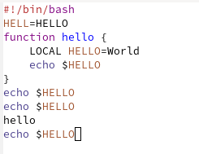

## Управление буферами

Комбинацией Ctrl-x Ctrl-b (C-x C-b) отображаю список активных буферов, затем переключаюсь между ними с помощью Ctrl-x и буквы o (Ctrl-x o) (рис. 16)

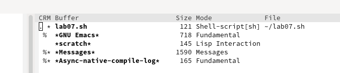

## Управление буферами

Закрываю список активных буферов комбинацией Ctrl-x с цифрой 0 (Ctrl-x 0) (рис. 17)

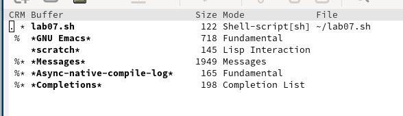

## Управление буферами

Переключаюсь между буферами без отображения списка с помощью Ctrl-x и буквы b (Ctrl-x b). Переключаюсь на буфер (Buffer List) (рис. 18 и рис. 19)

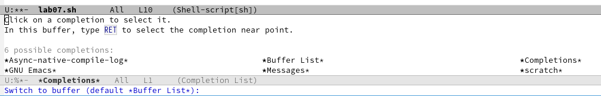

## Управление буферами

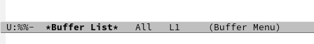

## Управление окнами

Возвращаюсь к lab07.sh, затем с помощью Ctrl-x с цифрой 3 (Ctrl-x 3) делю фрейм буфера по вертикали, а комбинацией Ctrl-x с цифрой 2 (Ctrl-x 2) — по горизонтали (рис. 20)

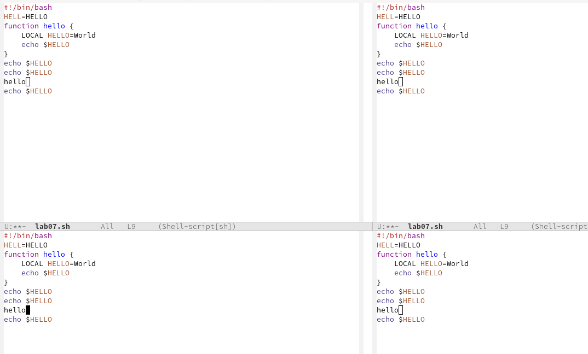

## Управление окнами

Открываю новый буфер в каждом из четырёх окон и ввожу текст (рис. 21)

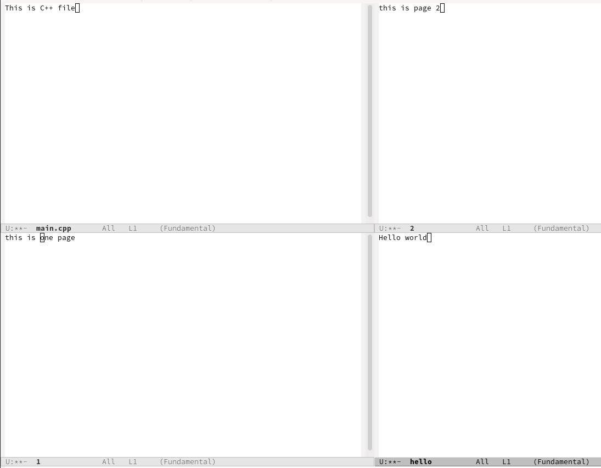

## Режим поиска

Активирую режим поиска комбинацией Ctrl-s (C-s), нахожу несколько слов в тексте (рис. 22)

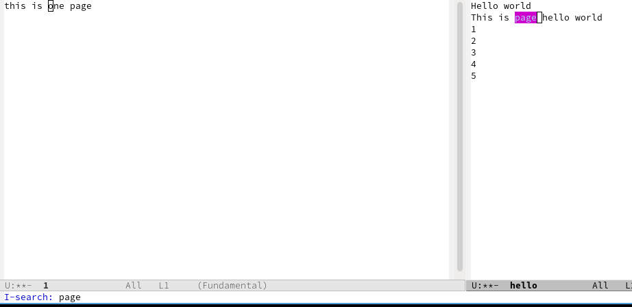

## Управление окнами

(Добавляю ещё текст для дополнительного поиска) (рис. 23)

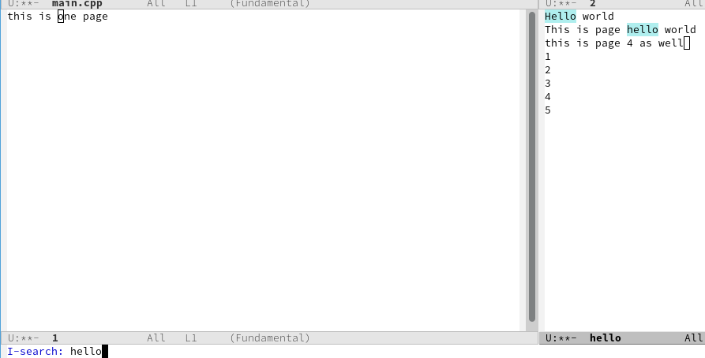

## Управление окнами

Переключаюсь между результатами поиска с помощью Ctrl-S (C-S) (рис. 24)

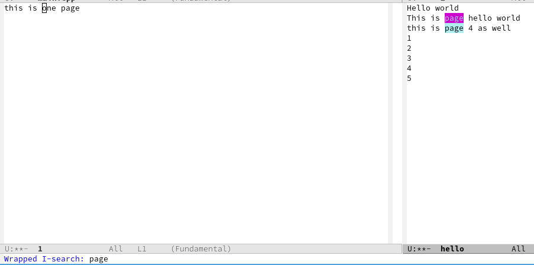

## Управление окнами

Выхожу из режима поиска комбинацией Ctrl-g (C-g) (рис. 25)

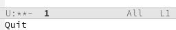

## Управление окнами

Активирую режим поиска и замены комбинацией Alt-% или Esc-% (M-%), ввожу текст для замены, затем текст замены и нажимаю Enter для применения (рис. 26)

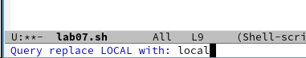

## Управление окнами

Проверяю результат — текст был заменён ('Local' -> 'local') (рис. 27)

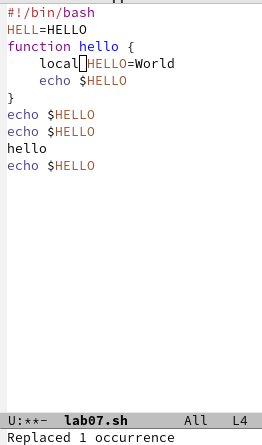

## Управление окнами

Используя Alt-s или Esc-s с буквой o (M-s o), пробую другой режим поиска: ввожу искомый текст, и результаты отображаются в отдельном окне (не в основном буфере) (рис. 28)

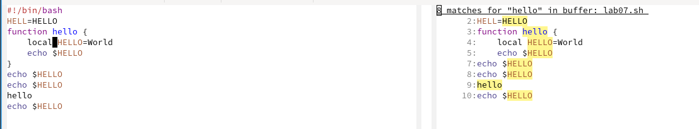

## Выводы

Я познакомился с операционной системой Linux и получил практические навыки работы с редактором Emacs

# Спасибо за внимание

