---
## Front matter
title: "Отчёт по лабораторной работе №11"
subtitle: "Операционные системы"
author: "Луангсуваннавонг Сайпхачан"

## Generic otions
lang: ru-RU
toc-title: "Содержание"

## Bibliography
bibliography: bib/cite.bib
csl: pandoc/csl/gost-r-7-0-5-2008-numeric.csl

## Pdf output format
toc: true # Table of contents
toc-depth: 2
lof: true # List of figures
lot: true # List of tables
fontsize: 12pt
linestretch: 1.5
papersize: a4
documentclass: scrreprt
## I18n polyglossia
polyglossia-lang:
  name: russian
  options:
	- spelling=modern
	- babelshorthands=true
polyglossia-otherlangs:
  name: english
## I18n babel
babel-lang: russian
babel-otherlangs: english
## Fonts
mainfont: IBM Plex Serif
romanfont: IBM Plex Serif
sansfont: IBM Plex Sans
monofont: IBM Plex Mono
mathfont: STIX Two Math
mainfontoptions: Ligatures=Common,Ligatures=TeX,Scale=0.94
romanfontoptions: Ligatures=Common,Ligatures=TeX,Scale=0.94
sansfontoptions: Ligatures=Common,Ligatures=TeX,Scale=MatchLowercase,Scale=0.94
monofontoptions: Scale=MatchLowercase,Scale=0.94,FakeStretch=0.9
mathfontoptions:
## Biblatex
biblatex: true
biblio-style: "gost-numeric"
biblatexoptions:
  - parentracker=true
  - backend=biber
  - hyperref=auto
  - language=auto
  - autolang=other*
  - citestyle=gost-numeric
## Pandoc-crossref LaTeX customization
figureTitle: "Рис."
tableTitle: "Таблица"
listingTitle: "Листинг"
lofTitle: "Список иллюстраций"
lotTitle: "Список таблиц"
lolTitle: "Листинги"
## Misc options
indent: true
header-includes:
  - \usepackage{indentfirst}
  - \usepackage{float} # keep figures where there are in the text
  - \floatplacement{figure}{H} # keep figures where there are in the text
---

# Цель работы

Познакомиться с операционной системой Linux. Получить практические навыки работы с редактором Emacs.

# Задание

1. Ознакомиться с теоретическим материалом.
2. Ознакомиться с редактором emacs.
3. Выполнить упражнения.
4. Ответить на контрольные вопросы.

# Теоретическое введение

Emacs (Editor MACroS) — один из самых гибких и настраиваемых текстовых редакторов, изначально разработанный Ричардом Столлманом в 1970-х годах в рамках проекта GNU.
Он быстро вышел за рамки обычного редактора, превратившись в полноценную рабочую среду, включающую инструменты для программирования, написания документов, чтения почты, управления файлами и даже игр.

Основу архитектуры Emacs составляет язык Emacs Lisp — диалект Lisp, который позволяет пользователям настраивать, автоматизировать и расширять практически любой аспект редактора.
Большая часть интерфейса и функций написана именно на Elisp, тогда как базовая система реализована на C.

Ключевые особенности:

Буферно-ориентированная работа — данные обрабатываются в буферах, которые могут содержать файлы, результаты команд, терминалы и другое.

Режимы (modes) — специальные режимы под разные типы задач: от org-mode для заметок до python-mode для программирования.

Интегрированная среда — поддержка компиляции, контроля версий (например, через Magit), терминала и отладки в рамках одного окна.

Несмотря на высокую кривую обучения (необычные сочетания клавиш и необходимость изучения Elisp),
Emacs остаётся любимым инструментом разработчиков и продвинутых пользователей благодаря своей гибкости, расширяемости и философии «редактор, подстраивающийся под пользователя».
Он объединяет принципы UNIX-инструментария в рамках одной мощной, программируемой среды.

# Выполнение лабораторной работы

## Основные команды emacs

Я устанавливаю и запускаю emacs через терминал (рис. [-@fig:001])

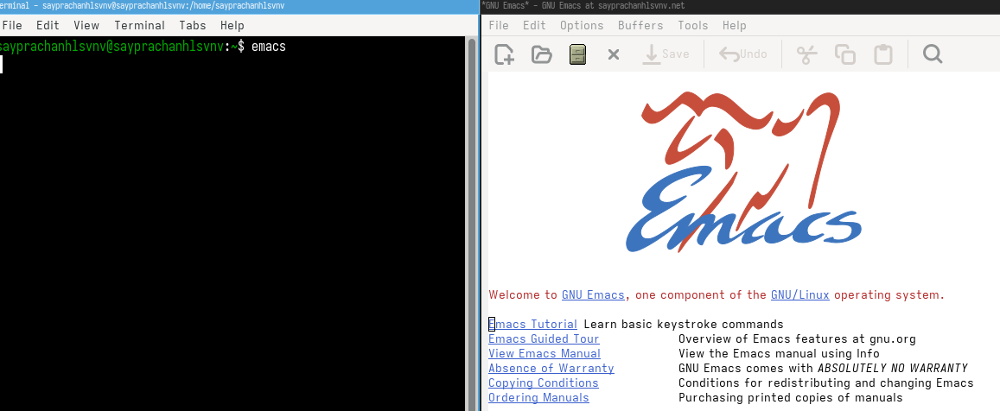{#fig:001 width=70%}

Используя комбинацию клавиш Ctrl-x Ctrl-f (C-x C-f), я создаю файл lab07.sh (Поскольку он не находит файл, создается новый) (рис. [-@fig:002])

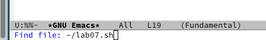{#fig:002 width=70%}

Добавляю текстовый код в файл lab07.sh (рис. [-@fig:003])

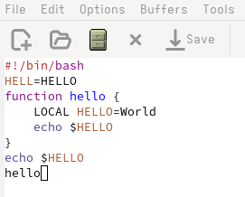{#fig:003 width=70%}

Сохраняю файл lab07.sh комбинацией Ctrl-x Ctrl-s (C-x C-s) (рис. [-@fig:004])

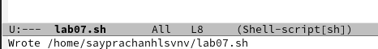{#fig:004 width=70%}

Вырезаю целую строку командой Ctrl-k (C-k) (рис. [-@fig:005])

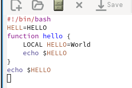{#fig:005 width=70%}

Пытаюсь вырезать другую строку, затем вставляю её в конец файла lab07.sh командой Ctrl-y (C-y) (рис. [-@fig:006])

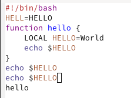{#fig:006 width=70%}

Для выделения области текста использую комбинацию Ctrl-space (C-space), затем копирую выделенный текст командой Alt-w или End-w (M-w) (рис. [-@fig:007])

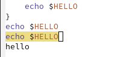{#fig:007 width=70%}

Снова используя Ctrl-y (C-y), вставляю скопированный текст в конец файла (рис. [-@fig:008])

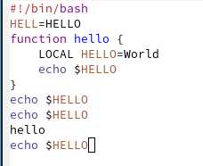{#fig:008 width=70%}

Выделяю вставленный текст в конце файла и вырезаю его командой Ctrl-w (C-w) (рис. [-@fig:009])

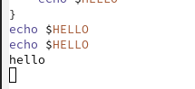{#fig:009 width=70%}

Отменяю предыдущее действие комбинацией Ctrl-/ (C-/), и мы видим, что текст возвращается к исходному состоянию до вырезания (рис. [-@fig:010] и рис. [-@fig:011])

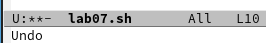{#fig:010 width=70%}

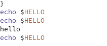{#fig:011 width=70%}

Перемещаю курсор в начало строки командой Ctrl-a (C-a) (рис. [-@fig:012])

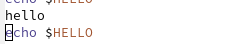{#fig:012 width=70%}

Затем перемещаю курсор в конец строки комбинацией Ctrl-e (C-e) (рис. [-@fig:013])

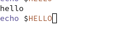{#fig:013 width=70%}

Перемещаю курсор в начало буфера (файла) с помощью Alt-< или Esc-< (M-<) (рис. [-@fig:014])

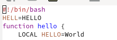{#fig:014 width=70%}

Далее, используя Alt-> или Esc-> (M->), перемещаю курсор в конец файла (рис. [-@fig:015])

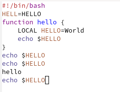{#fig:015 width=70%}

## Управление буферами

Отображаю список активных буферов на экране комбинацией Ctrl-x Ctrl-b (C-x C-b), затем переключаюсь между буфером lab07.sh и списком активных буферов командой Ctrl-x и буквой o (Ctrl-x o) (рис. [-@fig:016])

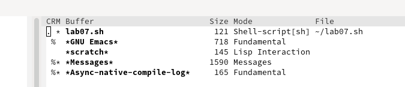{#fig:016 width=70%}

Закрываю вкладку со списком буферов комбинацией Ctrl-x и цифрой 0 (Ctrl-x 0) (рис. [-@fig:017])

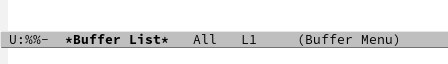{#fig:017 width=70%}

Переключаюсь между буферами без отображения их списка на экране с помощью Ctrl-x и буквы b (C-x b), выбираю нужный буфер (Buffer List) (рис. [-@fig:018] и рис. [-@fig:019])

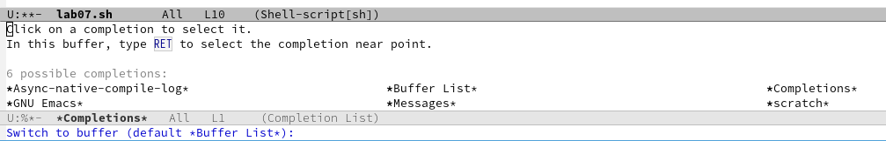{#fig:018 width=70%}

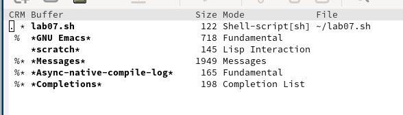{#fig:019 width=70%}

## Управление окнами

Возвращаюсь к буферу lab07.sh, затем разделяю фрейм на 4 части: комбинацией Ctrl-x с цифрой 3 (C-x 3) делю окна по вертикали, а с помощью Ctrl-x с цифрой 2 (C-x 2) — по горизонтали (рис. [-@fig:020])

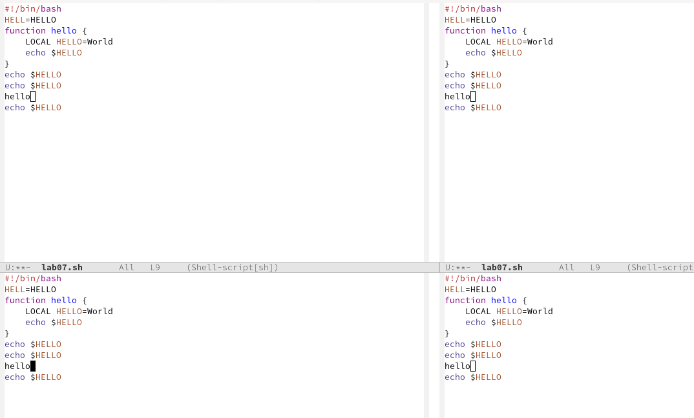{#fig:020 width=70%}

Открываю новый буфер в каждом из четырех созданных окон и ввожу в них текст (рис. [-@fig:021])

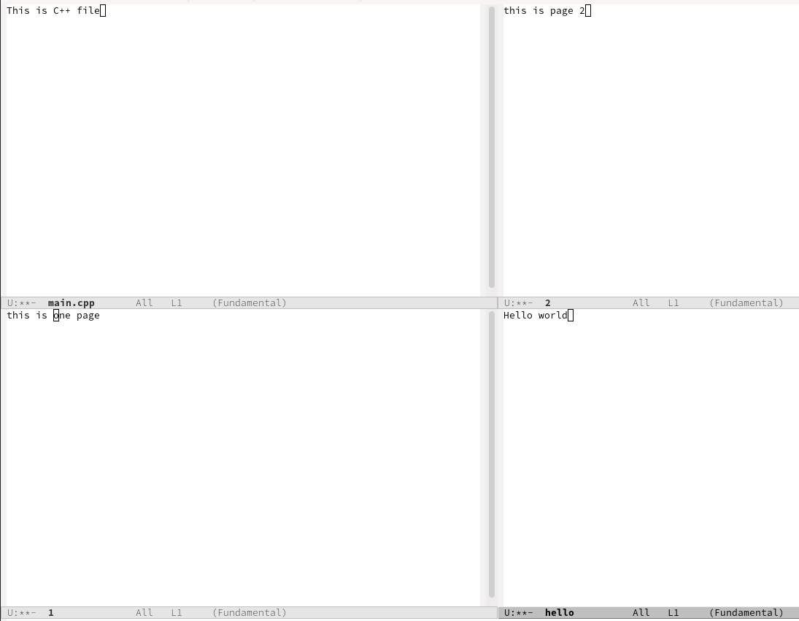{#fig:021 width=70%}

## Режим поиска

Переключаюсь в режим поиска командой Ctrl-s (C-s), нахожу несколько слов в тексте, также добавляю еще текст для дополнительного поиска (рис. [-@fig:022] и рис. [-@fig:023])

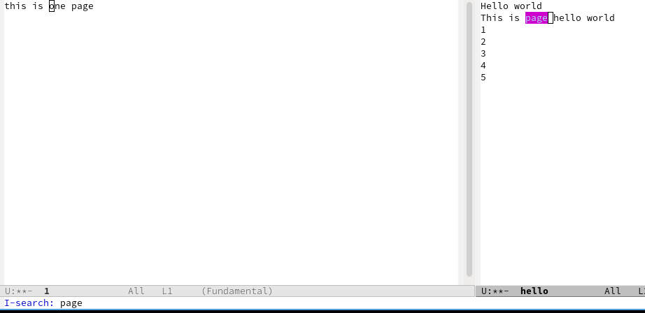{#fig:022 width=70%}

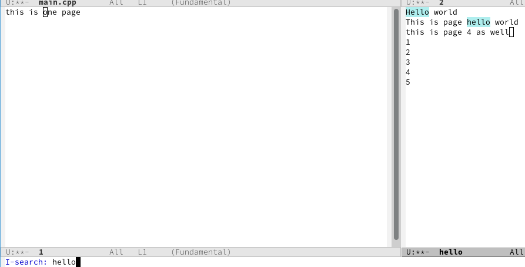{#fig:023 width=70%}

Переключаюсь между результатами поиска комбинацией Ctrl-S (C-S) (рис. [-@fig:024])

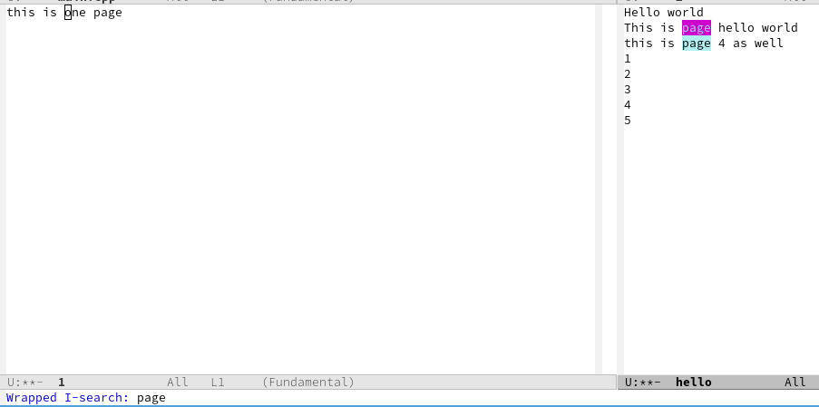{#fig:024 width=70%}

Выхожу из режима поиска командой Ctrl-g (C-g) (рис. [-@fig:025])

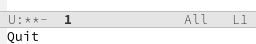{#fig:025 width=70%}

Активирую режим поиска и замены комбинацией Alt-% или Esc-% (M-%), ввожу текст для поиска и замены, нажимаю Enter для применения изменений (рис. [-@fig:026])

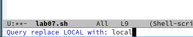{#fig:026 width=70%}

Проверяю результат — видно, что слово заменилось на новое (я заменил слово 'LOCAL' на 'local') (рис. [-@fig:027])

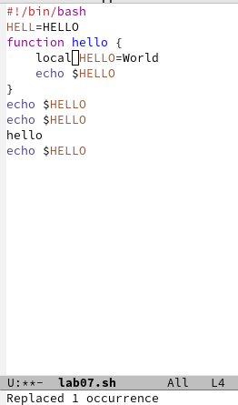{#fig:027 width=70%}

Пробую другой режим поиска: Alt-s или Esc-s с буквой o (M-s o), ввожу искомый текст, и результаты отображаются в отдельном окне (в отличие от обычного поиска) (рис. [-@fig:028])

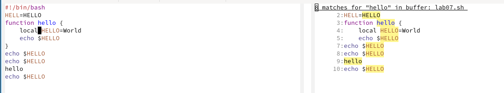{#fig:028 width=70%}

# Выводы

 Я познакомился с операционной системой Linux и получил практические навыки работы с редактором Emacs

# Ответы на контрольные вопросы

1. Кратко охарактеризуйте редактор emacs.

Emacs — это мощный, расширяемый текстовый редактор с большим количеством функций, включая подсветку синтаксиса, работу с файлами,
управление буферами, встроенный терминал, поддержку языков программирования и возможность кастомизации.

2. Какие особенности данного редактора могут сделать его сложным для освоения новичком?

Необычные сочетания клавиш (например, C-x C-s для сохранения).

Модальность (разные режимы ввода и команд).

Огромное количество функций, которые могут перегружать пользователя.

Настройка через Lisp (может быть сложной для непрограммистов).

3. Своими словами опишите, что такое буфер и окно в терминологии emacs’а.

Буфер — это объект Emacs, представляющий открытый файл, текстовые данные или процесс (например, терминал).
Окно — это область на экране, в котором отображается буфер. В одном графическом окне Emacs может быть несколько внутренних окон (фреймов).

4. Можно ли открыть больше 10 буферов в одном окне?

Да, мы можем открыть столько буферов, сколько захотим, но только некоторые из них отображаются в одном окне за раз (в зависимости от разбивки на подокна).

5. Какие буферы создаются по умолчанию при запуске emacs?

При запуске создаются буферы:

`*scratch*` (временный буфер для тестирования кода)

`*Messages*` (лог системных сообщений)

`*GNU Emacs*` (справка или приветствие)

6. Какие клавиши вы нажмёте, чтобы ввести следующую комбинацию C-c | и C-c C-|?

Для ввода:

C-c | → Зажать Ctrl, нажать c, отпустить, затем нажать | (Shift + ).

C-c C-| → Зажать Ctrl, нажать c, затем, не отпуская Ctrl, нажать |.

7. Как поделить текущее окно на две части?

Поделить окно:

Горизонтально: C-x 2 (Ctrl + x, затем 2).

Вертикально: C-x 3 (Ctrl + x, затем 3)

8. В каком файле хранятся настройки редактора emacs?

Настройки хранятся в файле ~/.emacs или ~/.emacs.d/init.el.

9. Какую функцию выполняет клавиша (<-) и можно ли её переназначить?

Клавиша <- (Backspace) обычно удаляет символ перед курсором. Её можно переназначить через настройки (например, в .emacs).

10. Какой редактор вам показался удобнее в работе vi или emacs? Поясните почему?

Emacs удобен для тех, кто любит кастомизацию, работу с разными режимами и Lisp.

Vi/Vim проще для быстрого редактирования благодаря модальности.

Если привыкнуть к сочетаниям клавиш, Emacs может быть удобнее из-за гибкости, но Vim быстрее для простого редактирования.

# Список литературы{.unnumbered}

[Лабораторная работа №11](https://esystem.rudn.ru/pluginfile.php/2586874/mod_resource/content/5/009-lab_emacs.pdf)

::: {#refs}
:::
