---
## Front matter
lang: ru-RU
title: Лабораторная работа №12
subtitle: Операционные системы
author:
  - Луангсуваннавонг Сайпхачан
institute:
  - Российский университет дружбы народов, Москва, Россия
date: 3 мая 2025

## i18n babel
babel-lang: russian
babel-otherlangs: english

## Formatting pdf
toc: false
toc-title: Содержание
slide_level: 2
aspectratio: 169
section-titles: true
theme: metropolis
header-includes:
 - \metroset{progressbar=frametitle,sectionpage=progressbar,numbering=fraction}
---

# Информация

## Докладчик

:::::::::::::: {.columns align=center}
::: {.column width="70%"}

  * Луангсуваннавонг Сайпхачан
  * Студент из группы НКАбд-01-24
  * Российский университет дружбы народов
  * <https://sayprachanh-lsvnv.github.io>

:::
::: {.column width="30%"}
:::
::::::::::::::

## Цель работы

Изучить основы программирования в оболочке ОС UNIX/Linux. Научиться писать небольшие командные файлы.

## Задание

1. Написать скрипт, который при запуске будет делать резервную копию са-
мого себя (то есть файла, в котором содержится его исходный код) в другую
директорию backup в вашем домашнем каталоге. При этом файл должен
архивироваться одним из архиваторов на выбор zip, bzip2 или tar. Способ
использования команд архивации необходимо узнать, изучив справку.
2. Написать пример командного файла, обрабатывающего любое произволь-
ное число аргументов командной строки, в том числе превышающее десять.
Например, скрипт может последовательно распечатывать значения всех
переданных аргументов.
3. Написать командный файл — аналог команды ls (без использования самой
этой команды и команды dir). Требуется, чтобы он выдавал информацию о
нужном каталоге и выводил информацию о возможностях доступа к файлам
этого каталога.
4. Написать командный файл, который получает в качестве аргумента команд-
ной строки формат файла (.txt, .doc, .jpg, .pdf и т.д.) и вычисляет количество
таких файлов в указанной директории. Путь к директории также передаёт-
ся в виде аргумента командной строки.

# Выполнение лабораторной работы

## Выполнение лабораторной работы

Я создаю файл program1.sh для написания программы и создаю директорию backup для хранения резервной копии.
В файле я ввожу код, который создаёт резервную копию самого себя в формате zip и помещает её в созданную директорию.
После завершения редактирования я сохраняю файл и даю ему права на выполнение. (рис. 1 и рис. 2)

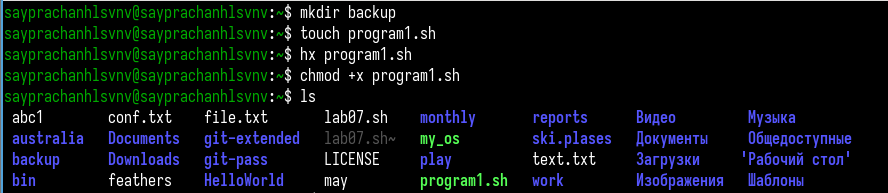

## Выполнение лабораторной работы

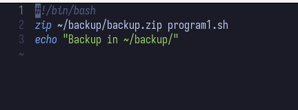

## Выполнение лабораторной работы

Я запускаю program1.sh, программа создаёт резервную копию в формате zip и помещает её в выбранную директорию. (рис. 3 и рис. 4)

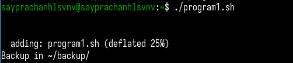

## Выполнение лабораторной работы

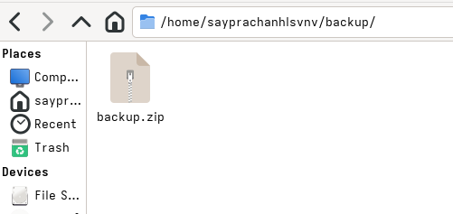

## Выполнение лабораторной работы

Я создаю program2.sh, затем ввожу в файл код, который принимает все переданные аргументы и отображает их на экране. (рис. 5 и рис. 6)

## Выполнение лабораторной работы

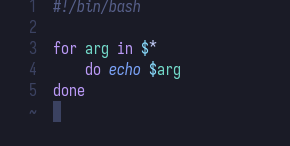

## Выполнение лабораторной работы

Затем я сохраняю файл, даю ему права на выполнение и запускаю программу. (рис. 7)
В результате программа работает корректно.

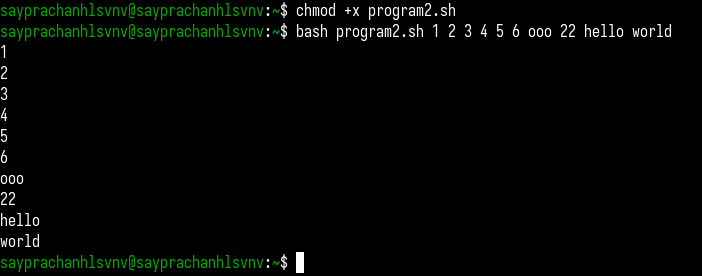

## Выполнение лабораторной работы

Я создаю program3.sh и ввожу программу, которая предоставляет информацию о нужной директории (домашней директории). (рис. 8 и рис. 9)

## Выполнение лабораторной работы

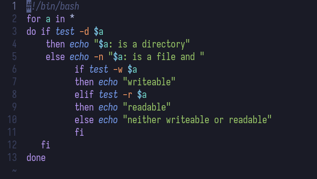

## Выполнение лабораторной работы

После завершения редактирования я сохраняю файл и запускаю программу.
Она выводит сообщение на экран, предоставляя информацию о каждом элементе в домашней директории, указывая, является ли это директорией или файлом, и можно ли его читать или записывать. (рис. 10)

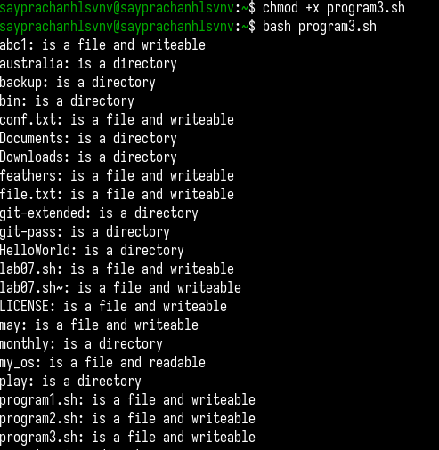

## Выполнение лабораторной работы

Я создаю program4.sh, программа запрашивает два ввода: формат файла (txt, sh, pdf и т. д.)
и указанную директорию. Затем программа находит файлы с указанным форматом в данной директории
и подсчитывает, сколько подходящих файлов найдено. (рис. 11 и рис. 12)

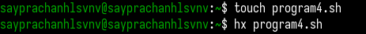

## Выполнение лабораторной работы

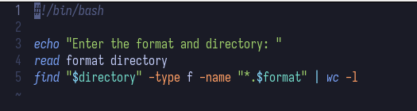

## Выполнение лабораторной работы

После завершения редактирования файла я сохраняю его, даю права на выполнение и запускаю программу.
В результате программа работает отлично в соответствии с введёнными данными (например: поиск файлов с расширением .txt в домашней директории). (рис. 13)

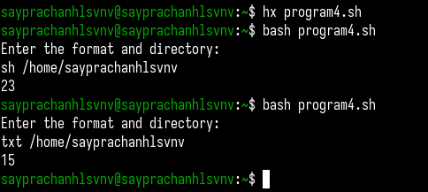

## Выводы

Во время выполнения этой лабораторной работы я изучил основы программирования в оболочке UNIX/Linux.
Научусь писать небольшие пакетные файлы.

# Спасибо за внимание

