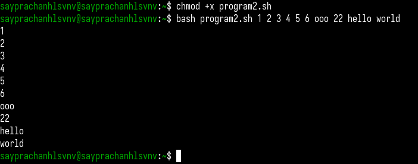

---
## Front matter
title: "Отчёт по лабораторной работе №12"
subtitle: "Операционные системы"
author: "Луангсуваннавонг Сайпхачан"

## Generic otions
lang: ru-RU
toc-title: "Содержание"

## Bibliography
bibliography: bib/cite.bib
csl: pandoc/csl/gost-r-7-0-5-2008-numeric.csl

## Pdf output format
toc: true # Table of contents
toc-depth: 2
lof: true # List of figures
lot: true # List of tables
fontsize: 12pt
linestretch: 1.5
papersize: a4
documentclass: scrreprt
## I18n polyglossia
polyglossia-lang:
  name: russian
  options:
	- spelling=modern
	- babelshorthands=true
polyglossia-otherlangs:
  name: english
## I18n babel
babel-lang: russian
babel-otherlangs: english
## Fonts
mainfont: IBM Plex Serif
romanfont: IBM Plex Serif
sansfont: IBM Plex Sans
monofont: IBM Plex Mono
mathfont: STIX Two Math
mainfontoptions: Ligatures=Common,Ligatures=TeX,Scale=0.94
romanfontoptions: Ligatures=Common,Ligatures=TeX,Scale=0.94
sansfontoptions: Ligatures=Common,Ligatures=TeX,Scale=MatchLowercase,Scale=0.94
monofontoptions: Scale=MatchLowercase,Scale=0.94,FakeStretch=0.9
mathfontoptions:
## Biblatex
biblatex: true
biblio-style: "gost-numeric"
biblatexoptions:
  - parentracker=true
  - backend=biber
  - hyperref=auto
  - language=auto
  - autolang=other*
  - citestyle=gost-numeric
## Pandoc-crossref LaTeX customization
figureTitle: "Рис."
tableTitle: "Таблица"
listingTitle: "Листинг"
lofTitle: "Список иллюстраций"
lotTitle: "Список таблиц"
lolTitle: "Листинги"
## Misc options
indent: true
header-includes:
  - \usepackage{indentfirst}
  - \usepackage{float} # keep figures where there are in the text
  - \floatplacement{figure}{H} # keep figures where there are in the text
---

# Цель работы

Изучить основы программирования в оболочке ОС UNIX/Linux. Научиться писать небольшие командные файлы.

# Задание

1. Написать скрипт, который при запуске будет делать резервную копию самого себя (то есть файла, в котором содержится его исходный код)
  в другую директорию backup в вашем домашнем каталоге. При этом файл должен архивироваться одним из архиваторов на выбор zip, bzip2 или tar.
  Способ использования команд архивации необходимо узнать, изучив справку.
2. Написать пример командного файла, обрабатывающего любое произвольное число аргументов командной строки, в том числе превышающее десять. Например, скрипт
  может последовательно распечатывать значения всех переданных аргументов.
3. Написать командный файл — аналог команды ls (без использования самой этой команды и команды dir). Требуется, чтобы он выдавал информацию о нужном каталоге
  и выводил информацию о возможностях доступа к файлам этого каталога.
4. Написать командный файл, который получает в качестве аргумента командной строки
    формат файла (.txt, .doc, .jpg, .pdf и т.д.) и вычисляет количество таких файлов
    в указанной директории. Путь к директории также передаётся в виде аргумента командной строки.
    
# Теоретическое введение

Командный процессор (командная оболочка, интерпретатор команд shell) — это программа, позволяющая пользователю взаимодействовать с операционной системой
компьютера. В операционных системах типа UNIX/Linux наиболее часто используются следующие реализации командных оболочек:

– оболочка Борна (Bourne shell или sh) — стандартная командная оболочка UNIX/Linux,
содержащая базовый, но при этом полный набор функций;

– С-оболочка (или csh) — надстройка на оболочкой Борна, использующая С-подобный
синтаксис команд с возможностью сохранения истории выполнения команд;

– оболочка Корна (или ksh) — напоминает оболочку С, но операторы управления программой совместимы с операторами оболочки Борна;

– BASH — сокращение от Bourne Again Shell (опять оболочка Борна), в основе своей совмещает свойства оболочек С и Корна (разработка компании Free Software Foundation).

POSIX (Portable Operating System Interface for Computer Environments) —  набор стандартов описания интерфейсов взаимодействия операционной системы и прикладных программ.
Стандарты POSIX разработаны комитетом IEEE (Institute of Electrical and Electronics Engineers) для обеспечения совместимости различных UNIX/Linux-подобных
операционных систем и переносимости прикладных программ на уровне исходного кода. POSIX-совместимые оболочки разработаны на базе оболочки Корна.
Рассмотрим основные элементы программирования в оболочке bash. В других оболочках большинство команд будет совпадать с описанными ниже.

# Выполнение лабораторной работы

Сначала я создаю директорию с именем backup для хранения резервной копии файла.
После этого я создаю файл program1.sh, затем редактирую этот файл, чтобы написать программу.
Программа будет создавать резервную копию самой себя в формате zip (используя команду zip) и помещать архив в выбранную директорию,
а также выводить сообщение, если программа выполнена успешно. После завершения редактирования я сохраняю и выхожу из файла, затем даю ему права на выполнение,
чтобы можно было запустить программу. (рис. [-@fig:001] и рис. [-@fig:002])

{#fig:001 width=70%}

{#fig:002 width=70%}

Код программы:

````
#!/bin/bash
zip ~/backup/backup.zip program1.sh
echo "Backup in ~/backup/"

````

Я запускаю программу program1.sh, и она работает правильно, потому что при выполнении не появляется никаких ошибок,
и в созданной директории backup я вижу файл backup.zip, который содержит резервную копию файла program1.sh. (рис. [-@fig:003] и рис. [-@fig:004])

{#fig:003 width=70%}

{#fig:004 width=70%}


Затем я создаю файл program2.sh для выполнения второго задания лабораторной работы.
Я открываю файл для редактирования, затем ввожу код, который принимает все введённые аргументы и выводит их на экран. (рис. [-@fig:005] и рис. [-@fig:006])

{#fig:005 width=70%}

{#fig:006 width=70%}

Код программы:

````
#!/bin/bash

for arg in $*
    do echo $arg
done

````

После этого я сохраняю файл program2.sh, даю ему права на выполнение и запускаю программу.
Я ввожу несколько аргументов, и в результате программа отображает все аргументы, которые я ввёл, что означает, что программа работает правильно. (рис. [-@fig:007])

{#fig:007 width=70%}

Далее я создаю файл program3.sh и открываю его в текстовом редакторе для редактирования.
Я ввожу код, который будет предоставлять информацию о выбранной директории (я выбрал домашнюю директорию).
Программа будет проверять через условные конструкции if-else, является ли элемент файлом или директорией,
а если это файл — проверяет, доступен ли он для записи или для чтения, и также, если оба условия не выполняются. (рис. [-@fig:008] и рис. [-@fig:009])

{#fig:008 width=70%}

{#fig:009 width=70%}

Код программы:

````
#!/bin/bash
for a in *
do if test -d $a
    then echo "$a: is a directory"
    else echo -n "$a: is a file and "
          if test -w $a
          then echo "writeable"
          elif test -r $a
          then echo "readable"
          else echo "neither writeable or readable"
          fi
   fi
done

````

После завершения редактирования я сохраняю файл, выхожу из редактора, даю файлу права на выполнение и запускаю программу.
В результате программа отображает сообщения на экран, давая информацию по каждому элементу в домашней директории, указывая,
является ли это директорией или файлом, доступен ли он для записи или чтения и так далее. (рис. [-@fig:010])

{#fig:010 width=70%}

Я создаю файл program4.sh и открываю его для редактирования. В этой программе я ввожу код, который будет запрашивать два ввода:
формат файла (например, txt, sh, pdf и т.д.) и путь к директории.
Программа будет искать файлы с указанным форматом в указанной директории и посчитает, сколько таких файлов найдено. (рис. [-@fig:011] и рис. [-@fig:012])

Используется команда wc -l, что означает «подсчёт строк» — она подсчитывает количество строк во входных данных,
а так как каждый найденный файл отображается в отдельной строке, команда показывает, сколько файлов найдено.

{#fig:011 width=70%}

{#fig:012 width=70%}

Код программы:

````
#!/bin/bash

echo "Enter the format and directory: "
read format directory
find "$directory" -type f -name "*.$format" | wc -l

````

После редактирования я сохраняю и закрываю файл, даю ему права на выполнение и запускаю программу.
Программа работает отлично: она показывает, сколько файлов с указанным форматом находится в указанной директории.
Я вводил формат .sh (для bash-файлов), а также формат .txt (для текстовых файлов).  (рис. [-@fig:013])

{#fig:013 width=70%}

# Выводы

 Во время выполнения этой лабораторной работы я изучил основы программирования в оболочке UNIX/Linux. Научусь писать
небольшие пакетные файлы.

# Ответы на контрольные вопросы

1. Объясните понятие командной оболочки. Приведите примеры командных оболочек.
Чем они отличаются?

Командная оболочка (shell) — это программа, обеспечивающая интерфейс между пользователем и операционной системой.
Она интерпретирует команды, введённые пользователем, и передаёт их операционной системе на выполнение.

Примеры:

bash — Bourne Again Shell (наиболее распространённая оболочка в Linux)

sh — оригинальная Bourne Shell

zsh — расширенная оболочка с поддержкой автодополнения и скриптов

csh — C Shell, использует синтаксис, похожий на язык C

fish — Friendly Interactive Shell, ориентирована на простоту и интерактивность

ksh — Korn Shell, сочетает возможности sh и csh

Отличия касаются синтаксиса, поддержки функциональности (например, массивов, автодополнения), встроенных команд и возможностей скриптования.

2. Что такое POSIX?

POSIX (Portable Operating System Interface) — это набор стандартов, разработанный IEEE, который определяет интерфейс совместимости между программами и операционной системой.
В контексте оболочек POSIX определяет стандартный набор функций и синтаксис, которому должны соответствовать оболочки (например, POSIX sh).

3. Как определяются переменные и массивы в языке программирования bash?

В Bash переменные создаются путём простого присваивания значений. Они не требуют предварительного объявления типа.
Для хранения множественных значений Bash поддерживает массивы, которые позволяют обращаться к элементам по индексам. 

4. Каково назначение операторов let и read?

Оператор let используется для выполнения арифметических вычислений в скриптах Bash.
Он упрощает работу с числами. Команда read применяется для получения ввода от пользователя в интерактивном режиме
и может сохранять его в одну или несколько переменных для дальнейшего использования.


5. Какие арифметические операции можно применять в языке программирования bash?

Язык Bash поддерживает базовые арифметические операции, включая сложение, вычитание, умножение, деление, остаток от деления, инкремент и декремент.
Также доступны логические и побитовые операции. Эти вычисления применяются при написании условий и циклов в скриптах.

6. Что означает операция (( ))?

Операция (( )) используется для вычисления арифметических выражений.
Она позволяет Bash интерпретировать выражение как число и возвращает код завершения, указывающий, было ли условие истинным или ложным.
Это часто используется в условных операторах и циклах.

7. Какие стандартные имена переменных Вам известны?

Стандартные переменные Bash — это переменные окружения, которые содержат важную информацию о текущем сеансе пользователя.
Например, переменные указывают имя пользователя, домашнюю директорию, текущий каталог, используемую оболочку и пути к исполняемым файлам.
Они автоматически устанавливаются при запуске системы или оболочки.

8. Что такое метасимволы?

Метасимволы — это специальные символы в оболочке, которые имеют особое значение.
Они могут использоваться для подстановки файлов, перенаправления ввода/вывода, объединения команд или работы с переменными.
Примеры таких символов включают звёздочку, вопросительный знак, кавычки, символ доллара и другие.

9. Как экранировать метасимволы?

Чтобы интерпретировать метасимвол как обычный символ, его необходимо экранировать.
Это делается с помощью обратного слэша, одинарных или двойных кавычек.
Экранирование позволяет избежать нежелательной интерпретации символа оболочкой и выводить его буквально.

10. Как создавать и запускать командные файлы?

Командные файлы (скрипты) создаются путём записи набора команд оболочки в текстовый файл.
Такой файл должен быть сохранён с соответствующими правами на выполнение.
После этого его можно запустить напрямую из терминала. Скрипты позволяют автоматизировать выполнение часто повторяющихся задач.

11. Как определяются функции в языке программирования bash?

В Bash функции определяются с именем и телом, включающим одну или несколько команд.
Они позволяют структурировать скрипт, повторно использовать код и улучшать читаемость.
Функции вызываются по имени и могут использовать аргументы, переданные им при вызове.


12. Каким образом можно выяснить, является файл каталогом или обычным файлом?

Чтобы определить тип файла (обычный файл или каталог), используются встроенные механизмы оболочки.
Bash предоставляет способы проверки свойств файлов, таких как существование, тип и права доступа.
Это важно для написания надёжных и безопасных скриптов.


13. Каково назначение команд set, typeset и unset?

Команда set управляет параметрами оболочки и может отображать текущие переменные.
typeset используется для задания свойств переменных (например, ограничения их области видимости).
unset позволяет удалить переменные и функции, освобождая используемую ими память.


14. Как передаются параметры в командные файлы?

Параметры передаются в командные файлы при их запуске из терминала.
Внутри скрипта они доступны через специальные позиционные переменные, которые позволяют обрабатывать вводимые пользователем значения.
Это основной способ передачи данных в скрипты.


15. Назовите специальные переменные языка bash и их назначение

Специальные переменные в Bash включают `$0, $1, $#, $@, $*, $?, $$, $!` и другие. Они используются для доступа к имени скрипта, аргументам командной строки,
количеству аргументов, коду возврата команд, идентификаторам процессов и другим служебным данным, необходимым для работы скриптов.

# Список литературы{.unnumbered}

[Лабораторная работа №12](https://esystem.rudn.ru/pluginfile.php/2586876/mod_resource/content/4/010-lab_shell_prog_1.pdf)

::: {#refs}
:::
