---
## Front matter
lang: ru-RU
title: Лабораторная работа №13
subtitle: Операционные системы
author:
  - Луангсуваннавонг Сайпхачан
institute:
  - Российский университет дружбы народов, Москва, Россия
date: 6 мая 2025

## i18n babel
babel-lang: russian
babel-otherlangs: english

## Formatting pdf
toc: false
toc-title: Содержание
slide_level: 2
aspectratio: 169
section-titles: true
theme: metropolis
header-includes:
 - \metroset{progressbar=frametitle,sectionpage=progressbar,numbering=fraction}
---

# Информация

## Докладчик

:::::::::::::: {.columns align=center}
::: {.column width="70%"}

  * Луангсуваннавонг Сайпхачан
  * Студент из группы НКАбд-01-24
  * Российский университет дружбы народов
  * <https://sayprachanh-lsvnv.github.io>

:::
::: {.column width="30%"}
:::
::::::::::::::

## Цель работы

Изучить основы программирования в оболочке ОС UNIX. Научится писать более
сложные командные файлы с использованием логических управляющих конструкций
и циклов.

## Задание

1. Используя команды getopts grep, написать командный файл, который анализирует
командную строку с ключами:
– -iinputfile — прочитать данные из указанного файла;
– -ooutputfile — вывести данные в указанный файл;
– -pшаблон — указать шаблон для поиска;
– -C — различать большие и малые буквы;
– -n — выдавать номера строк.
а затем ищет в указанном файле нужные строки, определяемые ключом -p.
2. Написать на языке Си программу, которая вводит число и определяет, является ли оно
больше нуля, меньше нуля или равно нулю. Затем программа завершается с помощью
функции exit(n), передавая информацию в о коде завершения в оболочку. Командный файл должен вызывать эту программу и, проанализировав с помощью команды
$?, выдать сообщение о том, какое число было введено.

## Задание

3. Написать командный файл, создающий указанное число файлов, пронумерованных
последовательно от 1 до N (например 1.tmp, 2.tmp, 3.tmp,4.tmp и т.д.). Число файлов,
которые необходимо создать, передаётся в аргументы командной строки. Этот же командный файл должен уметь удалять все созданные им файлы (если они существуют).
4. Написать командный файл, который с помощью команды tar запаковывает в архив
все файлы в указанной директории. Модифицировать его так, чтобы запаковывались
только те файлы, которые были изменены менее недели тому назад (использовать
команду find).

# Выполнение лабораторной работы

## Выполнение лабораторной работы

Я создаю файл program5.sh и открываю его для редактирования в текстовом редакторе. (рис. 1)

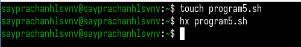

## Выполнение лабораторной работы

Я добавляю код программы, которая будет искать нужные строки в указанном файле,
используя команды getopts и grep. (рис. 2)

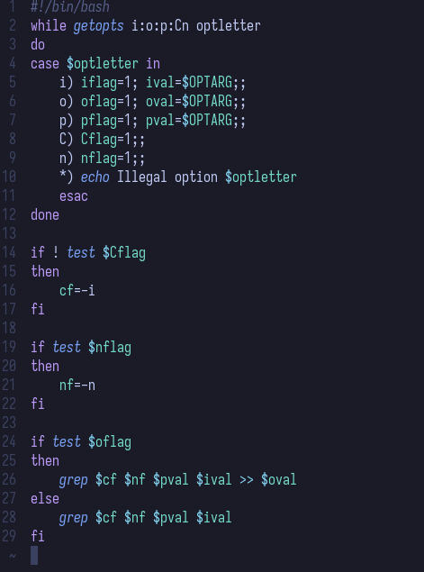

## Выполнение лабораторной работы

Я также создаю текстовый файл log.txt для использования с опцией -o, чтобы сохранять результат работы программы в файл. (рис. 3)

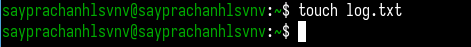

## Выполнение лабораторной работы

Я создаю тестовый файл test.txt для проверки работы программы.
Внутри файла я записываю некоторый текст. (рис. 4)

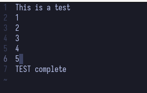

## Выполнение лабораторной работы

Я даю файлу разрешение на выполнение и запускаю программу.
Сначала я запускаю программу и выбираю вывод результата на экран. (рис. 5)

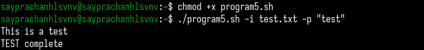

## Выполнение лабораторной работы

Затем я выбираю вывод результата в созданный текстовый файл, добавляя опцию -o, за которой следует имя файла (log.txt).
Я проверяю результат команды — в файле log.txt есть строки, значит программа работает корректно. (рис. 6 и рис. 7)

## Выполнение лабораторной работы

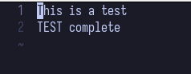

## Выполнение лабораторной работы

Я создаю bash-файл program6.sh и файл с программой на C, затем открываю их для редактирования в текстовом редакторе. (рис. 8)

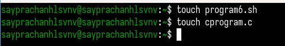

## Выполнение лабораторной работы

В файле C-программы я ввожу код, который запрашивает число, определяет,
больше ли оно нуля, меньше или равно нулю, и завершает программу с помощью функции exit. (рис. 9)

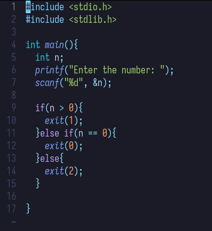

## Выполнение лабораторной работы

В bash-файл program6.sh я добавляю команду для компиляции C-программы, вызова программы и вывода сообщения на экран. (рис. 10)

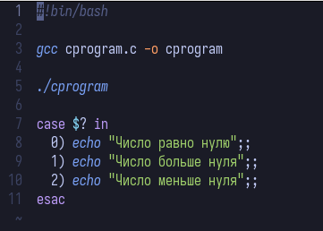

## Выполнение лабораторной работы

Я даю файлу разрешение на выполнение и запускаю программу. Ввожу число больше нуля, и программа корректно отображает сообщение. (рис. 11)

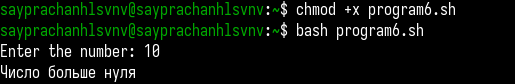

## Выполнение лабораторной работы

Я создаю bash-файл program7.sh и открываю его в текстовом редакторе. (рис. 12)

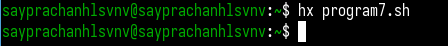

## Выполнение лабораторной работы

Я добавляю код в файл program7.sh. Программа создаёт новые файлы и удаляет уже существующие, созданные этой же программой.
Количество файлов определяется числом, переданным в аргументе командной строки. (рис. 13)

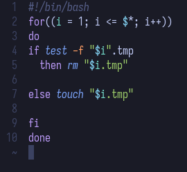

## Выполнение лабораторной работы

Я запускаю программу. Ввожу число 3 в качестве аргумента.
В результате программа создаёт 3 файла, и если я снова запускаю команду, то программа удаляет все 3 файла. (рис. 14)

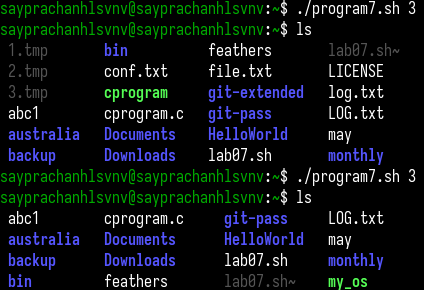

## Выполнение лабораторной работы

Затем я создаю bash-файл program8.sh и открываю его в текстовом редакторе. (рис. 15)

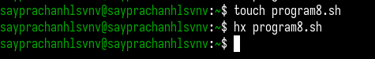

## Выполнение лабораторной работы

Я также создаю тестовую директорию и несколько текстовых файлов внутри этой директории. (рис. 16)

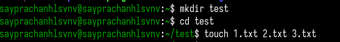

## Выполнение лабораторной работы

Я добавляю код в файл program8.sh.
Программа создаёт архив в указанной директории и включает в него только те файлы,
которые были изменены менее недели назад. (рис. 17)

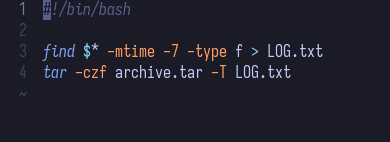

## Выполнение лабораторной работы

Я даю файлу разрешение на выполнение и запускаю программу. (рис. 18) Ввожу путь к указанной директории (тестовой директории),
и программа создаёт архив этой директории и файлов. Программа работает корректно. (рис. 19) В файле LOG.txt содержится список файлов, включённых в архив. (рис. 20)

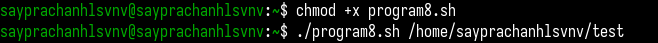

## Выполнение лабораторной работы

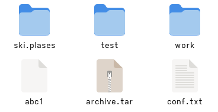

## Выполнение лабораторной работы

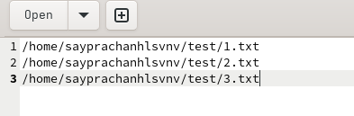

## Выводы

Во время этой лабораторной работы я изучил основы программирования в оболочке UNIX. Научился писать более
сложные пакетные файлы, используя логические структуры управления и циклы.

# Спасибо за внимание

