---
## Front matter
title: "Отчёт по лабораторной работе №13"
subtitle: "Операционные системы"
author: "Луангсуваннавонг Сайпхачан"

## Generic otions
lang: ru-RU
toc-title: "Содержание"

## Bibliography
bibliography: bib/cite.bib
csl: pandoc/csl/gost-r-7-0-5-2008-numeric.csl

## Pdf output format
toc: true # Table of contents
toc-depth: 2
lof: true # List of figures
lot: true # List of tables
fontsize: 12pt
linestretch: 1.5
papersize: a4
documentclass: scrreprt
## I18n polyglossia
polyglossia-lang:
  name: russian
  options:
	- spelling=modern
	- babelshorthands=true
polyglossia-otherlangs:
  name: english
## I18n babel
babel-lang: russian
babel-otherlangs: english
## Fonts
mainfont: IBM Plex Serif
romanfont: IBM Plex Serif
sansfont: IBM Plex Sans
monofont: IBM Plex Mono
mathfont: STIX Two Math
mainfontoptions: Ligatures=Common,Ligatures=TeX,Scale=0.94
romanfontoptions: Ligatures=Common,Ligatures=TeX,Scale=0.94
sansfontoptions: Ligatures=Common,Ligatures=TeX,Scale=MatchLowercase,Scale=0.94
monofontoptions: Scale=MatchLowercase,Scale=0.94,FakeStretch=0.9
mathfontoptions:
## Biblatex
biblatex: true
biblio-style: "gost-numeric"
biblatexoptions:
  - parentracker=true
  - backend=biber
  - hyperref=auto
  - language=auto
  - autolang=other*
  - citestyle=gost-numeric
## Pandoc-crossref LaTeX customization
figureTitle: "Рис."
tableTitle: "Таблица"
listingTitle: "Листинг"
lofTitle: "Список иллюстраций"
lotTitle: "Список таблиц"
lolTitle: "Листинги"
## Misc options
indent: true
header-includes:
  - \usepackage{indentfirst}
  - \usepackage{float} # keep figures where there are in the text
  - \floatplacement{figure}{H} # keep figures where there are in the text
---

# Цель работы

Изучить основы программирования в оболочке ОС UNIX. Научится писать более
сложные командные файлы с использованием логических управляющих конструкций
и циклов.


# Задание

1. Используя команды getopts grep, написать командный файл, который анализирует
командную строку с ключами:
– -iinputfile — прочитать данные из указанного файла;
– -ooutputfile — вывести данные в указанный файл;
– -pшаблон — указать шаблон для поиска;
– -C — различать большие и малые буквы;
– -n — выдавать номера строк.
а затем ищет в указанном файле нужные строки, определяемые ключом -p.
2. Написать на языке Си программу, которая вводит число и определяет, является ли оно
больше нуля, меньше нуля или равно нулю. Затем программа завершается с помощью
функции exit(n), передавая информацию в о коде завершения в оболочку. Командный файл должен вызывать эту программу и, проанализировав с помощью команды
$?, выдать сообщение о том, какое число было введено.
3. Написать командный файл, создающий указанное число файлов, пронумерованных
последовательно от 1 до N (например 1.tmp, 2.tmp, 3.tmp,4.tmp и т.д.). Число файлов,
которые необходимо создать, передаётся в аргументы командной строки. Этот же командный файл должен уметь удалять все созданные им файлы (если они существуют).
4. Написать командный файл, который с помощью команды tar запаковывает в архив
все файлы в указанной директории. Модифицировать его так, чтобы запаковывались
только те файлы, которые были изменены менее недели тому назад (использовать
команду find).

    
# Теоретическое введение

Командный процессор (командная оболочка, интерпретатор команд shell) — это программа, позволяющая пользователю взаимодействовать с операционной системой
компьютера. В операционных системах типа UNIX/Linux наиболее часто используются следующие реализации командных оболочек:

– оболочка Борна (Bourne shell или sh) — стандартная командная оболочка UNIX/Linux,
содержащая базовый, но при этом полный набор функций;

– С-оболочка (или csh) — надстройка на оболочкой Борна, использующая С-подобный
синтаксис команд с возможностью сохранения истории выполнения команд;

– оболочка Корна (или ksh) — напоминает оболочку С, но операторы управления программой совместимы с операторами оболочки Борна;

– BASH — сокращение от Bourne Again Shell (опять оболочка Борна), в основе своей совмещает свойства оболочек С и Корна (разработка компании Free Software Foundation).

POSIX (Portable Operating System Interface for Computer Environments) —  набор стандартов описания интерфейсов взаимодействия операционной системы и прикладных программ.
Стандарты POSIX разработаны комитетом IEEE (Institute of Electrical and Electronics Engineers) для обеспечения совместимости различных UNIX/Linux-подобных
операционных систем и переносимости прикладных программ на уровне исходного кода. POSIX-совместимые оболочки разработаны на базе оболочки Корна.
Рассмотрим основные элементы программирования в оболочке bash. В других оболочках большинство команд будет совпадать с описанными ниже.

# Выполнение лабораторной работы

Сначала я создаю файл program5.sh и открываю его в текстовом редакторе для редактирования.
Затем я добавляю код для программы, которая будет искать в указанном файле нужные строки, используя команды getopts и grep.
После завершения редактирования я сохраняю и закрываю файл. (рис. [-@fig:001] и рис. [-@fig:002])

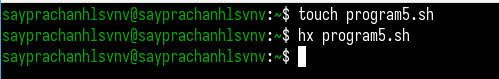{#fig:001 width=70%}

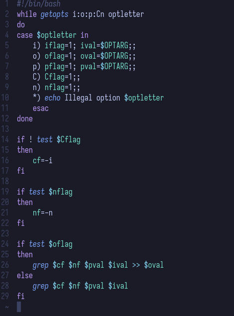{#fig:002 width=70%}

Код программы:

````
#!/bin/bash
while getopts i:o:p:Cn optletter
do
case $optletter in
    i) iflag=1; ival=$OPTARG;;
    o) oflag=1; oval=$OPTARG;;
    p) pflag=1; pval=$OPTARG;;
    C) Cflag=1;;
    n) nflag=1;;
    *) echo Illegal option $optletter
    esac
done

if ! test $Cflag
then
    cf=-i
fi

if test $nflag
then
    nf=-n
fi

if test $oflag
then
    grep $cf $nf $pval $ival >> $oval
else
    grep $cf $nf $pval $ival
fi
````

Я создаю текстовый файл log.txt для сохранения результата работы программы при выполнении команды,
которая требует записи результата в текстовый файл. (рис. [-@fig:003])

{#fig:003 width=70%}

Я также создаю тестовый файл с именем test.txt. Я записываю в файл некоторый текст,
так как этот файл будет использоваться для тестирования поиска в программе. (рис. [-@fig:004])

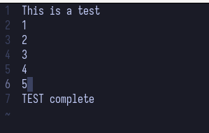{#fig:004 width=70%}

Затем я даю файлу разрешение на выполнение. Я запускаю программу: сначала, с выводом результата на экран. (рис. [-@fig:005])

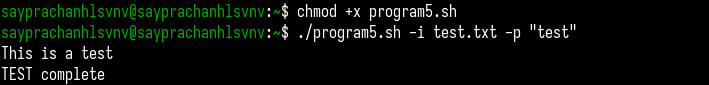{#fig:005 width=70%}

Во второй раз я запускаю программу с выводом результата в созданный текстовый файл, добавив опцию -o с указанием имени файла (log.txt).
Я открываю текстовый файл log.txt, и там есть строки, что означает, что программа работает корректно. (рис. [-@fig:006] и рис. [-@fig:007])

{#fig:006 width=70%}

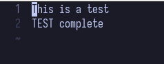{#fig:007 width=70%}

Затем я создаю файл program6.sh, а также C программу, так как во второй задаче нужно использовать оба файла: bash-скрипт и C программу.
C Программа будет запрашивать число и определять, больше ли оно нуля, меньше или равно нулю, после чего завершаться с помощью функции exit(n).
Bash-файл будет вызывать программу и выводить сообщение. (рис. [-@fig:008])

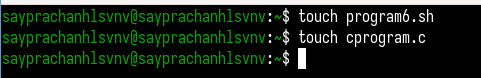{#fig:008 width=70%}

В C-программе я ввожу код, который запрашивает ввод числа,
затем определяет его значение относительно нуля, и завершает выполнение с помощью функции exit. (рис. [-@fig:009])

{#fig:009 width=70%}

Код программы:

````
#include <stdio.h>
#include <stdlib.h>

int main(){
  int n;
  printf("Enter the number: ");
  scanf("%d", &n);

  if(n > 0){
    exit(1);
  }else if(n == 0){
    exit(0);
  }else{
    exit(2);
  }
  
}
````

В bash-файле program6.sh я добавляю команду для компиляции программы на C, затем её вызов,
а после этого, конструкцию case для вывода соответствующего сообщения на экран. (рис. [-@fig:010])

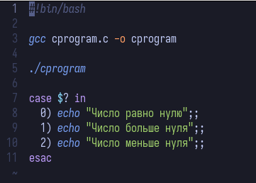{#fig:010 width=70%}

Код программы:

````
#!bin/bash

gcc cprogram.c -o cprogram

./cprogram

case $? in
  0) echo "Число равно нулю";;
  1) echo "Число больше нуля";;
  2) echo "Число меньше нуля";;
esac

````

Я даю файлу разрешение на выполнение и запускаю программу. Ввожу число и программа корректно выводит текст. (рис. [-@fig:011])

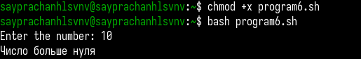{#fig:011 width=70%}

Я создаю bash-файл program7.sh и открываю его в текстовом редакторе. В этой программе создаётся указанное количество файлов.
Количество создаваемых файлов передаётся в аргументах командной строки. Если файлы уже существуют, программа их удаляет. (рис. [-@fig:012])

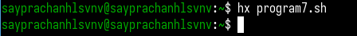{#fig:012 width=70%}

Я добавляю код в файл program7.sh. Программа работает в цикле for, проверяя, существует ли файл с заданным именем. Если файл существует, он удаляется, иначе создаётся новый.
Количество создаваемых файлов определяется переданным числом. (рис. [-@fig:013])

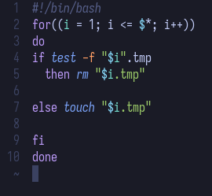{#fig:013 width=70%}

Код программы:

````
#!/bin/bash
for((i = 1; i <= $*; i++))
do
if test -f "$i".tmp
  then rm "$i.tmp"

else touch "$i.tmp"

fi
done

````
Затем я запускаю программу, ввожу число 3 , программа создаёт 3 файла. Затем я снова запускаю команду и программа удаляет созданные ранее 3 файла, так как они уже существуют,
что подтверждает корректность её работы. (рис. [-@fig:014])

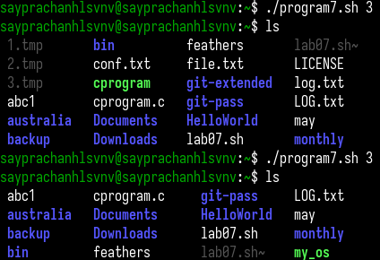{#fig:014 width=70%}

Затем я создаю файл program8.sh и открываю его для редактирования. В этой программе создаётся архив в указанной директории,
и в архив включаются только те файлы, которые были изменены менее недели назад. (рис. [-@fig:015])

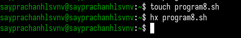{#fig:015 width=70%}

Я создаю тестовую директорию и несколько текстовых файлов для тестирования этой программы. (рис. [-@fig:016])

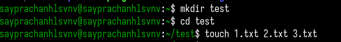{#fig:016 width=70%}

В файле program8.sh я добавляю код, который находит файлы, изменённые менее недели назад, с помощью команды find с опцией -mtime, за которой следует количество дней.
Результат сохраняется в LOG.txt, который создаётся после запуска программы.
Затем с помощью команды tar создаётся архив директории и файлов, перечисленных в LOG.txt. (рис. [-@fig:017])

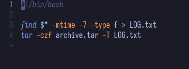{#fig:017 width=70%}

Код программы:

````
#!/bin/bash

find $* -mtime -7 -type f > LOG.txt
tar -czf archive.tar -T LOG.txt
````

После завершения редактирования я даю файлу разрешение на выполнение и запускаю программу. (рис. [-@fig:018])
Ввожу путь к нужной директории. В результате программа создаёт архив директории и файлов. (рис. [-@fig:019])
Это подтверждает, что программа работает корректно, а в файле LOG.txt отображается список файлов, включённых в архив. (рис. [-@fig:020])

{#fig:018 width=70%}

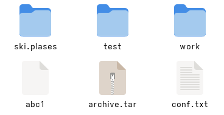{#fig:019 width=70%}

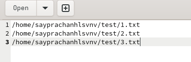{#fig:020 width=70%}


# Выводы

Во время этой лабораторной работы я изучил основы программирования в оболочке UNIX. Научился писать более
сложные пакетные файлы, используя логические структуры управления
и циклы.

# Ответы на контрольные вопросы

1. Каково предназначение команды getopts?

Команда getopts используется в shell-скриптах для разбора переданных аргументов командной строки.
Она позволяет обрабатывать опции (например, -f, -v) и их аргументы удобным способом.
Это встроенная команда Bash, которая часто используется внутри цикла для последовательного анализа всех переданных опций.

2. Какое отношение метасимволы имеют к генерации имён файлов?

Метасимволы (например, *, ?, [ ]) используются в shell для шаблонного поиска и генерации имён файлов.
Это называется глоббинг (file name globbing). Например, *.txt соответствует всем файлам с расширением .txt, а file?.sh — всем файлам вроде file1.sh, fileA.sh.

3. Какие операторы управления действиями вы знаете?

В оболочке Bash есть разные операторы:

&& (логическое И) — выполнить следующую команду, если предыдущая завершилась успешно (код 0).

|| (логическое ИЛИ) — выполнить следующую команду, если предыдущая завершилась с ошибкой.

; — разделяет команды, выполняет их последовательно, независимо от результата.

& — запускает команду в фоновом режиме.

Также можно добавить управляющие конструкции:

if, then, else, elif, fi

case, esac

for, while, until, do, done

select

4. Какие операторы используются для прерывания цикла?

break — немедленно завершает выполнение текущего цикла.

continue — пропускает текущую итерацию и переходит к следующей.

5. Для чего нужны команды false и true?

true — всегда возвращает статус завершения 0 (успех).

false — всегда возвращает статус завершения 1 (ошибка).
Они часто используются в условиях и циклах для управления потоком выполнения, например в бесконечном цикле while true.

6. Что означает строка if test -f man$s/$i.$s, встреченная в командном файле?

Эта строка проверяет, существует ли обычный файл (-f) с именем, составленным из переменных $s и $i, например: man1/help.1.
Условие test -f возвращает true, если файл существует и является обычным (не директорией, не устройством и т.п.).

7. Объясните различия между конструкциями while и until.

while выполняет цикл пока условие истинно (возвращает 0).

until выполняет цикл пока условие ложно (возвращает не 0), то есть до тех пор, пока оно не станет истинным.

# Список литературы{.unnumbered}

[Лабораторная работа №13](https://esystem.rudn.ru/pluginfile.php/2586878/mod_resource/content/5/011-lab_shell_prog_2.pdf)

::: {#refs}
:::
