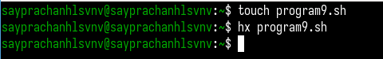
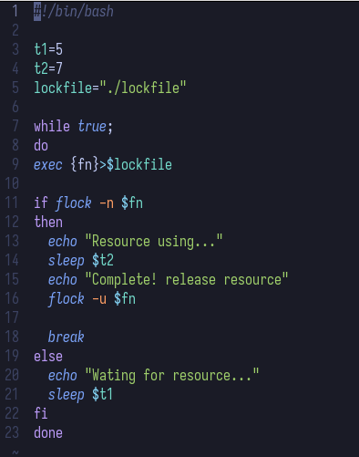
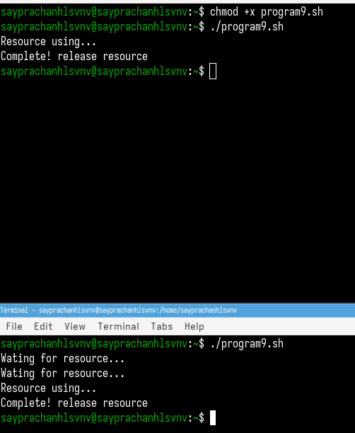
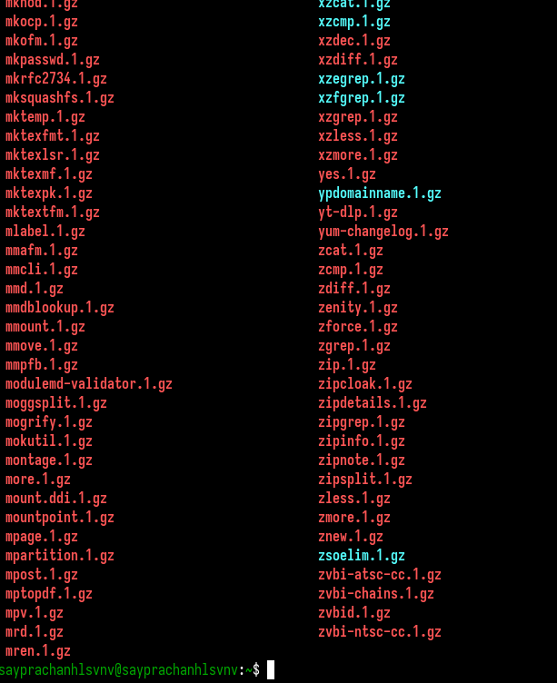
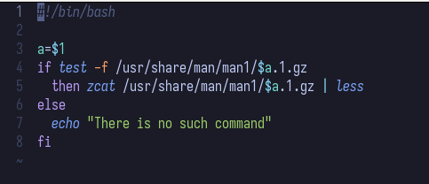
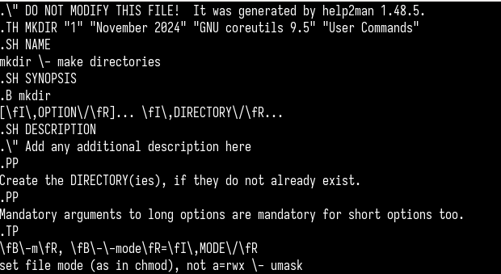
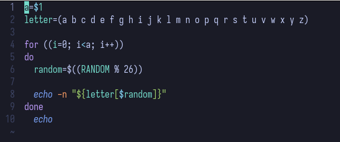

---
## Front matter
lang: ru-RU
title: Лабораторная работа №14
subtitle: Операционные системы
author:
  - Луангсуваннавонг Сайпхачан
institute:
  - Российский университет дружбы народов, Москва, Россия
date: 8 мая 2025

## i18n babel
babel-lang: russian
babel-otherlangs: english

## Formatting pdf
toc: false
toc-title: Содержание
slide_level: 2
aspectratio: 169
section-titles: true
theme: metropolis
header-includes:
 - \metroset{progressbar=frametitle,sectionpage=progressbar,numbering=fraction}
---

# Информация

## Докладчик

:::::::::::::: {.columns align=center}
::: {.column width="70%"}

  * Луангсуваннавонг Сайпхачан
  * Студент из группы НКАбд-01-24
  * Российский университет дружбы народов
  * <https://sayprachanh-lsvnv.github.io>

:::
::: {.column width="30%"}
:::
::::::::::::::

## Цель работы

Изучить основы программирования в оболочке ОС UNIX. Научится писать более
сложные командные файлы с использованием логических управляющих конструкций
и циклов.

## Задание

1. Написать командный файл, реализующий упрощённый механизм семафо-
ров. Командный файл должен в течение некоторого времени t1 дожидаться
освобождения ресурса, выдавая об этом сообщение, а дождавшись его осво-
бождения, использовать его в течение некоторого времени t2<>t1, также
выдавая информацию о том, что ресурс используется соответствующим
командным файлом (процессом). Запустить командный файл в одном вир-
туальном терминале в фоновом режиме, перенаправив его вывод в другой (>
/dev/tty#, где # — номер терминала куда перенаправляется вывод), в котором
также запущен этот файл, но не фоновом, а в привилегированном режиме.
Доработать программу так, чтобы имелась возможность взаимодействия
трёх и более процессов.

## Задание

2. Реализовать команду man с помощью командного файла. Изучите содер-
жимое каталога /usr/share/man/man1. В нем находятся архивы текстовых
файлов, содержащих справку по большинству установленных в системе
программ и команд. Каждый архив можно открыть командой less сразу
же просмотрев содержимое справки. Командный файл должен получать в
виде аргумента командной строки название команды и в виде результата
выдавать справку об этой команде или сообщение об отсутствии справки,
если соответствующего файла нет в каталоге man1.
3. Используя встроенную переменную $RANDOM, напишите командный файл,
генерирующий случайную последовательность букв латинского алфавита.
Учтите, что $RANDOM выдаёт псевдослучайные числа в диапазоне от 0 до 32767.

# Выполнение лабораторной работы

## Выполнение лабораторной работы

Я создаю файл 'program9.sh' и открываю его для редактирования. (рис. 1)

## Выполнение лабораторной работы

В файле 'program9.sh' я ввожу программу, которая реализует упрощённый механизм семафора
с помощью команды 'flock'. Программа будет использовать разные времена для ожидания и использования ресурса. (рис. 2)

## Выполнение лабораторной работы

Я запускаю программу. Программа во втором терминале ждёт, пока программа в первом терминале завершит
свой процесс, выводит сообщение, а затем начинает и завершает свой процесс. (рис. 3)

## Выполнение лабораторной работы

Далее я проверяю содержимое директории /usr/share/man/man1 для реализации следующей программы. (рис. 4)

## Выполнение лабораторной работы

Я создаю файл 'program10.sh' и ввожу программу, которая работает как команда man.
Программа принимает имя команды в качестве аргумента командной строки,
а затем с помощью команд 'less' и 'zcat' выводит информацию о команде. (рис. 5)

## Выполнение лабораторной работы

Я запускаю программу, ввожу имя команды, и она отображает справочную информацию по этой команде. (рис. 6 и рис. 7)

## Выполнение лабораторной работы

## Выполнение лабораторной работы

Затем я создаю файл 'program11.sh' и ввожу программу, которая генерирует случайную последовательность
букв латинского алфавита, используя встроенную переменную $RANDOM. (рис. 8)

## Выполнение лабораторной работы

Я запускаю программу, ввожу число генерируемых букв в качестве аргумента,
и она генерирует 10 случайных букв. (рис. 9)

## Выводы

Во время этой лабораторной работы я изучил основы программирования в оболочке UNIX. Научился писать более
сложные пакетные файлы, используя логические структуры управления и циклы.

# Спасибо за внимание

