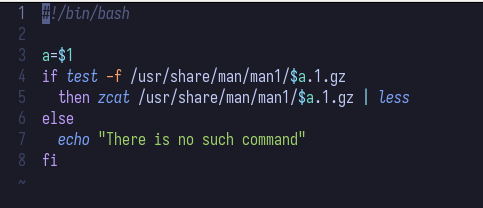

---
## Front matter
title: "Отчёт по лабораторной работе №14"
subtitle: "Операционные системы"
author: "Луангсуваннавонг Сайпхачан"

## Generic otions
lang: ru-RU
toc-title: "Содержание"

## Bibliography
bibliography: bib/cite.bib
csl: pandoc/csl/gost-r-7-0-5-2008-numeric.csl

## Pdf output format
toc: true # Table of contents
toc-depth: 2
lof: true # List of figures
lot: true # List of tables
fontsize: 12pt
linestretch: 1.5
papersize: a4
documentclass: scrreprt
## I18n polyglossia
polyglossia-lang:
  name: russian
  options:
	- spelling=modern
	- babelshorthands=true
polyglossia-otherlangs:
  name: english
## I18n babel
babel-lang: russian
babel-otherlangs: english
## Fonts
mainfont: IBM Plex Serif
romanfont: IBM Plex Serif
sansfont: IBM Plex Sans
monofont: IBM Plex Mono
mathfont: STIX Two Math
mainfontoptions: Ligatures=Common,Ligatures=TeX,Scale=0.94
romanfontoptions: Ligatures=Common,Ligatures=TeX,Scale=0.94
sansfontoptions: Ligatures=Common,Ligatures=TeX,Scale=MatchLowercase,Scale=0.94
monofontoptions: Scale=MatchLowercase,Scale=0.94,FakeStretch=0.9
mathfontoptions:
## Biblatex
biblatex: true
biblio-style: "gost-numeric"
biblatexoptions:
  - parentracker=true
  - backend=biber
  - hyperref=auto
  - language=auto
  - autolang=other*
  - citestyle=gost-numeric
## Pandoc-crossref LaTeX customization
figureTitle: "Рис."
tableTitle: "Таблица"
listingTitle: "Листинг"
lofTitle: "Список иллюстраций"
lotTitle: "Список таблиц"
lolTitle: "Листинги"
## Misc options
indent: true
header-includes:
  - \usepackage{indentfirst}
  - \usepackage{float} # keep figures where there are in the text
  - \floatplacement{figure}{H} # keep figures where there are in the text
---

# Цель работы

Изучить основы программирования в оболочке ОС UNIX. Научится писать более
сложные командные файлы с использованием логических управляющих конструкций
и циклов.


# Задание

1. Написать командный файл, реализующий упрощённый механизм семафоров. Командный файл должен в течение некоторого времени t1 дожидаться освобождения
ресурса, выдавая об этом сообщение, а дождавшись его освобождения, использовать
его в течение некоторого времени t2<>t1, также выдавая информацию о том, что
ресурс используется соответствующим командным файлом (процессом). Запустить
командный файл в одном виртуальном терминале в фоновом режиме, перенаправив
его вывод в другой (> /dev/tty#, где # — номер терминала куда перенаправляется
вывод), в котором также запущен этот файл, но не фоновом, а в привилегированном
режиме. Доработать программу так, чтобы имелась возможность взаимодействия трёх
и более процессов.
2. Реализовать команду man с помощью командного файла. Изучите содержимое каталога /usr/share/man/man1. В нем находятся архивы текстовых файлов, содержащих
справку по большинству установленных в системе программ и команд. Каждый архив
можно открыть командой less сразу же просмотрев содержимое справки. Командный
файл должен получать в виде аргумента командной строки название команды и в виде
результата выдавать справку об этой команде или сообщение об отсутствии справки,
если соответствующего файла нет в каталоге man1.
3. Используя встроенную переменную $RANDOM, напишите командный файл, генерирующий случайную последовательность букв латинского алфавита. Учтите, что $RANDOM
выдаёт псевдослучайные числа в диапазоне от 0 до 32767.

    
# Теоретическое введение

Командный процессор (командная оболочка, интерпретатор команд shell) — это программа, позволяющая пользователю взаимодействовать с операционной системой
компьютера. В операционных системах типа UNIX/Linux наиболее часто используются следующие реализации командных оболочек:

– оболочка Борна (Bourne shell или sh) — стандартная командная оболочка UNIX/Linux,
содержащая базовый, но при этом полный набор функций;

– С-оболочка (или csh) — надстройка на оболочкой Борна, использующая С-подобный
синтаксис команд с возможностью сохранения истории выполнения команд;

– оболочка Корна (или ksh) — напоминает оболочку С, но операторы управления программой совместимы с операторами оболочки Борна;

– BASH — сокращение от Bourne Again Shell (опять оболочка Борна), в основе своей совмещает свойства оболочек С и Корна (разработка компании Free Software Foundation).

POSIX (Portable Operating System Interface for Computer Environments) —  набор стандартов описания интерфейсов взаимодействия операционной системы и прикладных программ.
Стандарты POSIX разработаны комитетом IEEE (Institute of Electrical and Electronics Engineers) для обеспечения совместимости различных UNIX/Linux-подобных
операционных систем и переносимости прикладных программ на уровне исходного кода. POSIX-совместимые оболочки разработаны на базе оболочки Корна.
Рассмотрим основные элементы программирования в оболочке bash. В других оболочках большинство команд будет совпадать с описанными ниже.

# Выполнение лабораторной работы

Сначала я создаю файл 'program9.sh' и открываю его в текстовом редакторе для редактирования. (рис. [-@fig:001])

{#fig:001 width=70%}

В файле 'program9.sh' я ввожу программу, которая реализует упрощённый механизм семафора с помощью команды 'flock'.
Она ожидает некоторое время для ресурса (я установил это время на 5 секунд (t1)), выводя сообщение об этом,
а также время использования ресурса (я установил его на 7 секунд (t2)), и даёт информацию о том,
что ресурс используется соответствующим пакетом (процессом).  (рис. [-@fig:002])

{#fig:002 width=70%}

Код программы:

````
#!/bin/bash

t1=5
t2=7
lockfile="./lockfile"

while true;
do
exec {fn}>$lockfile

if flock -n $fn
then
  echo "Resource using..."
  sleep $t2
  echo "Complete! release resource"
  flock -u $fn

  break  
else
  echo "Wating for resource..."
  sleep $t1
fi
done
````

После этого я сохраняю файл, даю файлу права на выполнение и запускаю программу.
Открываю другой терминал и запускаю ту же команду. Программа во втором терминале ожидает завершения работы программы в первом терминале,
затем выводит сообщение, и только после завершения первой программы начинает использовать ресурс и завершает процесс, то есть программа работает корректно. (рис. [-@fig:003])

{#fig:003 width=70%}

Далее я проверяю содержимое директории /usr/share/man/man1 для реализации следующей программы. (рис. [-@fig:004])

{#fig:004 width=70%}

Я создаю файл 'program10.sh' и ввожу программу, которая работает как команда man, она принимает имя команды в качестве аргумента командной строки,
а затем с помощью команд 'less' и 'zcat' выводит справочную информацию о команде, указанной в аргументе командной строки. Программа также выведет сообщение,
если такой команды нет в директории man/man1. (рис. [-@fig:005])

{#fig:005 width=70%}

Код программы:

````
#!/bin/bash

a=$1
if test -f /usr/share/man/man1/$a.1.gz
  then zcat /usr/share/man/man1/$a.1.gz | less
else
  echo "There is no such command"
fi
````

Я сохраняю файл, даю файлу права на выполнение и запускаю программу, вводя команду в качестве аргумента.
Программа выводит справочную информацию по этой команде. (рис. [-@fig:006] и рис. [-@fig:007])

{#fig:006 width=70%}

{#fig:007 width=70%}

Затем я создаю файл 'program11.sh' и ввожу программу, которая генерирует случайную последовательность букв латинского алфавита, используя встроенную переменную $RANDOM.
Количество генерируемых букв будет задано в качестве аргумента командной строки. (рис. [-@fig:008])

{#fig:008 width=70%}

Код программы:

````
#!/bin/bash

a=$1
letter=(a b c d e f g h i j k l m n o p q r s t u v w x y z)

for ((i=0; i<a; i++))
do
  random=$((RANDOM % 26))

  echo -n "${letter[$random]}"
done
  echo
````

Я сохраняю файл и запускаю программу, вводя число генерируемых букв в качестве аргумента.
В результате программа генерирует 10 случайных букв, то есть программа работает корректно. (рис. [-@fig:009])

{#fig:009 width=70%}

# Выводы

Во время этой лабораторной работы я изучил основы программирования в оболочке UNIX. Научился писать более
сложные пакетные файлы, используя логические структуры управления
и циклы.

# Ответы на контрольные вопросы

1. Найдите синтаксическую ошибку в строке: while `[$1 != "exit"]`

В этой строке есть несколько ошибок. Во-первых, в bash после [ и перед ] обязательно должны быть пробелы. Без них команда не сработает.
Во-вторых, переменную $1 лучше взять в двойные кавычки, потому что она может содержать пробелы.

Правильная версия будет: while `[ "$1" != "exit" ]`

2. Как объединить несколько строк в одну?

В bash склеить строки можно просто написав их рядом.
Например, если есть переменные VAR1="Hello," и VAR2=" World", то VAR3="$VAR1$VAR2" создаст строку Hello, World.
Можно ещё использовать +=, например: VAR1="Hello,", потом VAR1+=" World". Результат будет тот же — Hello, World.

3. Что делает команда seq, и чем её можно заменить в bash?

Команда seq нужна, чтобы сделать последовательность чисел. Например, seq 5 выведет от 1 до 5. Можно задать начальное число, шаг и конечное, например: seq 1 2 9 даст 1, 3, 5, 7, 9.
Но эту команду можно заменить обычным циклом в bash: `for ((i=1; i<=10; i++))` он делает то же самое.
Также можно использовать фигурные скобки: {1..10} — это ещё один способ сделать последовательность.


4. Какой результат даст выражение $((10/3))?

Ответ будет 3, потому что bash делает только целочисленное деление. То есть дробная часть просто отбрасывается. Даже если 10 делится на 3 с остатком, bash покажет только целую часть.


5. Чем zsh отличается от bash?

Zsh — это как улучшенная версия bash.
У неё лучше автодополнение (например, если нажать Tab после cd, покажет папки), есть встроенный калькулятор zcalc, можно работать с числами с запятой.
Также поддерживаются хэши (ассоциативные массивы), продвинутый способ дописывания путей, и даже возможность разделить экран терминала, как в Vim.
В общем, zsh удобнее для работы вручную в терминале.


6. Правильна ли конструкция for ((a=1; a <= LIMIT; a++))?

Да, конструкция правильная. В bash такие циклы с двойными скобками работают как в языке C.
Там можно не ставить $ перед переменными. Главное, чтобы переменная LIMIT была определена (например, LIMIT=5), тогда всё будет работать.


7. Сравните bash с другими языками программирования. Какие плюсы и минусы?

Bash отлично подходит для автоматизации задач в Linux и macOS,
так как он предустановлен и хорошо интегрируется с системными командами. Он прост в использовании и идеально подходит для работы с файлами и пакетами.
Однако это не язык общего назначения, как Python, у него нет сложных структур данных, и выполнение команд может быть медленным из-за того, что каждая команда запускается в отдельном процессе.
Также bash-скрипты не кросс-платформенные и требуют настроек для работы на Windows.


# Список литературы{.unnumbered}

[Лабораторная работа №14](https://esystem.rudn.ru/pluginfile.php/2586880/mod_resource/content/4/012-lab_shell_prog_3.pdf)

::: {#refs}
:::
