---
## Front matter
lang: ru-RU
title: Индивидуальный проект №1
subtitle: Операционные системы
author:
  - Луангсуваннавонг Сайпхачан
institute:
  - Российский университет дружбы народов, Москва, Россия
date: 07 Марта 2025

## i18n babel
babel-lang: russian
babel-otherlangs: english

## Formatting pdf
toc: false
toc-title: Содержание
slide_level: 2
aspectratio: 169
section-titles: true
theme: metropolis
header-includes:
 - \metroset{progressbar=frametitle,sectionpage=progressbar,numbering=fraction}
---

## Цель работы

Учиться размещать сайт на GitHub page и выполнить первый этап реального
индивидуального проекта

## Задание

1. Установить необходимое программное обеспечение
2. Скачать шаблон темы сайта
3. Разместить его на хостинге git
4. Установить параметр для URLs сайта
5. Разместить заготовку сайта на Github pages

## Установить необходимое программное обеспечение

Я устанавливаю hugo из браузера страницы на github (рис. 1)

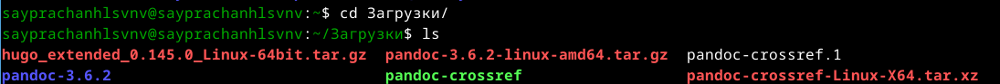

## Установить необходимое программное обеспечение

Я извлекаю установленный файл (рис. 2)

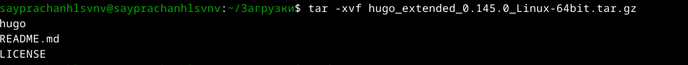

## Установить необходимое программное обеспечение

Я создаю каталог для размещения программы выполнения hugo (рис. 3)

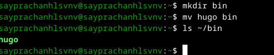

## Скачать шаблон темы сайта

Я захожу на Github и создаю новый репозиторий с именем "blog",
в котором я использую шаблон repository HugoBlox
в качестве основного шаблона для моего репозитория (рис. 4)

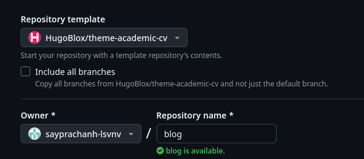

## Скачать шаблон темы сайта

После репозиторий был создан, я перехожу в каталог “work” и клонирую созданный репозиторий в этот каталог (рис. 5)

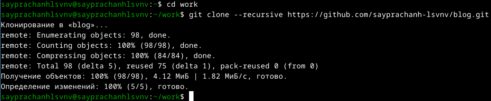

## Скачать шаблон темы сайта

Я захожу в каталог, который я клонировал из репозитория (рис. 6)

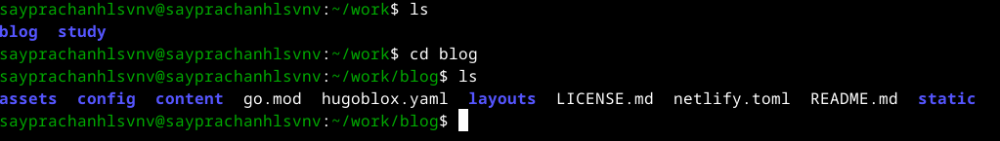

## Разместить его на хостинге git

Затем я начинаю создавать веб-сайт, используя команду hugo, которая находится в каталоге bin (рис. 7)

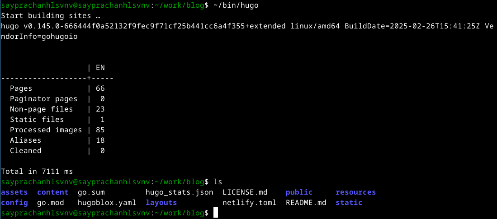

## Разместить его на хостинге git

Используя hugo server, я запускаю веб-сайт на своем локальном хостинге, чтобы просмотреть веб-сайт перед размещением реального сайта. (рис. 8)

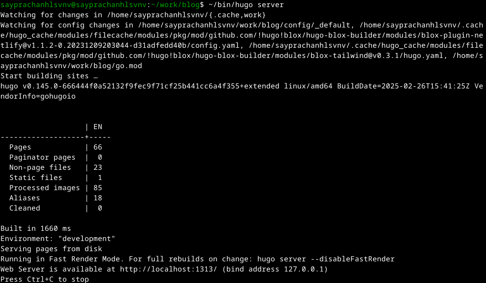

## Разместить его на хостинге git

В целом, веб-сайт выглядит нормально, мы видим, что ссылка на веб-сайт - localhost, который размещается с моего компьютера (рис. 9)

## Установить параметр для URLs сайта

Я захожу на Github и создаю новый репозиторий, так как именно в нем я буду размещать веб-сайт (рис. 10)

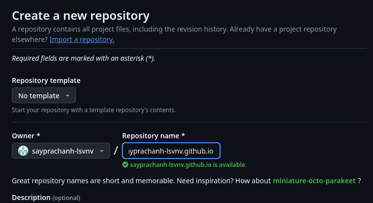

## Установить параметр для URLs сайта

После создания репозитория я клонирую его в свой локальный каталог (рис. 11)

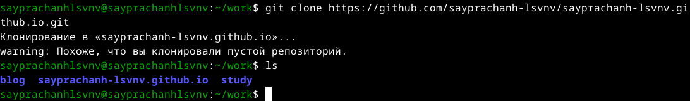

## Установить параметр для URLs сайта

Перехожу в  репозиторий и меняю новую ветку на “main”,
добавляю файл README.md, делаю первый коммит и отправляю его на Github сервер (рис. 12)

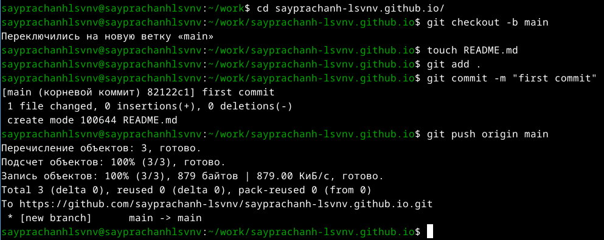

## Установить параметр для URLs сайта

Файл был добавлен (рис. 13)

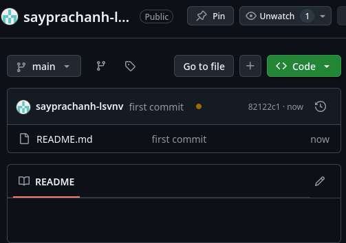

## Установить параметр для URLs сайта

Перехожу в каталог blog и удаляю каталог “public” (рис. 14)

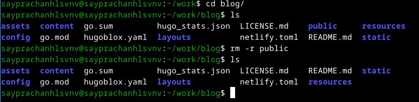

## Установить параметр для URLs сайта

Я создаю новый каталог "public", но устанавливаю его как подкаталог репозитория, в котором мы будем размещать веб-сайт (рис. 15)

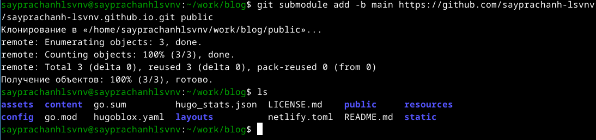

## Установить параметр для URLs сайта

Я перечисляю удаленные репозитории, связанные с локальным репозиторием 'public' (рис. 16)

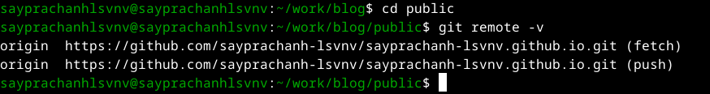

## Установить параметр для URLs сайта

После этого я создаю файлы для создания сайта в каталоге public (рис. 17)

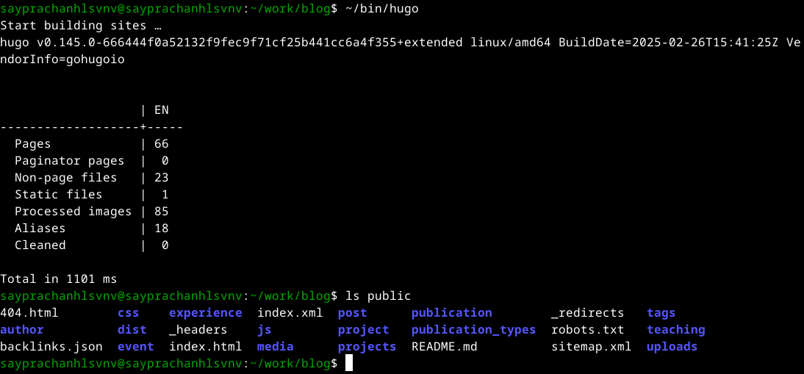

## Установить параметр для URLs сайта

Затем я добавляю все файлы в индекс Github (рис. 18)

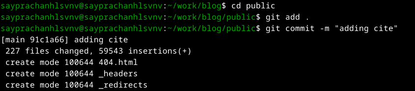

## Установить параметр для URLs сайта

Я отправляю все файлы на сервер (рис. 19)

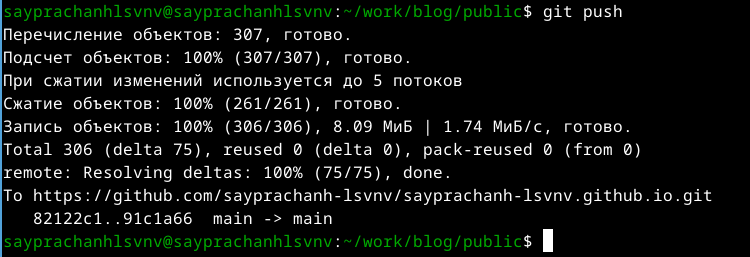

## Разместить заготовку сайта на Github pages

Удаленный репозиторий обновлен, и зеленая галочка указывает на то, что веб-сайт готов (рис. 20)

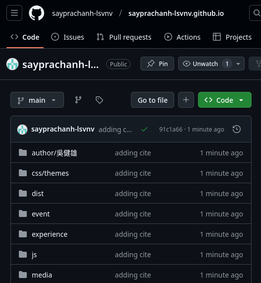

## Разместить заготовку сайта на Github pages

На Github-pages мы можем разместить ссылку на наш веб-сайт (рис. 21)

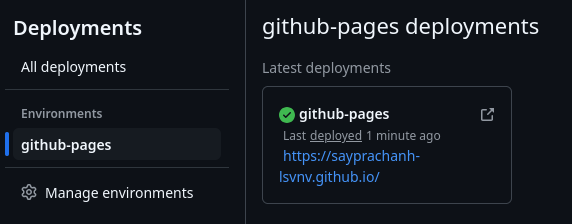

## Разместить заготовку сайта на Github pages

Я нажимаю на ссылку, и открывается веб-сайт с названием ссылки после имени моего репозитория (рис. 22)

## Разместить заготовку сайта на Github pages

После этого я добавляю все на Github (рис. 23)

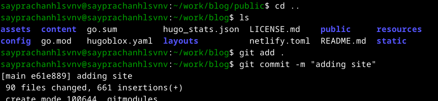

## Разместить заготовку сайта на Github pages

Я отправляю все на сервер GitHub (рис. 24)

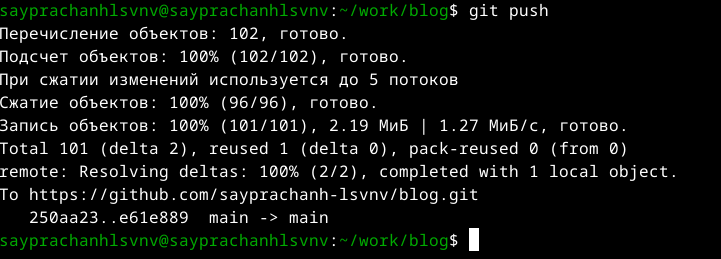

## Выводы

Я научился размещать сайт на github, а потому выполнил первый этап реаль-
ного индивидуального проекта
