---
## Front matter
title: "Отчет по индивидуальному проекту №1"
subtitle: "Операционные системы"
author: "Луангсуваннавонг Сайпхачан"

## Generic otions
lang: ru-RU
toc-title: "Содержание"

## Bibliography
bibliography: bib/cite.bib
csl: pandoc/csl/gost-r-7-0-5-2008-numeric.csl

## Pdf output format
toc: true # Table of contents
toc-depth: 2
lof: true # List of figures
lot: true # List of tables
fontsize: 12pt
linestretch: 1.5
papersize: a4
documentclass: scrreprt
## I18n polyglossia
polyglossia-lang:
  name: russian
  options:
	- spelling=modern
	- babelshorthands=true
polyglossia-otherlangs:
  name: english
## I18n babel
babel-lang: russian
babel-otherlangs: english
## Fonts
mainfont: IBM Plex Serif
romanfont: IBM Plex Serif
sansfont: IBM Plex Sans
monofont: IBM Plex Mono
mathfont: STIX Two Math
mainfontoptions: Ligatures=Common,Ligatures=TeX,Scale=0.94
romanfontoptions: Ligatures=Common,Ligatures=TeX,Scale=0.94
sansfontoptions: Ligatures=Common,Ligatures=TeX,Scale=MatchLowercase,Scale=0.94
monofontoptions: Scale=MatchLowercase,Scale=0.94,FakeStretch=0.9
mathfontoptions:
## Biblatex
biblatex: true
biblio-style: "gost-numeric"
biblatexoptions:
  - parentracker=true
  - backend=biber
  - hyperref=auto
  - language=auto
  - autolang=other*
  - citestyle=gost-numeric
## Pandoc-crossref LaTeX customization
figureTitle: "Рис."
tableTitle: "Таблица"
listingTitle: "Листинг"
lofTitle: "Список иллюстраций"
lotTitle: "Список таблиц"
lolTitle: "Листинги"
## Misc options
indent: true
header-includes:
  - \usepackage{indentfirst}
  - \usepackage{float} # keep figures where there are in the text
  - \floatplacement{figure}{H} # keep figures where there are in the text
---

# Цель работы

Учиться размещать сайт на GitHub page и выполнить первый этап реального индивидуального проекта

# Задание

 1. Установить необходимое программное обеспечение
 2. Скачать шаблон темы сайта
 3. Разместить его на хостинге git
 4. Установить параметр для URLs сайта
 5. Разместить заготовку сайта на Github pages

# Выполнение лабораторной работы

## Установить необходимое программное обеспечение

Сначала я загружаю необходимую программу, которой является hugo. Я загружаю ее из браузера (рис. [-@fig:001])

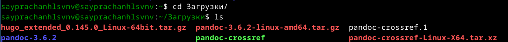{#fig:001 width=70%}

Я извлекаю загруженный файл. В файле есть программа hugo, файл markdown README.md и файл "лицензия" (рис. [-@fig:002])

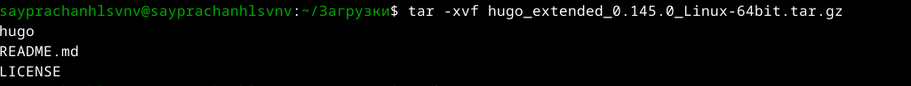{#fig:002 width=70%}

Затем я создаю новый каталог, в который помещаю программу hugo. Используя утилиту mv, я перемещаю hugo в папку bin (рис. [-@fig:003])

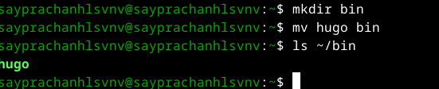{#fig:003 width=70%}

## Скачать шаблон темы сайта

Я захожу в репозиторий с шаблоном сайта и использую его в качестве шаблона репозитория. Я создаю новый репозиторий "blog",
который мы будем использовать в качестве основы шаблона" (рис. [-@fig:004])

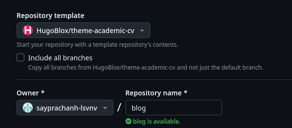{#fig:004 width=70%}

После репозиторий был создан, я перехожу в каталог "work" и клонирую созданный репозиторий в этот каталог (рис. [-@fig:005])

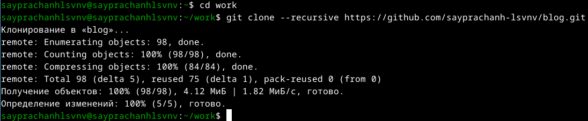{#fig:005 width=70%}

Я захожу в каталог, который я клонировал из репозитория (рис. [-@fig:006])

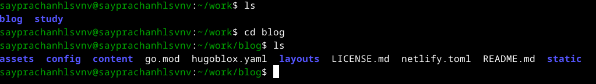{#fig:006 width=70%}

## Разместить его на хостинге git

Далее я начинаю создавать файлы для создания сайта,
используя команду hugo, которую я вызываю из каталога bin (рис. [-@fig:007])

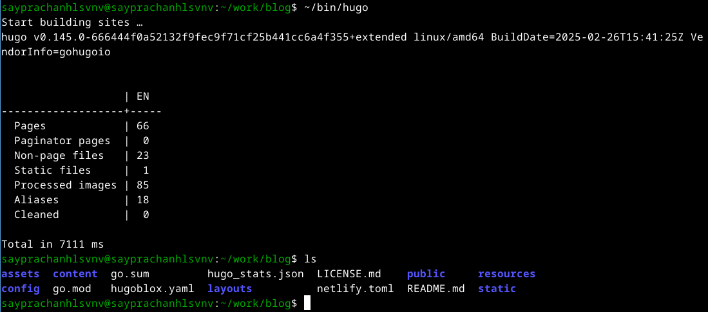{#fig:007 width=70%}

Используя команду huge server, я запускаю сайт в своей локальной системе,
чтобы проверить демонстрационный веб-сайт, который мы позже отправим на github
для размещения реального сайта (рис. [-@fig:008])

{#fig:008 width=70%}

Мы видим, что ссылка на веб-сайт является localhost, так как я размещаю веб-сайт на своем компьютере. (рис. [-@fig:009])

{#fig:009 width=70%}

## Установить параметр для URLs сайта

Затем я захожу на свой Github и создаю новый репозиторий.
Я называю репозиторий с помощью .github.io
поскольку мы используем это название в качестве ссылки на веб-сайт (рис. [-@fig:010])

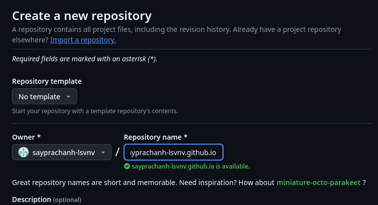{#fig:010 width=70%}

После создания репозитория я клонирую его в свой локальный каталог (рис. [-@fig:011])

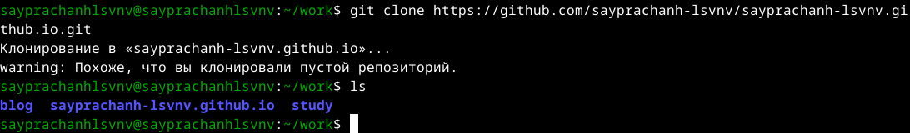{#fig:011 width=70%}

Я перехожу в клонированный репозиторий и меняю новую ветку на "main",
добавляю файл README.md, делаю первый коммит и отправляю его на Github-сервер (рис. [-@fig:012])

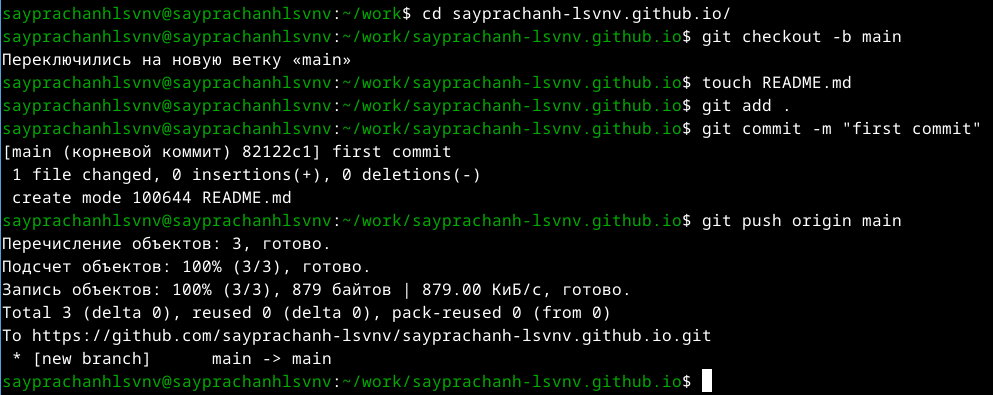{#fig:012 width=70%}

Файл был добавлен (рис. [-@fig:013])

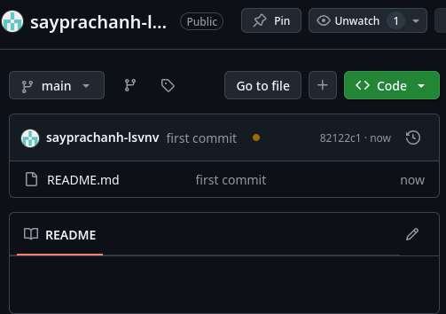{#fig:013 width=70%}

После этого я перехожу в каталог blog и удаляю каталог "public", так как мы создадим новый (рис. [-@fig:014])

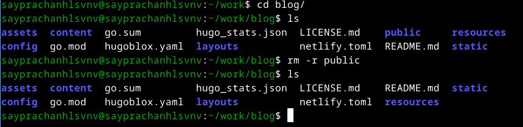{#fig:014 width=70%}

Я создаю новый общедоступный каталог, но, используя подмодуль git,
я устанавливаю подкаталог этого каталога в каталог, который мы разместим на github pages (рис. [-@fig:015])

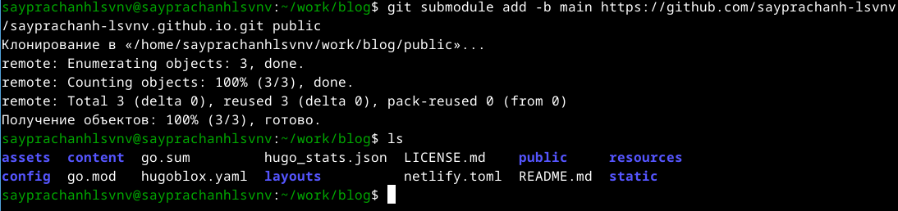{#fig:015 width=70%}

Используя команду git remote -v, я перечисляю удаленные репозитории, связанные с этим локальным репозиторием (рис. [-@fig:014])

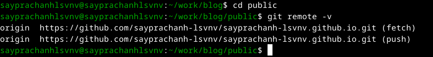{#fig:016 width=70%}

После этого я создаю файлы для создания сайта в общедоступном каталоге (рис. [-@fig:017])

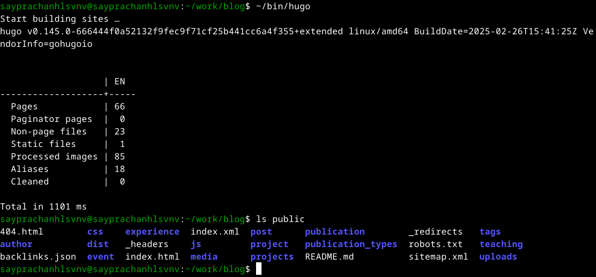{#fig:017 width=70%}

затем я добавляю все файлы в индекс Github (рис. [-@fig:018])

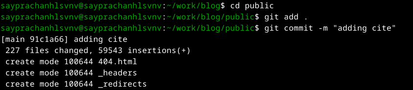{#fig:018 width=70%}

Я отправляю все файлы на сервер (рис. [-@fig:019])

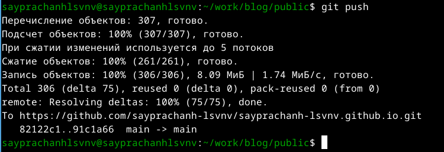{#fig:019 width=70%}

## Разместить заготовку сайта на Github pages

Удаленный репозиторий на Github обновлен, и мы видим, что новые файлы были добавлены
а также появляется зеленая правильная отметка, означает, что Github pages успешно развернута (рис. [-@fig:020])

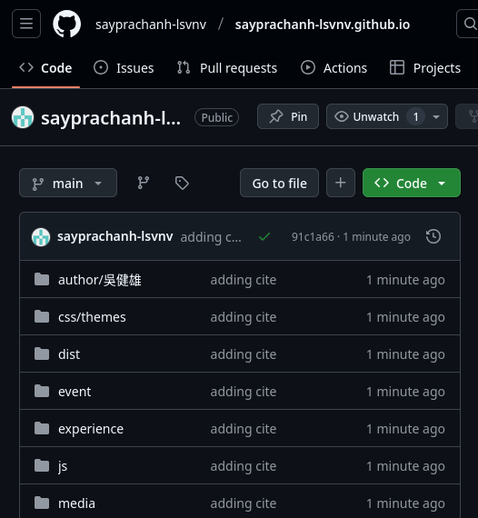{#fig:020 width=70%}

На Github-pages мы можем разместить ссылку на наш веб-сайт (рис. [-@fig:021])

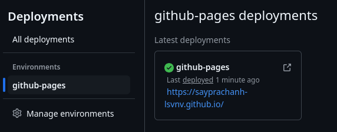{#fig:021 width=70%}

Я нажимаю на ссылку, и открывается веб-сайт с названием ссылки после имени моего репозитория (рис. [-@fig:022])

{#fig:022 width=70%}

После этого я добавляю все на Github (рис. [-@fig:023])

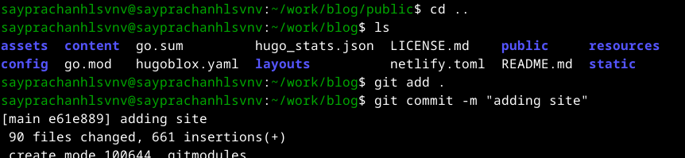{#fig:023 width=70%}

Я отправляю все на сервер GitHub (рис. [-@fig:024])

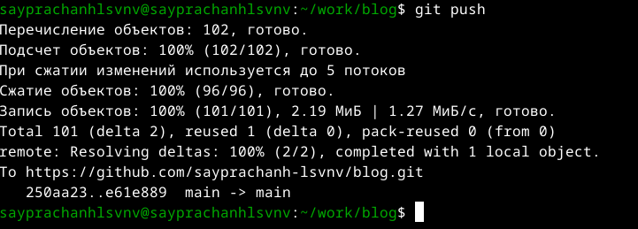{#fig:024 width=70%}

# Выводы

Я научился размещать сайт на github, а потому выполнил первый этап реального индивидуального проекта
