---
## Front matter
lang: ru-RU
title: Индивидуальный проект №2
subtitle: Операционные системы
author:
  - Луангсуваннавонг Сайпхачан
institute:
  - Российский университет дружбы народов, Москва, Россия
  
date: 21 марта 2025

## i18n babel
babel-lang: russian
babel-otherlangs: english

## Formatting pdf
toc: false
toc-title: Содержание
slide_level: 2
aspectratio: 169
section-titles: true
theme: metropolis
header-includes:
 - \metroset{progressbar=frametitle,sectionpage=progressbar,numbering=fraction}
---

## Цель работы

Целью этой работы является добавление информации на огромный удаленный
веб-сайт, а также размещение некоторого контента на веб-сайте

## Задание

1. Разместить фотографию владельца сайта.
2. Разместить краткое описание владельца сайта (Biography).
3. Добавить информацию об интересах (Interests).
4. Добавить информацию от образовании (Education).
5. Сделать пост по прошедшей неделе.
6. Добавить пост на тему: Управление версиями. Git.

## Добавление информации о владельце веб-сайта

Я захожу в каталог "blog", затем перехожу в каталог content/authors/admin, добавляю свою фотографию профиля, меняю имя и добавляю биографию в файл _index.md. (рис. 1)

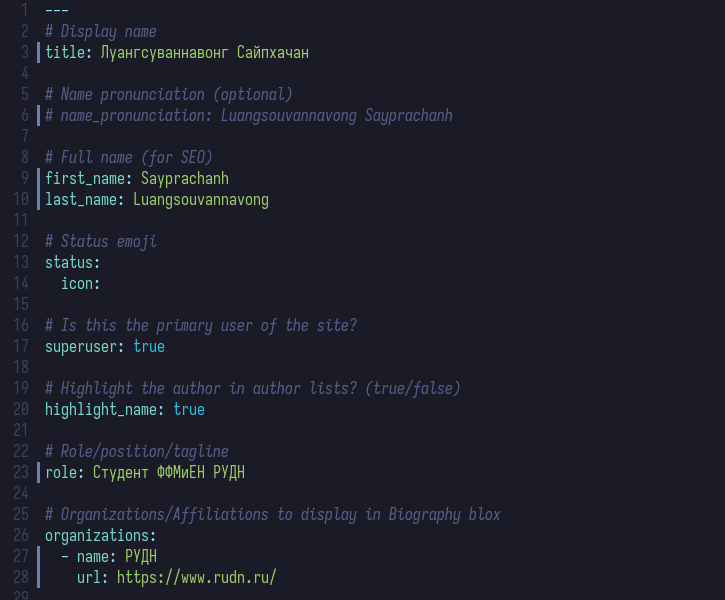

## Добавление информации о владельце веб-сайта

Я сохраняю файл и проверяю работу на локальном хостинге (рис. 2)

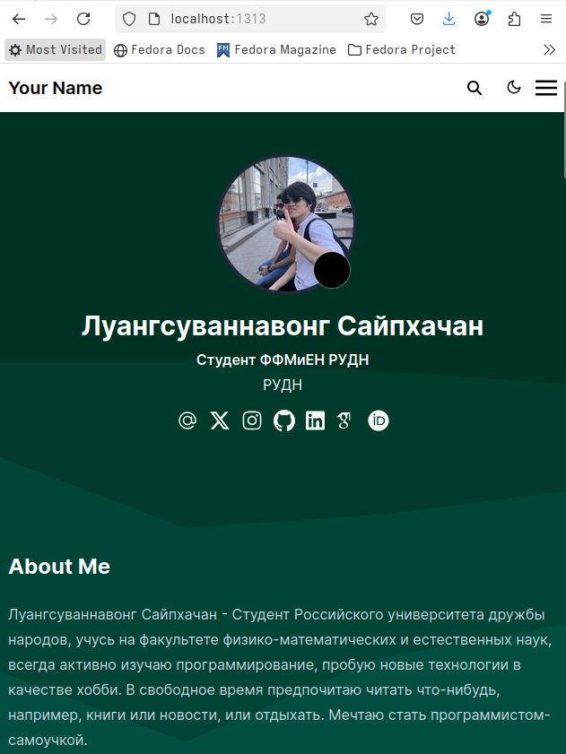

## Добавление информации о владельце веб-сайта

Я добавляю информацию о своих интересах и образовании в раздел "interests и education" (рис. 3)

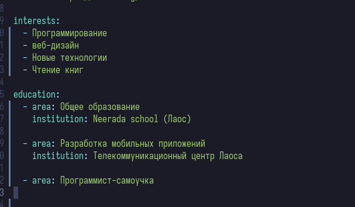

## Добавление информации о владельце веб-сайта

Локальный хостинг обновляется автоматически, поэтому я могу проверить работу сразу после сохранения файла (рис. 4)

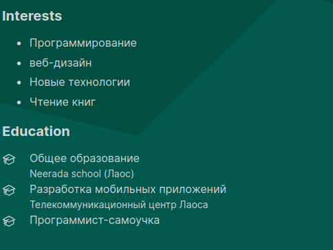

## Создание постов на веб-сайте

Я перехожу в каталог "post", где я буду писать посты на своем сайте. Я создаю новый каталог для хранения файла о публикации
потом начинаю писать пост о том, что произошло на прошлой неделе (рис. 5)

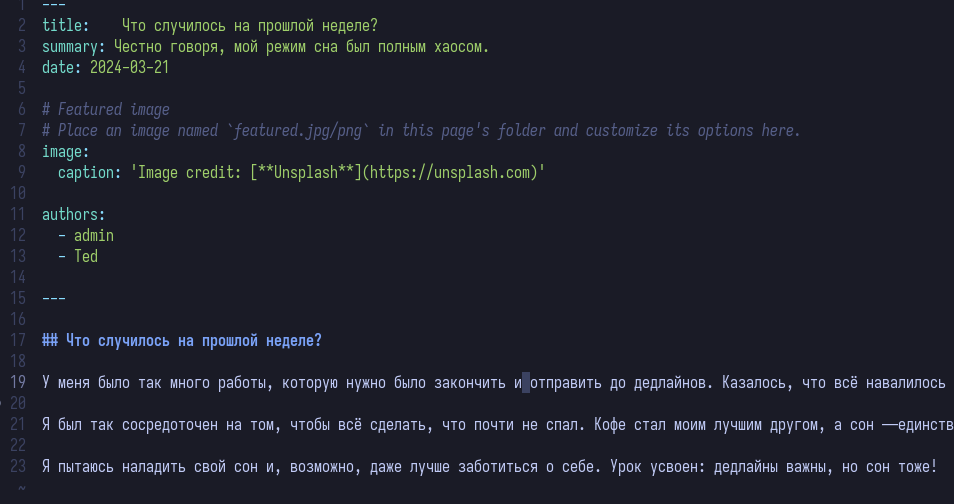

## Создание постов на веб-сайте

Затем я создаю другой каталог для другого поста. Я создаю пост о системе управления версиями Git (рис. 6)

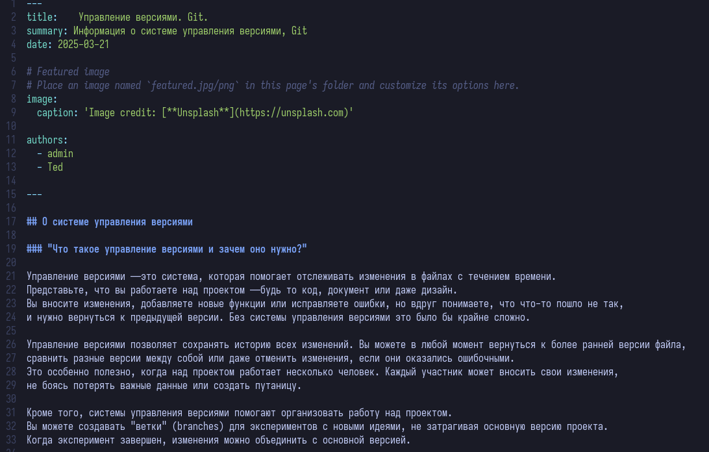

## Создание постов на веб-сайте

Я сохраняю файлы и проверяю правильность размещения сообщений на локальном веб-сайте хостинга (рис. 7)

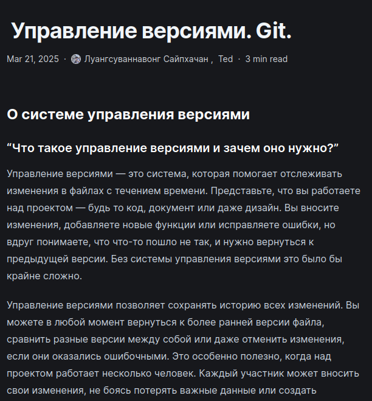

## Создание постов на веб-сайте

Затем я применяю изменения к веб-сайту удаленного каталога, используя команду ~/bin/hugo (рис. 8)

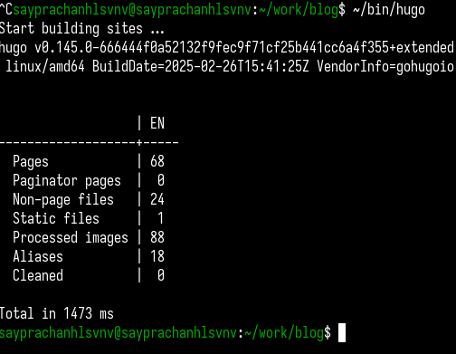

## Создание постов на веб-сайте

Я добавляю и отправляю все изменения в каталог "блог" на сервере Github (рис. 9)

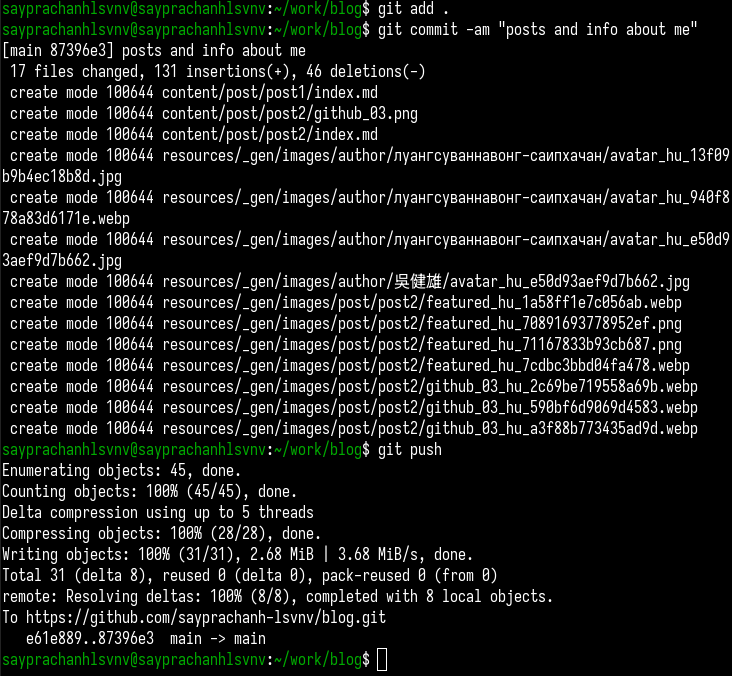

## Создание постов на веб-сайте

Я добавляю и отправляю все изменения в каталог "public" сервера github, так как я буду использовать этот каталог для размещения реального веб-сайта (рис. 10)

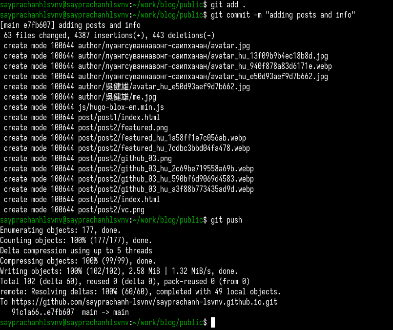

## Создание постов на веб-сайте

Я ввожу ссылку на веб-сайт в браузер и проверяю работу. Все было добавлено правильно, я могу видеть свою биографию, а также свои посты (рис. 11 и рис. 12)

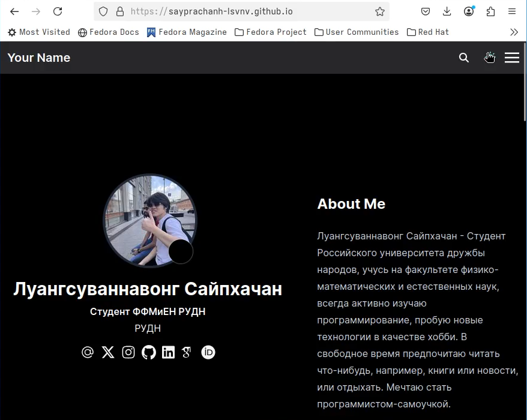

## Создание постов на веб-сайте

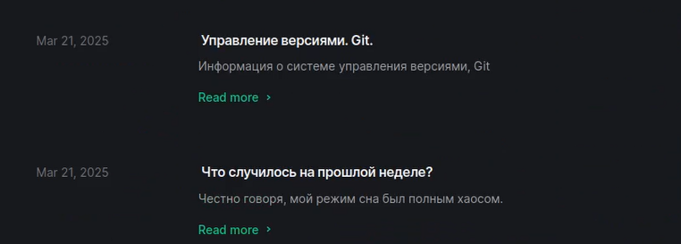

## Выводы

Во время выполнения индивидуального проекта я изучил, как изменять файлы
веб-сайта, а также общую структуру веб-сайта и как мы добавляем информацию
и посты на веб-сайт
