---
## Front matter
title: "Отчёт по индивидуальному проекту №2"
subtitle: "Опереционные системы"
author: "Луангсуваннавонг Сайпхачан"

## Generic otions
lang: ru-RU
toc-title: "Содержание"

## Bibliography
bibliography: bib/cite.bib
csl: pandoc/csl/gost-r-7-0-5-2008-numeric.csl

## Pdf output format
toc: true # Table of contents
toc-depth: 2
lof: true # List of figures
lot: true # List of tables
fontsize: 12pt
linestretch: 1.5
papersize: a4
documentclass: scrreprt
## I18n polyglossia
polyglossia-lang:
  name: russian
  options:
	- spelling=modern
	- babelshorthands=true
polyglossia-otherlangs:
  name: english
## I18n babel
babel-lang: russian
babel-otherlangs: english
## Fonts
mainfont: IBM Plex Serif
romanfont: IBM Plex Serif
sansfont: IBM Plex Sans
monofont: IBM Plex Mono
mathfont: STIX Two Math
mainfontoptions: Ligatures=Common,Ligatures=TeX,Scale=0.94
romanfontoptions: Ligatures=Common,Ligatures=TeX,Scale=0.94
sansfontoptions: Ligatures=Common,Ligatures=TeX,Scale=MatchLowercase,Scale=0.94
monofontoptions: Scale=MatchLowercase,Scale=0.94,FakeStretch=0.9
mathfontoptions:
## Biblatex
biblatex: true
biblio-style: "gost-numeric"
biblatexoptions:
  - parentracker=true
  - backend=biber
  - hyperref=auto
  - language=auto
  - autolang=other*
  - citestyle=gost-numeric
## Pandoc-crossref LaTeX customization
figureTitle: "Рис."
tableTitle: "Таблица"
listingTitle: "Листинг"
lofTitle: "Список иллюстраций"
lotTitle: "Список таблиц"
lolTitle: "Листинги"
## Misc options
indent: true
header-includes:
  - \usepackage{indentfirst}
  - \usepackage{float} # keep figures where there are in the text
  - \floatplacement{figure}{H} # keep figures where there are in the text
---

# Цель работы

Целью этой работы является добавление информации на огромный удаленный веб-сайт, а также размещение некоторого контента на веб-сайте

# Задание

 1. Разместить фотографию владельца сайта.
 2. Разместить краткое описание владельца сайта (Biography).
 3. Добавить информацию об интересах (Interests).
 4. Добавить информацию от образовании (Education).
 5. Сделать пост по прошедшей неделе.
 6. Добавить пост на тему: Управление версиями. Git.

# Выполнение лабораторной работы
## Добавление информации о владельце веб-сайта

Сначала я перехожу в директорию blog, которую создал, затем перемещаюсь в директорию `content/authors/admin`, добавляю свою фотографию профиля,
а также изменяю имя и добавляю биографию в файл `_index.md`. (рис. [-@fig:001])

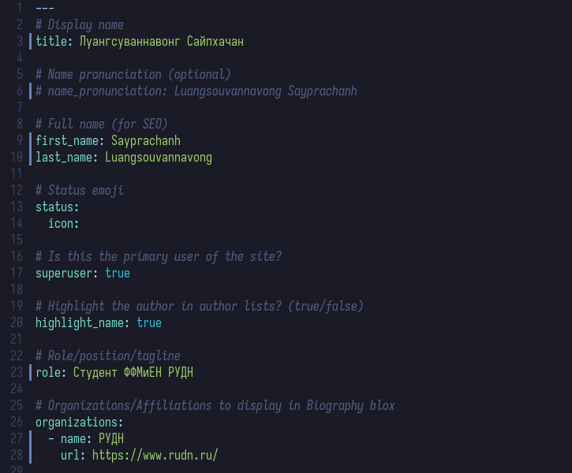{#fig:001 width=70%}

После сохранения файла, я запускаю локальный хостинг сайта, чтобы проверить правильность выполненной работы. (рис. [-@fig:002])  

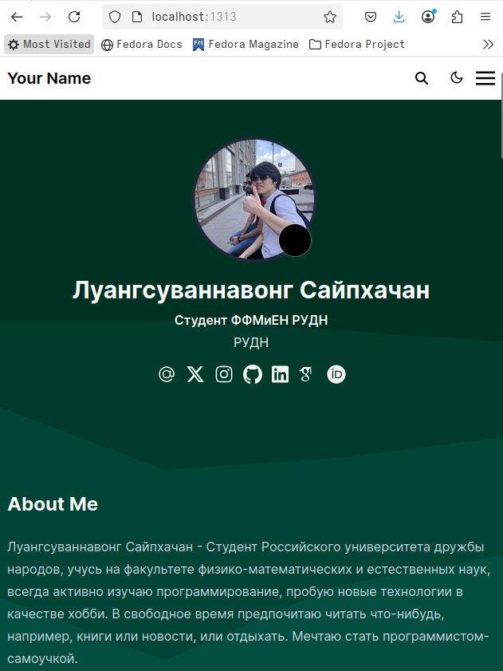{#fig:002 width=70%}

Затем я перехожу в раздел interests и education, изменяю его на свою информацию, добавляю то, что меня интересует, и информацию о своем образовании. (рис. [-@fig:003])

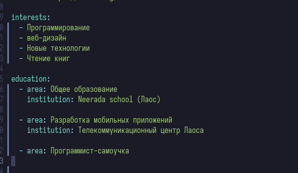{#fig:003 width=70%}

После сохранения файлов, локальный хостинг автоматически обновляется, и я проверяю результат. (рис. [-@fig:004])

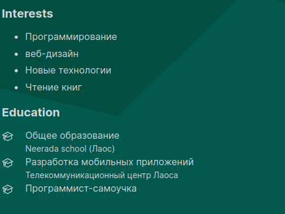{#fig:004 width=70%}

## Создание постов на веб-сайте

Я перехожу в раздел публикаций, где буду писать свои посты для сайта. Сначала я создаю пост о том, что произошло за последнюю неделю. (рис. [-@fig:005])

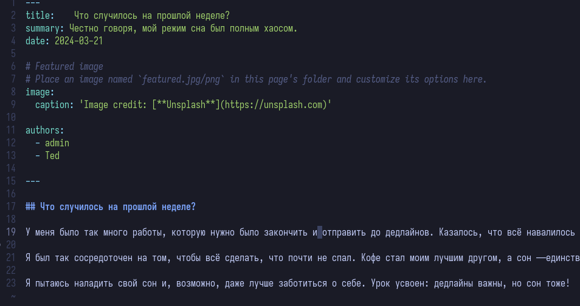{#fig:005 width=70%}

Следующий пост, который я опубликую на своем сайте, будет содержать информацию о системе контроля версий Git. Я создаю директорию и файл `index.md` для создания поста.
Я добавляю информацию о системе контроля версий Git. После завершения написания поста, я сохраняю файл. (рис. [-@fig:006])

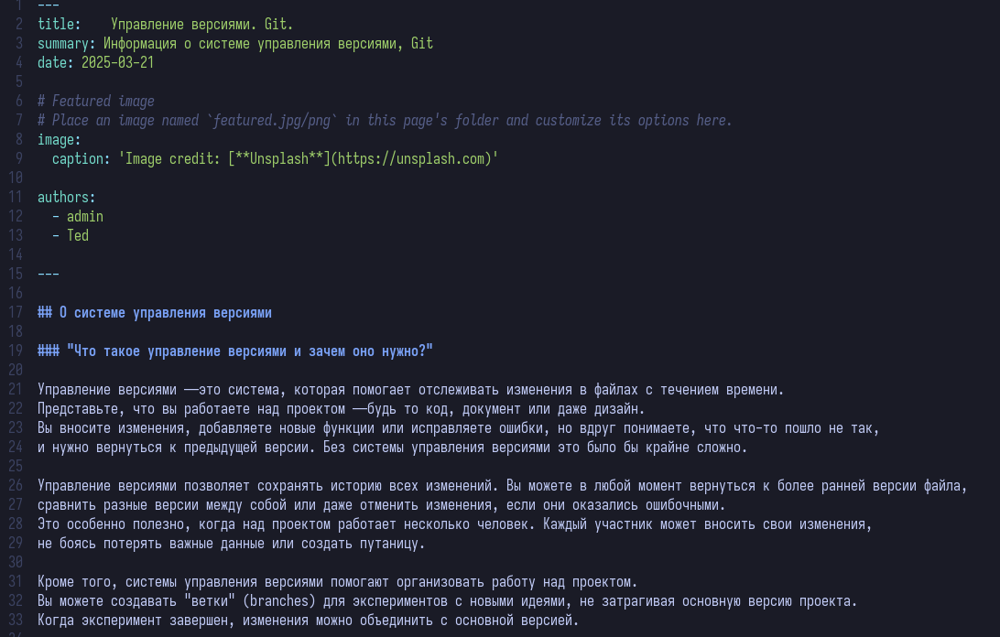{#fig:006 width=70%}

Я проверяю правильность выполненной работы на локальном хостинге. (рис. [-@fig:007])

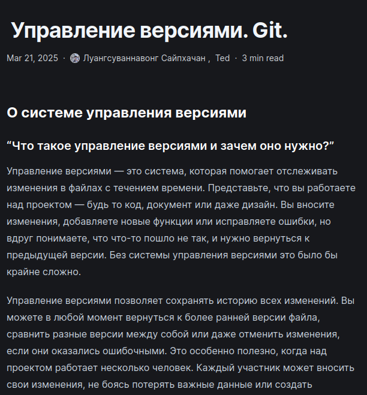{#fig:007 width=70%}

С помощью команды `~/bin/hugo` я применяю изменения в удаленной директории сайта. (рис. [-@fig:008])

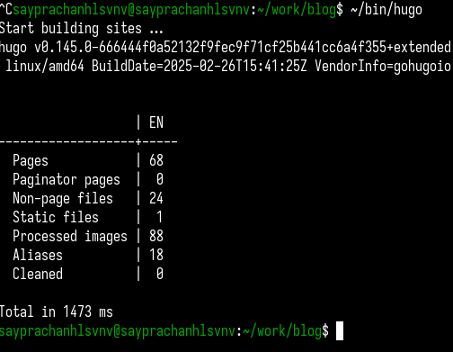{#fig:008 width=70%}

Затем я добавляю все файлы и изменения в директории 'blog' и отправляю все изменения на сервер GitHub. (рис. [-@fig:009])

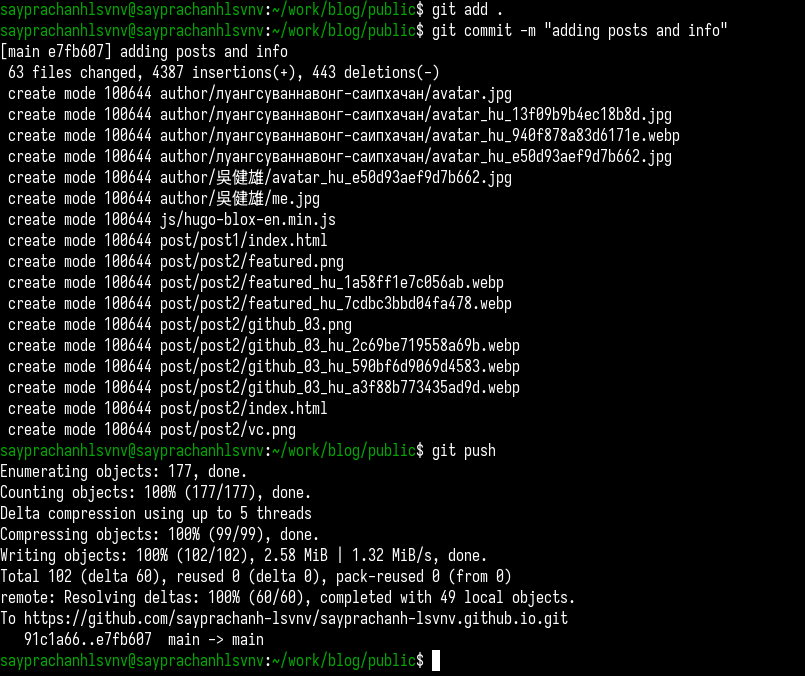{#fig:009 width=70%}

Я также добавляю все изменения в папке `public` в директории 'blog' и отправляю их на сервер GitHub, так как это папка, которую я использую для хостинга удаленного сайта. (рис. [-@fig:010])

{#fig:010 width=70%}

Я ввожу ссылку на удаленный сайт в браузере и проверяю работу. Все работает корректно. На сайте есть вся информация и посты, которые я создал. (рис. [-@fig:011] и рис. [-@fig:012])

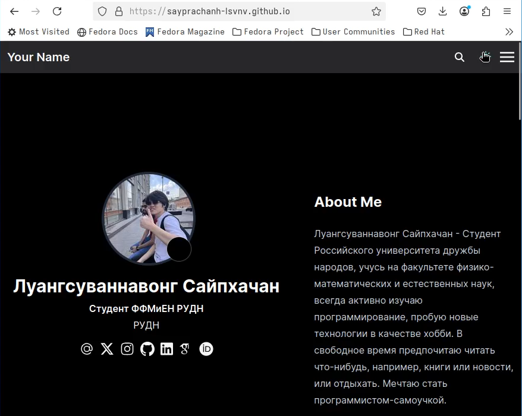{#fig:011 width=70%}

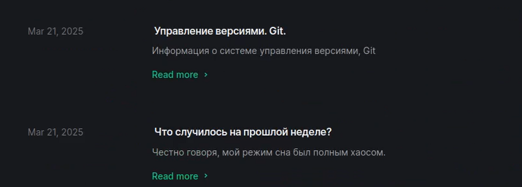{#fig:012 width=70%}

# Выводы

Во время выполнения индивидуального проекта я изучил, как изменять файлы веб-сайта, а также общую структуру веб-сайта и как мы добавляем информацию и посты на веб-сайт

