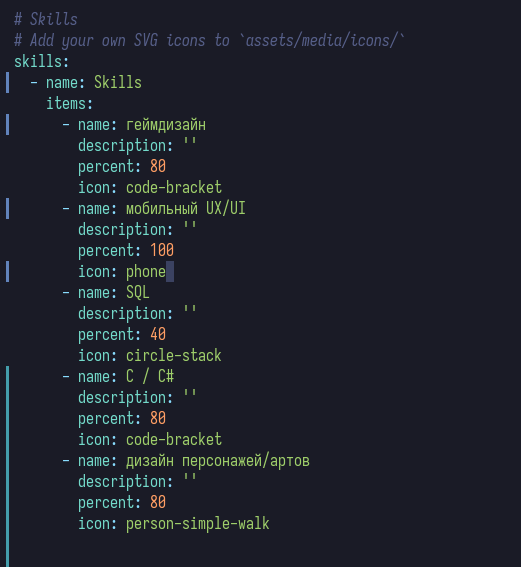
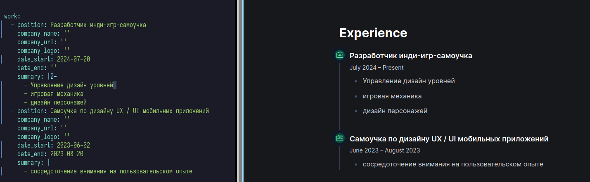
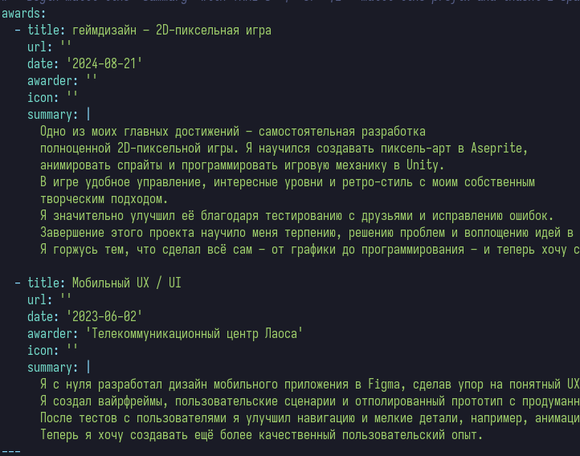
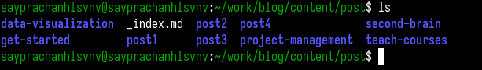
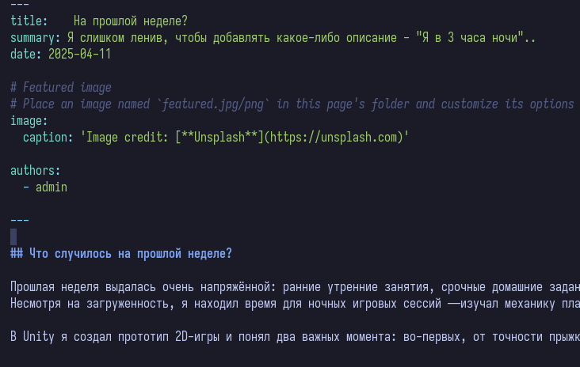
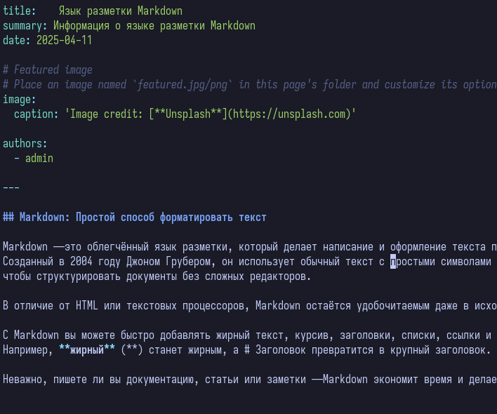
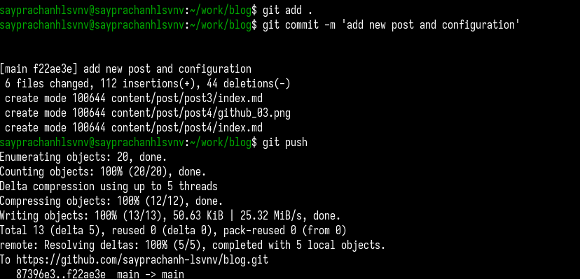
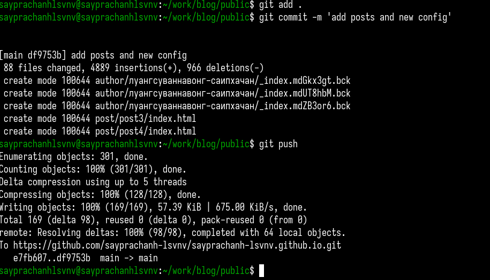
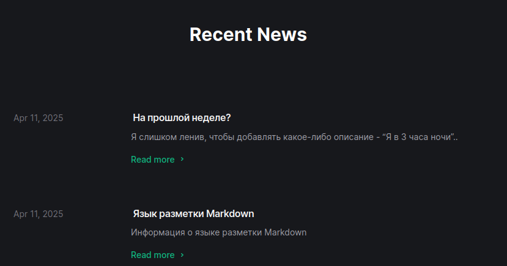

---
## Front matter
lang: ru-RU
title: Индивидуальный проект №3
subtitle: Операционные системы
author:
  - Луангсуваннавонг Сайпхачан
institute:
  - Российский университет дружбы народов, Москва, Россия
date: 11 апреля 2025

## i18n babel
babel-lang: russian
babel-otherlangs: english

## Formatting pdf
toc: false
toc-title: Содержание
slide_level: 2
aspectratio: 169
section-titles: true
theme: metropolis
header-includes:
 - \metroset{progressbar=frametitle,sectionpage=progressbar,numbering=fraction}
---

# Информация

## Докладчик

:::::::::::::: {.columns align=center}
::: {.column width="70%"}

  * Луангсуваннавонг Сайпхачан
  * Студент из группы НКАбд-01-24
  * Российский университет дружбы народов
  * <https://sayprachanh-lsvnv.github.io>

:::
::: {.column width="30%"}
:::
::::::::::::::

## Цель работы

Целью этой работы является добавление информации о навыках, опыте и достижениях на удаленный веб-сайт,
а также создание новых должностей.

## Задание

1. Добавить информацию о навыках (Skills).
2. Добавить информацию об опыте (Experience).
3. Добавить информацию о достижениях (Accomplishments).
4. Сделать пост по прошедшей неделе.
5. Добавить пост на тему: Язык разметки Markdown.

# Выполнение проекта

## Выполнение проекта

Я открываю файл, где хранится информация моей биографии, затем добавляю информацию, связанную с моими навыками (рис. 1)

## Выполнение проекта

Затем я добавляю информацию о своём опыте в раздел «работа» в файле index.md,
а также запускаю сайт локально на своей системе, чтобы видеть изменения в реальном времени (рис. 2)

## Выполнение проекта

Я перехожу в раздел «награды» в файле, добавляю информацию о своём достижении, а также его описание.
После завершения сохраняю файл и выхожу (рис. 3)

## Выполнение проекта

Далее я перехожу в директорию posts. Затем создаю две директории post2 и post4 для хранения информации записях (рис. 4)

## Выполнение проекта

В post2 открываю файл index.md для редактирования.
Добавляю информацию о том, что произошло на прошлой неделе, с чем я столкнулся (рис. 5)

## Выполнение проекта

В post4 добавляю информацию о выбранной теме: кратко описываю язык разметки Markdown — что это, его использование,
преимущества и т.д. (рис. 6)

## Выполнение проекта

Затем добавляю и отправляю все изменения на сервер GitHub. Сначала отправляю изменения из директории blog на сервер GitHub (рис. 7)

## Выполнение проекта

Так как мой сайт размещён через директорию public,
я перехожу в неё (она находится внутри blog) и обновляю изменения на сервере GitHub (рис. 8)

## Выполнение проекта

Перехожу на свой удалённый сайт по ссылке, чтобы проверить изменения и корректность работы.
Сайт обновился: появились новые записи и обновлённая информация в биографии (рис. 9)

## Выводы

Во время выполнения проекта я научился добавлять новую информацию и
посты на веб-сайт, а также его структуру как удаленно, так и в исходном коде.

# Спасибо за внимание
