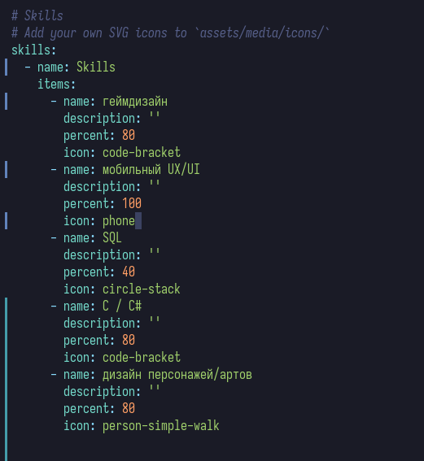
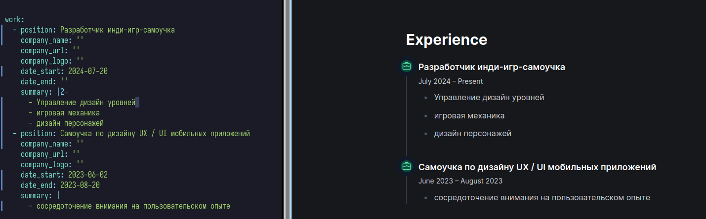
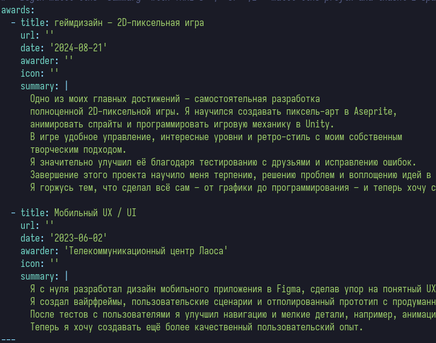
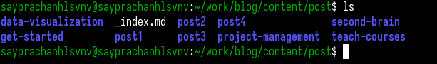
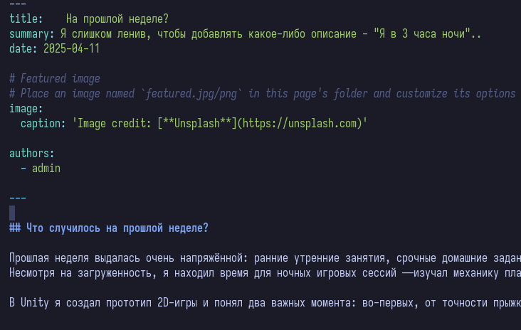
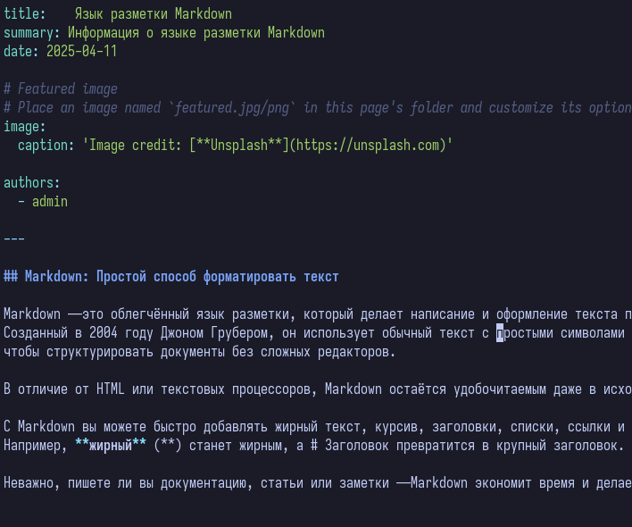
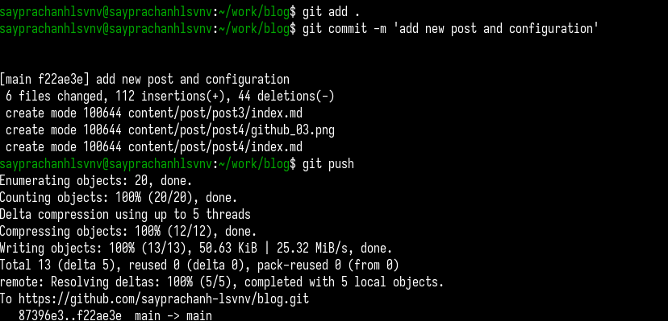
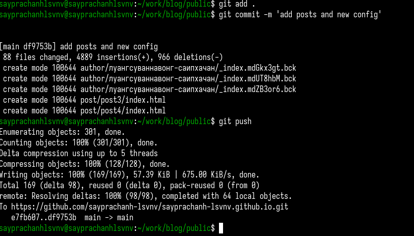
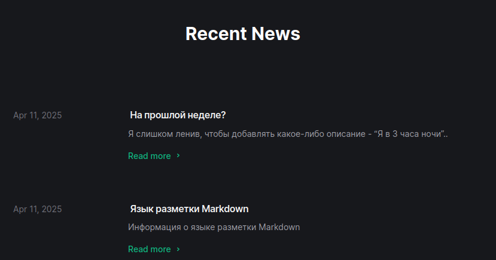

---
## Front matter
title: "Отчёт по индивидуальному проекту №3"
subtitle: "Операционные системы"
author: "Луангсуваннавонг Сайпхачан"

## Generic otions
lang: ru-RU
toc-title: "Содержание"

## Bibliography
bibliography: bib/cite.bib
csl: pandoc/csl/gost-r-7-0-5-2008-numeric.csl

## Pdf output format
toc: true # Table of contents
toc-depth: 2
lof: true # List of figures
lot: true # List of tables
fontsize: 12pt
linestretch: 1.5
papersize: a4
documentclass: scrreprt
## I18n polyglossia
polyglossia-lang:
  name: russian
  options:
	- spelling=modern
	- babelshorthands=true
polyglossia-otherlangs:
  name: english
## I18n babel
babel-lang: russian
babel-otherlangs: english
## Fonts
mainfont: IBM Plex Serif
romanfont: IBM Plex Serif
sansfont: IBM Plex Sans
monofont: IBM Plex Mono
mathfont: STIX Two Math
mainfontoptions: Ligatures=Common,Ligatures=TeX,Scale=0.94
romanfontoptions: Ligatures=Common,Ligatures=TeX,Scale=0.94
sansfontoptions: Ligatures=Common,Ligatures=TeX,Scale=MatchLowercase,Scale=0.94
monofontoptions: Scale=MatchLowercase,Scale=0.94,FakeStretch=0.9
mathfontoptions:
## Biblatex
biblatex: true
biblio-style: "gost-numeric"
biblatexoptions:
  - parentracker=true
  - backend=biber
  - hyperref=auto
  - language=auto
  - autolang=other*
  - citestyle=gost-numeric
## Pandoc-crossref LaTeX customization
figureTitle: "Рис."
tableTitle: "Таблица"
listingTitle: "Листинг"
lofTitle: "Список иллюстраций"
lotTitle: "Список таблиц"
lolTitle: "Листинги"
## Misc options
indent: true
header-includes:
  - \usepackage{indentfirst}
  - \usepackage{float} # keep figures where there are in the text
  - \floatplacement{figure}{H} # keep figures where there are in the text
---

# Цель работы

Целью этой работы является добавление информации о навыках, опыте и достижениях на удаленный веб-сайт, а также создание новых должностей.

# Задание

1. Добавить информацию о навыках (Skills).
2. Добавить информацию об опыте (Experience).
3. Добавить информацию о достижениях (Accomplishments).
4. Сделать пост по прошедшей неделе.
5. Добавить пост на тему: Язык разметки Markdown.

# Выполнение проекта

Я перехожу в директорию, где хранится индексный файл для настройки информации биографии. Открываю файл index.md в текстовом редакторе и нахожу раздел с навыками.
Добавляю соответствующую информацию о своих навыках. (рис. [-@fig:001])

{#fig:001 width=70%}

Далее я перехожу к разделу опыта, где добавлю информацию о своём профессиональном опыте. Согласно структуре индексного файла, опыт работы указывается в части work.
Я добавляю данные о своём опыте (как в гейм-дизайне, так и в мобильном UX/UI). Запускаю локальную версию сайта, чтобы видеть изменения в реальном времени. (рис. [-@fig:002])

{#fig:002 width=70%}

Затем я добавляю информацию о своих достижениях. Указываю два наиболее значимых accomplishment, которыми горжусь, а также их описание.
Раздел с достижениями можно добавить в часть award файла index.md. (рис. [-@fig:003])

{#fig:003 width=70%}

После этого я сохраняю файл index.md и выхожу из него. Перехожу в директорию post, где буду создавать и добавлять посты на свой сайт.
Создаю две новые директории и называю их post2 и post4 соответственно для хранения информации постов. (рис. [-@fig:004])

{#fig:004 width=70%}

Я перехожу в директорию post2, открываю её индексный файл для редактирования и добавляю информацию о том, что произошло за последнюю неделю: что я узнал, с чем столкнулся...
После завершения сохраняю файл и выхожу. (рис. [-@fig:005])

{#fig:005 width=70%}

Затем я перехожу в директорию post4, открываю её индексный файл и добавляю пост на выбранную тему. Я выбрал язык разметки Markdown.
В этом посте я кратко рассказываю о том, что это такое, как его используют и какие у него преимущества... После завершения сохраняю файл и выхожу. (рис. [-@fig:006])

{#fig:006 width=70%}

Я добавляю все изменения в репозиторий GitHub своего сайта, чтобы обновить его. Сначала отправляю все изменения в репозиторий блога на сервере GitHub. (рис. [-@fig:007])

{#fig:007 width=70%}

Затем я перехожу в директорию public в локальной папке blog и отправляю все изменения на сервер GitHub.
Поскольку мой сайт хостится через эту директорию, мне нужно обновить её в удалённом репозитории.(рис. [-@fig:008])

{#fig:008 width=70%}

Я открываю сайт по ссылке и проверяю внесённые изменения. В результате сайт обновлён: добавлены новые посты, а также изменения в биографии.(рис. [-@fig:009])

{#fig:009 width=70%}

# Выводы

Во время выполнения проекта я научился добавлять новую информацию и посты на веб-сайт, а также его структуру как удаленно, так и в исходном коде.

