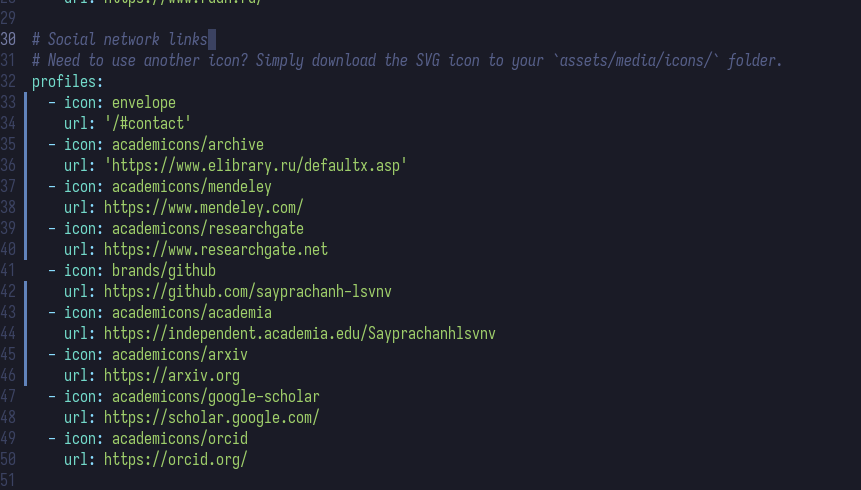
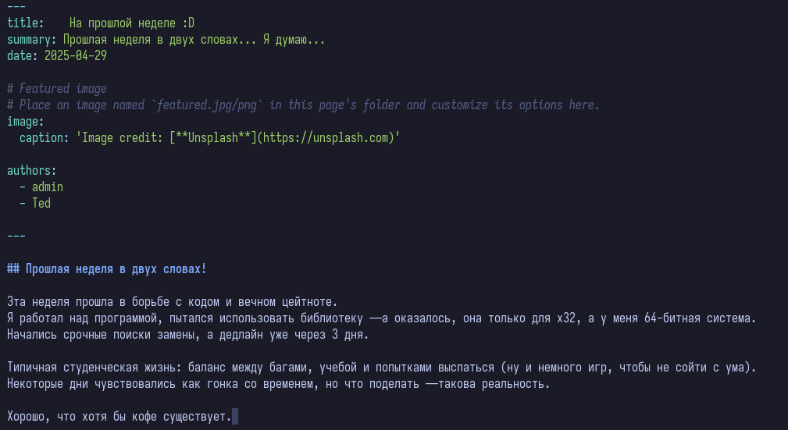
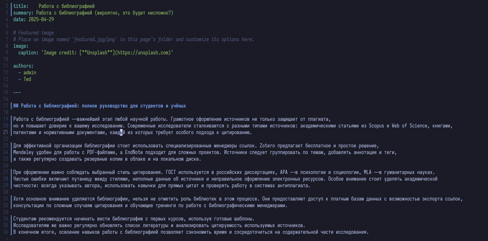
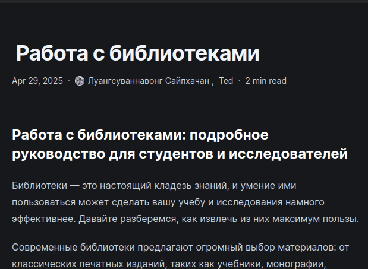

---
## Front matter
lang: ru-RU
title: Индивидуальный проект №4
subtitle: Операционные системы
author:
  - Луангсуваннавонг Сайпхачан
institute:
  - Российский университет дружбы народов, Москва, Россия
date: 1 мая 2025

## i18n babel
babel-lang: russian
babel-otherlangs: english

## Formatting pdf
toc: false
toc-title: Содержание
slide_level: 2
aspectratio: 169
section-titles: true
theme: metropolis
header-includes:
 - \metroset{progressbar=frametitle,sectionpage=progressbar,numbering=fraction}
---

# Информация

## Докладчик

:::::::::::::: {.columns align=center}
::: {.column width="70%"}

  * Луангсуваннавонг Сайпхачан
  * Студент из группы НКАбд-01-24
  * Российский университет дружбы народов
  * <https://sayprachanh-lsvnv.github.io>

:::
::: {.column width="30%"}
:::
::::::::::::::

## Цель работы

Целью работы является добавление на сайт ссылок на научные и библиометрические ресурсы,
а также новых записей на сайте.

## Задание

1. Добавить к сайту ссылки на научные и библиометрические ресурсы.
2. Сделать пост по прошедшей неделе.
3. Добавить пост на тему: Работа с библиографией.

# Выполнение проекта

## Выполнение проекта

Я редактирую свою биографию в файле index.md, добавляя ссылки на научные и библиометрические ресурсы сайта. (рис 1)

## Выполнение проекта

Затем я перехожу в директорию post, чтобы добавить запись о событиях прошлой недели. (рис 2)

## Выполнение проекта

После этого я публикую пост о работе с библиографией и отправляю изменения на сервер GitHub. (рис 3)

## Выполнение проекта

Проверяю обновления на сайте — теперь там отображаются и новая версия биографии, и добавленные записи. (рис 4 и рис 5)

## Выполнение проекта

## Выводы

В этой работе я добавил на сайт ссылки на научные и библиометрические
ресурсы, а также новые публикации на сайте.

# Спасибо за внимание
