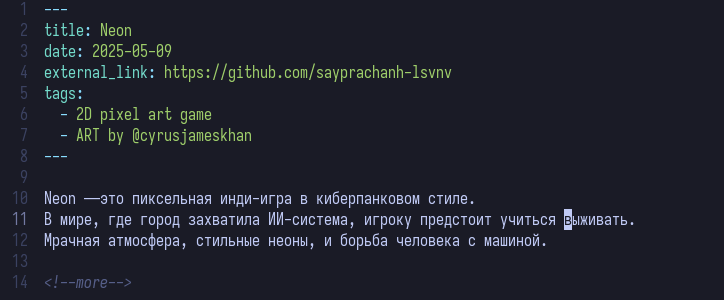
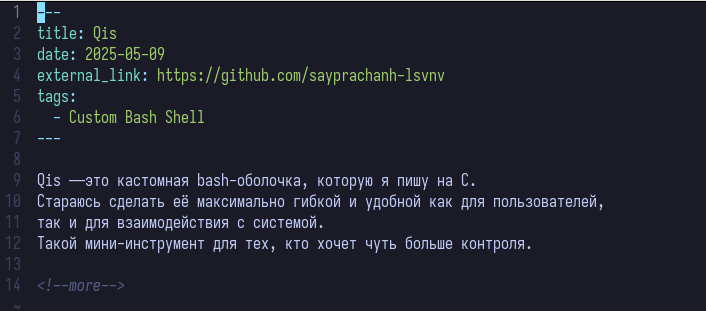
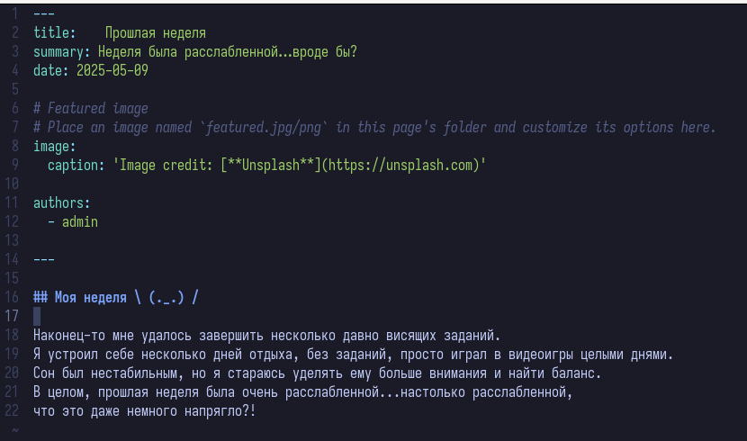
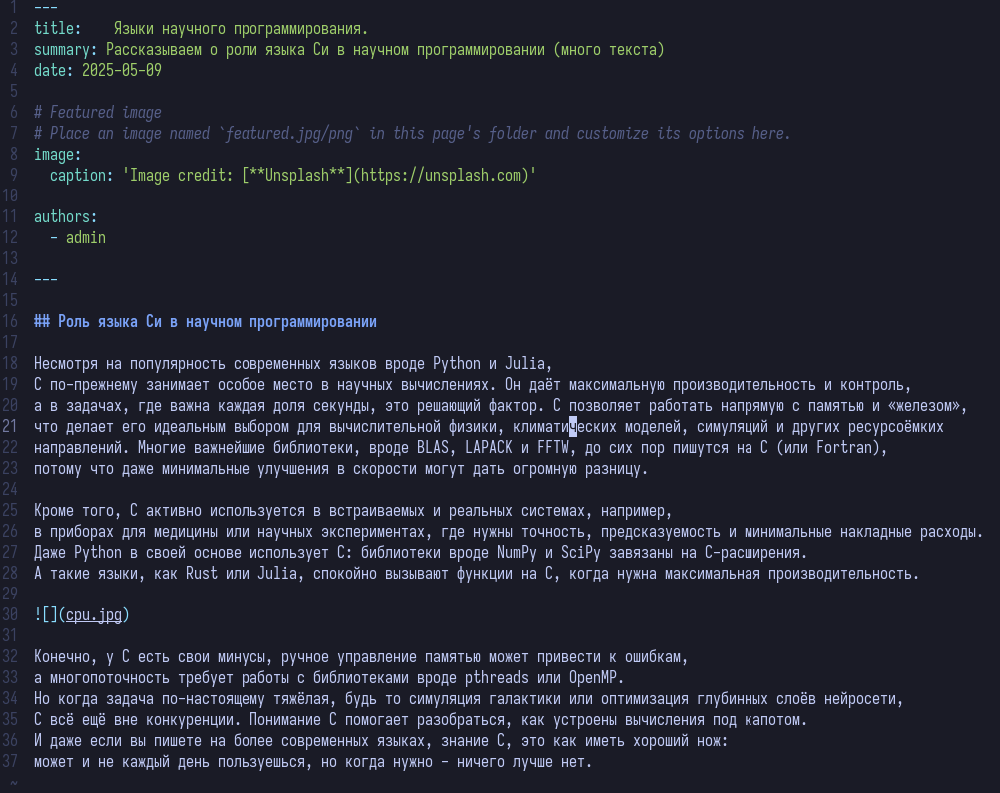
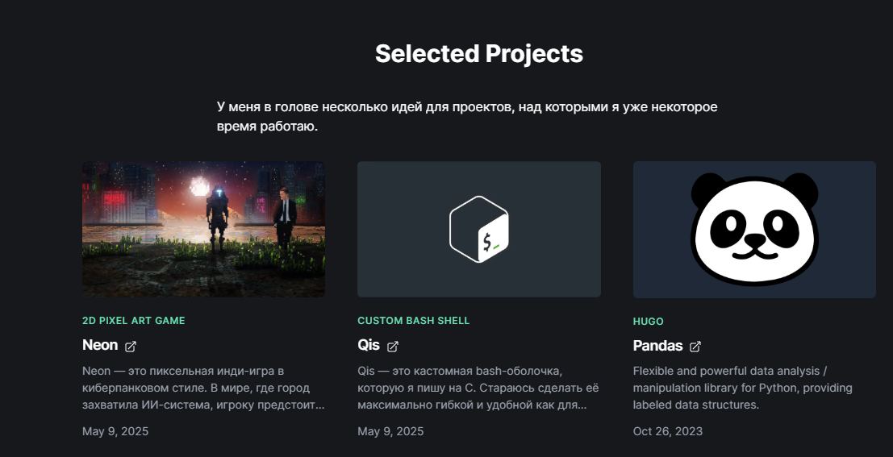
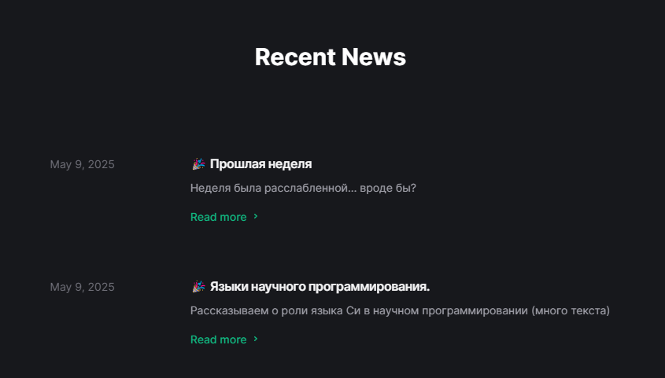

---
## Front matter
lang: ru-RU
title: Индивидуальный проект №5
subtitle: Операционные системы
author:
  - Луангсуваннавонг Сайпхачан
institute:
  - Российский университет дружбы народов, Москва, Россия
date: 9 мая 2025

## i18n babel
babel-lang: russian
babel-otherlangs: english

## Formatting pdf
toc: false
toc-title: Содержание
slide_level: 2
aspectratio: 169
section-titles: true
theme: metropolis
header-includes:
 - \metroset{progressbar=frametitle,sectionpage=progressbar,numbering=fraction}
---

# Информация

## Докладчик

:::::::::::::: {.columns align=center}
::: {.column width="70%"}

  * Луангсуваннавонг Сайпхачан
  * Студент из группы НКАбд-01-24
  * Российский университет дружбы народов
  * <https://sayprachanh-lsvnv.github.io>

:::
::: {.column width="30%"}
:::
::::::::::::::

## Цель работы

Целью работы является добавление на сайт всех остальных элементов, а также новых записей.

## Задание

1. Сделать записи для персональных проектов.
2. Сделать пост по прошедшей неделе.
3. Добавить пост на тему по выбору: языки научного программирования.

# Выполнение проекта

## Выполнение проекта

Я перехожу в раздел проектов в каталоге и создаю заметки для своих проектов,
а также краткое описание этих проектов. (рис. 1 и рис. 2)

## Выполнение проекта

## Выполнение проекта

Затем я перехожу в раздел постов и создаю пост, в котором рассказываю о своей прошлой неделе. (рис. 3)

## Выполнение проекта

Я создаю ещё один пост на тему научных языков программирования,
где рассказываю о роли языка программирования C. (рис. 4)

## Выполнение проекта

Я сохраняю изменения и отправляю их на сервер GitHub. Затем проверяю изменения на удалённом сайте.
В результате на сайте появляются как заметки о моих личных проектах, так и посты, которые я создал. (рис. 5 и рис. 6)

## Выполнение проекта

## Выводы

В этой работе, я добавил все остальные элементы и новые посты на сайт

# Спасибо за внимание
