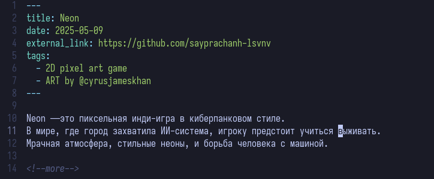
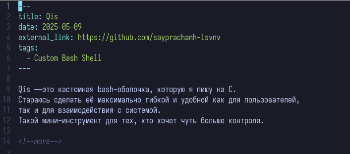
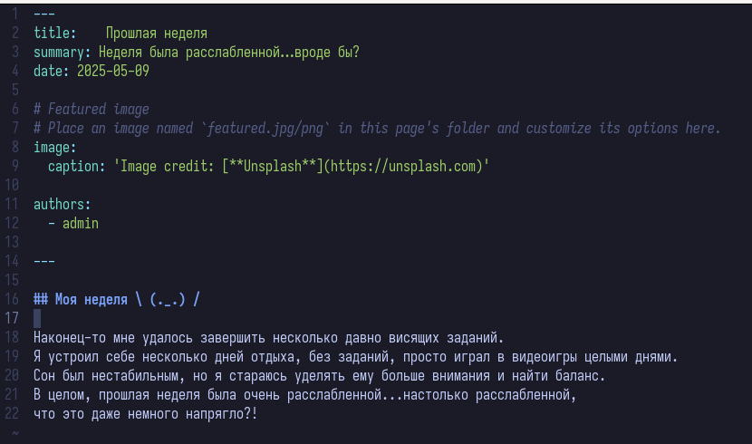
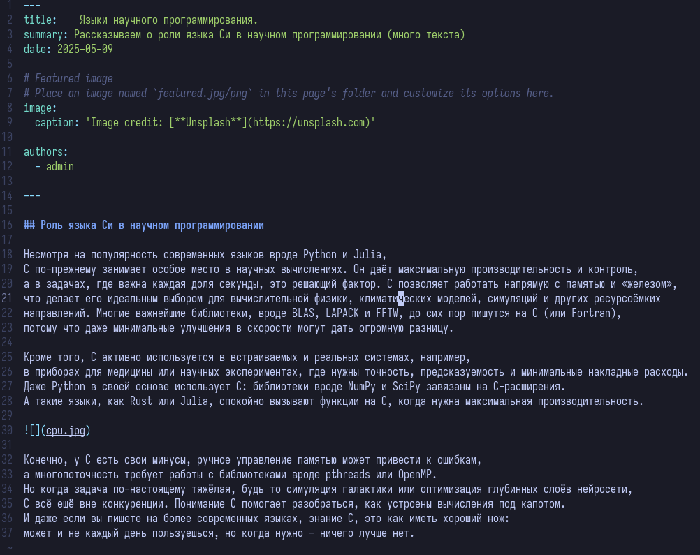
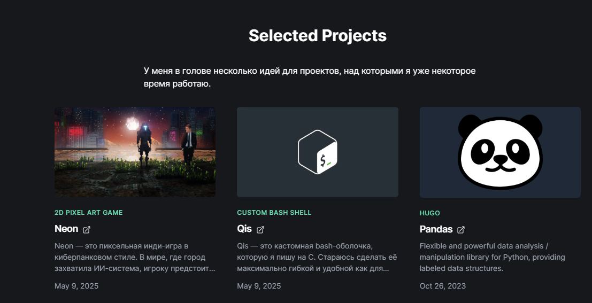
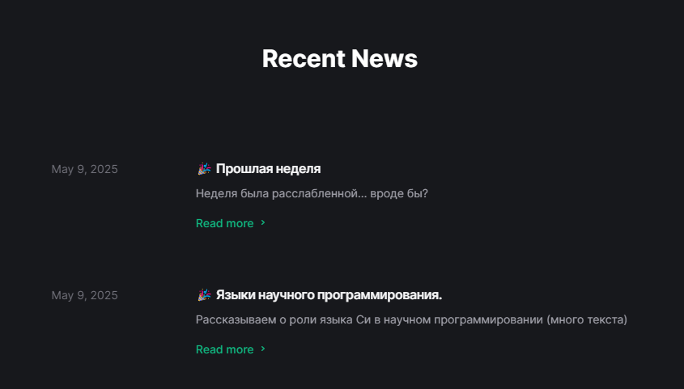

---
## Front matter
title: "Отчёт по индивидуальному проекту №5"
subtitle: "Операционные системы"
author: "Луангсуваннавонг Сайпхачан"

## Generic otions
lang: ru-RU
toc-title: "Содержание"

## Bibliography
bibliography: bib/cite.bib
csl: pandoc/csl/gost-r-7-0-5-2008-numeric.csl

## Pdf output format
toc: true # Table of contents
toc-depth: 2
lof: true # List of figures
lot: true # List of tables
fontsize: 12pt
linestretch: 1.5
papersize: a4
documentclass: scrreprt
## I18n polyglossia
polyglossia-lang:
  name: russian
  options:
	- spelling=modern
	- babelshorthands=true
polyglossia-otherlangs:
  name: english
## I18n babel
babel-lang: russian
babel-otherlangs: english
## Fonts
mainfont: IBM Plex Serif
romanfont: IBM Plex Serif
sansfont: IBM Plex Sans
monofont: IBM Plex Mono
mathfont: STIX Two Math
mainfontoptions: Ligatures=Common,Ligatures=TeX,Scale=0.94
romanfontoptions: Ligatures=Common,Ligatures=TeX,Scale=0.94
sansfontoptions: Ligatures=Common,Ligatures=TeX,Scale=MatchLowercase,Scale=0.94
monofontoptions: Scale=MatchLowercase,Scale=0.94,FakeStretch=0.9
mathfontoptions:
## Biblatex
biblatex: true
biblio-style: "gost-numeric"
biblatexoptions:
  - parentracker=true
  - backend=biber
  - hyperref=auto
  - language=auto
  - autolang=other*
  - citestyle=gost-numeric
## Pandoc-crossref LaTeX customization
figureTitle: "Рис."
tableTitle: "Таблица"
listingTitle: "Листинг"
lofTitle: "Список иллюстраций"
lotTitle: "Список таблиц"
lolTitle: "Листинги"
## Misc options
indent: true
header-includes:
  - \usepackage{indentfirst}
  - \usepackage{float} # keep figures where there are in the text
  - \floatplacement{figure}{H} # keep figures where there are in the text
---

# Цель работы

Целью работы является добавление на сайт всех остальных элементов, а также новых записей.

# Задание

1. Сделать записи для персональных проектов.
2. Сделать пост по прошедшей неделе.
3. Добавить пост на тему по выбору: языки научного программирования.

# Выполнение проекта

Сначала я перехожу к файлам, содержащим раздел проекта, затем создаю файл и добавляю в него свой проект.
Я добавляю заметку и краткое описание проектов, над которыми работал в свободное время. (рис. [-@fig:001] и рис. [-@fig:002])

{#fig:001 width=70%}

{#fig:002 width=70%}

Затем я перехожу в раздел постов в каталоге, где создаю пост о прошлой неделе — о том,
что произошло за это время. (рис. [-@fig:003])

{#fig:003 width=70%}

Я создаю ещё один пост на тему научных языков программирования, где решаю рассказать о роли языка C в научном программировании. (рис. [-@fig:004])

{#fig:004 width=70%}

После этого я сохраняю все изменения и отправляю их на сервер GitHub, чтобы обновить и применить изменения на удалённом сайте.
Я захожу на удалённый сайт, чтобы проверить обновление.
В результате в разделе проектов появляются мои заметки о проектах, а в разделе постов,
публикации о прошедшей неделе и моя тема о языках программирования. (рис. [-@fig:005] и рис. [-@fig:006])

{#fig:005 width=70%}

{#fig:006 width=70%}

# Выводы

В этой работе, я добавил все остальные элементы и новые посты на сайт

