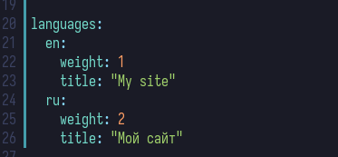
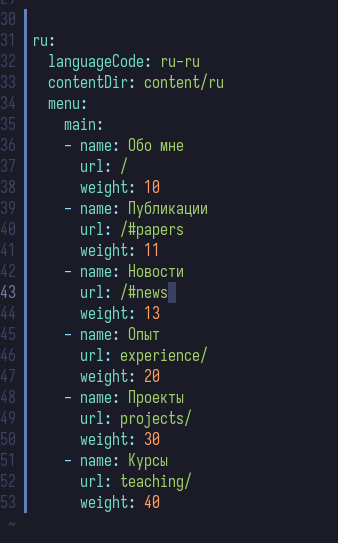
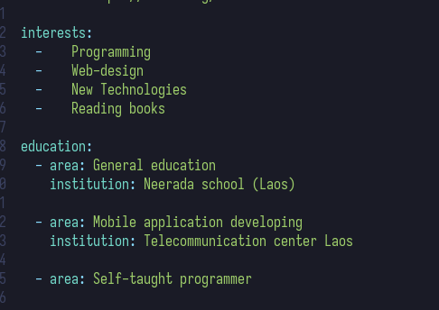
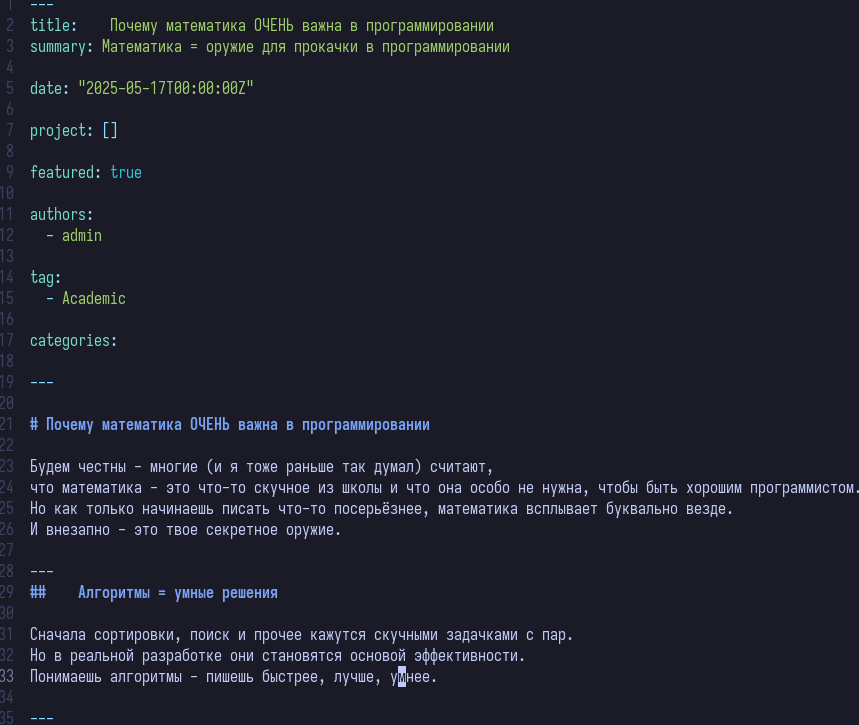
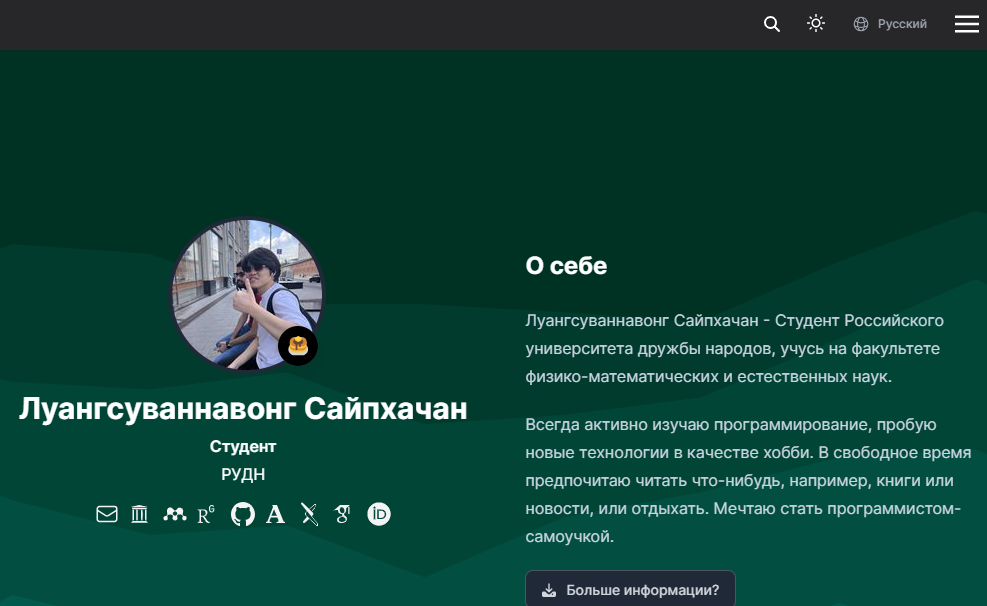
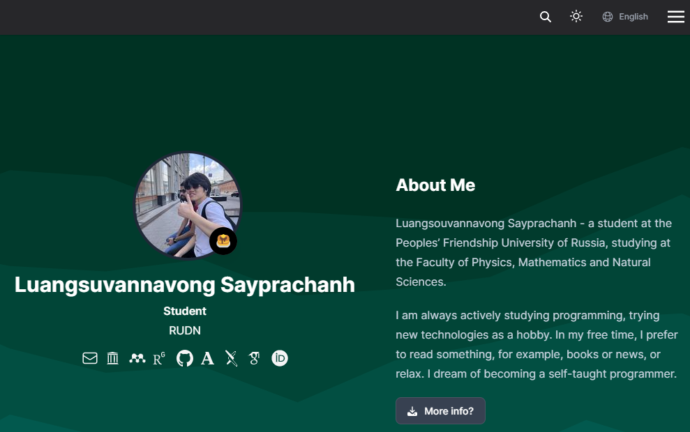

---
## Front matter
lang: ru-RU
title: Индивидуальный проект №6
subtitle: Операционные системы
author:
  - Луангсуваннавонг Сайпхачан
institute:
  - Российский университет дружбы народов, Москва, Россия
date: 18 мая 2025

## i18n babel
babel-lang: russian
babel-otherlangs: english

## Formatting pdf
toc: false
toc-title: Содержание
slide_level: 2
aspectratio: 169
section-titles: true
theme: metropolis
header-includes:
 - \metroset{progressbar=frametitle,sectionpage=progressbar,numbering=fraction}
---

# Информация

## Докладчик

:::::::::::::: {.columns align=center}
::: {.column width="70%"}

  * Луангсуваннавонг Сайпхачан
  * Студент из группы НКАбд-01-24
  * Российский университет дружбы народов
  * <https://sayprachanh-lsvnv.github.io>

:::
::: {.column width="30%"}
:::
::::::::::::::

## Цель работы

Целью работы является добавление на сайт поддержки русского и английского языков, а также публикация новых постов.

## Задание

1. Сделать поддержку английского и русского языков.
2. Разместить элементы сайта на обоих языках.
3. Разместить контент на обоих языках.
4. Сделать пост по прошедшей неделе.
5. Добавить пост на тему по выбору (на двух языках).

# Выполнение проекта

## Выполнение проекта

Я перехожу к конфигурационному файлу, чтобы добавить поддержку русского и английского языков на своём сайте. (рис. 1)

## Выполнение проекта

Я добавляю все элементы сайта для обоих языков. (рис. 2 и рис. 3)

## Выполнение проекта

## Выполнение проекта

Я публикую пост о том, что произошло на прошлой неделе, на двух языках. (рис. 4)

## Выполнение проекта

Я публикую ещё один пост на тему по своему выбору, на русском и английском языках. (рис. 5)

## Выполнение проекта

После завершения я обновляю все изменения на удалённом сайте. В результате сайт теперь поддерживает как английский, так и русский языки. (рис. 6 и рис. 7)

## Выполнение проекта

## Выводы

В этой работе, я добавил на сайт поддержки русского и английского языков, а также публикация новых постов.

# Спасибо за внимание
