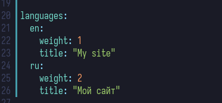
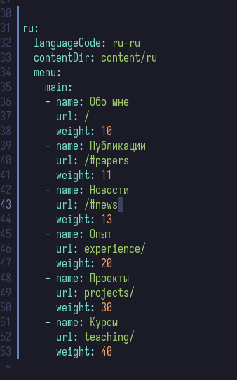
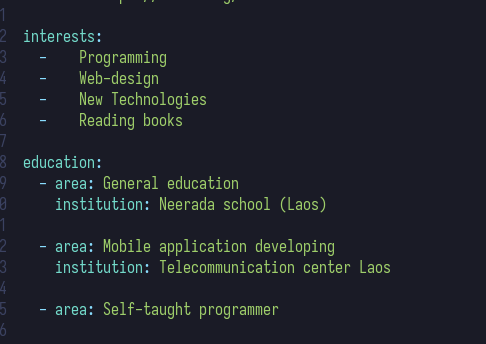
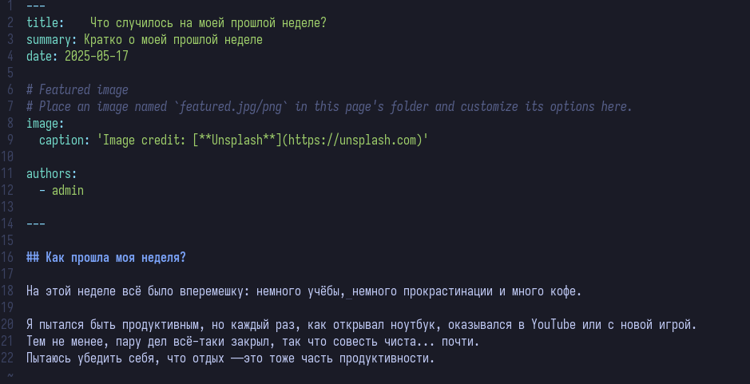
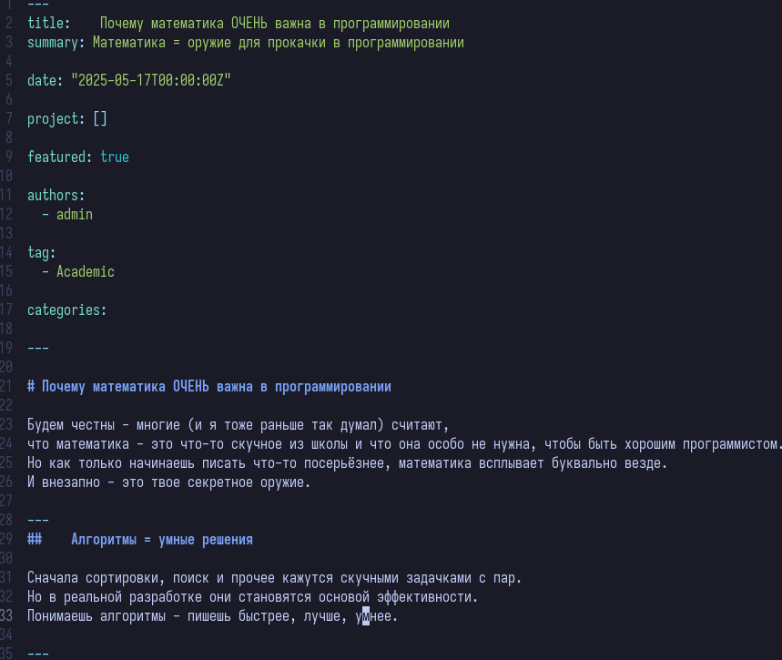
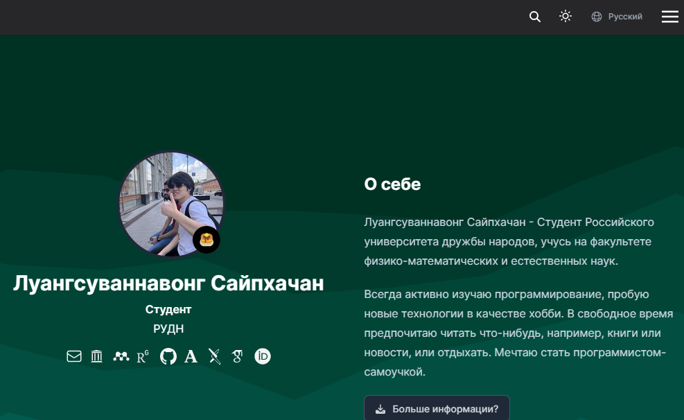
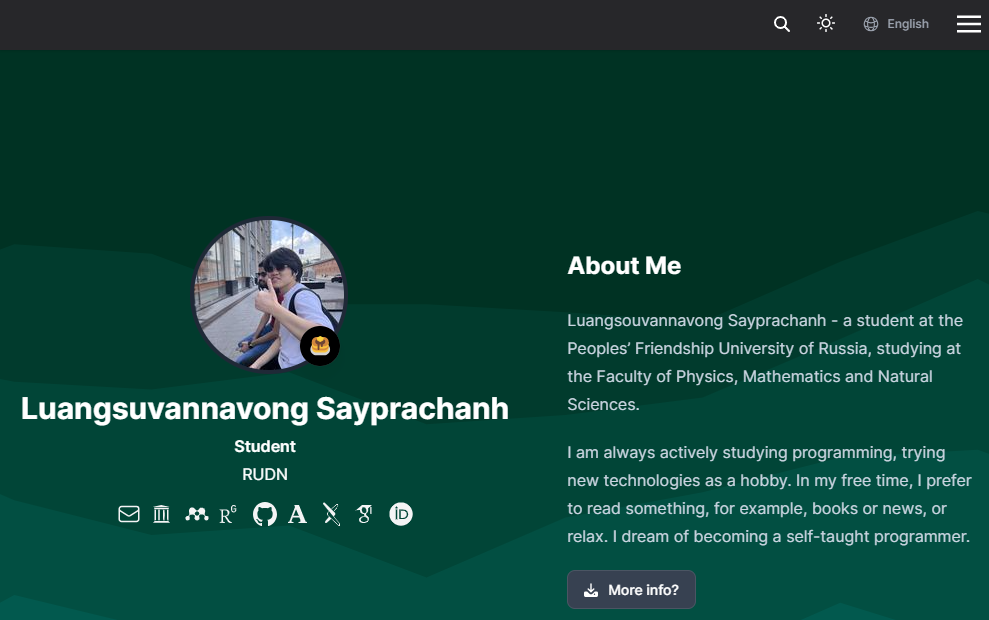

---
## Front matter
title: "Отчёт по индивидуальному проекту №6"
subtitle: "Операционные системы"
author: "Луангсуваннавонг Сайпхачан"

## Generic otions
lang: ru-RU
toc-title: "Содержание"

## Bibliography
bibliography: bib/cite.bib
csl: pandoc/csl/gost-r-7-0-5-2008-numeric.csl

## Pdf output format
toc: true # Table of contents
toc-depth: 2
lof: true # List of figures
lot: true # List of tables
fontsize: 12pt
linestretch: 1.5
papersize: a4
documentclass: scrreprt
## I18n polyglossia
polyglossia-lang:
  name: russian
  options:
	- spelling=modern
	- babelshorthands=true
polyglossia-otherlangs:
  name: english
## I18n babel
babel-lang: russian
babel-otherlangs: english
## Fonts
mainfont: IBM Plex Serif
romanfont: IBM Plex Serif
sansfont: IBM Plex Sans
monofont: IBM Plex Mono
mathfont: STIX Two Math
mainfontoptions: Ligatures=Common,Ligatures=TeX,Scale=0.94
romanfontoptions: Ligatures=Common,Ligatures=TeX,Scale=0.94
sansfontoptions: Ligatures=Common,Ligatures=TeX,Scale=MatchLowercase,Scale=0.94
monofontoptions: Scale=MatchLowercase,Scale=0.94,FakeStretch=0.9
mathfontoptions:
## Biblatex
biblatex: true
biblio-style: "gost-numeric"
biblatexoptions:
  - parentracker=true
  - backend=biber
  - hyperref=auto
  - language=auto
  - autolang=other*
  - citestyle=gost-numeric
## Pandoc-crossref LaTeX customization
figureTitle: "Рис."
tableTitle: "Таблица"
listingTitle: "Листинг"
lofTitle: "Список иллюстраций"
lotTitle: "Список таблиц"
lolTitle: "Листинги"
## Misc options
indent: true
header-includes:
  - \usepackage{indentfirst}
  - \usepackage{float} # keep figures where there are in the text
  - \floatplacement{figure}{H} # keep figures where there are in the text
---

# Цель работы

Целью работы является добавление на сайт поддержки русского и английского языков, а также публикация новых постов.

# Задание

1. Сделать поддержку английского и русского языков.
2. Разместить элементы сайта на обоих языках.
3. Разместить контент на обоих языках.
4. Сделать пост по прошедшей неделе.
5. Добавить пост на тему по выбору (на двух языках).

# Выполнение проекта

Сначала я перехожу к конфигурационному файлу, чтобы добавить поддержку как английского, так и русского языков на моём сайте.
Мой сайт изначально был на русском, поэтому мне нужно добавить только поддержку английского языка. (рис. [-@fig:001])

{#fig:001 width=70%}

Затем я добавляю все элементы сайта на русском языке в английскую версию сайта,
а также изменяю некоторую информацию внутри сайта. (рис. [-@fig:002] и рис. [-@fig:003])

{#fig:002 width=70%}

{#fig:003 width=70%}

После завершения добавления поддержки как английского, так и русского языков на сайт,
я публикую обычный пост о том, что произошло за последнюю неделю, на обоих языках. (рис. [-@fig:004])

{#fig:004 width=70%}

Затем я публикую ещё один пост на тему по своему выбору на двух языках:
сначала на английском, затем добавляю поддержку для русского языка. (рис. [-@fig:005])

{#fig:005 width=70%}

После завершения я обновляю все изменения на удалённом сайте.
В результате весь сайт теперь поддерживает два языка — русский и английский. (рис. [-@fig:006] и рис. [-@fig:007])

{#fig:006 width=70%}

{#fig:007 width=70%}

# Выводы

В этой работе, я добавил поддержку русского и английского языков на сайт, а также опубликовал новые посты.

